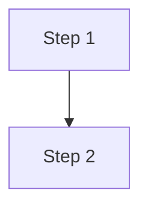

# aspire.dev Development Instructions

This is the aspire.dev documentation site, built with [Astro Starlight](https://starlight.astro.build/). All source lives under `src/frontend/`.

## Project Stack

- **Astro 5.x** with **Starlight** documentation theme
- **TypeScript** (strict mode, `astro/tsconfigs/strict`)
- **Static site generation** (SSG) — zero client-side JS by default
- **pnpm** as the package manager (`pnpm install`, `pnpm dev`, `pnpm build`)
- **15 locales** with Lunaria translation tracking

## Running Locally

```bash
cd src/frontend
pnpm install
pnpm dev        # starts dev server at http://localhost:4321
```

Search is disabled in dev mode — use `pnpm build && pnpm preview` to test search. Running `pnpm dev` is sufficient to verify documentation rendering changes; a full `pnpm build` is not required.

## Project Structure

```
src/frontend/
├── astro.config.mjs          # Starlight config, plugins, integrations
├── ec.config.mjs              # Expressive Code config (themes, plugins)
├── tsconfig.json              # TypeScript config with path aliases
├── config/                    # Sidebar topics, locales, redirects, cookies, SEO head
│   └── sidebar/               # Sidebar topic modules (7 files)
├── src/
│   ├── content.config.ts      # Content collections (docs, i18n, packages)
│   ├── route-data-middleware.ts
│   ├── assets/                # Images, icons, logos
│   ├── components/            # Custom Astro components
│   │   └── starlight/         # Starlight component overrides
│   ├── content/docs/          # All documentation pages (MDX/MD)
│   ├── data/                  # JSON data files + pkgs/ API reference
│   ├── expressive-code-plugins/  # Custom EC plugins (disable-copy)
│   ├── pages/                 # Astro page routes
│   ├── styles/                # Global CSS (site.css)
│   └── utils/                 # Helpers, package utils, sample tags
```

## Import Aliases

Always use these path aliases (defined in `tsconfig.json`) instead of relative paths:

| Alias | Resolves to |
|---|---|
| `@assets/*` | `./src/assets/*` |
| `@components/*` | `./src/components/*` |
| `@data/*` | `./src/data/*` |
| `@utils/*` | `./src/utils/*` |

Example usage in MDX frontmatter imports:

```mdx
import LearnMore from '@components/LearnMore.astro';
import ThemeImage from '@components/ThemeImage.astro';
import { Aside, Code, Steps, LinkButton, Tabs, TabItem } from '@astrojs/starlight/components';
```

## Starlight Plugins

The site uses these Starlight plugins (configured in `astro.config.mjs`):

| Plugin | Purpose |
|---|---|
| `starlight-sidebar-topics` | Dynamic sidebar organized by topic areas |
| `starlight-page-actions` | Share + AI action buttons (Copilot, Claude, ChatGPT) |
| `starlight-image-zoom` | Click-to-zoom images with captions |
| `starlight-kbd` | OS-aware keyboard shortcut display |
| `starlight-github-alerts` | GitHub-style `> [!NOTE]` callout syntax |
| `starlight-links-validator` | Build-time link checking |
| `starlight-scroll-to-top` | Scroll-to-top button |
| `starlight-llms-txt` | AI training data formatting |
| `@lunariajs/starlight` | i18n translation dashboard |
| `@catppuccin/starlight` | Theme integration |
| `astro-mermaid` | Mermaid diagram rendering |

## Starlight Component Overrides

Custom overrides live in `src/components/starlight/` and are registered in `astro.config.mjs` under `components:`:

- `EditLink.astro` — adds translation link
- `Footer.astro` — custom 4-column footer layout
- `Head.astro` — git metadata, auto-language detection, accessibility
- `Header.astro` — custom nav with cookie/CLI buttons
- `Hero.astro` — enhanced hero with image variants
- `MarkdownContent.astro` — image zoom wrapper
- `Search.astro` — search with API docs notice
- `Sidebar.astro` — enhanced sidebar with API filter & collapse
- `SocialIcons.astro` — additional social/misc buttons

When modifying these, study the corresponding Starlight source component to understand the expected props and slots.

## Custom Components

Many reusable components exist in `src/components/`. Before creating a new component, check what already exists. Key categories:

- **Layout/UI**: `HeroSection`, `TopicHero`, `IconLinkCard`, `MediaCard`, `SimpleCard`, `FluidGrid`, `Pivot`, `Expand`
- **Integrations**: `IntegrationCard`, `IntegrationGrid`, `Integrations`, `IntegrationTotals`
- **Media**: `LoopingImage`, `LoopingVideo`, `VimeoCard`, `YouTubeCard`, `TerminalShowcase`
- **Content helpers**: `Include`, `Placeholder`, `InstallAspireCLI`, `CodespacesButton`, `LearnMore`
- **Interactive**: `OsAwareTabs`, `AppHostBuilder`, `QuickStartJourney`, `TestimonialCarousel`
- **API reference**: `TypeHero`, `TypeSignature`, `MemberCard`, `MemberList`, `EnumTable`, `InheritanceDiagram`

Always follow existing component patterns: `.astro` files with frontmatter props at top, scoped styles, and PascalCase naming.

## Content Collections

Defined in `src/content.config.ts`:

- **docs** — uses Starlight's docs loader with extended schema fields: `renderBlocking`, `giscus`, `category`, `pageActions`
- **i18n** — Starlight i18n loader for 15 locales
- **packages** — auto-generated API reference JSON from `src/data/pkgs/`

## Writing Documentation (MDX)

### Frontmatter

Every page needs at minimum a `title`. Custom fields include:

```yaml
---
title: My page title
category: conceptual  # conceptual | quickstart | tutorial | blog | reference | sample
giscus: true          # enable comments
pageActions: false    # disable AI/share actions
---
```

### Key Conventions

- **Heading 1 is reserved** for the page title from frontmatter — start content headings at `##`
- **Use sentence case** for all headings and sidebar labels
- **Use active voice** and clear, concise language
- **Site-relative links** must include a trailing slash: `[First app](/get-started/first-app/)`
- **Unordered lists** use `-` (not `*`)
- **Italic text** uses `_` (not `*`)
- **Code blocks** use triple backticks with language identifier and optional `title`:
  ````md
  ```csharp title="Program.cs"
  var builder = DistributedApplication.CreateBuilder(args);
  ```
  ````

### Starlight Components in MDX

Import from `@astrojs/starlight/components`:

```mdx
import { Aside, Code, Steps, LinkButton, Tabs, TabItem } from '@astrojs/starlight/components';
```

- **`<Aside>`** — callout boxes with `type="note"`, `"tip"`, `"caution"`, or `"danger"`
- **`<Steps>`** — ordered step lists. Always leave a blank line between each step item (Prettier limitation)
- **`<Tabs>` / `<TabItem>`** — tabbed content sections
- **`<LinkButton>`** — styled link buttons with `variant` prop
- **`<Code>`** — code blocks from imported raw strings

### GitHub Alerts Syntax

Supported via `starlight-github-alerts` plugin:

```md
> [!NOTE]
> Useful information that users should know.

> [!TIP]
> Helpful advice for doing things better.

> [!CAUTION]
> Advises about risks or negative outcomes.
```

### Mermaid Diagrams

Write as fenced code blocks with `mermaid` language:

````md

````

## Expressive Code

Configured in `ec.config.mjs` with:

- **Themes**: `laserwave` (dark) and `slack-ochin` (light)
- **Plugins**: `pluginCollapsibleSections()`, `pluginLineNumbers()`, and custom `pluginDisableCopy()`
- Line numbers are off by default — enable per-block with `showLineNumbers`
- Use `disable-copy` meta to prevent copying specific code blocks

## Styling

- Global styles in `src/styles/site.css`
- Custom font: `@fontsource-variable/outfit`
- Scoped `<style>` blocks in `.astro` components
- **WCAG AA contrast** required in both light and dark themes
- **Starlight breakpoints**: `50em` (800px) and `72rem` (1152px) — use these for consistency
- Mobile-first approach with `min-width` media queries

## Sidebar Configuration

Sidebar topics are defined in `config/sidebar/` as separate modules and aggregated in `sidebar.topics.ts`. Each topic supports multi-language labels (15 locales) and icon associations. The `reference.topics.ts` dynamically reads API reference JSON files from `src/data/pkgs/`.

## Data Files

| File | Purpose |
|---|---|
| `aspire-integrations.json` | Integration metadata (title, description, icon, downloads) |
| `integration-docs.json` | Package-to-doc-page mapping |
| `samples.json` | Sample app definitions with tags and thumbnails |
| `testimonials.json` | Developer testimonials |
| `github-stats.json` | GitHub repository statistics |
| `pkgs/*.json` | Per-package API reference schemas |

## Cookie Consent

The site uses `@jop-software/astro-cookieconsent` with a box modal at bottom-right. The consent modal has three buttons: **"Accept all"**, **"Reject all"**, and **"Manage preferences"**. This is relevant when automating browser interactions — always dismiss the cookie modal first.

## Screenshots and Visual Verification with playwright-cli

When making visual changes or preparing PR screenshots, use the `playwright-cli` skill to automate browser interaction. This site has a cookie consent modal that appears on first visit and **must be dismissed before taking screenshots**.

### Workflow for Taking Screenshots

1. Start the dev server (`pnpm dev`) in the background
2. Open the browser and navigate to the page:
   ```bash
   playwright-cli open http://localhost:4321
   playwright-cli goto http://localhost:4321/path/to/page/
   ```
3. **Dismiss the cookie consent modal first** — click the "Reject all" button:
   ```bash
   playwright-cli snapshot
   # Find the ref for the "Reject all" button in the snapshot
   playwright-cli click <ref>
   ```
4. Take the screenshot:
   ```bash
   playwright-cli screenshot --filename=my-change.png
   ```
5. For responsive screenshots, resize the viewport first:
   ```bash
   playwright-cli resize 1440 900
   playwright-cli screenshot --filename=desktop.png
   playwright-cli resize 375 812
   playwright-cli screenshot --filename=mobile.png
   ```

Always dismiss the cookie modal before any screenshot or visual verification. The "Reject all" button avoids setting unnecessary cookies during development.

## Accessibility and Inclusive Writing

- **WCAG AA contrast** for all text and interactive elements (4.5:1 normal text, 3:1 large text)
- **Heading hierarchy**: H1 from frontmatter, then H2 → H3 → H4 without skipping
- **Meaningful link text**: "Read the deployment guide" not "Click here"
- **Alt text**: describe informative images, use `alt=""` for decorative ones
- **Inclusive language**: gender-neutral, no ableist terms, people-first
- **Active voice**: prefer "The system processes" over "is processed by"
- **Universal date formats**: "January 15, 2025" not "1/15/25"

## Scripts Reference

| Script | Purpose |
|---|---|
| `pnpm dev` | Start dev server with hot reload |
| `pnpm build` | Production build |
| `pnpm preview` | Preview production build |
| `pnpm lint` | ESLint (zero warnings allowed) |
| `pnpm format` | Prettier formatting |
| `pnpm update:integrations` | Sync NuGet integration data |
| `pnpm update:samples` | Sync sample data from GitHub |
| `pnpm update:all` | Run all data updates |