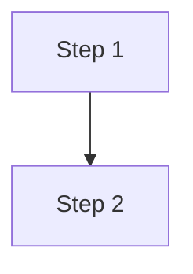

# aspire.dev Development Instructions

This is the aspire.dev documentation site, built with [Astro Starlight](https://starlight.astro.build/). Frontend source lives under `src/frontend/`.

Astro guidance is adapted from [Awesome GitHub Copilot's Astro development instructions](https://awesome-copilot.github.com/instruction/astro/) for this repository. Use `src/frontend/package.json`, `astro.config.mjs`, and `tsconfig.json` as the source of truth for installed versions and configuration; do not introduce optional upstream features without a task that requires them.

## Project Stack

- **Astro 7.x** with **Starlight** documentation theme and the **Content Layer API**
- **TypeScript** (strict mode, `astro/tsconfigs/strict`)
- **Static site generation** (SSG) with selective client-side interactivity
- **pnpm** as the package manager (`pnpm install`, `pnpm dev`)
- **15 locales** with Lunaria translation tracking

## Running Locally

```bash
cd src/frontend
pnpm install
pnpm dev        # starts dev server at http://localhost:4321
```

Search is disabled in dev mode. Running `pnpm dev` is sufficient to verify documentation rendering changes. Prefer CI for production builds and search validation; never run `pnpm build` locally without explicit user permission. Use `pnpm preview` when a production build is already available.

## Astro Architecture and Type Safety

- Render content at build time in `.astro` frontmatter by default. Keep the static-site architecture; Astro Actions, sessions, server islands (`server:defer`), and on-demand API routes require server runtime support and are not drop-in additions to this site.
- Prefer existing `.astro` components and browser scripts or Web Components for interactivity. Add a UI framework only when the task needs it; hydrate framework islands selectively with `client:load`, `client:idle`, or `client:visible`.
- Preserve `astro/tsconfigs/strict` and the generated `.astro/types.d.ts` include. Run `pnpm exec astro sync` from `src/frontend` after changing collections or Astro configuration; do not edit generated types.
- Define component props with a TypeScript `Props` interface, use explicit defaults where appropriate, and keep components focused and composable.
- Write fully closed HTML with valid nesting. Astro 7 rejects unclosed tags rather than repairing them.
- Account for Astro 7's default JSX-style whitespace handling (`compressHTML: 'jsx'`): use explicit `{' '}` between inline elements when a visible space is required.

## Client-Side Navigation

The existing `src/components/starlight/Head.astro` override renders `<ClientRouter />` from `astro:transitions`. Reuse it rather than adding another router.

- Initialize page-specific browser behavior on `astro:page-load` so it also works after client-side navigation.
- Make initialization idempotent and clean up listeners, observers, and timers when their page elements are replaced; avoid duplicate handlers after repeated navigation.
- Use `transition:persist` only for elements whose state should intentionally survive navigation.
- Keep content and links usable without JavaScript, and verify interactive changes on both an initial load and a client-side navigation.

## Two-slash TypeScript Examples

Use the `twoslash-validator` skill whenever you add or edit a `twoslash` TypeScript code fence, TypeScript AppHost sample, or generated TypeScript API data. The site must not ship rendered two-slash diagnostics; run `pnpm test:unit:twoslash-blocks` from `src/frontend` and fix every reported diagnostic instead of adding allowlists or suppressions.

## Project Structure

```
src/frontend/
├── astro.config.mjs          # Starlight config, plugins, integrations
├── ec.config.mjs              # Expressive Code config (themes, plugins)
├── tsconfig.json              # TypeScript config with path aliases
├── config/                    # Sidebar topics, locales, redirects, cookies, SEO head
│   └── sidebar/               # Sidebar topic modules (7 files)
├── src/
│   ├── content.config.ts      # Content collections (docs, i18n, packages)
│   ├── route-data-middleware.ts
│   ├── assets/                # Images, icons, logos
│   ├── components/            # Custom Astro components
│   │   └── starlight/         # Starlight component overrides
│   ├── content/docs/          # All documentation pages (MDX/MD)
│   ├── data/                  # JSON data files + pkgs/ API reference
│   ├── expressive-code-plugins/  # Custom EC plugins (disable-copy)
│   ├── pages/                 # Astro page routes
│   ├── styles/                # Global CSS (site.css)
│   └── utils/                 # Helpers, package utils, sample tags
```

## Import Aliases

Always use these path aliases (defined in `tsconfig.json`) instead of relative paths:

| Alias | Resolves to |
|---|---|
| `@assets/*` | `./src/assets/*` |
| `@components/*` | `./src/components/*` |
| `@data/*` | `./src/data/*` |
| `@scripts/*` | `./src/scripts/*` |
| `@utils/*` | `./src/utils/*` |

Example usage in MDX frontmatter imports:

```mdx
import LearnMore from '@components/LearnMore.astro';
import ThemeImage from '@components/ThemeImage.astro';
import { Aside, Code, Steps, LinkButton, Tabs, TabItem } from '@astrojs/starlight/components';
```

## Starlight Plugins

The site uses these Starlight plugins (configured in `astro.config.mjs`):

| Plugin | Purpose |
|---|---|
| `starlight-sidebar-topics` | Dynamic sidebar organized by topic areas |
| `starlight-page-actions` | Share + AI action buttons (Copilot, Claude, ChatGPT) |
| `starlight-image-zoom` | Click-to-zoom images with captions |
| `starlight-kbd` | OS-aware keyboard shortcut display |
| `starlight-github-alerts` | GitHub-style `> [!NOTE]` callout syntax |
| `starlight-links-validator` | Build-time link checking |
| `starlight-scroll-to-top` | Scroll-to-top button |
| `starlight-llms-txt` | AI training data formatting |
| `@lunariajs/starlight` | i18n translation dashboard |
| `@catppuccin/starlight` | Theme integration |
| `astro-mermaid` | Mermaid diagram rendering |

## Starlight Component Overrides

Custom overrides live in `src/components/starlight/` and are registered in `astro.config.mjs` under `components:`:

- `Banner.astro` — dismissible announcement banner (content hashed for a stable dismiss key). Supports declarative auto-expiry via two optional **top-level** frontmatter fields: `bannerExpiresOn` (a `YYYY-MM-DD` sunset date that hides it for everyone; a past date drops it at build time) and `bannerAutoDismissAfterDays` (a per-reader window that auto-hides it N days after they first see it, tracked in `localStorage`). These are top-level (not nested under `banner`) because extra keys nested inside Starlight's built-in `banner` object are stripped before reaching the component. Pure decision logic lives in `src/utils/banner-expiry.ts` and is **imported directly** by the client script (single source of truth — the shipped behavior can't diverge from the unit tests).
- `EditLink.astro` — adds translation link
- `Footer.astro` — custom 4-column footer layout
- `Head.astro` — git metadata, auto-language detection, accessibility
- `Header.astro` — custom nav with cookie/CLI buttons
- `Hero.astro` — enhanced hero with image variants
- `MarkdownContent.astro` — image zoom wrapper
- `Search.astro` — search with API docs notice
- `Sidebar.astro` — enhanced sidebar with API filter & collapse
- `SocialIcons.astro` — additional social/misc buttons

When modifying these, study the corresponding Starlight source component to understand the expected props and slots.

## Custom Components

Many reusable components exist in `src/components/`. Before creating a new component, check what already exists. Key categories:

- **Layout/UI**: `HeroSection`, `TopicHero`, `IconLinkCard`, `MediaCard`, `SimpleCard`, `FluidGrid`, `Pivot`, `Expand`
- **Integrations**: `IntegrationCard`, `IntegrationGrid`, `Integrations`, `IntegrationTotals`
- **Media**: `LoopingImage`, `LoopingVideo`, `VimeoCard`, `YouTubeCard`, `TerminalShowcase`
- **Content helpers**: `Include`, `Placeholder`, `InstallAspireCLI`, `CodespacesButton`, `LearnMore`
- **Interactive**: `OsAwareTabs`, `AppHostBuilder`, `QuickStartJourney`, `TestimonialCarousel`
- **API reference**: `TypeHero`, `TypeSignature`, `MemberCard`, `MemberList`, `EnumTable`, `InheritanceDiagram`

Always follow existing component patterns: `.astro` files with frontmatter props at top, scoped styles, and PascalCase naming.

## Content Collections

Defined in `src/content.config.ts`:

- **docs** — uses Starlight's docs loader with extended schema fields: `renderBlocking`, `giscus`, `category`, `pageActions`, and top-level banner auto-expiry fields (`bannerExpiresOn`, `bannerAutoDismissAfterDays`)
- **i18n** — Starlight i18n loader for 15 locales
- **packages** — auto-generated API reference JSON from `src/data/pkgs/`
- **tsModules** — auto-generated TypeScript API reference JSON from `src/data/ts-modules/`

Preserve Starlight's `docsLoader()`, `i18nLoader()`, `docsSchema()`, and `i18nSchema()` when extending content. Use `glob()` or `file()` from `astro/loaders` for additional file-backed collections, and query entries with type-safe `getCollection()` and `getEntry()` from `astro:content`. Import `z` from `astro/zod`, not `astro:content`; use Zod 4 helpers such as `z.email()` and `z.url()` for new email and URL schemas.

## Images, Metadata, and Data Fetching

- Reuse existing image components where appropriate, or import `Image` / `Picture` from `astro:assets` for optimized local assets. Provide meaningful alt text, preserve dimensions to avoid layout shifts, and lazy-load below-the-fold images rather than the main above-the-fold image.
- Preserve Starlight's default head output and the existing `Head.astro` override. Reuse `src/utils/page-metadata.ts` and `src/utils/structured-data.ts` for social cards and JSON-LD instead of emitting duplicate metadata.
- Fetch static data at build time or through the existing data-update scripts. Use standard `fetch`, check response status, and validate external data before consuming it; do not assume Astro provides automatic response typing or caching.
- Keep secrets out of client scripts and `PUBLIC_` environment variables. Only expose values intended to be public.

## Writing Documentation (MDX)

### Frontmatter

Every page needs at minimum a `title`. Custom fields include:

```yaml
---
title: My page title
category: conceptual  # conceptual | quickstart | tutorial | blog | reference | sample
giscus: true          # enable comments
pageActions: false    # disable AI/share actions
---
```

### Key Conventions

- **Heading 1 is reserved** for the page title from frontmatter — start content headings at `##`
- **Use sentence case** for all headings and sidebar labels
- **Use active voice** and clear, concise language
- **Site-relative links** must include a trailing slash: `[First app](/get-started/first-app/)`
- **Unordered lists** use `-` (not `*`)
- **Italic text** uses `_` (not `*`)
- **Code blocks** use triple backticks with language identifier and optional `title`:
  ````md
  ```csharp title="Program.cs"
  var builder = DistributedApplication.CreateBuilder(args);
  ```
  ````

### Bulleted List Grammar

Items in a bulleted list must follow consistent grammar and punctuation:

- Use parallel construction so all items in the same list share the same grammatical form (all noun phrases, all verb phrases, all complete sentences, etc.).
- Do not use a trailing period when items are sentence fragments that don't complete a sentence on their own or with the introductory text.
- Use a trailing period when items are complete sentences, or when they complete a sentence begun in the introductory text.
- Do not mix complete sentences and fragments in the same list. If one item needs to be a full sentence, rewrite all items as full sentences.

#### Examples

Fragments — no periods:

```md
The dashboard displays:

- Resource status and health indicators
- Logs, traces, and metrics
- Container and endpoint information
```

Complete sentences — periods:

```md
Use the dashboard to monitor your app:

- The **Resources** page shows the status of each service in your app.
- The **Console** page displays the log output from each resource.
- The **Traces** page shows the distributed traces from your app.
```

Fragments completing an introductory sentence — periods:

```md
The app host project is responsible for:

- acting as the orchestrator of your app.
- managing the lifecycle of all resources.
- passing configuration and connection strings to dependent resources.
```

Bad — mixed forms and inconsistent punctuation:

```md
<!-- DON'T: mixed forms and missing parallel construction -->
- Resource monitoring
- You can view the logs from the console page.
- traces
```

### Term Lists

A term list is a bulleted list that defines, describes, or explains a set of terms. Format each item as:

```md
- **Term in sentence case**: Definition starting with a capital letter and ending with a period.
```

Rules:

- **Bold the term only** — the colon that follows is not bold
- **Sentence case** for the term (capitalize the first word and proper nouns only)
- **Capital letter** at the start of every definition
- **Trailing period** on every definition, even when it is a fragment

#### Examples

```md
- **AppHost**: The orchestrator project that defines and manages the resources in your app.
- **Integration**: A NuGet package that configures a service or client for use with Aspire.
- **Resource**: A dependency of your cloud-native app, such as a database, cache, or messaging service.
```

Bad:

```md
<!-- DON'T: bold the colon, use title case, or omit the period -->
- **AppHost Project:** the orchestrator project
- **integration**: A NuGet package that configures a service or client for use with Aspire
```

### Parentheses

- The contents of parentheses must not be syntactically necessary to the surrounding sentence. The surrounding sentence must be meaningful without the parenthetical content.
- Only use parentheses when the contents is less important than the rest of the sentence. If the parenthetical content is equally important, use commas or other punctuation instead.

#### Examples

Good — parenthetical content is optional supplementary information:

```md
The AppHost project (defined in _AppHost.cs_) orchestrates all resources.
```

Bad — parenthetical content is syntactically necessary:

```md
<!-- DON'T: sentence is incomplete without the parenthetical -->
Add the Redis integration (which provides caching) to your project.
```

Rewrite as:

```md
Add the Redis integration, which provides caching, to your project.
```

### Starlight Components in MDX

Import from `@astrojs/starlight/components`:

```mdx
import { Aside, Code, Steps, LinkButton, Tabs, TabItem } from '@astrojs/starlight/components';
```

- **`<Aside>`** — callout boxes with `type="note"`, `"tip"`, `"caution"`, or `"danger"`
- **`<Steps>`** — ordered step lists. Always leave a blank line between each step item (Prettier limitation)
- **`<Tabs>` / `<TabItem>`** — tabbed content sections
- **`<LinkButton>`** — styled link buttons with `variant` prop
- **`<Code>`** — code blocks from imported raw strings

### GitHub Alerts Syntax

Supported via `starlight-github-alerts` plugin:

```md
> [!NOTE]
> Useful information that users should know.

> [!TIP]
> Helpful advice for doing things better.

> [!CAUTION]
> Advises about risks or negative outcomes.
```

### Mermaid Diagrams

Write as fenced code blocks with `mermaid` language:

````md

````

## Expressive Code

Configured in `ec.config.mjs` with:

- **Themes**: `laserwave` (dark) and `slack-ochin` (light)
- **Plugins**: `pluginCollapsibleSections()`, `pluginLineNumbers()`, and custom `pluginDisableCopy()`
- Line numbers are off by default — enable per-block with `showLineNumbers`
- Use `disable-copy` meta to prevent copying specific code blocks

## Styling

- Global styles in `src/styles/site.css`
- Custom font: `@fontsource-variable/outfit`
- Scoped `<style>` blocks in `.astro` components
- **WCAG AA contrast** required in both light and dark themes
- **Starlight breakpoints**: `50em` (800px) and `72rem` (1152px) — use these for consistency
- Mobile-first approach with `min-width` media queries

## Sidebar Configuration

Sidebar topics are defined in `config/sidebar/` as separate modules and aggregated in `sidebar.topics.ts`. Each topic supports multi-language labels (15 locales) and icon associations. The `reference.topics.ts` dynamically reads API reference JSON files from `src/data/pkgs/`.

## Data Files

| File | Purpose |
|---|---|
| `aspire-integrations.json` | Integration metadata (title, description, icon, downloads) |
| `integration-docs.json` | Package-to-doc-page mapping |
| `samples.json` | Sample app definitions with tags and thumbnails |
| `testimonials.json` | Developer testimonials |
| `github-stats.json` | GitHub repository statistics |
| `pkgs/*.json` | Per-package API reference schemas |

## Cookie Consent

The site uses Microsoft's **WCP** consent runtime (`wcp-consent.js`, loaded live from `wcpstatic.microsoft.com`), wired up in `src/components/starlight/Head.astro` and fully restyled by `src/styles/wcp-consent.css`. The banner is **geo-gated**: the CDN decides per region whether it appears, so where consent is not required (e.g. the US) **no banner shows** and the "Manage cookies" buttons are hidden (`html[data-consent-not-required]`). When it does appear (e.g. the EU) it is a **fixed strip at the top of the viewport** — not a bottom-right box — with **"Accept"**, **"Reject"**, and **"Manage cookies"** actions; "Manage cookies" opens a preferences dialog with per-category toggles and "Save changes" / "Reset all". Consent is persisted in the `MSCC` cookie. Because it is geo-gated, you usually will not see it in local/US automation — if it does appear, dismiss it first unless you are inspecting the consent UI itself.

Cookie management is also available as a text-style **Manage Cookies** action under **Legal** on all viewport sizes where WCP requires consent. It replaces the mobile footer cookie icon; the desktop header icon remains. The Legal action is server-rendered with the unique ID `c-uhff-footer_managecookies` and uses the existing delegated `[data-cookie-manage-consent]` handler.

The banner's **Accept** and dialog's **Save changes** buttons use the shared `--aspire-action-primary`, `--aspire-action-primary-text`, and `--aspire-action-primary-hover` tokens, matching **Try Aspire** in both themes. Do not use `--aspire-color-light` for primary action backgrounds: it aliases muted text and becomes gray in light mode.

For scanners, use `//*[@id="c-uhff-footer_managecookies"]` after deploying this markup. Do not use `//button[contains(@class, 'cookie-consent-btn')]`: it matches multiple controls, including hidden responsive variants. Verify exactly one match and an ordinary click that reopens preferences after a saved choice. WCP must have initialized in a consent-required region; a hidden control in a non-consent region or a blocked WCP CDN is not fixed by a different XPath. Confirm the scanned deployment and rerun the external scan rather than treating local tests as compliance certification.

Complete the initial banner choice before testing the footer's reopening action, especially on narrow screens where the banner can cover most of the viewport. Use the banner's own management action to inspect preferences before making an initial choice.

## Screenshots and Visual Verification with playwright-cli

When making visual changes or preparing PR screenshots, use the `playwright-cli` skill to automate browser interaction. This site _may_ show a WCP cookie banner on first visit, but it is **geo-gated** and usually absent in local/US runs — when it does appear (a fixed strip at the top of the viewport) **dismiss it before taking screenshots**.

### Workflow for Taking Screenshots

1. Start the dev server (`pnpm dev`) in the background
2. Open the browser and navigate to the page:
   ```bash
   playwright-cli open http://localhost:4321
   playwright-cli goto http://localhost:4321/path/to/page/
   ```
3. **Dismiss the cookie banner if one appears** — click the "Reject" button (often a
   no-op locally, since the banner is geo-gated and typically does not render):
   ```bash
   playwright-cli snapshot
   # If a banner is present, find the "Reject" ref in the snapshot and click it
   playwright-cli click <ref>
   ```
4. Take the screenshot:
   ```bash
   playwright-cli screenshot --filename=my-change.png
   ```
5. For responsive screenshots, resize the viewport first:
   ```bash
   playwright-cli resize 1440 900
   playwright-cli screenshot --filename=desktop.png
   playwright-cli resize 375 812
   playwright-cli screenshot --filename=mobile.png
   ```

If a banner is present, dismiss it before any screenshot or visual verification. The "Reject" button avoids setting unnecessary cookies during development; in local/US runs no banner appears, so this step is usually unnecessary.

## Accessibility and Inclusive Writing

- **WCAG AA contrast** for all text and interactive elements (4.5:1 normal text, 3:1 large text)
- **Heading hierarchy**: H1 from frontmatter, then H2 → H3 → H4 without skipping
- **Meaningful link text**: "Read the deployment guide" not "Click here"
- **Alt text**: describe informative images, use `alt=""` for decorative ones
- **Inclusive language**: gender-neutral, no ableist terms, people-first
- **Active voice**: prefer "The system processes" over "is processed by"
- **Universal date formats**: "January 15, 2025" not "1/15/25"

## Scripts Reference

| Script | Purpose |
|---|---|
| `pnpm dev` | Start dev server with hot reload |
| `pnpm build` | Production build (CI preferred; explicit user permission required locally) |
| `pnpm preview` | Preview production build |
| `pnpm lint` | ESLint (zero warnings allowed) |
| `pnpm format` | Prettier formatting |
| `pnpm update:integrations` | Sync NuGet integration data |
| `pnpm update:samples` | Sync sample data from GitHub |
| `pnpm update:all` | Run all data updates |