```mermaid
architecture-beta
  service api(logos:dotnet)[API service]
  service frontend(aspire:blazor)[Blazor front end]

  frontend:L --> R:api
```

# Documentation Writer Skill

This skill provides guidelines for AI coding agents to help maintainers produce accurate and easy-to-maintain documentation for the Aspire project. The aspire.dev repository is the official documentation site for Aspire, and this skill helps ensure consistent, high-quality documentation.

## Documentation Overview

### Site Structure

**Location**: `src/frontend/src/content/docs/`  
**Audience**: Developers using Aspire for cloud-native application development  
**Format**: Astro with MDX files  
**Build System**: Astro (static site generator with Starlight theme)

### Documentation Categories

```
src/frontend/src/content/docs/
├── index.mdx                    # Landing page
├── get-started/                 # Getting started guides
│   ├── prerequisites.mdx
│   ├── install-cli.mdx
│   ├── first-app.mdx
│   └── ...
├── app-host/                    # AppHost documentation
├── architecture/                # Architecture concepts
├── dashboard/                   # Aspire Dashboard docs
├── deployment/                  # Deployment guides
├── diagnostics/                 # Diagnostics and telemetry
├── extensibility/               # Extensibility guides
├── fundamentals/                # Core concepts
├── integrations/                # Integration documentation
│   ├── ai/                      # AI integrations
│   ├── caching/                 # Caching integrations
│   ├── cloud/                   # Cloud integrations
│   ├── compute/                 # Compute integrations
│   ├── databases/               # Database integrations
│   ├── frameworks/              # Framework integrations
│   ├── messaging/               # Messaging integrations
│   ├── observability/           # Observability integrations
│   ├── reverse-proxies/         # Reverse proxy integrations
│   └── security/                # Security integrations
├── reference/                   # API reference
├── testing/                     # Testing guides
└── whats-new/                   # Release notes
```

## Astro and MDX Conventions

When calling `pnpm dev` or `aspire run` to test documentation in the context of CI/CD, or from an LLM, call `astro telemetry disable` to disable telemetry.

### Frontmatter

Every documentation file requires frontmatter:

```yaml
---
title: Page Title
description: A brief summary of the page content (required for SEO)
---
```

Optional frontmatter fields:
- `next: false` - Disable "Next page" link for terminal pages
- Custom metadata as needed by Starlight theme

### Required Imports

Import Starlight components at the top of your MDX file:

```tsx
import { Aside, CardGrid, LinkCard, Steps, Tabs, TabItem, Icon, FileTree } from '@astrojs/starlight/components';
```

Additional commonly used imports:

```tsx
import { Kbd } from 'starlight-kbd/components'
import LearnMore from '@components/LearnMore.astro';
import PivotSelector from '@components/PivotSelector.astro';
import Pivot from '@components/Pivot.astro';
import ThemeImage from '@components/ThemeImage.astro';
import InstallPackage from '@components/InstallPackage.astro';
import InstallDotNetPackage from '@components/InstallDotNetPackage.astro';
import AsciinemaPlayer from '@components/AsciinemaPlayer.astro';
import Badge from '@astrojs/starlight/components/Badge.astro';
import Image from 'astro:assets';
```

### Component Usage

#### Aside (Callouts)

Use for tips, notes, cautions, and warnings:

```mdx
<Aside type="tip" title="Pro Tip">
This is a helpful tip for users.
</Aside>

<Aside type="note">
Important information users should be aware of.
</Aside>

<Aside type="caution">
Proceed with care - this may have unexpected consequences.
</Aside>

<Aside type="danger">
Critical warning - this could cause data loss or security issues.
</Aside>
```

#### Steps

Use for sequential instructions:

```mdx
<Steps>

1. First step with explanation

    ```bash title="Run this command"
    aspire new aspire-starter
    ```

2. Second step

3. Third step

</Steps>
```

#### Tabs/TabItem

Use for language or platform-specific content:

```mdx
<Tabs>
<TabItem label="CLI">

```bash
aspire run
```

</TabItem>
<TabItem label="Visual Studio">

Press F5 to start debugging.

</TabItem>
</Tabs>
```

#### Pivot/PivotSelector

Use for programming language selection that persists across page:

```mdx
<PivotSelector
    title="Select your programming language"
    key="lang"
    options={[
        { id: "csharp", title: "C#" },
        { id: "python", title: "Python" },
    ]}
/>

<Pivot id="csharp">
C# specific content here.
</Pivot>

<Pivot id="python">
Python specific content here.
</Pivot>
```

#### CardGrid and LinkCard

Use for navigation and feature highlights:

```mdx
<CardGrid>
<LinkCard
    title="Getting Started"
    description="Build your first Aspire app"
    href="/get-started/first-app/"
/>
<LinkCard
    title="Integrations"
    description="Explore available integrations"
    href="/integrations/"
/>
</CardGrid>
```

### Code Blocks

Always include a descriptive title:

```mdx
```csharp title="C# — AppHost.cs"
var builder = DistributedApplication.CreateBuilder(args);

var api = builder.AddProject<Projects.Api>("api");

// After adding all resources, run the app...
builder.Build().Run();
```
```

For JSON configuration:

```mdx
```json title="JSON — appsettings.json"
{
  "ConnectionStrings": {
    "mydb": "Host=localhost;Database=mydb"
  }
}
```
```

### Package Installation Components

For hosting packages:

```mdx
<InstallPackage package="Aspire.Hosting.Redis" />
```

For client/library packages:

```mdx
<InstallDotNetPackage package="Aspire.StackExchange.Redis" />
```

## Integration Documentation

### File Location

Place integration docs in the appropriate category folder under `src/frontend/src/content/docs/integrations/`:

| Category | Folder | Examples |
|----------|--------|----------|
| AI/ML | `ai/` | Ollama, Azure OpenAI |
| Caching | `caching/` | Redis, Garnet, Valkey |
| Cloud | `cloud/` | Azure, AWS services |
| Compute | `compute/` | Docker, Kubernetes |
| Databases | `databases/` | PostgreSQL, SQL Server, MongoDB |
| Frameworks | `frameworks/` | Python, Rust, Orleans |
| Messaging | `messaging/` | RabbitMQ, Kafka |
| Observability | `observability/` | OpenTelemetry, Prometheus |
| Reverse Proxies | `reverse-proxies/` | YARP |
| Security | `security/` | Keycloak |

### Integration Documentation Structure

#### For Hosting-Only Integrations

```mdx
---
title: [Technology] integration
description: Learn how to use the [Technology] integration with Aspire.
---

import { Aside } from '@astrojs/starlight/components';
import InstallPackage from '@components/InstallPackage.astro';
import Image from 'astro:assets';

import techIcon from "@assets/icons/technology.svg";

<Image src={techIcon} alt="Technology logo" width={100} height={100} style="float: left; margin-right: 1rem;" data-zoom-off />

Brief description of the technology and what the integration enables.

## Hosting integration

<InstallPackage package="Aspire.Hosting.Technology" />

### Add [Technology] resource

```csharp title="C# — AppHost.cs"
var builder = DistributedApplication.CreateBuilder(args);

var tech = builder.AddTechnology("tech");

// After adding all resources, run the app...
builder.Build().Run();
```

### Configuration options

Describe available configuration methods and options.

## See also

- [Official Technology documentation](https://...)
- [Related Aspire documentation](/path/to/related/)
```

#### For Hosting + Client Integrations

Include both hosting and client sections:

```mdx
## Hosting integration

<InstallPackage package="Aspire.Hosting.Technology" />

### Add [Technology] resource

[Hosting examples...]

### Hosting integration health checks

[Health check information if applicable...]

## Client integration

<InstallDotNetPackage package="Aspire.Technology" />

### Add [Technology] client

```csharp title="C# — Program.cs"
builder.AddTechnologyClient("tech");
```

### Add keyed [Technology] client

```csharp title="C# — Program.cs"
builder.AddKeyedTechnologyClient("tech");
```

For more information, see [.NET dependency injection: Keyed services](https://learn.microsoft.com/dotnet/core/extensions/dependency-injection#keyed-services).

### Configuration

#### Connection strings

The connection name must match the resource name defined in the AppHost.

#### Configuration providers

```json title="JSON — appsettings.json"
{
  "Aspire": {
    "Technology": {
      "myconnection": {
        "Option1": "value"
      }
    }
  }
}
```

### Client integration health checks

[Health check information...]

### Observability and telemetry

[Logging and tracing information...]

## See also

- [Official documentation](https://...)
```

### Community Toolkit Integrations

For integrations from the [Aspire Community Toolkit](https://github.com/CommunityToolkit/Aspire), add the badge at the top:

```mdx
import Badge from '@astrojs/starlight/components/Badge.astro';

<Badge text="⭐ Community Toolkit" variant="tip" size="large" />
```

## Updating Navigation

After creating documentation, update the sidebar configuration:

### Location

Edit `src/frontend/config/sidebar/sidebar.topics.ts` (or the appropriate topic file)

### Adding Entries

Add entries to the appropriate section in alphabetical order:

```typescript
{ label: "Technology Name", slug: "integrations/category/technology" }
```

For collapsed sections with children:

```typescript
{
  label: "Technology Name",
  collapsed: true,
  items: [
    { label: "Overview", slug: "integrations/category/technology" },
    { label: "Advanced", slug: "integrations/category/technology-advanced" },
  ]
}
```

### Update Integration Links

After adding integration documentation, run the update-integrations prompt to ensure the integration is indexed:

```
.github/prompts/update-integrations.prompt.md
```

## Writing Style Guidelines

### Voice and Tone

- Use **second person** ("you") when addressing the reader
- Use **active voice** ("Create a resource" not "A resource is created")
- Use **imperative mood** for instructions ("Call the method" not "You should call the method")
- Be concise but complete
- Be professional but approachable

### Terminology

Use consistent terminology throughout:

| Preferred | Avoid |
|-----------|-------|
| Aspire | .NET Aspire (except in formal/legal contexts) |
| AppHost | App Host, app host |
| resource | component (for AppHost resources) |
| integration | connector, plugin |

### Inclusive Language

- Use inclusive, accessible language
- Avoid assumptions about the reader's background
- Use gender-neutral pronouns (they/them) or rewrite to avoid pronouns
- Avoid ableist language (e.g., "blind to", "crippled by")
- Use people-first language when discussing disabilities

### International Considerations

- Write dates as "January 15, 2025" not "1/15/25"
- Specify time zones when referencing specific times
- Use diverse, international examples
- Avoid idioms and culturally-specific references

## Icons and Images

### Icon Location

Place icons in `src/frontend/src/assets/icons/`

### Icon Usage

```mdx
import Image from 'astro:assets';
import techIcon from "@assets/icons/technology.svg";

<Image
    src={techIcon}
    alt="Technology logo"
    width={100}
    height={100}
    style="float: left; margin-right: 1rem;"
    data-zoom-off
/>
```

For light/dark theme variants:

```mdx
import ThemeImage from '@components/ThemeImage.astro';

<ThemeImage
    lightSrc={techIconLight}
    darkSrc={techIconDark}
    alt="Technology logo"
    width={100}
    height={100}
/>
```

### Terminal Recordings (Asciinema)

For CLI demonstrations, use asciinema recordings (`.cast` files) instead of static code blocks. These provide an interactive, playable terminal experience that better demonstrates command output and timing.

#### Existing Recordings

Recordings are stored in `src/frontend/public/casts/`. Check for existing recordings before creating new ones:

- `aspire-version.cast` - Shows `aspire --version` command
- `aspire-new.cast` - Shows project creation with `aspire new`
- `aspire-run.cast` - Shows running an Aspire app
- `aspire-help.cast` - Shows CLI help output
- `agent-init.cast` - Shows agent init command

#### Using AsciinemaPlayer

```mdx
import AsciinemaPlayer from '@components/AsciinemaPlayer.astro';

<AsciinemaPlayer
  src="/casts/aspire-new.cast"
  poster="npt:0:01"
  rows={15}
  autoPlay={false}
/>
```

**Common props**:
- `src`: Path to the `.cast` file (relative to `public/`)
- `rows`: Terminal height in rows (default: 15)
- `poster`: Frame to show before playback (e.g., `"npt:0:01"` = 1 second in)
- `autoPlay`: Whether to auto-play (default: false)
- `loop`: Whether to loop playback (default: true)
- `speed`: Playback speed multiplier (default: 1.5)
- `idleTimeLimit`: Max idle time between commands (default: 1.5s)

#### Creating New Recordings with Hex1b CLI

Use the Hex1b CLI tool to create new terminal recordings and screenshots. Install it first if needed:

```bash
dotnet tool install -g Hex1b.Tool
```

Refer to the **hex1b skill** for the full command reference. Common workflow:

1. Start a terminal session:
   ```bash
   dotnet hex1b terminal start -- bash
   # Note the terminal ID from the output
   ```

2. Send commands and wait for output:
   ```bash
   dotnet hex1b keys <id> --text "aspire run"
   dotnet hex1b keys <id> --key Enter
   dotnet hex1b assert <id> --text-present "Ready" --timeout 30
   ```

3. Record a session:
   ```bash
   dotnet hex1b capture recording start <id> --output session.cast
   # ... interact with the terminal ...
   dotnet hex1b capture recording stop <id>
   ```

4. Capture output as SVG (for screenshots) or text:
   ```bash
   dotnet hex1b capture screenshot <id> --format svg --output screenshot.svg
   dotnet hex1b capture screenshot <id> --format text --output output.txt
   ```

5. Stop the terminal when done:
   ```bash
   dotnet hex1b terminal stop <id>
   ```

#### When to Use Recordings vs Code Blocks

| Content Type | Recommendation |
|--------------|----------------|
| CLI command with dynamic output | Asciinema recording |
| Simple one-liner command | Code block |
| Interactive terminal session | Asciinema recording |
| Configuration files | Code block |
| Long-running process (aspire run) | Asciinema recording |

## Testing Your Documentation

Before submitting documentation:

1. **Build locally**: Run the site locally to verify rendering
2. **Check links**: Ensure all internal and external links work
3. **Validate code**: Test all code examples compile and run using `aspire run`
4. **Review formatting**: Verify components render correctly
5. **Check navigation**: Confirm sidebar entries are correct

### Installing the Aspire CLI

Ensure you have the appropriate version of the Aspire CLI installed for testing. The version depends on what you're documenting:

#### GA/Stable Builds (Default)

For documenting released features:

```bash
# Linux/macOS
curl -sSL https://aspire.dev/install.sh | bash

# Windows (PowerShell)
irm https://aspire.dev/install.ps1 | iex
```

For complete installation instructions, see [Install Aspire CLI](/get-started/install-cli/).

#### Nightly/Dev Builds

For documenting features on the main branch that haven't been released yet:

```bash
# Linux/macOS
curl -sSL https://aspire.dev/install.sh | bash -s -- --quality dev

# Windows (PowerShell)
iex "& { $(irm https://aspire.dev/install.ps1) } -Quality 'dev'"
```

You can also access this via the download icon on aspire.dev and selecting "Dev" from the Channel selector.

#### PR Builds

For documenting features in specific pull requests before they merge:

1. Go to the PR in [dotnet/aspire](https://github.com/dotnet/aspire)
2. Find the build artifacts in the Checks/Actions section
3. Download and install the CLI from the PR artifacts

This is useful for getting an early start on documentation for upcoming features.

#### Staging Builds

For prerelease builds from the current release branch:

```bash
# Linux/macOS
curl -sSL https://aspire.dev/install.sh | bash -s -- --quality staging

# Windows (PowerShell)
iex "& { $(irm https://aspire.dev/install.ps1) } -Quality 'staging'"
```

### Running Locally

The documentation site can be run locally using the Aspire CLI:

```bash
aspire run
```

<Aside type="tip">
When testing code examples that add integration packages, use `aspire add <package-name>` rather than `dotnet add package`. The Aspire CLI automatically adds packages to the correct project.
</Aside>

Use the Aspire MCP tools to check the status of resources:

```
mcp_aspire_list_resources
```

Navigate to the `frontend` resource endpoint to view the documentation site.

## Cross-Referencing

### Link to Related Documentation

Use standard Markdown links with absolute paths from the docs root:

```markdown
For more information, see [Service Defaults](/fundamentals/service-defaults/).
```

### Reference NuGet Packages

Use the 📦 emoji with links:

```markdown
Install the [📦 Aspire.Hosting.Redis](https://nuget.org/packages/Aspire.Hosting.Redis) package.
```

### See Also Sections

End pages with a "See also" section linking to:
- Official technology documentation
- Related Aspire documentation
- NuGet package pages
- GitHub repositories (when applicable)

## Localization

The aspire.dev site supports multiple languages. When creating new content:

1. Create content in the default (English) location first
2. Localized versions are managed separately in their respective folders (e.g., `fr/`, `de/`, `ja/`)
3. Do not manually translate content - follow the project's localization workflow

## Common Patterns

### Prerequisites Notes

```mdx
<Aside type="note" title="Prerequisites">
Before continuing, ensure you have:
- [Installed the Aspire CLI](/get-started/install-cli/)
- [Completed the prerequisites](/get-started/prerequisites/)
</Aside>
```

### Version-Specific Information

```mdx
<Aside type="caution">
This feature requires Aspire version 9.0 or later.
</Aside>
```

### Feature Flags or Experimental Features

```mdx
<Aside type="danger" title="Experimental">
This feature is experimental and may change in future releases.
</Aside>
```

## Mermaid Diagrams

The site supports Mermaid diagrams for architecture visualization:

```mdx

```

Use the `architecture-beta` diagram type for service architecture diagrams.

## Common Documentation Issues (From PR Feedback)

The following rules are derived from common feedback patterns in documentation PRs. Following these rules will help avoid common mistakes.

### General Writing Rules

1. **Remove unnecessary commas**: Don't write "Now, that you have..." - write "Now that you have..."
2. **Avoid casual language**: Don't include phrases like "treat yourself to a coffee" or other informal asides in documentation
3. **Remove unused imports**: Don't import components that aren't used in the document
4. **Verify all internal links**: Links must point to pages that actually exist. Common mistakes:
   - Linking to `/get-started/setup-and-tooling/` instead of `/get-started/prerequisites/`
   - Linking to `/reference/cli/` for CLI installation instead of `/get-started/install-cli/`
5. **Add redirects when restructuring**: When moving or renaming documentation pages, add redirect entries in `src/frontend/config/redirects.mjs`

### Code Example Rules

1. **Use standard indentation**: For fluent APIs on newlines, use standard 4-space indentation, NOT alignment with the method call above
   
   ✅ Correct:
   ```csharp
   builder.AddProject<Projects.Api>("api")
       .WithReference(redis)
       .WithExternalHttpEndpoints();
   ```
   
   ❌ Incorrect (aligned indentation):
   ```csharp
   builder.AddProject<Projects.Api>("api")
          .WithReference(redis)
          .WithExternalHttpEndpoints();
   ```

2. **Code block language identifiers**: Use only one language identifier, not duplicates like `csharp csharp`

3. **Verify code syntax**: Check for typos in code:
   - `main:app` not `main.app` (Python uvicorn module:app format)
   - Verify package/module names are correct

4. **Accurate technical descriptions**:
   - `process.env` is an **object**, not a method
   - `express` is NOT used to access environment variables (that's `process.env`)
   - Don't claim libraries do things they don't do

5. **Connection string environment variables**:
   - For C#/.NET: Use `ConnectionStrings:resourcename` (colon separator)
   - For Python/JavaScript: Use `ConnectionStrings__resourcename` (double underscore separator)
   - Use the standard `ConnectionStrings__<resourcename>` pattern, not custom variable names like `ELASTICSEARCH_ENDPOINT`

6. **Don't document deprecated APIs as primary examples**: If an API is deprecated, don't use it as the first or main example. Use current, recommended APIs.

7. **Avoid insecure defaults in examples**: Don't include `TrustServerCertificate=true` in connection strings without noting it's for development only

### Component Usage Rules

1. **Match Pivot components to their PivotSelector**: When using nested Pivot components, ensure they reference the correct parent PivotSelector with the `key` attribute

2. **Keep LinkCard descriptions concise**: Card descriptions should be short enough to not squeeze the UI. Prefer "Configure persistence..." over "Discover how to configure persistence..."

3. **Avoid redundant Asides**: Don't have two Asides saying similar things near each other

### Cross-Language Documentation

When documenting integrations that support multiple languages (C#, Python, JavaScript):

1. **Show complete, working examples** for each language
2. **Ensure variable names are defined** before they're used in code examples
3. **Verify the same resource name** is used consistently across language examples
4. **Don't remove code that defines variables** that are used later in the document
