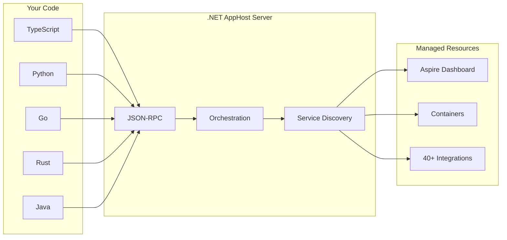

import {
  Aside,
  Badge,
  Code,
  Steps,
  Tabs,
  TabItem,
  FileTree,
} from '@astrojs/starlight/components';
import LearnMore from '@components/LearnMore.astro';
import OsAwareTabs from '@components/OsAwareTabs.astro';
import PivotSelector from '@components/PivotSelector.astro';
import Pivot from '@components/Pivot.astro';

<Badge
  text="Preview feature"
  variant="danger"
  size="large"
  class:list={'mb-4'}
/>

Aspire's polyglot support allows you to write AppHosts in languages other than C#. This enables teams to use their preferred programming language while still benefiting from Aspire's orchestration capabilities, including access to 40+ hosting integrations (Redis, PostgreSQL, Azure services, and more).

<Aside type="note" title="Enable preview feature">
Polyglot AppHost support is currently in preview. Not all features are supported, and the API may change.

To enable this feature, run the following command:

```bash title="Enable polyglot support"
aspire config set features:polyglotSupportEnabled true --global
```

<LearnMore>
For more information, see [aspire config command reference](/reference/cli/commands/aspire-config-set/)
</LearnMore>
</Aside>

## How it works

When you create a polyglot AppHost:

<Steps>

1. The Aspire CLI scaffolds a language-specific AppHost project
2. A .NET AppHost Server runs in the background, handling orchestration
3. Your code communicates with the server via JSON-RPC over Unix sockets (or named pipes on Windows)
4. The server manages containers, service discovery, and the Aspire Dashboard

</Steps>



This architecture gives you access to the full power of Aspire's orchestration while writing code in your preferred language.

## Prerequisites

Before creating a polyglot AppHost, ensure you have the following installed:

### Required for all languages

| Requirement                                                   | Version | Notes                            |
| ------------------------------------------------------------- | ------- | -------------------------------- |
| [.NET SDK](https://dotnet.microsoft.com/download/dotnet/10.0) | 10.0+   | Required for the AppHost server  |
| [Aspire CLI](/get-started/install-cli/)                       | Latest  | Install using the install script |
| [Docker](https://docs.docker.com/get-docker/)                 | Latest  | Required for container resources |

## Language-specific setup

Select your preferred language to see the specific requirements and setup instructions:

<PivotSelector
  title="Select your language"
  key="polyglot-language"
  marginTop="1"
  options={[
    { id: 'typescript', title: 'TypeScript' },
    { id: 'python', title: 'Python' },
    { id: 'go', title: 'Go' },
    { id: 'rust', title: 'Rust' },
    { id: 'java', title: 'Java' },
  ]}
/>

### Runtime requirements

<Pivot id="typescript">

| Requirement                    | Version | Notes                   |
| ------------------------------ | ------- | ----------------------- |
| [Node.js](https://nodejs.org/) | 20+     | LTS version recommended |
| npm or pnpm                    | Latest  | Package manager         |

</Pivot>
<Pivot id="python">

| Requirement                                 | Version | Notes                         |
| ------------------------------------------- | ------- | ----------------------------- |
| [Python](https://www.python.org/downloads/) | 3.10+   | `python3` or `python` command |
| [uv](https://docs.astral.sh/uv/)            | Latest  | Python package manager        |

Install uv if not already installed:

```bash title="Install uv"
curl -LsSf https://astral.sh/uv/install.sh | sh
```

</Pivot>
<Pivot id="go">

| Requirement              | Version | Notes                       |
| ------------------------ | ------- | --------------------------- |
| [Go](https://go.dev/dl/) | 1.23+   | Required for module support |

</Pivot>
<Pivot id="rust">

<Aside type="caution" title="Experimental">
  Rust support is experimental and may have compilation issues with some
  integrations. Please report any issues on the [Aspire GitHub
  repository](https://github.com/dotnet/aspire/issues).
</Aside>

| Requirement                | Version       | Notes              |
| -------------------------- | ------------- | ------------------ |
| [Rust](https://rustup.rs/) | Latest stable | Via rustup         |
| Cargo                      | Latest        | Included with Rust |

</Pivot>
<Pivot id="java">

| Requirement                       | Version | Notes                       |
| --------------------------------- | ------- | --------------------------- |
| [Java JDK](https://adoptium.net/) | 17+     | OpenJDK/Temurin recommended |

</Pivot>

### Create an AppHost

The following steps demonstrate how to create a new polyglot AppHost for your preferred language.

<Pivot id="typescript">

<Steps>

1. Create a new directory and initialize the AppHost:

   ```bash title="Initialize TypeScript AppHost"
   mkdir my-apphost && cd my-apphost
   aspire init -l typescript
   ```

2. The following project structure is created:

   <FileTree>
     - my-apphost/ - .aspire/ - settings.json - .modules/ Generated SDK (created
     on first run) - apphost.ts Your AppHost code - apphost.run.json -
     package.json - tsconfig.json
   </FileTree>

3. Review the generated `apphost.ts`:

   ```typescript title="apphost.ts"
   import { createBuilder } from './.modules/aspire.js';

   const builder = await createBuilder();

   // Add your resources here, for example:
   // const redis = builder.addRedis("cache");
   // const postgres = builder.addPostgres("db");

   const app = builder.build();
   await app.run();
   ```

</Steps>

</Pivot>
<Pivot id="python">

<Steps>

1. Create a new directory and initialize the AppHost:

   ```bash title="Initialize Python AppHost"
   mkdir my-apphost && cd my-apphost
   aspire init -l python
   ```

2. The following project structure is created:

   <FileTree>
     - my-apphost/ - .aspire/ - settings.json - .modules/ Generated SDK (created
     on first run) - apphost.py Your AppHost code - apphost.run.json -
     requirements.txt - uv-install.py
   </FileTree>

3. Review the generated `apphost.py`:

   ```python title="apphost.py"
   import sys
   from pathlib import Path
   sys.path.insert(0, str(Path(__file__).parent / ".modules"))

   from aspire import create_builder

   builder = create_builder()

   # Add your resources here, for example:
   # redis = builder.add_redis("cache")
   # postgres = builder.add_postgres("db")

   builder.build().run()
   ```

</Steps>

</Pivot>
<Pivot id="go">

<Steps>

1. Create a new directory and initialize the AppHost:

   ```bash title="Initialize Go AppHost"
   mkdir my-apphost && cd my-apphost
   aspire init -l go
   ```

2. The following project structure is created:

   <FileTree>
     - my-apphost/ - .aspire/ - settings.json - .modules/ Generated SDK -
     apphost.go Your AppHost code - apphost.run.json - go.mod
   </FileTree>

3. Review the generated `apphost.go`:

   ```go title="apphost.go"
   package main

   import (
       "log"
       "apphost/modules/aspire"
   )

   func main() {
       builder, err := aspire.CreateBuilder(nil)
       if err != nil {
           log.Fatalf("Failed to create builder: %v", err)
       }

       // Add your resources here, for example:
       // redis, _ := builder.AddRedis("cache", 0, nil)
       // postgres, _ := builder.AddPostgres("db", 0, nil, nil)

       app, err := builder.Build()
       if err != nil {
           log.Fatalf("Failed to build: %v", err)
       }
       if err := app.Run(nil); err != nil {
           log.Fatalf("Failed to run: %v", err)
       }
   }
   ```

</Steps>

</Pivot>
<Pivot id="rust">

<Steps>

1. Create a new directory and initialize the AppHost:

   ```bash title="Initialize Rust AppHost"
   mkdir my-apphost && cd my-apphost
   aspire init -l rust
   ```

2. The following project structure is created:

   <FileTree>
     - my-apphost/ - .aspire/ - settings.json - .modules/ Generated SDK -
     apphost.rs Marker file - apphost.run.json - Cargo.toml - src/ - main.rs
     Your AppHost code
   </FileTree>

3. Review the generated `src/main.rs`:

   ```rust title="src/main.rs"
   #[path = "../.modules/mod.rs"]
   mod aspire;

   use aspire::*;

   fn main() -> Result<(), Box<dyn std::error::Error>> {
       let builder = create_builder(None)?;

       // Add your resources here, for example:
       // let redis = builder.add_redis("cache", None, None)?;
       // let postgres = builder.add_postgres("db", None, None, None)?;

       let app = builder.build()?;
       app.run(None)?;
       Ok(())
   }
   ```

</Steps>

</Pivot>
<Pivot id="java">

<Steps>

1. Create a new directory and initialize the AppHost:

   ```bash title="Initialize Java AppHost"
   mkdir my-apphost && cd my-apphost
   aspire init -l java
   ```

2. The following project structure is created:

   <FileTree>
     - my-apphost/ - .aspire/ - settings.json - .modules/ Generated SDK -
     AppHost.java Your AppHost code - apphost.run.json
   </FileTree>

3. Review the generated `AppHost.java`:

   ```java title="AppHost.java"
   package aspire;

   public class AppHost {
       public static void main(String[] args) {
           try {
               IDistributedApplicationBuilder builder = Aspire.createBuilder(null);

               // Add your resources here, for example:
               // var redis = builder.addRedis("cache", null, null);
               // var postgres = builder.addPostgres("db", null, null, null);

               DistributedApplication app = builder.build();
               app.run(null);
           } catch (Exception e) {
               System.err.println("Failed to run: " + e.getMessage());
               e.printStackTrace();
               System.exit(1);
           }
       }
   }
   ```

</Steps>

</Pivot>

### Add Redis integration

<Pivot id="typescript">

<Steps>

1. Add the Redis integration:

   ```bash title="Add Redis"
   aspire add Aspire.Hosting.Redis
   ```

2. Update `apphost.ts` to use Redis:

   ```typescript title="apphost.ts" ins={5-6}
   import { createBuilder } from './.modules/aspire.js';

   const builder = await createBuilder();

   // Add Redis cache resource
   const redis = builder.addRedis('cache');

   const app = builder.build();
   await app.run();
   ```

3. Run the AppHost:

   ```bash title="Run AppHost"
   aspire run
   ```

</Steps>

</Pivot>
<Pivot id="python">

<Steps>

1. Add the Redis integration:

   ```bash title="Add Redis"
   aspire add Aspire.Hosting.Redis
   ```

2. Update `apphost.py` to use Redis:

   ```python title="apphost.py" ins={9-10}
   import sys
   from pathlib import Path
   sys.path.insert(0, str(Path(__file__).parent / ".modules"))

   from aspire import create_builder

   builder = create_builder()

   # Add Redis cache resource
   redis = builder.add_redis("cache")

   builder.build().run()
   ```

3. Run the AppHost:

   ```bash title="Run AppHost"
   aspire run
   ```

</Steps>

</Pivot>
<Pivot id="go">

<Steps>

1. Add the Redis integration:

   ```bash title="Add Redis"
   aspire add Aspire.Hosting.Redis
   ```

2. Update `apphost.go` to use Redis:

   ```go title="apphost.go" ins={14-18}
   package main

   import (
       "log"
       "apphost/modules/aspire"
   )

   func main() {
       builder, err := aspire.CreateBuilder(nil)
       if err != nil {
           log.Fatalf("Failed to create builder: %v", err)
       }

       // Add Redis cache resource (name, port, password)
       // Use 0 for default port, nil for no password
       _, err = builder.AddRedis("cache", 0, nil)
       if err != nil {
           log.Fatalf("Failed to add Redis: %v", err)
       }

       app, err := builder.Build()
       if err != nil {
           log.Fatalf("Failed to build: %v", err)
       }
       if err := app.Run(nil); err != nil {
           log.Fatalf("Failed to run: %v", err)
       }
   }
   ```

3. Run the AppHost:

   ```bash title="Run AppHost"
   aspire run
   ```

</Steps>

</Pivot>
<Pivot id="rust">

<Steps>

1. Add the Redis integration:

   ```bash title="Add Redis"
   aspire add Aspire.Hosting.Redis
   ```

2. Update `src/main.rs` to use Redis:

   ```rust title="src/main.rs" ins={9-10}
   #[path = "../.modules/mod.rs"]
   mod aspire;

   use aspire::*;

   fn main() -> Result<(), Box<dyn std::error::Error>> {
       let builder = create_builder(None)?;

       // Add Redis cache resource (name, port, password)
       builder.add_redis("cache", None, None)?;

       let app = builder.build()?;
       app.run(None)?;
       Ok(())
   }
   ```

3. Run the AppHost:

   ```bash title="Run AppHost"
   aspire run
   ```

</Steps>

</Pivot>
<Pivot id="java">

<Steps>

1. Add the Redis integration:

   ```bash title="Add Redis"
   aspire add Aspire.Hosting.Redis
   ```

2. Update `AppHost.java` to use Redis:

   ```java title="AppHost.java" ins={8-10}
   package aspire;

   public class AppHost {
       public static void main(String[] args) {
           try {
               IDistributedApplicationBuilder builder = Aspire.createBuilder(null);

               // Add Redis cache resource (name, port, password)
               // Use null for default port and no password
               builder.addRedis("cache", null, null);

               DistributedApplication app = builder.build();
               app.run(null);
           } catch (Exception e) {
               System.err.println("Failed to run: " + e.getMessage());
               e.printStackTrace();
               System.exit(1);
           }
       }
   }
   ```

3. Run the AppHost:

   ```bash title="Run AppHost"
   aspire run
   ```

</Steps>

</Pivot>

## Adding integrations

To add Aspire hosting integrations to your polyglot AppHost, use the `aspire add` command:

```bash title="Add integrations"
# Add PostgreSQL
aspire add postgreSQL

# Add RabbitMQ
aspire add rabbitmq

# Add Azure Storage
aspire add azure_storage
```

When you add an integration, the Aspire CLI:

<Steps>

1. Updates `.aspire/settings.json` with the package reference
2. Regenerates the language-specific SDK in the `.modules` directory
3. Makes the new APIs available in your AppHost code

</Steps>

<LearnMore>
  Explore all [available integrations](/integrations/overview/) or see the
  [aspire add reference](/reference/cli/commands/aspire-add/).
</LearnMore>

## Troubleshooting

If you encounter issues with your polyglot AppHost, this section provides guidance on diagnosing and resolving common problems.

### Common issues

Here are solutions to common problems you may encounter when working with polyglot AppHosts.

#### "Command not found" errors

Ensure the language runtime is installed and available in your PATH:

<Pivot id="typescript">

<OsAwareTabs syncKey="terminal">
  <div slot="unix">

```bash title="Verify Node.js installation"
node --version
npm --version
```

  </div>
  <div slot="windows">

```powershell title="Verify Node.js installation"
node --version
npm --version
```

  </div>
</OsAwareTabs>

</Pivot>
<Pivot id="python">

<OsAwareTabs syncKey="terminal">
  <div slot="unix">

```bash title="Verify Python installation"
python3 --version
uv --version
```

  </div>
  <div slot="windows">

```powershell title="Verify Python installation"
python --version
uv --version
```

  </div>
</OsAwareTabs>

</Pivot>
<Pivot id="go">

<OsAwareTabs syncKey="terminal">
  <div slot="unix">

```bash title="Verify Go installation"
go version
```

  </div>
  <div slot="windows">

```powershell title="Verify Go installation"
go version
```

  </div>
</OsAwareTabs>

</Pivot>
<Pivot id="rust">

<OsAwareTabs syncKey="terminal">
  <div slot="unix">

```bash title="Verify Rust installation"
rustc --version
cargo --version
```

  </div>
  <div slot="windows">

```powershell title="Verify Rust installation"
rustc --version
cargo --version
```

  </div>
</OsAwareTabs>

</Pivot>
<Pivot id="java">

<OsAwareTabs syncKey="terminal">
  <div slot="unix">

```bash title="Verify Java installation"
java -version
```

  </div>
  <div slot="windows">

```powershell title="Verify Java installation"
java -version
```

  </div>
</OsAwareTabs>

</Pivot>

#### "Polyglot support not enabled"

Enable polyglot support in the Aspire CLI configuration:

```bash title="Enable polyglot support"
aspire config set features:polyglotSupportEnabled true --global
```

#### SDK compilation errors

If you encounter compilation errors in the generated SDK:

<Steps>

1. Ensure you have the latest version of the Aspire CLI installed
2. Delete the `.modules` directory and run `aspire run` again to regenerate the SDK
3. Check the [Aspire GitHub issues](https://github.com/dotnet/aspire/issues) for known problems

</Steps>

### Debug mode

Run with debug output to diagnose issues:

```bash title="Run with debug output"
aspire run --debug
```

<LearnMore>
  See the [aspire run command reference](/reference/cli/commands/aspire-run/).
</LearnMore>

### Check logs

Aspire CLI logs are stored at:

<OsAwareTabs syncKey="terminal">
  <Code slot="unix" lang="bash" code="~/.aspire/cli/logs/" />
  <Code
    slot="windows"
    lang="powershell"
    code="%USERPROFILE%\.aspire\cli\logs\"
  />
</OsAwareTabs>

## Feedback

Polyglot AppHost support is a preview feature. Your feedback helps us improve language support and prioritize new features. Please share your experiences, suggestions, and bug reports on the [Aspire GitHub repository](https://github.com/dotnet/aspire/issues).

When reporting issues, please include:

- The language you're using
- The Aspire CLI version (`aspire --version`)
- The language runtime version
- Steps to reproduce the issue
- Any error messages or logs

## See also

- [Provide feedback on GitHub](https://github.com/dotnet/aspire/issues)
- [AppHost overview](/get-started/app-host/)
- [Aspire CLI reference](/reference/cli/overview/)
- [Integrations overview](/integrations/overview/)
