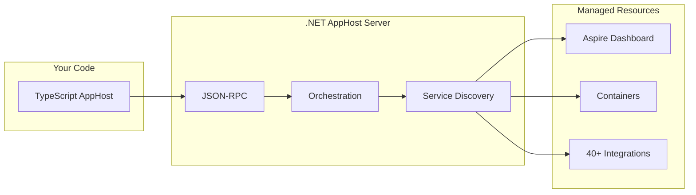

import {
  Aside,
  Badge,
  Code,
  Steps,
  Tabs,
  TabItem,
  FileTree,
} from '@astrojs/starlight/components';
import LearnMore from '@components/LearnMore.astro';
import OsAwareTabs from '@components/OsAwareTabs.astro';

<Badge
  text="Preview feature"
  variant="danger"
  size="large"
  class:list={'mb-4'}
/>

Aspire's polyglot support allows you to write AppHosts in TypeScript instead of C#. This enables teams to use TypeScript while still benefiting from Aspire's orchestration capabilities, including access to 40+ hosting integrations (Redis, PostgreSQL, Azure services, and more).

<Aside type="note" title="Enable preview feature">
Polyglot AppHost support is currently in preview. Not all features are supported, and the API may change.

To enable this feature, run the following command:

```bash title="Enable polyglot support"
aspire config set features:polyglotSupportEnabled true --global
```

<LearnMore>
For more information, see [aspire config command reference](/reference/cli/commands/aspire-config-set/)
</LearnMore>
</Aside>

## How it works

When you create a polyglot AppHost:

<Steps>

1. The Aspire CLI scaffolds a TypeScript AppHost project
2. A .NET AppHost Server runs in the background, handling orchestration
3. Your code communicates with the server via JSON-RPC over Unix sockets (or named pipes on Windows)
4. The server manages containers, service discovery, and the Aspire Dashboard

</Steps>



This architecture gives you access to the full power of Aspire's orchestration while writing code in TypeScript.

## Prerequisites

Before creating a polyglot AppHost, ensure you have the following installed:

| Requirement                                                   | Version | Notes                            |
| ------------------------------------------------------------- | ------- | -------------------------------- |
| [.NET SDK](https://dotnet.microsoft.com/download/dotnet/10.0) | 10.0+   | Required for the AppHost server  |
| [Aspire CLI](/get-started/install-cli/)                       | Latest  | Install using the install script |
| [Docker](https://docs.docker.com/get-docker/)                 | Latest  | Required for container resources |
| [Node.js](https://nodejs.org/)                                | 20+     | LTS version recommended          |
| npm or pnpm                                                   | Latest  | Package manager                  |

## Create an AppHost

The following steps demonstrate how to create a new TypeScript AppHost.

<Steps>

1.  Create and initialize the AppHost:

    ```bash title="Initialize TypeScript AppHost"
    aspire new -l typescript --name my-apphost
    ```

          <Aside type="tip">

    You can also initialize a TypeScript AppHost in an existing directory:

    ```bash title="Initialize in existing directory"
    mkdir my-apphost && cd my-apphost
    aspire init -l typescript
    ```

          </Aside>

2.  The following project structure is created:

    <FileTree>
      - my-apphost/ - .aspire/ - settings.json - .modules/ Generated SDK
      (created on first run) - apphost.ts Your AppHost code - apphost.run.json -
      package.json - tsconfig.json
    </FileTree>

3.  Review the generated `apphost.ts`:

    ```typescript title="apphost.ts"
    import { createBuilder } from './.modules/aspire.js';

    const builder = await createBuilder();

    // Add your resources here, for example:
    // const redis = builder.addRedis("cache");
    // const postgres = builder.addPostgres("db");

    const app = builder.build();
    await app.run();
    ```

</Steps>

## Add integrations

To add Aspire hosting integrations to your polyglot AppHost, use the `aspire add` command. The following example adds Redis and Azure Storage integrations.

<Steps>

1. Add the Redis and Azure Storage integrations:

   ```bash title="Add integrations"
   aspire add redis
   aspire add azurestorage
   ```

   When you add an integration, the Aspire CLI updates `.aspire/settings.json` with the package reference, regenerates the TypeScript SDK in the `.modules` directory, and makes the new APIs available in your AppHost code.

2. Update `apphost.ts` to use the integrations:

   ```typescript title="apphost.ts" ins={5-9}
   import { createBuilder } from './.modules/aspire.js';

   const builder = await createBuilder();

   // Add a Redis cache
   const cache = builder.addRedis('cache');

   // Add Azure Storage running as a local emulator
   const storage = builder.addAzureStorage('storage').runAsEmulator();

   const app = builder.build();
   await app.run();
   ```

3. Run the AppHost:

   ```bash title="Run AppHost"
   aspire run
   ```

   The Aspire CLI starts the .NET AppHost server, pulls the required container images for Redis and the Azure Storage emulator, and opens the Aspire Dashboard.

</Steps>

<LearnMore>
  Explore all [available integrations](/integrations/overview/) or see the
  [aspire add reference](/reference/cli/commands/aspire-add/).
</LearnMore>

## Add a JavaScript application

You can add JavaScript or Node.js applications to your AppHost and have them participate in Aspire's orchestration, including service discovery and resource references.

<Steps>

1. Add the JavaScript hosting integration:

   ```bash title="Add JavaScript integration"
   aspire add javascript
   ```

2. Update `apphost.ts` to reference your JavaScript application:

   ```typescript title="apphost.ts" ins={11-14}
   import { createBuilder } from './.modules/aspire.js';

   const builder = await createBuilder();

   // Add a Redis cache
   const cache = builder.addRedis('cache');

   // Add Azure Storage running as a local emulator
   const storage = builder.addAzureStorage('storage').runAsEmulator();

   // Add a Node.js application
   const api = builder
     .addNodeApp('api', '../api', 'server.js')
     .withHttpEndpoint({ port: 3000, env: 'PORT' })
     .withReference(cache);

   const app = builder.build();
   await app.run();
   ```

   In this example, the Node.js application at `../api/server.js` is registered as a resource named `api`. It receives a connection string for the Redis cache through service discovery.

</Steps>

<Aside type="note">
  The JavaScript application itself is for you to create. Aspire orchestrates it
  alongside your other resources, providing service discovery and environment
  variables for any referenced resources.
</Aside>

## Troubleshooting

If you encounter issues with your polyglot AppHost, this section provides guidance on diagnosing and resolving common problems.

### Common issues

Here are solutions to common problems you may encounter when working with polyglot AppHosts.

#### "Command not found" errors

Ensure Node.js is installed and available in your PATH:

```bash title="Verify Node.js installation"
node --version
npm --version
```

#### "Polyglot support not enabled"

Enable polyglot support in the Aspire CLI configuration:

```bash title="Enable polyglot support"
aspire config set features:polyglotSupportEnabled true --global
```

#### SDK compilation errors

If you encounter compilation errors in the generated SDK:

<Steps>

1. Ensure you have the latest version of the Aspire CLI installed
2. Delete the `.modules` directory and run `aspire run` again to regenerate the SDK
3. Check the [Aspire GitHub issues](https://github.com/dotnet/aspire/issues) for known problems

</Steps>

### Debug mode

Run with debug output to diagnose issues:

```bash title="Run with debug output"
aspire run --debug
```

<LearnMore>
  See the [aspire run command reference](/reference/cli/commands/aspire-run/).
</LearnMore>

### Check logs

Aspire CLI logs are stored at:

<OsAwareTabs syncKey="terminal">
  <Code slot="unix" lang="bash" code="$HOME/.aspire/cli/logs/" />
  <Code slot="windows" lang="powershell" code="$HOME\.aspire\cli\logs\" />
</OsAwareTabs>

## Feedback

Polyglot AppHost support is a preview feature. Your feedback helps us improve language support and prioritize new features. Please share your experiences, suggestions, and bug reports on the [Aspire GitHub repository](https://github.com/dotnet/aspire/issues).

When reporting issues, please include:

- The Aspire CLI version (`aspire --version`)
- The Node.js version (`node --version`)
- Steps to reproduce the issue
- Any error messages or logs

## See also

- [Provide feedback on GitHub](https://github.com/dotnet/aspire/issues)
- [AppHost overview](/get-started/app-host/)
- [Aspire CLI reference](/reference/cli/overview/)
- [Integrations overview](/integrations/overview/)
