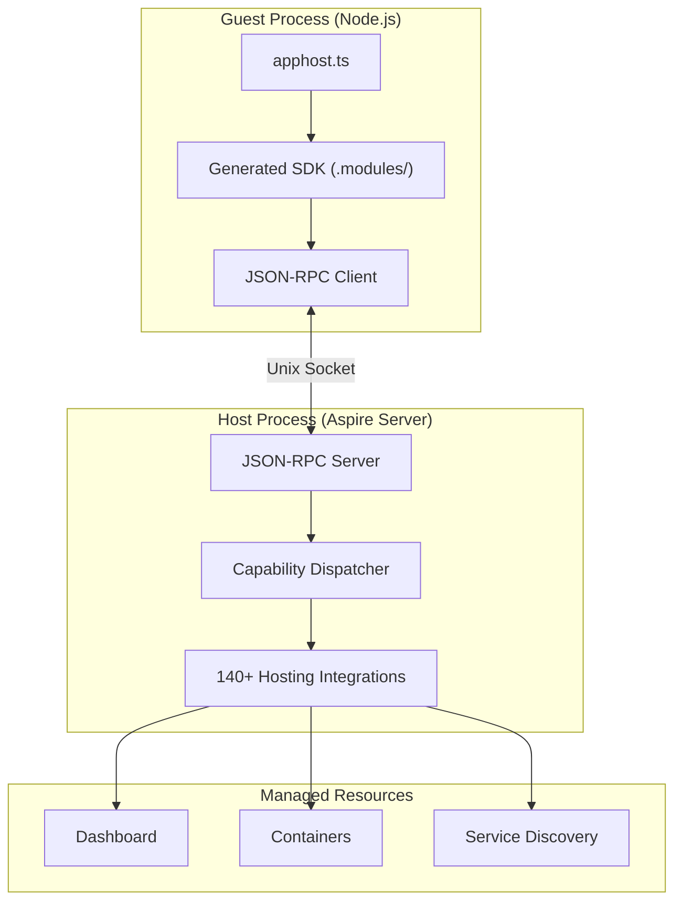

import { Aside } from '@astrojs/starlight/components';
import LearnMore from '@components/LearnMore.astro';

Aspire supports writing AppHosts in multiple languages. While the orchestration engine is built on .NET, a guest/host architecture allows AppHosts written in TypeScript (and other languages in the future) to access the full power of Aspire's integrations, service discovery, and dashboard.

## Why a shared backend

Aspire has 140+ hosting integrations and deployment publishers — all written in .NET with years of production hardening. Rewriting these in every language would be massive duplication and a maintenance nightmare. Instead, guest languages just *declare* resources (`addRedis`, `addPostgres`, `withReference`), and the .NET host handles orchestration (starting containers, service discovery, health checks, the dashboard) and publishing (generating Bicep, Kubernetes YAML). The trade-off is a local IPC hop, which is far cheaper than maintaining N languages × M integrations.

## Guest/host model

When you run a TypeScript AppHost, the Aspire CLI orchestrates two processes:

- **Guest** — your TypeScript code (`apphost.ts`), running in Node.js
- **Host** — the Aspire orchestration server, managing containers, service discovery, and the dashboard

The guest communicates with the host via JSON-RPC over a local transport (Unix sockets on macOS/Linux, named pipes on Windows). This is transparent — your TypeScript code calls `addRedis()` or `withReference()` and the generated SDK handles the RPC.

### Startup sequence

1. The CLI prepares the AppHost server with the required hosting packages
2. The ATS scanner scans assemblies for `[AspireExport]` attributes and generates the TypeScript SDK in `.modules/`
3. The CLI starts the host process with a socket path
4. The CLI starts the guest process, passing the socket path via the `REMOTE_APP_HOST_SOCKET_PATH` environment variable
5. The guest connects and invokes capabilities (`createBuilder`, `addRedis`, `build`, `run`)
6. The host orchestrates resources, starts the dashboard, and manages the full lifecycle

### Connection security

The guest process authenticates with the host using a one-time token passed via environment variable at startup. The local socket is also protected by file system permissions — only processes running as the same user can connect. There are no open network ports.

## Aspire Type System (ATS)

ATS is the type system that bridges .NET and guest languages. Every type crossing the boundary has a portable **type ID** derived from its assembly and type name.

### Type categories

| Category | Description | Serialization |
|----------|-------------|---------------|
| **Primitive** | `string`, `int`, `bool`, `double`, etc. | JSON native types |
| **Enum** | .NET enum types | String (member name) |
| **Handle** | Opaque reference to a .NET object | `{ "$handle": "42", "$type": "..." }` |
| **DTO** | Data transfer objects (`[AspireDto]`) | JSON object |
| **Callback** | Guest-provided delegate functions | Callback ID |
| **Array** | Immutable collections | JSON array (copied by value) |
| **List / Dict** | Mutable collections | Handle when a property, JSON when a parameter |

### How it maps to TypeScript

| .NET type | TypeScript representation |
|-----------|--------------------------|
| Primitives (`string`, `int`, `bool`) | Native TypeScript types |
| Enums | String literal unions |
| Resource types (`RedisResource`, etc.) | Typed handle objects with fluent methods |
| DTOs (`[AspireDto]` classes) | Interfaces serialized as JSON |
| Collections (`List<T>`, `Dictionary<K,V>`) | Arrays and `Record<string, T>` |
| Delegates (`Action<T>`, `Func<T>`) | Async callback functions |

Resource types are passed by **handle** — the actual instance lives in the .NET host, and the TypeScript SDK holds a reference. Method calls are dispatched as JSON-RPC requests.

### Polymorphism flattening

.NET's type system uses interfaces, generics, and inheritance. Guest languages don't need to understand any of this. The ATS scanner flattens the type hierarchy at scan time:

- Each concrete type gets a complete list of all applicable capabilities
- Generic constraints are resolved to concrete types
- Interface relationships are expanded so `RedisResource` automatically gets `withEnvironment()` (from `IResourceWithEnvironment`) alongside `addRedis()`-specific methods

The result is a flat API where every resource type has all its methods directly — no inheritance to reason about.

## SDK generation

The TypeScript SDK is generated automatically from hosting integration assemblies. When you add an integration with `aspire add`, the CLI:

1. Loads the integration's .NET assembly
2. Scans for methods and types marked with `[AspireExport]` attributes
3. Flattens interface hierarchies into concrete type capabilities
4. Generates typed TypeScript wrappers in `.modules/`

This means every C# hosting integration with `[AspireExport]` annotations is automatically available in TypeScript — no manual bindings needed. Integration authors don't write TypeScript; they annotate their C# code and the SDK is generated.

<LearnMore>
  If you're building a hosting integration and want it to work with TypeScript AppHosts, see [Multi-language integrations](/extensibility/multi-language-integration-authoring/).
</LearnMore>

## Same model, different syntax

The AppHost model is identical regardless of language. A TypeScript AppHost defines the same resources, references, and dependency graph as a C# AppHost — only the syntax differs:

| Concept | C# | TypeScript |
|---------|-----|-----------|
| Create builder | `DistributedApplication.CreateBuilder(args)` | `await createBuilder()` |
| Add resource | `builder.AddRedis("cache")` | `await builder.addRedis("cache")` |
| Reference | `.WithReference(db)` | `.withReference(db)` |
| Wait for | `.WaitFor(api)` | `.waitFor(api)` |
| Build and run | `builder.Build().Run()` | `await builder.build().run()` |

The generated dashboard, service discovery, health checks, and deployment artifacts are identical regardless of which language the AppHost is written in.

## See also

- [Build your first app](/get-started/first-app/?lang=javascript) — get started with a TypeScript AppHost
- [Resource model](/architecture/resource-model/) — how Aspire models resources and relationships
- [Multi-language integrations](/extensibility/multi-language-integration-authoring/) — make your integration work with TypeScript AppHosts
