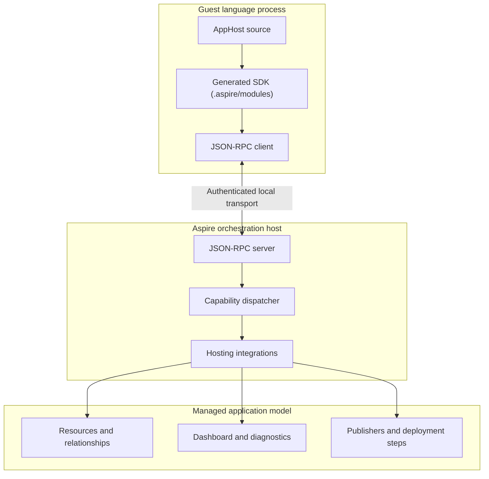

import AppHostTabs from '@components/AppHostTabs.astro';
import LearnMore from '@components/LearnMore.astro';

Aspire uses one application model across C#, TypeScript, Python, Go, Java, and Rust AppHosts. C# hosts that model directly. The other languages use generated SDKs that call the same .NET orchestration engine.

TypeScript and C# AppHosts are established. Python, Go, Java, and Rust AppHosts are experimental and require the corresponding `experimentalPolyglot:<language>` feature flag.

## Why a shared backend

Aspire hosting integrations and deployment publishers are implemented in .NET. They already contain the behavior for containers, service discovery, health checks, diagnostics, resource commands, and publishing. Reimplementing that behavior for every AppHost language would produce separate orchestration engines that could drift.

Instead, ATS exports a language-neutral capability contract. Generated guest SDKs expose that contract using each language's naming and error conventions, while the .NET host remains responsible for resource behavior.

## Guest and host processes

When you run a guest-language AppHost, the Aspire CLI coordinates two processes:

- **Guest process**: your `apphost.mts`, `apphost.py`, `apphost.go`, `AppHost.java`, or `apphost.rs` program.
- **Host process**: the Aspire orchestration server that loads hosting integrations and owns the application model.

The generated SDK sends JSON-RPC requests over a local transport: Unix domain sockets on macOS and Linux, and named pipes on Windows.


```mermaid
flowchart TB
    subgraph Guest["Guest language process"]
        AppHost["AppHost source"]
        SDK["Generated SDK (.aspire/modules)"]
        Client["JSON-RPC client"]
        AppHost --> SDK --> Client
    end

    subgraph Host["Aspire orchestration host"]
        RPC["JSON-RPC server"]
        Dispatcher["Capability dispatcher"]
        Integrations["Hosting integrations"]
        RPC --> Dispatcher --> Integrations
    end

    subgraph Managed["Managed application model"]
        Resources["Resources and relationships"]
        Dashboard["Dashboard and diagnostics"]
        Publishers["Publishers and deployment steps"]
    end

    Client <-->|"Authenticated local transport"| RPC
    Integrations --> Resources & Dashboard & Publishers
```

## Startup sequence

1. The CLI detects the AppHost from `aspire.config.json` or its canonical entry filename.
1. The CLI restores the hosting packages required by the AppHost.
1. ATS scans exported capabilities and generates the language SDK under `.aspire/modules`.
1. The CLI starts the host process and creates a local socket or named pipe.
1. The CLI generates a one-time authentication token and passes connection details to the guest process through environment variables.
1. The guest runtime starts and invokes capabilities such as builder creation, resource methods, `build`, and `run`.
1. The host validates and orchestrates the resulting resource graph.

The transport doesn't open a public network port. Operating-system permissions protect the local endpoint, and the one-time token authenticates the guest process.

## Aspire Type System

The Aspire Type System (ATS) describes the contract that can cross the guest/host boundary. It gives exported .NET types portable identities and classifies values by how they move across JSON-RPC.

| Category              | Representation                                                    |
| --------------------- | ----------------------------------------------------------------- |
| Primitive             | JSON-native strings, numbers, booleans, and null values           |
| Enum or value catalog | Generated language enum, constant, or literal representation      |
| Handle                | Opaque reference to an object that remains in the host process    |
| DTO                   | JSON-shaped object generated in the guest SDK                     |
| Callback              | Guest function registered by identifier and invoked from the host |
| Collection            | JSON value or a handle, depending on the exported contract        |
| Union                 | One of the explicitly exported ATS-compatible value shapes        |

Resource builders are handles. A guest method such as `addRedis`, `add_redis`, or `AddRedis` invokes a host capability and returns a generated wrapper for the host-side resource builder.

## Generated SDK layouts

The package list in `aspire.config.json` controls which integration APIs are generated. `aspire add` updates the package list and regenerates the SDK; `aspire restore` regenerates it without running the AppHost.

| Language   | Generated layout under `.aspire/modules`         | AppHost reference                                              |
| ---------- | ------------------------------------------------ | -------------------------------------------------------------- |
| TypeScript | `aspire.mts`, `base.mts`, `transport.mts`        | `./.aspire/modules/aspire.mjs`                                 |
| Python     | `aspire_app.py`, `pyproject.toml`                | Editable `aspire_app` package installed from `.aspire/modules` |
| Go         | `aspire.go`, `base.go`, `transport.go`, `go.mod` | `apphost/modules/aspire`, replaced to `./.aspire/modules`      |
| Java       | `aspire/*.java`, `sources.txt`                   | `import aspire.*;`                                             |
| Rust       | `aspire.rs`, `base.rs`, `transport.rs`, `mod.rs` | `#[path = ".aspire/modules/mod.rs"] mod aspire;`               |

Don't edit generated files. Their contents are replaced whenever the SDK regenerates.

## Runtime and error conventions

Each SDK follows the target language instead of reproducing C# syntax:

| Language   | Runtime command                   | Method style              | Error and fluent convention                                                                                                                  |
| ---------- | --------------------------------- | ------------------------- | -------------------------------------------------------------------------------------------------------------------------------------------- |
| TypeScript | Node.js package-manager command   | `camelCase`, asynchronous | Await generated calls; wrapper-returning methods support fluent chaining.                                                                    |
| Python     | `uv run python` or `.venv` Python | `snake_case`              | SDK calls raise Python exceptions; `create_builder()` is a context manager.                                                                  |
| Go         | `go run .`                        | exported `PascalCase`     | Value operations return errors; fluent resource methods accumulate errors and expose `Err()`. Use `aspire.FormatError` for host diagnostics. |
| Java       | `java` after `javac --release 25` | `camelCase`               | Generated calls throw exceptions; resource methods use Java-style fluent objects and options builders.                                       |
| Rust       | `cargo run --bin apphost --`      | `snake_case`              | Generated calls return `Result<_, Box<dyn Error>>`; use `?` or handle each error.                                                            |

Java can also detect Maven or Gradle projects. Aspire uses the checked-in wrapper to resolve dependencies, then compiles the AppHost and generated sources with `javac` so `.aspire/modules` participates in the same compile.

Python prefers `uv`. If `uv` isn't available, Aspire creates `.venv`, bootstraps `pip`, and installs `apphost_requirements.txt`. Both paths require Python 3.11 or later.

## Same model, language-specific syntax

The following AppHosts all declare one Redis resource:

<AppHostTabs>
<Fragment slot="typescript">

```typescript title="apphost.mts"
import { createBuilder } from './.aspire/modules/aspire.mjs';

const builder = await createBuilder();
const cache = await builder.addRedis('cache');
await builder.build().run();
```

</Fragment>
<Fragment slot="csharp">

```csharp title="apphost.cs"
#:sdk Aspire.AppHost.Sdk@%ASPIRE_VERSION%
#:package Aspire.Hosting.Redis@%ASPIRE_VERSION%

var builder = DistributedApplication.CreateBuilder(args);
var cache = builder.AddRedis("cache");
builder.Build().Run();
```

</Fragment>
<Fragment slot="python">

```python title="apphost.py"
from aspire_app import create_builder

with create_builder() as builder:
    cache = builder.add_redis("cache")
    builder.run()
```

</Fragment>
<Fragment slot="go">

```go title="apphost.go"
builder, err := aspire.CreateBuilder()
if err != nil {
	log.Fatal(aspire.FormatError(err))
}

cache := builder.AddRedis("cache")
if err := cache.Err(); err != nil {
	log.Fatal(aspire.FormatError(err))
}

app, err := builder.Build()
if err != nil {
	log.Fatal(aspire.FormatError(err))
}
if err := app.Run(); err != nil {
	log.Fatal(aspire.FormatError(err))
}
```

</Fragment>
<Fragment slot="java">

```java title="AppHost.java"
var builder = DistributedApplication.CreateBuilder();
var cache = builder.addRedis("cache");
builder.build().run();
```

</Fragment>
<Fragment slot="rust">

```rust title="apphost.rs"
let builder = create_builder(None)?;
let cache = builder.add_redis("cache", None, None)?;
let app = builder.build()?;
app.run(None)?;
```

</Fragment>
</AppHostTabs>

The syntax differs, but the host receives the same resource and relationship model.

## Polymorphism flattening

.NET hosting APIs use interfaces, inheritance, generics, overloads, and extension methods. ATS flattens that shape for guest SDKs:

- Concrete generated wrappers receive the capabilities that apply to their base types and interfaces.
- Exported overload families become one ATS-friendly method, options object, or union where possible.
- Runtime capability IDs stay independent from friendly generated method names.
- Resource and endpoint values remain handles instead of being serialized as arbitrary JSON.

This lets a generated `RedisResource` wrapper expose common resource-builder capabilities alongside Redis-specific APIs without reproducing the complete .NET inheritance tree.

## Feature flags and language IDs

| Language   | CLI language ID                                            | Feature flag                  |
| ---------- | ---------------------------------------------------------- | ----------------------------- |
| TypeScript | `typescript/nodejs` (`typescript` is accepted as an alias) | None                          |
| C#         | `csharp`                                                   | None                          |
| Python     | `python`                                                   | `experimentalPolyglot:python` |
| Go         | `go`                                                       | `experimentalPolyglot:go`     |
| Java       | `java`                                                     | `experimentalPolyglot:java`   |
| Rust       | `rust`                                                     | `experimentalPolyglot:rust`   |

Enable an experimental language globally with `aspire config set features:<flag> true --global`, or add the same key under `features` in the project's `aspire.config.json`.

## Current limitations

- Python, Go, Java, and Rust AppHost contracts are experimental and can change.
- Rust SDK validation is marked `continue-on-error` in the Aspire polyglot validation workflow because known issues remain.
- Integration availability depends on ATS exports. A hosting package can work in C# while lacking a verified generated surface in one or more guest languages.
- Full starter templates currently exist for Go and Java AppHosts. `aspire-py-starter` creates a Python workload with a **TypeScript AppHost**, and Rust has only an empty AppHost template.

<LearnMore>
  If you build a hosting integration, see [Author multi-language Aspire
  integrations](/extensibility/multi-language-integration-authoring/) for ATS
  export and validation guidance.
</LearnMore>

## See also

- [Build your first Aspire app](/get-started/first-app/)
- [What is the AppHost?](/get-started/app-host/)
- [Resource model](/architecture/resource-model/)
- [Multi-language integrations](/extensibility/multi-language-integration-authoring/)
