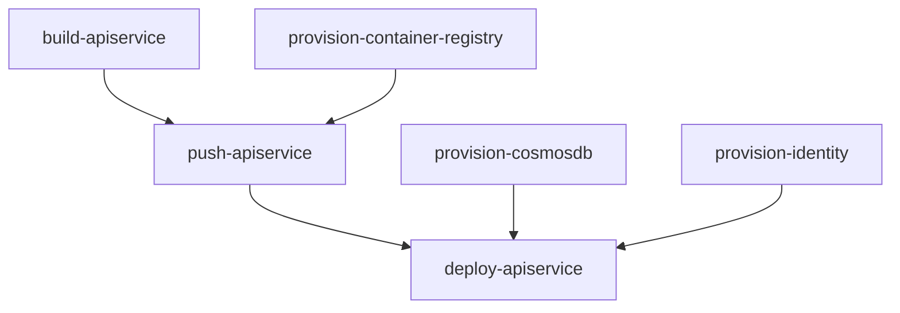

import LearnMore from '@components/LearnMore.astro';
import ThemeImage from '@components/ThemeImage.astro';
import CodespacesButton from '@components/CodespacesButton.astro';
import { Aside, Code, Steps, LinkButton, Tabs, TabItem } from '@astrojs/starlight/components';
import editPage from '@assets/community/edit-page.png';
import editPageLight from '@assets/community/edit-page-light.png';
import pnpm from '@assets/icons/pnpm.svg';
import pnpmLight from '@assets/icons/pnpm-light.svg';

Thank you for your interest in contributing to `aspire.dev`! Whether you're fixing typos, adding new content, or improving existing pages, this guide will help you get started and your contributions are greatly appreciated.

## 🚀 About this site

This documentation site is built using [Starlight](https://starlight.astro.build/), a full-featured documentation theme built on top of [Astro](https://astro.build/). Starlight provides a fast, accessible, and SEO-friendly foundation, while Astro's component-based architecture makes it easy to create and maintain content.

## 🤔 Ways to contribute

There are several ways you can contribute to `aspire.dev`:

- **Small fixes** - Correct typos, grammar mistakes, or formatting issues.
- **Content additions** - Add new documentation pages or sections to cover missing topics.
- **Content improvements** - Enhance existing documentation with clearer explanations, updated information, or additional examples.
- **Code contributions** - Improve the site's codebase, fix bugs, or add new features.

There's also different methods for contributing, from selecting the **Edit page** button at the bottom of any documentation page, to using [GitHub Codespaces](/get-started/github-codespaces/) for a fully configured development environment, or setting up a local development environment on your machine.

### Click-edit

Selecting the **Edit page** button at the bottom of any documentation page will take you to the corresponding file in the GitHub repository. From there, you can make changes directly in the GitHub web interface and submit a pull request. This is best suited for small fixes or minor content additions.

:::tip
If you haven't noticed the **Edit page** button, scroll to the bottom of this page and you should see it there:

<ThemeImage dark={editPage} light={editPageLight} alt="Edit page button at the bottom of a documentation page" />
:::

### Codespaces

To avoid local setup, you can use [GitHub Codespaces](/get-started/github-codespaces/) for a fully configured development environment in the cloud. This is ideal for larger contributions or if you prefer not to set up a local environment.

<CodespacesButton owner='microsoft' repo='aspire.dev' />

:::note
If you choose to use Codespaces, please still refer to the rest of this guide for information on writing style, code quality, and the contribution workflow. Continue reading at the [Writing style section below](#️-writing-style-guide).
:::

### Local development

If you prefer to work locally, you can set up a development environment on your machine. Follow the instructions below to get started.

## 📋 Prerequisites

Before you begin, ensure you have the following installed:

- [Node.js](https://nodejs.org/en/download) (LTS version recommended) - For running the development server
- [pnpm](https://pnpm.io/installation) - Fast, disk space efficient package manager
- [Visual Studio Code](https://code.visualstudio.com/) - Recommended code editor
- [Git](https://git-scm.com/downloads) - For version control

## ⚙️ Local dev setup

<Steps>

1. Clone the `aspire.dev` repository.

    ```bash
    git clone https://github.com/microsoft/aspire.dev.git
    ```

1. Navigate to the `aspire.dev` directory.

    ```bash
    cd aspire.dev
    ```

1. Install dependencies

    <Tabs syncKey="pkg-mgr">

    <TabItem label="pnpm" icon="pnpm">
		```bash
    pnpm install
    ```
	  </TabItem>
	  <TabItem label="npm" icon="npm">
    ```bash
    npm install
    ```

    :::tip[Stop using npm]{icon='seti:todo'}
    If you're not already using `pnpm`, consider switching! <ThemeImage dark={pnpm} light={pnpmLight} alt="pnpm logo" zoomable={false} classOverride='inline' href={'https://pnpm.io/installation'} /> It's faster and more efficient than `npm` or `yarn`.
    
    Install globally with:

    ```bash
    npm install -g pnpm
    ```
    :::
	  </TabItem>
    </Tabs>

1. Run the development server

    ```bash
    pnpm dev
    ```

    This starts the Vite development server for the frontend and provide hot-reload capabilities.

1. View the site locally

    Open your browser to `http://localhost:4321` (or the port shown in your terminal)

    :::tip
    During local development, the site search functionality is disabled. This is normal behavior as the search index is built during the production build process. To test search functionality, run a production build locally using `pnpm build` and then preview it with `pnpm preview`.
    :::

</Steps>

### Dependency release policy

Use the pnpm version pinned in `package.json`. Both install roots enforce a
seven-day minimum release age, including transitive dependencies, and reject
packages with missing publication timestamps. This complements Dependabot's
cooldown; don't bypass it with release-age exclusions or unqualified updates.
Both install roots select the public npm registry, matching CI. Regenerate locks
against that registry so machine-specific mirror URLs or downgraded integrity
metadata aren't committed. Keep strict lock verification enabled.

The September 18, 2026 upgrade snapshot uses releases published by September 11,
2026, at 14:59:53 UTC. Its frontend cohort is Astro 7.3.2, Starlight 0.42.0,
MDX 8.0.1, Vite 8.3.0, and pnpm 11.26.0, with Node 24 LTS. Keep the nested MDX 7
processor used by `starlight-llms-txt` separate from the MDX 8 processor.

| Dependency | Compatibility decision |
| ---------- | ---------------------- |
| TypeScript | Retain 6.0.3; the native TypeScript 7 compiler requires a separate lint/Twoslash migration. |
| Mermaid | Retain 11.16.1 until Mermaid 12 rendering, interactions, and browser support are qualified. |
| Azure Front Door integration | Retain the existing preview package; don't replace deployment infrastructure as part of the upgrade. |
| UnoCSS | Pin both `unocss` and `@unocss/astro` to 66.9.2, the newest eligible cohort before the inspector introduces h3 2 release candidates. Don't override the newer inspector to incompatible h3 1.x. |
| pnpm setup | Retain the enterprise-approved `pnpm/action-setup` 6.0.10 SHA with pnpm 11.26.0. pnpm 12 requires Action 6.1.0, which is not currently allowlisted. |

The generated `agentics-maintenance.yml` workflow is held because its authoring
source is absent. Publication age for the pnpm devcontainer feature and inactive
gh-aw OCI catalog entries is not verified, so those existing references are
retained rather than selecting an unverified replacement. These deliberate
holds preserve compatibility; built-site qualification is still required.

### Incremental build qualification pilot

Normal production builds and `pnpm dev` are unchanged. An **experimental,
opt-in pilot** can reuse generated C# and TypeScript API pages and their Markdown
endpoints. It doesn't cache Starlight documentation pages and isn't enabled for
deployments. The measured pilot passes whole-site output comparisons in the
qualified scenarios, but is slower than matched clean builds. Keep it for
qualification, not routine CI acceleration.

From `src/frontend`, use the pinned pnpm version and run:

```sh title="Terminal — Opt into API incremental builds"
pnpm build:incremental
pnpm build:incremental --force
pnpm build:incremental --skip-search
```

These commands perform full site builds, not lightweight development-server
updates. `--force` ignores reusable output and refreshes the cache.
`--skip-search` uses a separate cache partition and omits Pagefind, like the
existing skip-search build. The regular `pnpm build:production` command remains
the rollback path. Coding agents must obtain explicit permission before running
any local production build.

Reusable data lives under
`src/frontend/node_modules/.astro-incremental/<mode>/<compatibility>/`.
Each build assembles a complete new `dist`; the cache isn't a deployable site.
Package/module keys cover all siblings used by sidebars and type links. The
compatibility partition covers the runtime, lockfile, patches, configuration,
middleware, shared source, assets, public environment settings, and build mode.
Route keys also capture generated icon metadata after Starlight refreshes it.
For safety, documentation edits also invalidate API reuse because MDX can change
global CSS and imported assets. The initial performance opportunity is therefore
unchanged-input and API-data-only builds, not ordinary documentation edits.

Build identity is finalized after rendering and raw-cache storage, including
restored HTML, but before Pagefind indexes the site. A streaming HTML parser
updates only designated metadata and footer ranges without reserializing pages
or constructing a full document tree for each page. Validated ranges are now
saved in `identity-ranges.json` inside the same compatibility partition, keyed
by SHA-256 of the exact raw HTML. Byte-identical pages reuse positions, not
previous identity values; changed HTML is parsed again. Missing metadata is
regenerated, malformed JSON or schema data produces a warning and is rebuilt,
and `--force` ignores it. Invalid offsets or token contents, filesystem errors,
and unsupported identity markers still fail the build. This avoids repeating
HTML tokenization on warm builds without
caching documentation rendering or weakening output comparison. Equal-width
identity tokens allow UTF-8 buffers to be updated without repeatedly copying or
decoding complete pages. Four bounded file workers overlap I/O; finalization
awaits every worker and propagates failures before indexing or cache publication.
The pilot also wraps Astro's default prerenderer through the public
`setPrerenderer` build hook. It collects incremental dependency metadata only
for components whose static paths include a `cacheKey`, avoiding metadata
collection and response buffering for uncached documentation components.
Keyed API components retain Astro's content and image tracking; static paths,
responses, lifecycle hooks, and image collection are delegated unchanged.
Components mixing keyed and unkeyed paths remain conservatively tracked.
This doesn't add caching to Starlight documentation routes or patch Astro.
The existing merge-base commit selection, source links, footer SHA, and
cross-deployment full-navigation guard remain the intended contract. The pilot
rejects missing identity and unreplaced identity markers instead of producing a
success-shaped artifact.

The **Frontend incremental pilot** GitHub Actions workflow never deploys. Run it
manually after the clean dependency-upgrade CI passes. Before the workflow is
available on the default branch, maintainers can opt a pull request into the
complete five-scenario matrix with the `ci:incremental-pilot` label. This runs
multiple full builds, so don't enable it on routine documentation changes.
For a focused identity-fixture rerun after the other scenarios are qualified,
replace that label with `ci:incremental-pilot:identity`. If both labels are
present, the complete matrix takes precedence.

The workflow compares every output file by SHA-256, without normalizing away
HTML, identity, scripts, images, search data, or endpoints. It first checks
clean-versus-clean determinism, then first-use and warm incremental equivalence,
and requires both HTML and Markdown cache hits. Additional scenarios cover a
different real commit SHA as an identity fixture, API add/delete/rename/sibling
edits, a global CSS edit, and a missing cache file. The API scenario creates and
restores a fixture commit only inside CI, recording each build's source commit
to distinguish real cross-commit reuse from an unchanged-checkout warm build.
It retains the existing unit and desktop/tablet/mobile Chromium suites against
the built site. The identity fixture isn't a substitute for measuring real
cross-commit builds. It chooses a commit different from the resolved build
identity, rather than assuming `HEAD^` differs: in a pull-request merge checkout,
that parent can be the same merge-base SHA used by the normal build.

The qualification captures successful public GitHub contributor and icon
responses once per job, then replays those exact responses for every compared
build. Capture requires the workflow's read-only GitHub token; credentials
aren't stored in the snapshot. A missing recorded request fails the experiment
instead of accepting empty contributor lists after a rate-limit failure.
Normal builds don't use this replay.

RSS fallback dates normally use the current time. For reproducible builds,
`SOURCE_DATE_EPOCH` can supply a Unix timestamp in whole seconds; explicitly
dated feed entries are unchanged. The qualification sets it to the checkout
commit's timestamp for every paired build, including mutation fixtures, and
records it with the measurements. This RSS-only clock doesn't evict API pages:
RSS is rebuilt on every run. No output timestamps or search-index files are
normalized away.

Evidence artifacts include complete-output differences, build logs, phase
timings, peak resident memory, restored-route counts, and cache size. Use Actions
step durations to include cache transfer, checks, and upload costs in any
performance comparison; rendering time alone doesn't establish a net speedup.
The diagnostic site artifact can contain deliberate fixture changes and must
not be deployed. Only a successful default-branch `warm` run can save a reusable
CI cache, in a namespace that ordinary production and pull-request builds never
consume.

The pull-request `warm` and `api-data` jobs also measure upload and restore in
separate, run-and-scenario-specific `astro-api-transport-probe-` namespaces.
Each job snapshots every cache
file, removes the local copy, restores the exact diagnostic key, and verifies
all bytes. A missing or changed cache fails the probe. These diagnostic entries
are never read by deployments or other pilot runs and do not populate the
trusted pilot namespace. Include both measured transfer steps when assessing a
net CI benefit.

The icon plugin patch defers reading its safelist until CSS generation, after
Starlight has refreshed it. This preserves offline fallback and prevents a cold
checkout from omitting icons that appear only on the next build. Looping media
markup also omits unused random attributes; playback remains scoped to each
component wrapper.

Two additional clean-build differences were traced to output generation rather
than incremental reuse. Shiki's wall-clock tokenization deadline could silently
truncate syntax colors on a busy runner; code and hover highlighting now finish
without that deadline. The Twoslash patch configures its separate hover renderer,
which doesn't inherit the site's Shiki options. Pagefind's entry manifest
serialized its language map in random hash-map order. A build hook now writes
that map in descending page-count
order with a language-code tie-breaker, preserving every metadata value and the
site's largest-language search fallback. This applies to ordinary and incremental
builds, not the comparator; every generated file still requires exact byte parity.

#### Measured API pilot results

The [September 20, 2026 qualification run](https://github.com/microsoft/aspire.dev/actions/runs/35502757529)
on `937c1a80` passed all five scenarios: cold/warm reuse, a genuinely different
build identity, a real API-data fixture commit, global CSS invalidation, and
partial-cache recovery. Every incremental output matched its corresponding
clean output byte for byte, across **33,894-33,902 files**, including search
data, scripts, images, and endpoints. Added, removed, renamed, and sibling API
entries produced the expected routes instead of leaving stale output.

The API-data fixture advances the source commit from `a576c2ac` to `8fc163eb`.
Its incremental build restores **7,350 HTML and 7,309 Markdown** outputs while
rerendering the 24 changed keyed outputs. The unchanged warm build restores
**7,362 HTML and 7,321 Markdown** outputs. Both transport probes restored and
verified all **15,420 cache files**, about **2.28 GB raw / 58 MB compressed**.

| Matched experiment | Clean build | Incremental build | Cache upload + restore | Build + transfer | Net saving |
| ------------------ | ----------- | ----------------- | ---------------------- | ---------------- | ---------- |
| Unchanged inputs, warm cache | 719.806s | 677.262s | 28s + 5s | 710.262s | **9.545s / 1.33%** |
| Real API-data fixture commit | 912.845s | 811.708s | 14s + 7s | 832.708s | **80.137s / 8.78%** |

Each row compares builds on the same runner with matching source and recorded
network inputs. The warm row uses its clean-repeat control. Transfer is measured
on each row's own runner, not extrapolated from another job. These totals exclude
qualification-only snapshot/checksum work and aren't complete workflow durations.
Across all five runners, warm build-process savings range from **5.91% to 15.43%
before transfer**; only the two rows above have directly measured net totals.
The small no-op margin and runner/transfer variability aren't a universal
speedup guarantee.

The original [September 19 pilot](https://github.com/microsoft/aspire.dev/actions/runs/35414420034)
was slower despite API cache hits: whole-site identity processing erased its
rendering savings. Exact-content token-position reuse, byte-native stamping,
bounded file I/O, and metadata scoping now reduce that overhead. In the current
warm job, identity finalization falls from **184.905s cold to 26.562s warm**,
with no reparsing. Metadata collection is bypassed for **8,617 uncached renders**;
keyed API renders retain their dependency tracking.

All five jobs also passed 640 unit tests and the existing desktop, tablet, and
mobile Chromium suites. Warm/API jobs each report **579 browser passes and 75
applicability skips**. The existing router, search, filter, modal, component,
responsive, and accessibility contracts are covered; this isn't a guarantee
against every possible regression or a Firefox/Safari qualification.

**Keep the pilot opt-in pending a separate rollout decision.** The pilot now
demonstrates a net benefit for a compatible API-only edit, but it doesn't speed
up every change. First-use and global-invalidated caches still cost more:
the global CSS fixture takes **747.891s clean versus 953.556s incremental**
(27.50% slower before transfer). Documentation, shared-source, runtime, and
dependency changes deliberately invalidate reuse. Normal CI and deployment
remain full builds.

Local incremental commands remain available for opt-in use, but local speed
hasn't been measured. Windows configuration and helper behavior were checked
without running a local production build.

:::caution[Qualification is still required]
Astro 7.3.2 supports concurrent incremental builds, so the pilot retains the
existing concurrency of four. It precedes fixes for CSS-preprocessor dependency
invalidation and original-image retention. Source changes conservatively
invalidate the pilot cache, but complete-output comparison and built-site checks
must still prove asset retention. Any unexplained difference, missing asset,
navigation regression, or lack of useful reuse blocks promotion. Don't bypass
the seven-day dependency release buffer to make a qualification run pass.
:::

### Known formatting limitations

We expose `lint` and `format` scripts in the `package.json` to help maintain code quality and consistency. This isn't something that you're need to run manually. However, regardless of whether or not you run these scrips, be aware of the following known limitation when working with MDX files.

<Aside type="caution">

**Prettier and Steps components**

The Prettier formatter has a known limitation when formatting MDX files containing the `Steps` component. Prettier incorrectly converts all ordered lists (`ol`) as a single line, which causes the steps to render malformed.

**Workaround:** Always ensure there is a blank line between each step item in a `Steps` component. For example:

```md
<Steps>

1. First step with content

1. Second step with content

1. Third step with content

</Steps>
```

Without the blank lines between steps, the inner content won't render correctly. If you notice steps appearing malformed after running `pnpm format`, manually add the blank lines back before committing.

</Aside>

## ➡️ Git workflow

<Steps>

1. Start from an issue (or a discussion that leads to an issue)
1. Fork the repository

    As mentioned in the local dev setup section, start by forking the `aspire.dev` repository to your own GitHub account
 
1. Create a new branch for your changes

    ```bash
    git checkout -b feature/your-feature-name
    ```

1. Make your changes, considering the writing style guide
1. Commit with descriptive messages
1. Push to your fork
1. Create a pull request, and always follow the [Code of Conduct](https://github.com/microsoft/aspire.dev/blob/main/CODE_OF_CONDUCT.md)

</Steps>

## 🧩 Adding a new framework integration

If you've built a new Community Toolkit hosting integration (e.g. `CommunityToolkit.Aspire.Hosting.<Framework>`) and want to document it on `aspire.dev`, you'll need to touch several files. Here's a summary of the steps, using the Perl integration as an example:

<Steps>

1. **Create the documentation page**

    Add a new MDX file at `src/frontend/src/content/docs/integrations/frameworks/<framework>.mdx`. Use an existing framework page (such as `python.mdx` or `java.mdx`) as a template. Include frontmatter with a `title`, any required component imports, and a `Badge` indicating it's a Community Toolkit integration.

1. **Add an icon asset**

    Place an SVG icon for the framework in `src/frontend/src/assets/icons/`. Reference it in your MDX page with an `Image` component import.

1. **Register the sidebar entry**

    In `src/frontend/config/sidebar/integrations.topics.ts`, add a new entry for your framework in the frameworks list (keep alphabetical order):

    ```ts
    { label: '<Framework>', slug: 'integrations/frameworks/<framework>' },
    ```

1. **Add the NuGet package name**

    In `src/frontend/src/data/aspire-integration-names.json`, add the full NuGet package name for your integration (keep alphabetical order):

    ```json
    "CommunityToolkit.Aspire.Hosting.<Framework>",
    ```

1. **Add license attribution**

    If your integration uses assets or technologies with specific licenses, add entries in `src/frontend/src/data/thanks-license-titles.ts`:

    ```ts
    '<key>': '<License>: <URL>',
    ```

</Steps>

After making these changes, run `pnpm dev` (or `aspire start`) locally to verify the page renders correctly, the sidebar navigation works, and the icon displays as expected.

## ✍️ Writing style guide

<span id='-writing-style-guide'></span>

When contributing to `aspire.dev`, follow these writing guidelines to ensure consistency and clarity:

- **Use clear and concise language** - Aim for simplicity. Avoid jargon unless necessary, and explain technical terms when they first appear.
- **Be consistent** - Follow existing conventions in terminology, formatting, and structure. Refer to other documentation pages for examples.
- **Use active voice** - Write in active voice to make instructions and explanations more direct and engaging.
- **Use sentence case** - Capitalize only the first word and proper nouns in headings, sidebars, and table of contents.
- **Be inclusive** - Use inclusive language that respects all readers. Avoid gendered terms and stereotypes.
- **Provide examples** - Where applicable, include code snippets or examples to illustrate concepts.
- **Use proper grammar and spelling** - Proofread your contributions to ensure they are free of errors and typos.
- **Structure content logically** - Use headings, subheadings, and lists to organize information in a way that is easy to follow.
- **Link to relevant resources** - When mentioning concepts, tools, or related documentation, provide links to help readers find more information.
- **Follow formatting conventions** - Use consistent formatting for code snippets, commands, and technical terms. Refer to the examples in this guide for guidance.
- **Review existing content** - Before adding new content, review existing documentation to avoid duplication and ensure coherence.

### Third-party links

Third-party links are appropriate when they help readers complete a task or understand a topic. Apply these standards to both authored and generated content:

- **Use links sparingly** - Include third-party links only when they're directly relevant. Prefer Aspire documentation when it covers the same information.
- **Present resources neutrally** - Describe third-party resources factually. Avoid endorsements, marketing claims, promotional comparisons, and calls to purchase or sign up.
- **Avoid promotion** - Don't add links or surrounding content whose primary purpose is to market a third-party offering or position it as a preferred replacement for Aspire.
- **Choose substantive destinations** - Link to technical documentation or other substantive resources. Don't link to product, pricing, lead-generation, or sales pages except as described in the following exceptions.
- **Allow necessary exceptions** - Prerequisite download or account sign-up pages, pricing or billing references needed for cost planning, and project descriptions or links on attribution and acknowledgment pages are allowed. Keep each exception limited to the context that makes it necessary.
- **Disclose affiliations** - In the **Third-party links and affiliations** section of the pull request description, disclose any material affiliation with a linked organization, such as employment, sponsorship, or ownership. An affiliation doesn't automatically disqualify a link, but the link and surrounding content must meet the same editorial standards as any other contribution.
- **Review generated content** - Automated updates and generated catalogs aren't exempt. They may reproduce upstream metadata when that's the catalog's explicit purpose, but the reviewing maintainer must apply the same editorial standards to the surrounding content and linked destinations.

### AppHost-specific TypeScript and C# content

When you are documenting AppHost-specific content that changes between TypeScript and C#, use synced `Tabs` and `TabItem` blocks with `syncKey='aspire-lang'`. Put TypeScript first so `apphost.mts` is the default for readers without a saved preference. Each code snippet should have its own TypeScript and C# selector, and the shared sync key keeps the selected language consistent across the page.

Use `Tabs` for other choices such as package managers, deployment targets, IDEs, or CLI variants.

If a feature is only available in the C# AppHost today, show the C# example by itself and add an explanatory note. Do not add a language selector for a single-language example.

For the **On this page** table of contents to pick up a heading reliably, define the heading outside `Pivot` and `Tabs`. Headings inside those components are often missed or can produce incomplete results in the generated table of contents.

## 📝 Write Markdown

Here are some common Markdown formatting examples to help you write documentation:

### Frontmatter

You can customize individual pages in `aspire.dev` by setting values in their frontmatter.
Frontmatter is set at the top of your files between `---` separators:

```md title="src/content/docs/example.md"
---
title: My page title
---

Page content follows the second `---`.
```

Every page must include at least a `title`. See the [frontmatter reference](https://starlight.astro.build/reference/frontmatter/) for all available fields and how to add custom fields.

#### Social card metadata (Open Graph)

Aspire automatically generates a per-page Open Graph image at build time. Each card uses the site-wide `og-image.png` as a full-bleed background and overlays a topic pill (with the same icon you see in the topics sidebar), the page `title`, and — if the page has one — its `description`. Long titles and descriptions are truncated with an ellipsis so previews stay readable at small social-card sizes. The generated image lives at `/og/<slug>.png` and is referenced by the page's `og:image` and `twitter:image` meta tags so links shared on Discord, Slack, Twitter/X, LinkedIn, and other platforms render a unique preview.

To customize the social card for a specific page, set one of the following optional frontmatter fields:

```md title="src/content/docs/example.mdx"
---
title: My page title
description: A short summary rendered on the card and shown next to the
  social-card image on most platforms.
# Use a custom image instead of the auto-generated one. Accepts an absolute URL
# or a site-relative path.
ogImage: /img/custom-card.png
# Or opt out of dynamic image generation entirely and fall back to the
# site-wide og-image.png.
og: false
---
```

Pages that intentionally have no description (such as the home page or splash landing pages) fall back to the site-wide marketing description. Translated pages reuse the site-wide `og-image.png` so the same imagery is shown across locales.

### Headings

Use `#` symbols to create headings. More `#` symbols create smaller headings:

```md title="src/content/docs/example.md"
## Heading 2
### Heading 3
#### Heading 4
```

Headings are automatically created as bookmarks (shareable deep links) for easy navigation.

<Aside type="note">
  Avoid using Heading 1 (`#`) in your content, as it is reserved for the page title defined in frontmatter.
</Aside>

<Aside type="tip">
  To configure which headings appear in the **On this page** sidebar, use the `tableOfContents` frontmatter field. See the [tableOfContents reference](https://starlight.astro.build/reference/frontmatter/#tableofcontents) for more details.
</Aside>

### Text formatting

**Bold text** is created with double asterisks:

```md title="src/content/docs/example.md"
**Bold text**
```

_Italic text_ is created with an `_` (or single asterisks `*`—while valid, for consistency we recommend using `_`):

```md title="src/content/docs/example.md"
_Italic text_
```

`Inline code` is created with backticks:

```md title="src/content/docs/example.md"
`Inline code`
```

### Links

Links are created with square brackets and parentheses:

```md title="src/content/docs/example.md"
[David Pine](https://davidpine.net)
```

Renders as:

[David Pine](https://davidpine.net)

Additionally, when linking to other pages within `aspire.dev`, use site relative paths:

```md title="src/content/docs/example.md"
[Build your first Aspire app](/get-started/first-app/)
```

Renders as:

[Build your first Aspire app](/get-started/first-app/)

:::note
Site relative links should always include a trailing slash `/` at the end to ensure proper navigation.
<LearnMore>
This is confugred by default for `aspire.dev`, for more information see [Astro Docs: trailingSlash](https://docs.astro.build/en/reference/configuration-reference/#trailingslash).
</LearnMore>
:::

### Lists

Unordered lists use `-` (or `*`—while valid, for consistency we recommend using `-`):

```md title="src/content/docs/example.md"
- First item
- Second item
- Third item
```

Renders as:

- First item
- Second item
- Third item

Ordered lists use numbers:

```md title="src/content/docs/example.md"
1. First step
2. Second step
3. Third step
```

Renders as:

1. First step
2. Second step
3. Third step

### Code blocks

Use triple backticks with a language identifier for syntax highlighting:

````md title="src/content/docs/example.md"
```csharp title="AppHost.cs"
var builder = DistributedApplication.CreateBuilder(args);
builder.AddProject<Projects.ApiService>("apiservice");
```
````

Renders as:

```csharp title="AppHost.cs"
var builder = DistributedApplication.CreateBuilder(args);
builder.AddProject<Projects.ApiService>("apiservice");
```

To add a title to a code block, use this syntax:

````md title="src/content/docs/example.md"
```csharp title="Program.cs"
var builder = DistributedApplication.CreateBuilder(args);
builder.AddProject<Projects.ApiService>("apiservice");
```
````

Renders as:

```csharp title="Program.cs"
var builder = DistributedApplication.CreateBuilder(args);
builder.AddProject<Projects.ApiService>("apiservice");
```

### Blockquotes

Use `>` to create blockquotes:

```md title="src/content/docs/example.md"
> This is a note or important callout.
```

Renders as:

> This is a note or important callout.

### Tables

Create tables using pipes `|` and hyphens `-`. Keep a blank line before and after the table, include one separator cell for each heading, and use at least three hyphens in each separator cell:

```md title="src/content/docs/example.md"
| Feature | Description | Status |
| ------- | ----------- | ------ |
| Dashboard | Web-based monitoring | Available |
| Telemetry | OpenTelemetry support | Available |
| Deployment | Kubernetes deployment | Preview |
```

Renders as:

| Feature | Description | Status |
| ------- | ----------- | ------ |
| Dashboard | Web-based monitoring | Available |
| Telemetry | OpenTelemetry support | Available |
| Deployment | Kubernetes deployment | Preview |

<Aside type="tip">
  You can align columns using colons: `| :--- |` for left, `| :---: |` for center, and `| ---: |` for right alignment.
</Aside>

### Horizontal rules

Create a horizontal rule with three or more hyphens, asterisks, or underscores:

```md title="src/content/docs/example.md"
---
```

Renders as:

---

### Strikethrough

Use double tildes to create strikethrough text:

```md title="src/content/docs/example.md"
~~This text is crossed out~~
```

Renders as:

~~This text is crossed out~~

### Task lists

Create interactive task lists in Markdown:

```md
- [x] Add Aspire to your project
- [x] Configure service defaults
- [ ] Deploy to Azure
- [ ] Set up monitoring
```

Renders as:

- [x] Add Aspire to your project
- [x] Configure service defaults
- [ ] Deploy to Azure
- [ ] Set up monitoring

### Nested lists

You can nest lists by indenting with two spaces:

```md
- Aspire components
  - Databases
    - PostgreSQL
    - Redis
  - Messaging
    - RabbitMQ
    - Azure Service Bus
```

Renders as:

- Aspire components
  - Databases
    - PostgreSQL
    - Redis
  - Messaging
    - RabbitMQ
    - Azure Service Bus

### Escaping characters

Use a backslash `\` to escape special Markdown characters:

```md
\*This text is not italic\*
\[This is not a link\]
```

Renders as:

\*This text is not italic\*
\[This is not a link\]

### Line breaks

End a line with two or more spaces to create a line break:

```md
First line with two spaces at the end  
Second line
```

Or use an empty line to create a paragraph break.

## ➕ Markdown extensions

The `aspire.dev` site supports several Markdown extensions to enhance your documentation:

### Mermaid diagrams

You can write mermaid diagrams as code blocks:

````md title="src/content/docs/example.md"

````

Renders as:


### Asides

[Asides](https://starlight.astro.build/components/asides/), "admonitions", "callouts", or "alerts" are special highlighted blocks used to draw attention to important information, tips, warnings, or notes.

The `:::` syntax creates asides given a type of `note`, `tip`, `caution`, or `danger` in both Markdown and [MDX](#write-mdx):

Use the `:::` syntax as the default pattern in `aspire.dev` docs, including `.mdx` pages. Prefer the `Aside` component only when you specifically need a JSX-only composition pattern that fenced callouts cannot express cleanly.

````md title="src/content/docs/example.md"
:::note
Some content in an aside.
:::

:::caution
Some cautionary content.
:::

:::tip

Other content is also supported in asides.

```js
// A code snippet, for example.
```

:::

:::danger
Do not give your password to anyone.
:::
````

Renders as:

:::note
Some content in an aside.
:::

:::caution
Some cautionary content.
:::

:::tip

Other content is also supported in asides.

```js
// A code snippet, for example.
```

:::

:::danger
Do not give your password to anyone.
:::

Additionally, `aspire.dev` supports [GitHub Alerts](https://docs.github.com/en/get-started/writing-on-github/getting-started-with-writing-and-formatting-on-github/basic-writing-and-formatting-syntax#alerts) syntax with the [community plugin](https://starlight-github-alerts.netlify.app/getting-started/):

For example, you can write:

#### Note

```md title="src/content/docs/example.md"
> [!NOTE]
> Useful information that users should know, even when skimming content.
```

Renders as:

> [!NOTE]
> Useful information that users should know, even when skimming content.

See the full demo here: [Starlight: GitHub Alerts](https://starlight-github-alerts.netlify.app/demo/).

<LearnMore>
If you need a JSX-only fallback, see the [Aside component](#aside-component) section below.
</LearnMore>

## ☑️ Write MDX

<p id="write-mdx"></p>

MDX files use the `.mdx` extension and combine standard Markdown with the power of JSX. This means you can write content and seamlessly embed interactive components—all in one file.

<LearnMore>
[Learn more about MDX](https://mdxjs.com/docs/what-is-mdx/).
</LearnMore>

With the power of Astro components, you can enhance your documentation with interactive elements, custom layouts, and dynamic content. To use any of the built-in Starlight or custom components available in `aspire.dev`, simply import them at the top of your MDX file and use them like regular JSX components.

### LinkButton component

```mdx title="src/content/docs/example.mdx"
---
title: Example MDX Page
---

import { LinkButton } from '@astrojs/starlight/components';

Here's an example of an MDX page with a custom button:

<LinkButton href="https://aspire.dev" variant="primary">
  Visit aspire.dev
</LinkButton>
```

Renders as:

Here's an example of an MDX page with a custom button:

<LinkButton href="https://aspire.dev" variant="primary">
  Visit aspire.dev
</LinkButton>

<LearnMore>
For all available components, see: [Starlight: Components](https://starlight.astro.build/components/using-components/).
</LearnMore>

### FileTree component

Use the `FileTree` component from `starlight-plugin-icons` so file and folder entries render with icons:

````mdx title="src/content/docs/example.mdx"
---
title: Example MDX Page
---

import FileTree from 'starlight-plugin-icons/components/FileTree.astro';

<FileTree>
- src/
  - components/
    - Example.astro
  - content/
    - docs/
      - example.mdx
</FileTree>
````

### Aside component

Prefer `:::` callouts for new docs content. The `Aside` component from Starlight is the fallback option when you need JSX composition inside a callout:

````mdx title="src/content/docs/example.mdx"
---
title: Example MDX Page
---

import { Aside } from '@astrojs/starlight/components';

<Aside>Some content in an aside.</Aside>

<Aside type="caution">Some cautionary content.</Aside>

<Aside type="tip">

  Other content is also supported in asides.

  ```js
  // A code snippet, for example.
  ```

</Aside>

<Aside type="danger">Do not give your password to anyone.</Aside>
````

Renders as:

<Aside>Some content in an aside.</Aside>

<Aside type="caution">Some cautionary content.</Aside>

<Aside type="tip">

Other content is also supported in asides.

```js
// A code snippet, for example.
```

</Aside>

<Aside type="danger">Do not give your password to anyone.</Aside>

### Using custom components

import tsConfig from "../../../../tsconfig.json?raw";

To use custom components available in `aspire.dev`, import them at the top of your MDX file. Custom component imports rely on configured aliases—have a look at the `tsconfig.json` file for more information:

<Code code={tsConfig} lang="json" title="tsconfig.json" mark={8} />

By using the `@components` alias, you can easily import any custom component from the `frontend/src/components/` directory. For example, to import the `LearnMore` component used in this guide:

```mdx title="src/content/docs/example.mdx"
---
title: Example MDX Page
---

import LearnMore from '@components/LearnMore.astro';

Here's an example of using the `LearnMore` component:

<LearnMore>
  Please give our [repository a star on GitHub! ⭐](https://github.com/microsoft/aspire.dev)
</LearnMore>
```

### Aspire language selectors

Use synced `Tabs` and `TabItem` blocks for AppHost content that switches between TypeScript and C#. Put TypeScript first so the `apphost.mts` tab appears on the left and is selected by default. Each AppHost code snippet should have its own selector, and every AppHost language selector on the page should share `syncKey='aspire-lang'` so a reader's language choice applies to the whole page.

Keep shared section headings outside the tabs. For example, write `## Add a Redis resource` before the `Tabs` block, then place the language-specific code inside the `csharp` and `typescript` tab items. This helps the **On this page** navigation stay accurate.

````mdx title="src/content/docs/example.mdx"
---
title: Example MDX Page
---

import { Tabs, TabItem } from '@astrojs/starlight/components';

<Tabs syncKey='aspire-lang'>
<TabItem id='typescript' label='TypeScript'>

```typescript title="apphost.mts" twoslash
import { createBuilder } from './.aspire/modules/aspire.mjs';

const builder = await createBuilder();

const cache = await builder.addRedis("cache");

const api = await builder.addProject("api", "../Api/Api.csproj");
await api.withReference(cache);

await builder.build().run();
```

</TabItem>
<TabItem id='csharp' label='C#'>

```csharp title="AppHost.cs"
var builder = DistributedApplication.CreateBuilder(args);

var cache = builder.AddRedis("cache");

builder.AddProject<Projects.Api>("api")
    .WithReference(cache);

builder.Build().Run();
```

</TabItem>
</Tabs>
````

If the difference is not about AppHost language, keep using regular `Tabs`.

The same TOC rule applies to `Tabs`: if a heading should appear in **On this page**, keep that heading outside the component and only put the variant-specific body content inside.

Renders as:

Here's an example of using the `LearnMore` component:

<LearnMore>
  Please give our [repository a star on GitHub! ⭐](https://github.com/microsoft/aspire.dev)
</LearnMore>

## 🆘 Getting help

- **Issues** - Report bugs or request features via [GitHub Issues](https://github.com/microsoft/aspire.dev/issues)
- **Discussions** - Join conversations in [GitHub Discussions](https://github.com/microsoft/aspire.dev/discussions)
- **Discord** - Connect with the community on the [Aspire Discord](https://discord.com/invite/raNPcaaSj8)
