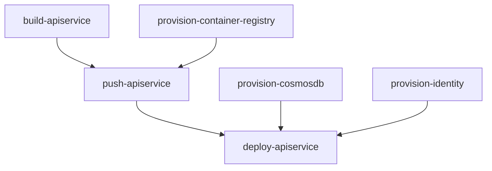

import LearnMore from '@components/LearnMore.astro';
import ThemeImage from '@components/ThemeImage.astro';
import CodespacesButton from '@components/CodespacesButton.astro';
import { Aside, Code, Steps, LinkButton, Tabs, TabItem } from '@astrojs/starlight/components';
import editPage from '@assets/community/edit-page.png';
import editPageLight from '@assets/community/edit-page-light.png';
import pnpm from '@assets/icons/pnpm.svg';
import pnpmLight from '@assets/icons/pnpm-light.svg';

Thank you for your interest in contributing to `aspire.dev`! Whether you're fixing typos, adding new content, or improving existing pages, this guide will help you get started and your contributions are greatly appreciated.

## 🚀 About this site

This documentation site is built using [Starlight](https://starlight.astro.build/), a full-featured documentation theme built on top of [Astro](https://astro.build/). Starlight provides a fast, accessible, and SEO-friendly foundation, while Astro's component-based architecture makes it easy to create and maintain content.

## 🤔 Ways to contribute

There are several ways you can contribute to `aspire.dev`:

- **Small fixes** - Correct typos, grammar mistakes, or formatting issues.
- **Content additions** - Add new documentation pages or sections to cover missing topics.
- **Content improvements** - Enhance existing documentation with clearer explanations, updated information, or additional examples.
- **Code contributions** - Improve the site's codebase, fix bugs, or add new features.

There's also different methods for contributing, from selecting the **Edit page** button at the bottom of any documentation page, to using [GitHub Codespaces](/get-started/github-codespaces/) for a fully configured development environment, or setting up a local development environment on your machine.

### Click-edit

Selecting the **Edit page** button at the bottom of any documentation page will take you to the corresponding file in the GitHub repository. From there, you can make changes directly in the GitHub web interface and submit a pull request. This is best suited for small fixes or minor content additions.

:::tip
If you haven't noticed the **Edit page** button, scroll to the bottom of this page and you should see it there:

<ThemeImage dark={editPage} light={editPageLight} alt="Edit page button at the bottom of a documentation page" />
:::

### Codespaces

To avoid local setup, you can use [GitHub Codespaces](/get-started/github-codespaces/) for a fully configured development environment in the cloud. This is ideal for larger contributions or if you prefer not to set up a local environment.

<CodespacesButton owner='microsoft' repo='aspire.dev' />

:::note
If you choose to use Codespaces, please still refer to the rest of this guide for information on writing style, code quality, and the contribution workflow. Continue reading at the [Writing style section below](#️-writing-style-guide).
:::

### Local development

If you prefer to work locally, you can set up a development environment on your machine. Follow the instructions below to get started.

## 📋 Prerequisites

Before you begin, ensure you have the following installed:

- [Node.js](https://nodejs.org/en/download) (LTS version recommended) - For running the development server
- [pnpm](https://pnpm.io/installation) - Fast, disk space efficient package manager
- [Visual Studio Code](https://code.visualstudio.com/) - Recommended code editor
- [Git](https://git-scm.com/downloads) - For version control

## ⚙️ Local dev setup

<Steps>

1. Clone the `aspire.dev` repository.

    ```bash
    git clone https://github.com/microsoft/aspire.dev.git
    ```

1. Navigate to the `aspire.dev` directory.

    ```bash
    cd aspire.dev
    ```

1. Install dependencies

    <Tabs syncKey="pkg-mgr">

    <TabItem label="pnpm" icon="pnpm">
		```bash
    pnpm install
    ```
	  </TabItem>
	  <TabItem label="npm" icon="npm">
    ```bash
    npm install
    ```

    :::tip[Stop using npm]{icon='seti:todo'}
    If you're not already using `pnpm`, consider switching! <ThemeImage dark={pnpm} light={pnpmLight} alt="pnpm logo" zoomable={false} classOverride='inline' href={'https://pnpm.io/installation'} /> It's faster and more efficient than `npm` or `yarn`.
    
    Install globally with:

    ```bash
    npm install -g pnpm
    ```
    :::
	  </TabItem>
    </Tabs>

1. Run the development server

    ```bash
    pnpm dev
    ```

    This starts the Vite development server for the frontend and provide hot-reload capabilities.

1. View the site locally

    Open your browser to `http://localhost:4321` (or the port shown in your terminal)

    :::tip
    During local development, the site search functionality is disabled. This is normal behavior as the search index is built during the production build process. To test search functionality, run a production build locally using `pnpm build` and then preview it with `pnpm preview`.
    :::

</Steps>

### Known formatting limitations

We expose `lint` and `format` scripts in the `package.json` to help maintain code quality and consistency. This isn't something that you're need to run manually. However, regardless of whether or not you run these scrips, be aware of the following known limitation when working with MDX files.

<Aside type="caution">

**Prettier and Steps components**

The Prettier formatter has a known limitation when formatting MDX files containing the `Steps` component. Prettier incorrectly converts all ordered lists (`ol`) as a single line, which causes the steps to render malformed.

**Workaround:** Always ensure there is a blank line between each step item in a `Steps` component. For example:

```md
<Steps>

1. First step with content

1. Second step with content

1. Third step with content

</Steps>
```

Without the blank lines between steps, the inner content won't render correctly. If you notice steps appearing malformed after running `pnpm format`, manually add the blank lines back before committing.

</Aside>

## ➡️ Git workflow

<Steps>

1. Start from an issue (or a discussion that leads to an issue)
1. Fork the repository

    As mentioned in the local dev setup section, start by forking the `aspire.dev` repository to your own GitHub account
 
1. Create a new branch for your changes

    ```bash
    git checkout -b feature/your-feature-name
    ```

1. Make your changes, considering the writing style guide
1. Commit with descriptive messages
1. Push to your fork
1. Create a pull request, and always follow the [Code of Conduct](https://github.com/microsoft/aspire.dev/blob/main/CODE_OF_CONDUCT.md)

</Steps>

## 🧩 Adding a new framework integration

If you've built a new Community Toolkit hosting integration (e.g. `CommunityToolkit.Aspire.Hosting.<Framework>`) and want to document it on `aspire.dev`, you'll need to touch several files. Here's a summary of the steps, using the Perl integration as an example:

<Steps>

1. **Create the documentation page**

    Add a new MDX file at `src/frontend/src/content/docs/integrations/frameworks/<framework>.mdx`. Use an existing framework page (such as `python.mdx` or `java.mdx`) as a template. Include frontmatter with a `title`, any required component imports, and a `Badge` indicating it's a Community Toolkit integration.

1. **Add an icon asset**

    Place an SVG icon for the framework in `src/frontend/src/assets/icons/`. Reference it in your MDX page with an `Image` component import.

1. **Register the sidebar entry**

    In `src/frontend/config/sidebar/integrations.topics.ts`, add a new entry for your framework in the frameworks list (keep alphabetical order):

    ```ts
    { label: '<Framework>', slug: 'integrations/frameworks/<framework>' },
    ```

1. **Add the NuGet package name**

    In `src/frontend/src/data/aspire-integration-names.json`, add the full NuGet package name for your integration (keep alphabetical order):

    ```json
    "CommunityToolkit.Aspire.Hosting.<Framework>",
    ```

1. **Add license attribution**

    If your integration uses assets or technologies with specific licenses, add entries in `src/frontend/src/data/thanks-license-titles.ts`:

    ```ts
    '<key>': '<License>: <URL>',
    ```

</Steps>

After making these changes, run `pnpm dev` (or `aspire start`) locally to verify the page renders correctly, the sidebar navigation works, and the icon displays as expected.

## ✍️ Writing style guide

<span id='-writing-style-guide'></span>

When contributing to `aspire.dev`, follow these writing guidelines to ensure consistency and clarity:

- **Use clear and concise language** - Aim for simplicity. Avoid jargon unless necessary, and explain technical terms when they first appear.
- **Be consistent** - Follow existing conventions in terminology, formatting, and structure. Refer to other documentation pages for examples.
- **Use active voice** - Write in active voice to make instructions and explanations more direct and engaging.
- **Use sentence case** - Capitalize only the first word and proper nouns in headings, sidebars, and table of contents.
- **Be inclusive** - Use inclusive language that respects all readers. Avoid gendered terms and stereotypes.
- **Provide examples** - Where applicable, include code snippets or examples to illustrate concepts.
- **Use proper grammar and spelling** - Proofread your contributions to ensure they are free of errors and typos.
- **Structure content logically** - Use headings, subheadings, and lists to organize information in a way that is easy to follow.
- **Link to relevant resources** - When mentioning concepts, tools, or related documentation, provide links to help readers find more information.
- **Follow formatting conventions** - Use consistent formatting for code snippets, commands, and technical terms. Refer to the examples in this guide for guidance.
- **Review existing content** - Before adding new content, review existing documentation to avoid duplication and ensure coherence.

### Third-party links

Third-party links are appropriate when they help readers complete a task or understand a topic. Apply these standards to both authored and generated content:

- **Use links sparingly** - Include third-party links only when they're directly relevant. Prefer Aspire documentation when it covers the same information.
- **Present resources neutrally** - Describe third-party resources factually. Avoid endorsements, marketing claims, promotional comparisons, and calls to purchase or sign up.
- **Avoid promotion** - Don't add links or surrounding content whose primary purpose is to market a third-party offering or position it as a preferred replacement for Aspire.
- **Choose substantive destinations** - Link to technical documentation or other substantive resources. Don't link to product, pricing, lead-generation, or sales pages except as described in the following exceptions.
- **Allow necessary exceptions** - Prerequisite download or account sign-up pages, pricing or billing references needed for cost planning, and project descriptions or links on attribution and acknowledgment pages are allowed. Keep each exception limited to the context that makes it necessary.
- **Disclose affiliations** - In the **Third-party links and affiliations** section of the pull request description, disclose any material affiliation with a linked organization, such as employment, sponsorship, or ownership. An affiliation doesn't automatically disqualify a link, but the link and surrounding content must meet the same editorial standards as any other contribution.
- **Review generated content** - Automated updates and generated catalogs aren't exempt. They may reproduce upstream metadata when that's the catalog's explicit purpose, but the reviewing maintainer must apply the same editorial standards to the surrounding content and linked destinations.

### AppHost-specific TypeScript and C# content

When you are documenting AppHost-specific content that changes between TypeScript and C#, use synced `Tabs` and `TabItem` blocks with `syncKey='aspire-lang'`. Put TypeScript first so `apphost.mts` is the default for readers without a saved preference. Each code snippet should have its own TypeScript and C# selector, and the shared sync key keeps the selected language consistent across the page.

Use `Tabs` for other choices such as package managers, deployment targets, IDEs, or CLI variants.

If a feature is only available in the C# AppHost today, show the C# example by itself and add an explanatory note. Do not add a language selector for a single-language example.

For the **On this page** table of contents to pick up a heading reliably, define the heading outside `Pivot` and `Tabs`. Headings inside those components are often missed or can produce incomplete results in the generated table of contents.

## 📝 Write Markdown

Here are some common Markdown formatting examples to help you write documentation:

### Frontmatter

You can customize individual pages in `aspire.dev` by setting values in their frontmatter.
Frontmatter is set at the top of your files between `---` separators:

```md title="src/content/docs/example.md"
---
title: My page title
---

Page content follows the second `---`.
```

Every page must include at least a `title`. See the [frontmatter reference](https://starlight.astro.build/reference/frontmatter/) for all available fields and how to add custom fields.

#### Social card metadata (Open Graph)

Aspire automatically generates a per-page Open Graph image at build time. Each card uses the site-wide `og-image.png` as a full-bleed background and overlays a topic pill (with the same icon you see in the topics sidebar), the page `title`, and — if the page has one — its `description`. Long titles and descriptions are truncated with an ellipsis so previews stay readable at small social-card sizes. The generated image lives at `/og/<slug>.png` and is referenced by the page's `og:image` and `twitter:image` meta tags so links shared on Discord, Slack, Twitter/X, LinkedIn, and other platforms render a unique preview.

To customize the social card for a specific page, set one of the following optional frontmatter fields:

```md title="src/content/docs/example.mdx"
---
title: My page title
description: A short summary rendered on the card and shown next to the
  social-card image on most platforms.
# Use a custom image instead of the auto-generated one. Accepts an absolute URL
# or a site-relative path.
ogImage: /img/custom-card.png
# Or opt out of dynamic image generation entirely and fall back to the
# site-wide og-image.png.
og: false
---
```

Pages that intentionally have no description (such as the home page or splash landing pages) fall back to the site-wide marketing description. Translated pages reuse the site-wide `og-image.png` so the same imagery is shown across locales.

### Headings

Use `#` symbols to create headings. More `#` symbols create smaller headings:

```md title="src/content/docs/example.md"
## Heading 2
### Heading 3
#### Heading 4
```

Headings are automatically created as bookmarks (shareable deep links) for easy navigation.

<Aside type="note">
  Avoid using Heading 1 (`#`) in your content, as it is reserved for the page title defined in frontmatter.
</Aside>

<Aside type="tip">
  To configure which headings appear in the **On this page** sidebar, use the `tableOfContents` frontmatter field. See the [tableOfContents reference](https://starlight.astro.build/reference/frontmatter/#tableofcontents) for more details.
</Aside>

### Text formatting

**Bold text** is created with double asterisks:

```md title="src/content/docs/example.md"
**Bold text**
```

_Italic text_ is created with an `_` (or single asterisks `*`—while valid, for consistency we recommend using `_`):

```md title="src/content/docs/example.md"
_Italic text_
```

`Inline code` is created with backticks:

```md title="src/content/docs/example.md"
`Inline code`
```

### Links

Links are created with square brackets and parentheses:

```md title="src/content/docs/example.md"
[David Pine](https://davidpine.net)
```

Renders as:

[David Pine](https://davidpine.net)

Additionally, when linking to other pages within `aspire.dev`, use site relative paths:

```md title="src/content/docs/example.md"
[Build your first Aspire app](/get-started/first-app/)
```

Renders as:

[Build your first Aspire app](/get-started/first-app/)

:::note
Site relative links should always include a trailing slash `/` at the end to ensure proper navigation.
<LearnMore>
This is confugred by default for `aspire.dev`, for more information see [Astro Docs: trailingSlash](https://docs.astro.build/en/reference/configuration-reference/#trailingslash).
</LearnMore>
:::

### Lists

Unordered lists use `-` (or `*`—while valid, for consistency we recommend using `-`):

```md title="src/content/docs/example.md"
- First item
- Second item
- Third item
```

Renders as:

- First item
- Second item
- Third item

Ordered lists use numbers:

```md title="src/content/docs/example.md"
1. First step
2. Second step
3. Third step
```

Renders as:

1. First step
2. Second step
3. Third step

### Code blocks

Use triple backticks with a language identifier for syntax highlighting:

````md title="src/content/docs/example.md"
```csharp title="AppHost.cs"
var builder = DistributedApplication.CreateBuilder(args);
builder.AddProject<Projects.ApiService>("apiservice");
```
````

Renders as:

```csharp title="AppHost.cs"
var builder = DistributedApplication.CreateBuilder(args);
builder.AddProject<Projects.ApiService>("apiservice");
```

To add a title to a code block, use this syntax:

````md title="src/content/docs/example.md"
```csharp title="Program.cs"
var builder = DistributedApplication.CreateBuilder(args);
builder.AddProject<Projects.ApiService>("apiservice");
```
````

Renders as:

```csharp title="Program.cs"
var builder = DistributedApplication.CreateBuilder(args);
builder.AddProject<Projects.ApiService>("apiservice");
```

### Blockquotes

Use `>` to create blockquotes:

```md title="src/content/docs/example.md"
> This is a note or important callout.
```

Renders as:

> This is a note or important callout.

### Tables

Create tables using pipes `|` and hyphens `-`. Keep a blank line before and after the table, include one separator cell for each heading, and use at least three hyphens in each separator cell:

```md title="src/content/docs/example.md"
| Feature | Description | Status |
| ------- | ----------- | ------ |
| Dashboard | Web-based monitoring | Available |
| Telemetry | OpenTelemetry support | Available |
| Deployment | Kubernetes deployment | Preview |
```

Renders as:

| Feature | Description | Status |
| ------- | ----------- | ------ |
| Dashboard | Web-based monitoring | Available |
| Telemetry | OpenTelemetry support | Available |
| Deployment | Kubernetes deployment | Preview |

<Aside type="tip">
  You can align columns using colons: `| :--- |` for left, `| :---: |` for center, and `| ---: |` for right alignment.
</Aside>

### Horizontal rules

Create a horizontal rule with three or more hyphens, asterisks, or underscores:

```md title="src/content/docs/example.md"
---
```

Renders as:

---

### Strikethrough

Use double tildes to create strikethrough text:

```md title="src/content/docs/example.md"
~~This text is crossed out~~
```

Renders as:

~~This text is crossed out~~

### Task lists

Create interactive task lists in Markdown:

```md
- [x] Add Aspire to your project
- [x] Configure service defaults
- [ ] Deploy to Azure
- [ ] Set up monitoring
```

Renders as:

- [x] Add Aspire to your project
- [x] Configure service defaults
- [ ] Deploy to Azure
- [ ] Set up monitoring

### Nested lists

You can nest lists by indenting with two spaces:

```md
- Aspire components
  - Databases
    - PostgreSQL
    - Redis
  - Messaging
    - RabbitMQ
    - Azure Service Bus
```

Renders as:

- Aspire components
  - Databases
    - PostgreSQL
    - Redis
  - Messaging
    - RabbitMQ
    - Azure Service Bus

### Escaping characters

Use a backslash `\` to escape special Markdown characters:

```md
\*This text is not italic\*
\[This is not a link\]
```

Renders as:

\*This text is not italic\*
\[This is not a link\]

### Line breaks

End a line with two or more spaces to create a line break:

```md
First line with two spaces at the end  
Second line
```

Or use an empty line to create a paragraph break.

## ➕ Markdown extensions

The `aspire.dev` site supports several Markdown extensions to enhance your documentation:

### Mermaid diagrams

You can write mermaid diagrams as code blocks:

````md title="src/content/docs/example.md"

````

Renders as:


### Asides

[Asides](https://starlight.astro.build/components/asides/), "admonitions", "callouts", or "alerts" are special highlighted blocks used to draw attention to important information, tips, warnings, or notes.

The `:::` syntax creates asides given a type of `note`, `tip`, `caution`, or `danger` in both Markdown and [MDX](#write-mdx):

Use the `:::` syntax as the default pattern in `aspire.dev` docs, including `.mdx` pages. Prefer the `Aside` component only when you specifically need a JSX-only composition pattern that fenced callouts cannot express cleanly.

````md title="src/content/docs/example.md"
:::note
Some content in an aside.
:::

:::caution
Some cautionary content.
:::

:::tip

Other content is also supported in asides.

```js
// A code snippet, for example.
```

:::

:::danger
Do not give your password to anyone.
:::
````

Renders as:

:::note
Some content in an aside.
:::

:::caution
Some cautionary content.
:::

:::tip

Other content is also supported in asides.

```js
// A code snippet, for example.
```

:::

:::danger
Do not give your password to anyone.
:::

Additionally, `aspire.dev` supports [GitHub Alerts](https://docs.github.com/en/get-started/writing-on-github/getting-started-with-writing-and-formatting-on-github/basic-writing-and-formatting-syntax#alerts) syntax with the [community plugin](https://starlight-github-alerts.netlify.app/getting-started/):

For example, you can write:

#### Note

```md title="src/content/docs/example.md"
> [!NOTE]
> Useful information that users should know, even when skimming content.
```

Renders as:

> [!NOTE]
> Useful information that users should know, even when skimming content.

See the full demo here: [Starlight: GitHub Alerts](https://starlight-github-alerts.netlify.app/demo/).

<LearnMore>
If you need a JSX-only fallback, see the [Aside component](#aside-component) section below.
</LearnMore>

## ☑️ Write MDX

<p id="write-mdx"></p>

MDX files use the `.mdx` extension and combine standard Markdown with the power of JSX. This means you can write content and seamlessly embed interactive components—all in one file.

<LearnMore>
[Learn more about MDX](https://mdxjs.com/docs/what-is-mdx/).
</LearnMore>

With the power of Astro components, you can enhance your documentation with interactive elements, custom layouts, and dynamic content. To use any of the built-in Starlight or custom components available in `aspire.dev`, simply import them at the top of your MDX file and use them like regular JSX components.

### LinkButton component

```mdx title="src/content/docs/example.mdx"
---
title: Example MDX Page
---

import { LinkButton } from '@astrojs/starlight/components';

Here's an example of an MDX page with a custom button:

<LinkButton href="https://aspire.dev" variant="primary">
  Visit aspire.dev
</LinkButton>
```

Renders as:

Here's an example of an MDX page with a custom button:

<LinkButton href="https://aspire.dev" variant="primary">
  Visit aspire.dev
</LinkButton>

<LearnMore>
For all available components, see: [Starlight: Components](https://starlight.astro.build/components/using-components/).
</LearnMore>

### FileTree component

Use the `FileTree` component from `starlight-plugin-icons` so file and folder entries render with icons:

````mdx title="src/content/docs/example.mdx"
---
title: Example MDX Page
---

import FileTree from 'starlight-plugin-icons/components/FileTree.astro';

<FileTree>
- src/
  - components/
    - Example.astro
  - content/
    - docs/
      - example.mdx
</FileTree>
````

### Aside component

Prefer `:::` callouts for new docs content. The `Aside` component from Starlight is the fallback option when you need JSX composition inside a callout:

````mdx title="src/content/docs/example.mdx"
---
title: Example MDX Page
---

import { Aside } from '@astrojs/starlight/components';

<Aside>Some content in an aside.</Aside>

<Aside type="caution">Some cautionary content.</Aside>

<Aside type="tip">

  Other content is also supported in asides.

  ```js
  // A code snippet, for example.
  ```

</Aside>

<Aside type="danger">Do not give your password to anyone.</Aside>
````

Renders as:

<Aside>Some content in an aside.</Aside>

<Aside type="caution">Some cautionary content.</Aside>

<Aside type="tip">

Other content is also supported in asides.

```js
// A code snippet, for example.
```

</Aside>

<Aside type="danger">Do not give your password to anyone.</Aside>

### Using custom components

import tsConfig from "../../../../tsconfig.json?raw";

To use custom components available in `aspire.dev`, import them at the top of your MDX file. Custom component imports rely on configured aliases—have a look at the `tsconfig.json` file for more information:

<Code code={tsConfig} lang="json" title="tsconfig.json" mark={8} />

By using the `@components` alias, you can easily import any custom component from the `frontend/src/components/` directory. For example, to import the `LearnMore` component used in this guide:

```mdx title="src/content/docs/example.mdx"
---
title: Example MDX Page
---

import LearnMore from '@components/LearnMore.astro';

Here's an example of using the `LearnMore` component:

<LearnMore>
  Please give our [repository a star on GitHub! ⭐](https://github.com/microsoft/aspire.dev)
</LearnMore>
```

### Aspire language selectors

Use synced `Tabs` and `TabItem` blocks for AppHost content that switches between TypeScript and C#. Put TypeScript first so the `apphost.mts` tab appears on the left and is selected by default. Each AppHost code snippet should have its own selector, and every AppHost language selector on the page should share `syncKey='aspire-lang'` so a reader's language choice applies to the whole page.

Keep shared section headings outside the tabs. For example, write `## Add a Redis resource` before the `Tabs` block, then place the language-specific code inside the `csharp` and `typescript` tab items. This helps the **On this page** navigation stay accurate.

````mdx title="src/content/docs/example.mdx"
---
title: Example MDX Page
---

import { Tabs, TabItem } from '@astrojs/starlight/components';

<Tabs syncKey='aspire-lang'>
<TabItem id='typescript' label='TypeScript'>

```typescript title="apphost.mts" twoslash
import { createBuilder } from './.aspire/modules/aspire.mjs';

const builder = await createBuilder();

const cache = await builder.addRedis("cache");

const api = await builder.addProject("api", "../Api/Api.csproj");
await api.withReference(cache);

await builder.build().run();
```

</TabItem>
<TabItem id='csharp' label='C#'>

```csharp title="AppHost.cs"
var builder = DistributedApplication.CreateBuilder(args);

var cache = builder.AddRedis("cache");

builder.AddProject<Projects.Api>("api")
    .WithReference(cache);

builder.Build().Run();
```

</TabItem>
</Tabs>
````

If the difference is not about AppHost language, keep using regular `Tabs`.

The same TOC rule applies to `Tabs`: if a heading should appear in **On this page**, keep that heading outside the component and only put the variant-specific body content inside.

Renders as:

Here's an example of using the `LearnMore` component:

<LearnMore>
  Please give our [repository a star on GitHub! ⭐](https://github.com/microsoft/aspire.dev)
</LearnMore>

## Dev Hub content

[Dev Hub](/dev/) is a curated resource directory in `src/pages/dev/index.astro`. Its links and featured selections are exported from `src/data/dev-central.ts`, using existing documentation URLs and uploads from [the Aspire YouTube channel](https://www.youtube.com/@aspiredotdev/videos). The page and its Markdown export share this data.

Cloud links cover AWS, Azure, and Kubernetes. The blog highlights are a curated selection from the [Aspire blog](https://devblogs.microsoft.com/aspire/), not a live feed. Keep each post's original title, publication date, URL, and featured-image URL in `blogHighlights`, with a short summary of your own.

Featured samples use existing IDs and tags from `src/data/samples.json`, with short curated summaries and screenshots in the Dev Hub. The Hub's search button opens the existing site-wide documentation search dialog.

[Browse resources](/dev/browse/) is the complete resource directory. `src/utils/dev-center/catalog.ts` assembles its typed catalog during Astro page generation from documentation, glossary entries, ingested samples and integrations, and shared video and blog data. The existing ingestion flow refreshes external data; the catalog consumes those outputs directly, so there is no second resource list to maintain.

The Dev Hub, Browse resources, and glossary directory are excluded from Pagefind. Individual glossary term pages remain indexed so site search leads directly to definitions rather than duplicate directory listings.

These three directory pages share the native article layout: a title panel, full-width divider, then the breadcrumb and page content. Keep their page actions disabled. The Hub and glossary introductions belong below the breadcrumb, not inside the title panel.

Browse searches titles, descriptions, tags, and available language/provider metadata, rather than full article bodies. Matching words in card titles, descriptions, and text-based artwork receive a theme-aware highlight, using the same case- and accent-insensitive matching as search. Metadata-only matches can appear without a visible highlight. Highlights update with search, filters, pagination, and browser history, and disappear when search is cleared. It excludes shared fragments in `includes` folders, translated duplicates, and individual API symbols; use the dedicated API reference search for symbols. Include fragments stay excluded even when frontmatter changes their public slug. The combined listing is excluded from Pagefind to avoid competing with the source articles.

Browse includes the complete official [Aspire blog](https://devblogs.microsoft.com/aspire/) archive alongside curated external posts. Run `pnpm update:blogs` from `src/frontend` to refresh `src/data/aspire-blog-posts.json`. This command is also part of `pnpm update:all`, run by the Integration Data Updater daily at 21:10 UTC. The workflow proposes generated-data changes through its existing pull request flow; publication still requires merging the update. The ingestion follows all WordPress API pages, preserves publication dates and featured images, and stores titles and plain-text excerpts, not article bodies. Incomplete or failed refreshes leave the previous snapshot intact. Browse deduplicates canonical URLs, preferring official metadata while retaining unique curated posts. The Hub's featured blog selection stays curated.

Set `category: tutorial` in frontmatter for guided learning walkthroughs and `category: quickstart` for short, hands-on setup paths. Browse honors this category before its folder-based defaults, so an integration tutorial remains in the **Integrations** topic but appears under the **Tutorial** resource type. Do not classify by title or the `-get-started` suffix alone: many integration pages with that suffix are overviews linking to setup and connection references. Package metadata and logos still merge into the canonical article without changing its declared type.

Browse and the glossary reuse `InpageSearch`. Browse places compact resource type, topic, language, provider, and video platform controls next to search, wrapping below it on smaller screens. All filters and sorting share `BrowseDropdown`, showing their short option lists directly without a separate option-search input. Arrow Down opens a menu and focuses its first enabled option. Active checkbox filters show an accent dot, with selection counts in their accessible labels, and stay open for multiple selections. Provider is single-select. The sort dropdown has independent Date and Title radio groups, each with ascending and descending icons and a muted current-selection label. Material Design sort icons come from `@iconify-json/mdi` through the existing UnoCSS icon preset and the safelist in `uno.config.ts`; do not edit the generated `.starlight-icons` files to add them. Date is primary, with Title ordering resources published on the same calendar date. The default is newest first, then A-Z. Undated resources follow dated resources in either direction and use the selected Title order. Searches preserve both directions. Menus close with Escape or when focus moves outside the menu; the sort menu stays open while you adjust both rows.

Multiple types, topics, languages, or platforms match any selected value within that group; different filter groups must all match. Shareable URLs use `q`, repeated `type`, `topic`, `language`, and `platform` parameters, a single `provider` parameter, `sort`, `title`, and `page`. Date sort values are `newest` and `oldest`; Title values are `asc` and `desc`. Default values are omitted from generated URLs. Numbered pagination keeps the current, first, and last pages reachable, with ellipses for omitted ranges. Page changes keep the pagination controls at the same viewport position and retain keyboard focus, adjusting the scroll offset for different card-grid heights. The browser clamps scrolling at document boundaries. Filtering resets the page, and browser history restores filters, both sort directions, and pagination. Existing single-language URLs still work. Without JavaScript, all resource links remain available.

On initial load, Browse reserves the controls and shows static card placeholders until the URL's filters, sorting, and pagination have been applied. Do not expose the unfiltered catalog before initialization finishes. If the controller fails to load, the page explains that interactive browsing is unavailable and reveals all resource links.

Browse includes videos marked `Official` in `src/data/community-videos.ts`, the Hub's official featured uploads, and the YouTube and Twitch channel links from `config/socials.config.ts`. Third-party community videos remain on the community videos page, not in Browse. Twitch currently links to the live channel, not an ingested recording archive.

Every Browse card reserves the same 16:9 header area. Media uses its existing thumbnail; package logos use a topic-colored background. CLI command artwork shows the command, diagnostics show their code, and release notes without images show their version. Other resources without imagery use a resource-type icon with the same topic colors. Show the type or platform with its icon once in the image area's lower-left corner, on a theme-aware background for readable contrast over thumbnails. Language badges sit opposite it, using the catalog's language metadata, existing language logos, and readable names for languages without artwork. Each card exposes those languages as an accessible link description. Do not repeat the type label or branding in the card body: the title and description lead, with a footer only for dates or an external-link indicator. Browse uses the shared `Breadcrumb` component above its heading.

To select featured artwork from an article, set `resourceImage` in its frontmatter to a local `~/assets/` path, a root-relative URL, or an HTTPS URL. Use an object with `light` and `dark` paths when the screenshot has theme variants. Prefer a meaningful existing screenshot over an arbitrary first image or a small icon. Browse uses this selection before an explicit `ogImage` override, then falls back to resource artwork or a package logo. Local screenshots are optimized for card display.

The Language filter combines existing sample/package tags and framework metadata with the languages of code examples in each article. Both AppHost and consuming-client examples count: an article demonstrating C# and TypeScript appears under both, and client examples in Go or Python appear under those languages too. The catalog reads fenced code and the `Code` component's `lang` attribute, including shared `Include` fragments, at generation time. Language aliases such as `cs` and `ts` are normalized. Prose mentions, tab labels, shell installation commands, and configuration formats do not add programming-language labels. Article bodies remain out of the browser search payload.

Glossary topic filters match any selected topic, together with the search and letter filters. Multiple topics use repeated `topic` query parameters; existing single-topic links still work. Keep the toolbar compact: a bounded search field, a short result count, and neutral topic buttons that gain topic colors when selected. The full alphabet wraps into rows on smaller screens instead of scrolling sideways; unavailable letters remain disabled. Preserve the detailed filter summary for screen readers. Term pages reuse `Breadcrumb`, with `DevLayout` set to `layout="article"` for the standard article header: heading, page actions, divider, then breadcrumbs and definition content. Group the short definition and aliases separately from the explanation, and always show the practical example rather than placing it in a disclosure. Render documentation links with the shared `LearnMore` component directly beneath the practical example. Starlight's standard Previous/Next navigation follows the full glossary's A-Z order and preserves the filtered return link. Omit unavailable neighbors at the beginning and end. Keep the glossary directory's card-based landing layout.

Glossary terms live in `src/content/glossary/`. Each term has a short definition, practical context, topics, related term IDs, and documentation links. Keep its filename stable because it determines the public term URL. Preserve `legacyAnchors` when editing migrated terms so links into the original glossary continue to work. Context previews and term pages share the same content; do not maintain separate definitions for them.

Use optional `termType` metadata when technical context helps, such as `Concept`, `API method`, `API interface`, `API type`, `API contract`, `Pattern`, `Tool`, `Standard`, or `Protocol`. These are technical labels, not grammatical parts of speech. Add `pronunciation` only where useful, using plain English rather than IPA or audio, and verify unfamiliar pronunciations before publishing. Identify the abbreviation when the hint applies to an alias rather than the full title, for example `pronunciation: O-T-L-P (OTLP)`. Both fields appear beneath **Definition**, participate in glossary search, and are included in Markdown exports. Omit either field when it adds no value; do not repeat them on directory cards.

The old `/get-started/glossary/` URL uses a static compatibility page that redirects to `/dev/glossary/` with the query string and fragment intact. Do not replace it with an Astro configured redirect: its static meta-refresh output drops fragments. Without JavaScript, the compatibility page provides definition links generated from the same glossary collection. Term cards retain the old term anchors, and former section anchors point to the first associated term. The compatibility page is excluded from indexing and declares the new directory as canonical.

New Dev Hub content is authored in English and follows the site's existing localization workflow. Do not prefix the new English-only routes with a locale until that route has a translated counterpart.

## 🆘 Getting help

- **Issues** - Report bugs or request features via [GitHub Issues](https://github.com/microsoft/aspire.dev/issues)
- **Discussions** - Join conversations in [GitHub Discussions](https://github.com/microsoft/aspire.dev/discussions)
- **Discord** - Connect with the community on the [Aspire Discord](https://discord.com/invite/raNPcaaSj8)
