import { Aside, Steps, Tabs, TabItem } from '@astrojs/starlight/components';
import LearnMore from '@components/LearnMore.astro';

Deploying Aspire applications from continuous integration and continuous delivery (CI/CD) pipelines follows a consistent pattern regardless of your target platform: generate deployment artifacts, push container images to a registry, then apply the artifacts using your preferred tooling.

## CI/CD workflow overview

The recommended CI/CD pattern for Aspire applications uses `aspire publish` to produce deployment artifacts and then pushes the built images to a container registry. The artifacts (Docker Compose files, Kubernetes manifests, or other formats) reference your images by a placeholder that you resolve at deploy time.

```mermaid
architecture-beta
  service ci(logos:github-actions)[CI runner]
  service reg(logos:docker)[Container registry]
  service target(logos:kubernetes)[Deployment target]

  ci:R --> L:reg
  reg:R --> L:target
```



The workflow breaks down into three phases:

<Steps>

1. **Build & publish** — `aspire publish` builds your .NET project container images and generates deployment artifacts (Docker Compose files, Kubernetes manifests, etc.) with image name placeholders.

1. **Push** — Your pipeline tags the locally-built images and pushes them to a container registry such as GitHub Container Registry, Docker Hub, Amazon ECR, or Azure Container Registry.

1. **Deploy** — Your pipeline applies the generated artifacts using the appropriate tooling (`kubectl apply`, `docker compose up`, etc.), substituting the image placeholders with the pushed registry addresses.

</Steps>

<Aside type="note">
Some integrations also support `aspire deploy`, which handles image building, pushing, and provisioning in a single command. See the platform-specific deployment documentation for details.
</Aside>

<LearnMore>
  Learn more: [Publishing and deployment overview](/deployment/overview/)
</LearnMore>

## Running aspire publish in CI

The `aspire publish` command is **non-interactive by default** — it does not prompt for input and writes all artifacts to the output path you specify. This makes it straightforward to use in automated pipelines.

```bash title="Aspire CLI — Generate deployment artifacts"
aspire publish --project src/AppHost/AppHost.csproj -o ./artifacts
```

The output directory contains the deployment manifests and the container images are built into the local Docker daemon during the publish step. You push those images to a registry as a separate step.

<Aside type="tip">
Use a consistent, versioned image tag (for example, the Git commit SHA) so that each pipeline run produces a unique, traceable image. Avoid overwriting a fixed `latest` tag in production pipelines.
</Aside>

## Pushing container images to a registry

After `aspire publish` builds your images locally, tag and push them to your registry using standard Docker CLI commands.

### GitHub Container Registry

[GitHub Container Registry (GHCR)](https://docs.github.com/packages/working-with-a-github-packages-registry/working-with-the-container-registry) is built into every GitHub repository and requires no additional setup. Authenticate with the built-in `GITHUB_TOKEN`:

```bash title="Bash — Authenticate and push to GHCR"
echo "$GITHUB_TOKEN" | docker login ghcr.io -u "$GITHUB_ACTOR" --password-stdin
docker tag myapp-api:latest ghcr.io/$GITHUB_REPOSITORY/myapp-api:$GITHUB_SHA
docker push ghcr.io/$GITHUB_REPOSITORY/myapp-api:$GITHUB_SHA
```

<LearnMore>
  For a complete end-to-end example including GHCR login and `aspire do push`, see [Step 3: Build app, create & push image to GHCR](/fundamentals/app-lifecycle/#step-3-build-app-create--push-image-to-ghcr).
</LearnMore>

### Docker Hub

```bash title="Bash — Authenticate and push to Docker Hub"
echo "$DOCKERHUB_TOKEN" | docker login -u "$DOCKERHUB_USERNAME" --password-stdin
docker tag myapp-api:latest $DOCKERHUB_USERNAME/myapp-api:$IMAGE_TAG
docker push $DOCKERHUB_USERNAME/myapp-api:$IMAGE_TAG
```

Store `DOCKERHUB_TOKEN` and `DOCKERHUB_USERNAME` as secrets in your pipeline. Generate the token from [hub.docker.com](https://hub.docker.com) under **Account settings > Personal access tokens**.

### Other registries

Other container registries (Amazon ECR, Azure Container Registry, Google Artifact Registry, JFrog Artifactory, and self-hosted registries) follow the same pattern: authenticate with `docker login`, tag your image with the registry hostname, and push. Refer to your registry's authentication documentation for the specific login command.

## GitHub Actions workflow

The following complete workflow generates artifacts with `aspire publish`, pushes images to GitHub Container Registry, and applies a Docker Compose deployment. Customize the deploy step for your own target (Kubernetes, a cloud provider, etc.).

```yaml title="GitHub Actions — .github/workflows/deploy.yml"
name: Build and deploy Aspire app

on:
  push:
    branches: [main]
  workflow_dispatch:

permissions:
  contents: read
  packages: write   # Required to push to GHCR

jobs:
  deploy:
    runs-on: ubuntu-latest
    timeout-minutes: 30

    env:
      IMAGE_TAG: ${{ github.sha }}
      REGISTRY: ghcr.io/${{ github.repository_owner }}

    steps:
      - name: Checkout
        uses: actions/checkout@v4

      - name: Set up .NET
        uses: actions/setup-dotnet@v4
        with:
          dotnet-version: '10.x'

      - name: Install Aspire CLI
        run: |
          curl -sSL https://aspire.dev/install.sh | bash
          echo "$HOME/.aspire/bin" >> $GITHUB_PATH

      - name: Generate deployment artifacts
        # Adjust the --project path to match your AppHost project location
        run: aspire publish --project src/AppHost/AppHost.csproj -o ./artifacts

      - name: Log in to GHCR
        run: echo "${{ secrets.GITHUB_TOKEN }}" | docker login ghcr.io -u ${{ github.actor }} --password-stdin

      - name: Push container images
        run: |
          # Replace 'myapp-api' and 'myapp-web' with the resource names from your AppHost.
          # The image names produced by aspire publish match your AppHost resource names.
          for image in myapp-api myapp-web; do
            docker tag ${image}:latest ${REGISTRY}/${image}:${IMAGE_TAG}
            docker push ${REGISTRY}/${image}:${IMAGE_TAG}
          done

      - name: Deploy
        run: |
          # This example uses Docker Compose. Replace with kubectl apply, helm upgrade,
          # or your cloud provider's CLI as needed for your deployment target.
          export MYAPP_API_IMAGE=${REGISTRY}/myapp-api:${IMAGE_TAG}
          export MYAPP_WEB_IMAGE=${REGISTRY}/myapp-web:${IMAGE_TAG}
          docker compose -f artifacts/docker-compose.yml up -d
```

<Aside type="tip">
Replace the service image names (`myapp-api`, `myapp-web`) and the deploy step with those specific to your application. The image names used by `aspire publish` match the resource names defined in your AppHost.
</Aside>

## Azure DevOps pipeline

The following pipeline publishes and deploys an Aspire application using the same pattern. It uses generic Docker CLI commands to push to any container registry.

```yaml title="Azure DevOps — azure-pipelines.yml"
trigger:
  branches:
    include:
      - main

pool:
  vmImage: ubuntu-latest

variables:
  imageTag: $(Build.SourceVersion)
  registry: $(REGISTRY_HOST)/$(REGISTRY_NAMESPACE)

steps:
  - task: UseDotNet@2
    displayName: Set up .NET
    inputs:
      packageType: sdk
      version: '10.x'

  - script: |
      curl -sSL https://aspire.dev/install.sh | bash
      echo "##vso[task.prependpath]$HOME/.aspire/bin"
    displayName: Install Aspire CLI

  - script: |
      # Adjust the --project path to match your AppHost project location
      aspire publish --project src/AppHost/AppHost.csproj -o $(Build.ArtifactStagingDirectory)/artifacts
    displayName: Generate deployment artifacts

  - script: |
      echo "$(REGISTRY_PASSWORD)" | docker login $(REGISTRY_HOST) \
        -u $(REGISTRY_USERNAME) --password-stdin
    displayName: Log in to container registry

  - script: |
      # Replace 'myapp-api' and 'myapp-web' with the resource names from your AppHost.
      for image in myapp-api myapp-web; do
        docker tag ${image}:latest $(registry)/${image}:$(imageTag)
        docker push $(registry)/${image}:$(imageTag)
      done
    displayName: Push container images

  - script: |
      # This example uses Docker Compose. Replace with kubectl apply, helm upgrade,
      # or your cloud provider's CLI as needed for your deployment target.
      export MYAPP_API_IMAGE=$(registry)/myapp-api:$(imageTag)
      export MYAPP_WEB_IMAGE=$(registry)/myapp-web:$(imageTag)
      docker compose -f $(Build.ArtifactStagingDirectory)/artifacts/docker-compose.yml up -d
    displayName: Deploy

  - task: PublishBuildArtifacts@1
    displayName: Publish artifacts
    inputs:
      PathtoPublish: $(Build.ArtifactStagingDirectory)/artifacts
      ArtifactName: deployment-artifacts
```

Set `REGISTRY_HOST`, `REGISTRY_NAMESPACE`, `REGISTRY_USERNAME`, and `REGISTRY_PASSWORD` as pipeline variables or a variable group. Mark credentials as secret so they're not logged.

## CI environment tips

### Terminal output and formatting

The Aspire CLI detects whether it's running in a CI environment and adjusts its output accordingly (no interactive prompts, plain-text progress). If you see garbled or ANSI escape codes in logs, set the `NO_COLOR` environment variable:

<Tabs>
<TabItem label="GitHub Actions">

```yaml title="GitHub Actions — Disable color output"
env:
  NO_COLOR: '1'
```

</TabItem>
<TabItem label="Azure DevOps">

```yaml title="Azure DevOps — Disable color output"
variables:
  NO_COLOR: '1'
```

</TabItem>
</Tabs>

### Timeouts

Publishing and deploying Aspire apps can take several minutes. Set your pipeline's timeout high enough to allow for:

- .NET container image builds
- Container registry image push (varies with image size and network speed)
- Provisioning and startup of deployment targets

<Tabs>
<TabItem label="GitHub Actions">

```yaml title="GitHub Actions — job timeout"
jobs:
  deploy:
    runs-on: ubuntu-latest
    timeout-minutes: 30
```

</TabItem>
<TabItem label="Azure DevOps">

```yaml title="Azure DevOps — job timeout"
jobs:
  - job: deploy
    timeoutInMinutes: 30
```

</TabItem>
</Tabs>

### Docker availability

The Aspire CLI builds container images using the local Docker daemon during `aspire publish`. Ensure Docker is available on the build agent:

- **GitHub Actions**: Docker is pre-installed on `ubuntu-latest` and `windows-latest` runners.
- **Azure DevOps**: Docker is pre-installed on Microsoft-hosted `ubuntu-latest` agents. Self-hosted agents may need Docker installed separately.

<Aside type="note">
If your pipeline uses Podman or another container runtime, ensure it is configured to be compatible with Docker CLI commands (for example, by aliasing `docker` to `podman`).
</Aside>

### Caching deployment state

The Aspire CLI caches deployment state (provisioned resource IDs, resolved parameter values) to speed up subsequent runs. In CI/CD you typically want one of two behaviors:

- **Ephemeral (fresh deploy every run)**: Use `--clear-cache` to discard saved state and provision from scratch.
- **Incremental (update existing resources)**: Persist the `.aspire/` directory between runs using your pipeline's cache mechanism.

<Tabs>
<TabItem label="GitHub Actions">

```yaml title="GitHub Actions — cache .aspire directory"
- name: Restore deployment cache
  uses: actions/cache@v4
  with:
    path: .aspire
    key: aspire-deploy-${{ github.ref_name }}
```

</TabItem>
<TabItem label="Azure DevOps">

```yaml title="Azure DevOps — cache .aspire directory"
- task: Cache@2
  inputs:
    key: aspire-deploy | $(Build.SourceBranchName)
    path: .aspire
  displayName: Restore deployment cache
```

</TabItem>
</Tabs>

<LearnMore>
  For more information about deployment state caching, see [Deployment state caching](/deployment/deployment-state-caching/).
</LearnMore>

## See also

- [Publishing and deployment overview](/deployment/overview/)
- [Deploy using the Aspire CLI (Azure Container Apps)](/deployment/azure/aca-deployment-aspire-cli/)
- [Deployment state caching](/deployment/deployment-state-caching/)
- [`aspire publish` command reference](/reference/cli/commands/aspire-publish/)
- [`aspire deploy` command reference](/reference/cli/commands/aspire-deploy/)
