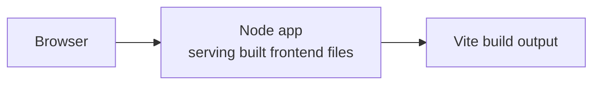
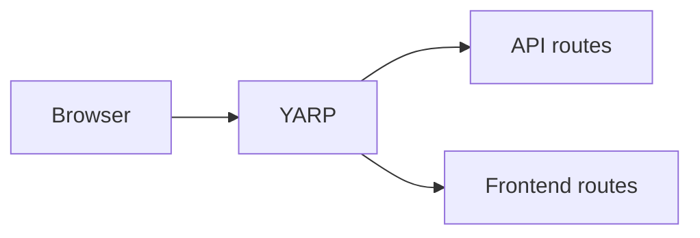
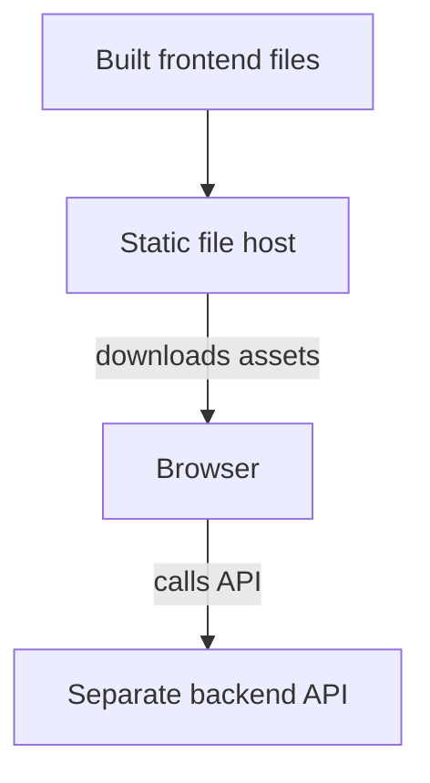

import { Aside, TabItem, Tabs } from '@astrojs/starlight/components';
import LearnMore from '@components/LearnMore.astro';

JavaScript app resources can represent static browser frontends, Node.js servers, SSR frameworks, and specialized resources such as Next.js apps. The deployment decision is less about which AppHost API you started with and more about **which resource owns the public HTTP surface in production**.


Use this table as the starting point:

| What are you deploying? | Production entrypoint | Aspire pattern |
|---|---|---|
| Static frontend served by a backend | Backend, API, or web server | `PublishWithContainerFiles` |
| Static frontend served by a gateway or BFF | Reverse proxy | `PublishWithStaticFiles` |
| Static frontend served by its own JavaScript resource | JavaScript app resource | `PublishAsStaticWebsite` |
| SSR or Node.js app with a built server artifact | JavaScript app resource | `PublishAsNodeServer` |
| SSR or Node.js app started by a package script | JavaScript app resource | `PublishAsNpmScript` |
| Next.js standalone app | Next.js app resource | `AddNextJsApp` |
| Static frontend hosted separately from the backend | Static host + separate API | Custom topology |

This article is deployment-target agnostic. It explains the JavaScript hosting models you can use with Aspire, not the full steps for a specific deployment target.

## Choose the production entrypoint

For deployment, most JavaScript app resources should be treated as build-only resources until you choose a production serving model. Different app resource APIs provide different defaults, such as Vite conventions, direct Node.js script execution, command-driven JavaScript apps, or Next.js standalone output.

To deploy a JavaScript app, choose which resource owns the public HTTP surface in production:

- Use `PublishWithContainerFiles(...)` when your backend or web server serves the built frontend files.
- Use `PublishWithStaticFiles(...)` when your reverse proxy, gateway, or <abbr title="Backend for Frontend" data-tooltip-placement="top">BFF</abbr> serves the built frontend files.
- Use a JavaScript publish method when the JavaScript app resource should become the deployed static website or Node.js server.
- Use `AddNextJsApp(...)` for a Next.js app that publishes as a standalone Next.js server.

:::caution[Experimental]
The JavaScript app resource publish methods and `AddNextJsApp` are marked `[Experimental]` and require suppressing the `ASPIREJAVASCRIPT001` diagnostic.
:::

If you only add a Vite or JavaScript app and reference backend services, Aspire still needs one of these production hosting patterns to know who serves requests in deployment. During publish or deploy, Aspire validates that build-only containers are either consumed by another resource through `PublishWithContainerFiles(...)` or `PublishWithStaticFiles(...)`, or converted into a deployable JavaScript resource with a JavaScript publish method. An unconsumed build-only container does not participate in deployment.

<Aside type="note">
  The Vite dev server is a development concern. During publish, Aspire is no
  longer relying on that dev server to handle proxying or route fallback. If you
  use Vite dev-server routing or proxy configuration locally, the
  production-serving resource needs its own equivalent routing configuration.
</Aside>

## Static frontend served by a backend

Use this shape when your backend, API, or web server is responsible for serving static frontend files in production from `wwwroot`, `static`, or a similar directory.

This shape only works if the deployed application service can actually serve those files. `PublishWithContainerFiles(...)` copies the built frontend assets into the destination container; it does not configure the destination app to serve them.



<Tabs syncKey='aspire-lang'>
<TabItem id='csharp' label='C#'>

```csharp title="AppHost.cs"
var builder = DistributedApplication.CreateBuilder(args);

var app = builder
    .AddNodeApp("app", "./api", "src/index.js")
    .WithHttpEndpoint(port: 3000, env: "PORT")
    .WithExternalHttpEndpoints();

var frontend = builder
    .AddViteApp("frontend", "./frontend")
    .WithReference(app)
    .WaitFor(app);

app.PublishWithContainerFiles(frontend, "./static");

builder.Build().Run();
```

</TabItem>
<TabItem id='typescript' label='TypeScript'>

```typescript title="apphost.ts" twoslash
import { createBuilder } from './.modules/aspire.js';

const builder = await createBuilder();

const app = await builder
  .addNodeApp('app', './api', 'src/index.js')
  .withHttpEndpoint({ env: 'PORT' })
  .withExternalHttpEndpoints();

const frontend = await builder
  .addViteApp('frontend', './frontend')
  .withReference(app)
  .waitFor(app);

await app.publishWithContainerFiles(frontend, './static');

await builder.build().run();
```

</TabItem>

</Tabs>

### How it works

1. `AddViteApp` runs the Vite dev server during `aspire run`.
2. During publish, Aspire builds the frontend and extracts its production output.
3. `PublishWithContainerFiles` copies those files into the backend or web server container.
4. The backend or web server becomes the deployed HTTP endpoint and serves the frontend files.

### When to use this shape

- Your backend already serves static files, or you are willing to make it do so.
- You want one deployed service to host both the API and the frontend.
- You want the same resource to own routing, auth, headers, fallback behavior, and static asset hosting.

### Implications

- The backend container gets larger because it contains both backend code and frontend assets.
- Frontend and backend are deployed together, which is convenient when they change together but less flexible if you want to scale or release them independently.
- Authentication, caching, headers, and fallback routing are handled where the backend serves the files.
- This usually gives the simplest mental model: one deployed service, one public endpoint, one place to troubleshoot.

## Static frontend served by a gateway or BFF

Use this shape when a reverse proxy should be the public entrypoint for your app, either as a gateway or as a BFF. In Aspire, YARP is the built-in example, but the same topology applies when you use another reverse proxy such as Nginx or Caddy.



<Tabs syncKey='aspire-lang'>
<TabItem id='csharp' label='C#'>

```csharp title="AppHost.cs"
var builder = DistributedApplication.CreateBuilder(args);

var api = builder
    .AddNodeApp("api", "./api", "src/index.js")
    .WithHttpEndpoint(port: 3000, env: "PORT");
var frontend = builder
    .AddViteApp("frontend", "./frontend");

builder
    .AddYarp("app")
    .WithConfiguration(c =>
    {
        c.AddRoute("/api/{**catch-all}", api)
            .WithTransformPathRemovePrefix("/api");
    })
    .WithExternalHttpEndpoints()
    .PublishWithStaticFiles(frontend);

builder.Build().Run();
```

</TabItem>
<TabItem id='typescript' label='TypeScript'>

```typescript title="apphost.ts" twoslash
import { createBuilder } from './.modules/aspire.js';

const builder = await createBuilder();

const api = await builder
  .addNodeApp('api', './api', 'src/index.js')
  .withHttpEndpoint({ env: 'PORT' });
const frontend = await builder.addViteApp('frontend', './frontend');

const apiEndpoint = await api.getEndpoint('http');

await builder
  .addYarp('gateway')
  .withExternalHttpEndpoints()
  .publishWithStaticFiles(frontend)
  .withConfiguration(async (yarp) => {
    (await yarp.addRoute('/api/{**catch-all}', apiEndpoint))
      .withTransformPathRemovePrefix('/api');
  });

await builder.build().run();
```

</TabItem>

</Tabs>

`AddViteApp` is still fine in this shape, but the Vite development server endpoint is not used at publish time.

### Dev-only gateway wiring

If your gateway or BFF needs to know about the frontend dev server during local development, gate that wiring to run mode only:

<Tabs syncKey='aspire-lang'>
<TabItem id='csharp' label='C#'>

```csharp title="AppHost.cs"
var frontend = builder
    .AddViteApp("frontend", "./frontend");

var gateway = builder
    .AddYarp("app")
    .WithExternalHttpEndpoints()
    .PublishWithStaticFiles(frontend);

if (builder.ExecutionContext.IsRunMode)
{
    gateway.WaitFor(frontend);
    gateway.WithEnvironment("FRONTEND_DEV_URL", frontend.GetEndpoint("http"));
}
```

</TabItem>
<TabItem id='typescript' label='TypeScript'>

```typescript title="apphost.ts"
const frontend = await builder.addViteApp('frontend', './frontend');

const gateway = await builder
  .addYarp('gateway')
  .withExternalHttpEndpoints()
  .publishWithStaticFiles(frontend);

if (await builder.executionContext.isRunMode()) {
  const frontendDevEndpoint = await frontend.getEndpoint('http');
  await gateway.waitFor(frontend);
  await gateway.withEnvironment('FRONTEND_DEV_URL', frontendDevEndpoint);
}
```

</TabItem>

</Tabs>

<Aside type="caution">
  Dev-only waits, references, and environment variables that point at the
  frontend development server can be correct in run mode, but wrong in
  publish/deploy if you leave them unconditional. Publish must not depend on the
  frontend development endpoint.
</Aside>

### How it works

1. The reverse proxy owns the public URL surface for both frontend and backend routes.
2. API requests such as `/api/*` are routed to the backend service.
3. During publish, Aspire builds the frontend and `PublishWithStaticFiles` copies the output into the proxy resource.
4. In production, the proxy serves frontend routes itself while continuing to proxy API routes.

### When to use this shape

- You want a gateway or BFF in front of your application.
- You already use a reverse proxy for API routing, aggregation, path transforms, or BFF-style concerns.
- You want one public endpoint in both development and production.

### Implications

- Backend services can stay internal behind the gateway or BFF.
- Frontend hosting is decoupled from any individual backend service, which can make routing cleaner in multi-service apps.
- Route rules now matter directly because the proxy decides which requests go to APIs and which requests go to the frontend.
- You now have a dedicated gateway/BFF in the deployment, which adds one more moving part but also gives you more control over ingress behavior.

## Static frontend served by its own JavaScript resource

Use `PublishAsStaticWebsite` when the framework produces static files and you want the JavaScript app resource to become the deployed static website. The generated container uses YARP to serve the built files and can optionally proxy API requests to a backend resource using [service discovery](/fundamentals/service-discovery/overview/).

Choose this shape instead of `PublishWithStaticFiles(...)` when you do not already have a gateway or BFF resource that should own the public route table. If you already have an explicit YARP resource for gateway or BFF behavior, keep using `PublishWithStaticFiles(...)` on that resource.

<Tabs syncKey='aspire-lang'>
<TabItem id='csharp' label='C#'>

```csharp title="AppHost.cs"
#pragma warning disable ASPIREJAVASCRIPT001

var builder = DistributedApplication.CreateBuilder(args);

var api = builder.AddProject<Projects.Api>("api");
var frontend = builder.AddViteApp("frontend", "./frontend");

frontend.PublishAsStaticWebsite(
    apiPath: "/api",
    apiTarget: api,
    configure: options =>
    {
        options.OutputPath = "dist";
        options.StripPrefix = true;
    })
    .WithExternalHttpEndpoints();

builder.Build().Run();
```

</TabItem>
<TabItem id='typescript' label='TypeScript'>

```typescript title="apphost.ts"
import { createBuilder } from './.modules/aspire.js';

const builder = await createBuilder();

const api = await builder.addProject('api', '../Api/Api.csproj');
const frontend = await builder.addViteApp('frontend', './frontend');

await frontend
  .publishAsStaticWebsite({
    apiPath: '/api',
    apiTarget: api,
    outputPath: 'dist',
    stripPrefix: true,
  })
  .withExternalHttpEndpoints();

await builder.build().run();
```

</TabItem>

</Tabs>

### Static website options

| Option | Default | Description |
|---|---|---|
| `OutputPath` / `outputPath` | `dist` | The build output directory that contains the static files to serve. |
| `StripPrefix` / `stripPrefix` | `false` | Whether to remove the API path prefix before forwarding to the API backend. Set to `true` if the API does not expect the route prefix in the request path. |
| `TargetEndpointName` / `targetEndpointName` | `null` | The endpoint name on the API resource to use for proxying. When unset, YARP uses service discovery and prefers HTTPS when available. |

You can call `PublishAsStaticWebsite` without an API target when the static website does not need proxy routes. Add `apiPath` and `apiTarget` when the static website should also route API requests to a backend resource.

### Dev-mode API proxying

`PublishAsStaticWebsite` only takes effect at publish time. In run mode, each framework still uses its own dev server, and the browser hits the dev server's origin instead of YARP. To keep the same `/api/*` shape working in development, the dev server itself needs a small proxy config that forwards `/api/*` to the backend resource.

When the frontend references a backend resource, either explicitly through `WithReference` or implicitly when you pass `apiTarget` to `PublishAsStaticWebsite`, Aspire exposes the backend URL through service-discovery environment variables. The variable name follows the pattern `<RESOURCENAME>_<SCHEME>` in upper case. For a backend resource named `api` with an `http` endpoint, that's `API_HTTP`. If you rename the resource, for example `weather`, or use `https`, the variable becomes `WEATHER_HTTP` or `API_HTTPS`. `apiTarget` adds the reference for you, so no extra `WithReference` call is required when you use `PublishAsStaticWebsite(apiPath, apiTarget)`.

Each framework reads that variable from its own dev-server config:

- **Vite, React, Vue**: Add `server.proxy` in `vite.config.ts` and read `process.env.API_HTTP`.
- **Astro**: Add `vite.server.proxy` in `astro.config.mjs` and read `process.env.API_HTTP`.
- **Angular**: Add a `proxy.conf.js` (not `.json`) that reads `process.env.API_HTTP`, then reference it from `angular.json` under `serve.options.proxyConfig`.

Once that's in place, `/api/*` resolves to the backend in both dev mode through the framework's dev proxy and production through YARP. This avoids `VITE_*` build-time variables and CORS configuration for this shape. Substitute the actual variable name your resource produces (`<RESOURCENAME>_<SCHEME>`) if you don't name your backend `api`.

## SSR or Node.js app served by its own JavaScript resource

Use this shape when the JavaScript framework output should become the deployed web server and you do not need to attach the build output to a separate backend or gateway resource.

There are two common runtime shapes:

- Use `PublishAsNodeServer` when the build produces a self-contained server artifact that can run directly with `node`.
- Use `PublishAsNpmScript` when the production server starts through a package-manager script and needs production dependencies from `node_modules`.

### Built Node.js server artifact

Use `PublishAsNodeServer` for frameworks that produce a self-contained Node.js server artifact during build, such as SvelteKit and TanStack Start. Aspire generates a runtime container that runs the built artifact directly with `node`.

Choose this method instead of `PublishAsNpmScript` when the build output does not need a production `node_modules` install at runtime. The resulting image can be smaller because it copies the server artifact rather than the full application with production dependencies.

<Tabs syncKey='aspire-lang'>
<TabItem id='csharp' label='C#'>

```csharp title="AppHost.cs"
#pragma warning disable ASPIREJAVASCRIPT001

var builder = DistributedApplication.CreateBuilder(args);

var svelteApp = builder
    .AddJavaScriptApp("svelte-app", "./svelte-app")
    .WithHttpEndpoint(port: 3000, env: "PORT");

svelteApp
    .PublishAsNodeServer(entryPoint: "build/server.js", outputPath: "build")
    .WithExternalHttpEndpoints();

builder.Build().Run();
```

</TabItem>
<TabItem id='typescript' label='TypeScript'>

```typescript title="apphost.ts"
import { createBuilder } from './.modules/aspire.js';

const builder = await createBuilder();

const svelteApp = await builder
  .addJavaScriptApp('svelte-app', './svelte-app')
  .withHttpEndpoint({ env: 'PORT' });

await svelteApp
  .publishAsNodeServer('build/server.js', { outputPath: 'build' })
  .withExternalHttpEndpoints();

await builder.build().run();
```

</TabItem>

</Tabs>

The generated container sets `HOST=0.0.0.0` and `HOSTNAME=0.0.0.0` so the Node.js server binds to all interfaces and is reachable inside the container network.

### Package-script server

Use `PublishAsNpmScript` for SSR frameworks that start production by running an npm-compatible script, such as Nuxt, Astro SSR, and Remix. Aspire generates a multi-stage Dockerfile that installs production dependencies and uses the package manager script as the container entrypoint.

Choose this method instead of `PublishAsNodeServer` when the production server imports packages from `node_modules` at runtime or the framework's recommended production command is an npm script.

<Tabs syncKey='aspire-lang'>
<TabItem id='csharp' label='C#'>

```csharp title="AppHost.cs"
#pragma warning disable ASPIREJAVASCRIPT001

var builder = DistributedApplication.CreateBuilder(args);

var nuxtApp = builder
    .AddJavaScriptApp("nuxt-app", "./nuxt-app")
    .WithHttpEndpoint(port: 3000, env: "PORT");

nuxtApp
    .PublishAsNpmScript(startScriptName: "start")
    .WithExternalHttpEndpoints();

builder.Build().Run();
```

</TabItem>
<TabItem id='typescript' label='TypeScript'>

```typescript title="apphost.ts"
import { createBuilder } from './.modules/aspire.js';

const builder = await createBuilder();

const nuxtApp = await builder
  .addJavaScriptApp('nuxt-app', './nuxt-app')
  .withHttpEndpoint({ env: 'PORT' });

await nuxtApp
  .publishAsNpmScript({ startScriptName: 'start' })
  .withExternalHttpEndpoints();

await builder.build().run();
```

</TabItem>

</Tabs>

The generated container sets `HOST=0.0.0.0` and `HOSTNAME=0.0.0.0` so the server binds to all interfaces inside the container network.

## Next.js standalone apps

Use `AddNextJsApp` for Next.js apps that use [standalone output](https://nextjs.org/docs/pages/api-reference/next-config-js/output). It is more specific than `AddJavaScriptApp` because it configures the Next.js development server port argument and publish-time standalone container shape, and it validates that the Next.js configuration enables `output: "standalone"`.

Choose this method instead of `AddJavaScriptApp(...).PublishAsNpmScript(...)` for Next.js standalone deployments. Use the more general npm-script publish method for frameworks where the production server should be started through the package manager and the framework does not have a dedicated Aspire resource.

<Tabs syncKey='aspire-lang'>
<TabItem id='csharp' label='C#'>

```csharp title="AppHost.cs"
#pragma warning disable ASPIREJAVASCRIPT001

var builder = DistributedApplication.CreateBuilder(args);

var api = builder.AddProject<Projects.Api>("api");

builder
    .AddNextJsApp("next-app", "./next-app")
    .WithReference(api)
    .WithExternalHttpEndpoints();

builder.Build().Run();
```

</TabItem>
<TabItem id='typescript' label='TypeScript'>

```typescript title="apphost.ts"
import { createBuilder } from './.modules/aspire.js';

const builder = await createBuilder();

const api = await builder.addProject('api', '../Api/Api.csproj');

await builder
  .addNextJsApp('next-app', './next-app')
  .withReference(api)
  .withExternalHttpEndpoints();

await builder.build().run();
```

</TabItem>

</Tabs>

Set `output: "standalone"` in your Next.js configuration so the generated Dockerfile has the server files it needs:

```javascript title="next.config.js"
/** @type {import('next').NextConfig} */
const nextConfig = {
  output: "standalone",
};

module.exports = nextConfig;
```

<LearnMore>
  For setting up `AddNextJsApp` with its deploy-time `output: "standalone"` validation, see [JavaScript integration — Add Next.js application](/integrations/frameworks/javascript/#add-nextjs-application).
</LearnMore>

## Separate static host and backend API

Another common deployment shape is:

- The frontend is deployed to its own static file host.
- The backend is deployed to separate compute.
- The browser calls the backend directly.



This is a natural model for many SPA teams, especially when they already think in terms of "static site + API". It can work, but it is not the primary Aspire deployment story for `AddViteApp` and `AddJavaScriptApp`.

<Tabs syncKey='aspire-lang'>
<TabItem id='csharp' label='C#'>

```csharp title="AppHost.cs"
var builder = DistributedApplication.CreateBuilder(args);

var api = builder
    .AddNodeApp("api", "./api", "src/index.js")
    .WithHttpEndpoint(port: 3000, env: "PORT")
    .WithExternalHttpEndpoints();

builder
    .AddViteApp("frontend", "./frontend")
    .WithExternalHttpEndpoints()
    .PublishAsDockerFile();

builder.Build().Run();
```

</TabItem>
<TabItem id='typescript' label='TypeScript'>

```typescript title="apphost.ts" twoslash
import { createBuilder } from './.modules/aspire.js';

const builder = await createBuilder();

const api = await builder
  .addNodeApp('api', './api', 'src/index.js')
  .withHttpEndpoint({ env: 'PORT' })
  .withExternalHttpEndpoints();

await builder
  .addViteApp('frontend', './frontend')
  .withExternalHttpEndpoints()
  .publishAsDockerFile();

await builder.build().run();
```

</TabItem>

</Tabs>

### Why this shape gets harder

This shape pushes more work onto the browser/frontend boundary:

- The browser now talks to a different origin, so you often need to configure CORS.
- The frontend needs to know the backend URL for each environment.
- Vite apps usually consume those values at build time, which means the backend URL must be known when the frontend is built or injected through a separate runtime configuration pattern.
- Local Vite proxy behavior often hides these production concerns until you try to deploy.

The following example looks reasonable, but it is a trap in publish/deploy:

<Tabs syncKey='aspire-lang'>
<TabItem id='csharp' label='C#'>

```csharp title="AppHost.cs"
var builder = DistributedApplication.CreateBuilder(args);

var api = builder
    .AddNodeApp("api", "./api", "src/index.js")
    .WithHttpEndpoint(port: 3001, env: "PORT")
    .WithExternalHttpEndpoints();

builder
    .AddViteApp("frontend", "./frontend")
    .WithReference(api)
    .WithEnvironment("VITE_API_BASE_URL", api.GetEndpoint("http"))
    .PublishAsDockerFile();

builder.Build().Run();
```

</TabItem>
<TabItem id='typescript' label='TypeScript'>

```typescript title="apphost.ts" twoslash
import { createBuilder } from './.modules/aspire.js';

const builder = await createBuilder();

const api = await builder
  .addNodeApp('api', './api', 'src/index.js')
  .withHttpEndpoint({ port: 3001, env: 'PORT' })
  .withExternalHttpEndpoints();

await builder
  .addViteApp('frontend', './frontend')
  .withReference(api)
  .withEnvironment('VITE_API_BASE_URL', await api.getEndpoint('http'))
  .publishAsDockerFile();

await builder.build().run();
```

</TabItem>

</Tabs>

### Pitfalls

- **Pit 1 - Runtime environment on the Vite resource**

  Example: `WithEnvironment(...)` / `withEnvironment(...)` on `AddViteApp` / `addViteApp` to set `VITE_API_BASE_URL`.

  Associated failure: Vite usually reads `VITE_*` values at build time, so the deployed browser app does not learn its backend URL from the Vite resource at runtime.

- **Pit 2 - Switching the same value to a build arg**

  Example: `WithBuildArg(...)` / `withBuildArg(...)` to set the backend URL during the frontend image build.

  Associated failure: the backend URL is usually not known when the frontend image is being built.

- **Pit 3 - Trying to wire both sides of the relationship**

  Example: the frontend needs the backend URL, while the backend also needs the frontend origin for CORS.

  Associated failure: this creates a deployment-time cycle between the frontend and backend. In publish/deploy, the Vite resource is a build resource, not the runtime web server, so it cannot be the place where the browser discovers the backend URL.

<Aside type="caution" title="If publish throws this exception">
  If publish throws `The given key 'Aspire.Hosting.JavaScript.ViteAppResource'
  was not present in the dictionary.`, treat that as a modeling problem, not as
  a missing dictionary entry. Move that runtime relationship to the backend,
  reverse proxy, or other deployed resource that actually serves the frontend or
  owns the public HTTP surface.
</Aside>

Aspire can still orchestrate the frontend build and the backend resource, but this topology is less integrated than the backend-serves-frontend or gateway-serves-frontend shapes. If this is the model you want, plan for explicit runtime configuration and CORS management.

## Framework output reference

The following table summarizes common framework outputs and the Aspire patterns they usually map to. Treat it as guidance, not an exhaustive list.

| Framework | Recommended method | Entry point | Configuration required |
|---|---|---|---|
| Vite / React / Vue | `PublishAsStaticWebsite` | N/A (YARP serves `dist/`) | None |
| Angular | `PublishAsStaticWebsite` | N/A (YARP serves `dist/`) | `outputPath` in `angular.json` so the build writes to `dist/` directly |
| Astro (static output) | `PublishAsStaticWebsite` | N/A (YARP serves `dist/`) | None |
| SvelteKit | `PublishAsNodeServer` | `build/index.js` | `@sveltejs/adapter-node` |
| TanStack Start | `PublishAsNodeServer` | `.output/server/index.mjs` | None (Nitro `node-server` preset by default) |
| Next.js | `AddNextJsApp` | `server.js` (in `.next/standalone/`) | `output: "standalone"` in `next.config.*` |
| Nuxt | `PublishAsNpmScript` | `node .output/server/index.mjs` (via `start`) | `NUXT_` prefix on `runtimeConfig` env vars |
| Astro SSR | `PublishAsNpmScript` | `node ./dist/server/entry.mjs` (via `start`) | `@astrojs/node`, `prerender: false` per page |
| Remix / React Router | `PublishAsNpmScript` | `react-router-serve` (via `start`) | None |
| Qwik City | `PublishAsNpmScript` | `node server/entry.node-server.js` (via `start`) | Node server adapter, Node 20+ |

### Framework-specific gotchas

These are issues that aren't always called out in framework deployment docs but matter for the corresponding publish method to actually work.

The SSR examples below assume a backend resource named `api` referenced from the frontend (via `WithReference` or by passing `apiTarget` to `PublishAsStaticWebsite`). Aspire then exposes its URL as `API_HTTP` following the `<RESOURCENAME>_<SCHEME>` convention from [Dev-mode API proxying](#dev-mode-api-proxying). If your backend has a different name or scheme, substitute the matching variable.

#### Nuxt

- **Directory structure**: Nuxt 4 places pages in `app/pages/`, not a root `pages/` directory.
- **Environment variables**: Nuxt maps [`runtimeConfig`](https://nuxt.com/docs/getting-started/configuration#runtime-config) keys to env vars with a `NUXT_` prefix. To pass the backend URL, set `NUXT_API_HTTP` on the resource so Nuxt sees it as `runtimeConfig.apiHttp`.
- **Server API routes**: The recommended pattern for calling external APIs from Nuxt is a [server API route](https://nuxt.com/docs/guide/directory-structure/server) (`server/api/<name>.ts`) that uses `useRuntimeConfig()`, consumed from a page via [`useAsyncData`](https://nuxt.com/docs/api/composables/use-async-data).
- **Publish method**: Always use `PublishAsNpmScript` for Nuxt. The Nitro `.output/` looks self-contained, but server-side data fetching via `useAsyncData` / `useFetch` fails without the full `node_modules` available at runtime.

#### Astro SSR

- **Adapter**: Use [`@astrojs/node`](https://docs.astro.build/en/guides/integrations-guide/node/) so Astro produces a Node SSR build.
- **Pre-rendering**: Astro [pre-renders pages](https://docs.astro.build/en/guides/on-demand-rendering/) at build time by default, even with the Node adapter. Add `export const prerender = false` to any page that needs to run at request time.
- **Environment variables**: Use `process.env.API_HTTP`, not `import.meta.env.API_HTTP`. `import.meta.env` values are resolved at build time and baked into the output.
- **Runtime dependencies**: The built `entry.mjs` imports unbundled `@astrojs/*` packages, so SSR Astro must use `PublishAsNpmScript`. The [official Docker recipe](https://docs.astro.build/en/recipes/docker/#multi-stage-build-using-ssr) confirms `node_modules` must be copied into the runtime image.

#### SvelteKit

- **Adapter**: The default `@sveltejs/adapter-auto` does not produce a deployable Node.js artifact. Install [`@sveltejs/adapter-node`](https://svelte.dev/docs/kit/adapter-node) and update `svelte.config.js` to use it.
- **Server-side data**: Use a [`+page.server.ts`](https://svelte.dev/docs/kit/load) `load` function for server-side fetching. `process.env.API_HTTP` is available inside the load function.
- **Output shape**: The `build/` directory is fully self-contained, so no `node_modules` are required at runtime. This makes SvelteKit a good fit for `PublishAsNodeServer`.

#### Next.js

- **Standalone output**: Set [`output: "standalone"`](https://nextjs.org/docs/app/api-reference/config/next-config-js/output) in `next.config.*`. Without this, the build output requires `node_modules` at runtime and the generated container won't run. `AddNextJsApp` validates this configuration at deploy time.
- **Copy shape**: The standalone build produces three directories that must be copied separately into the runtime image: `.next/standalone/` (server + bundled deps), `.next/static/` (client assets), and `public/` (static files). `AddNextJsApp` handles this automatically; see the [official with-docker example](https://github.com/vercel/next.js/tree/canary/examples/with-docker) if you need to do it manually.
- **Server components**: Default App Router components are [server components](https://nextjs.org/docs/app/getting-started/server-and-client-components). Use `async` directly in the component body to fetch data; no special loader pattern is needed.

#### TanStack Start

- **Nitro preset**: Uses [Nitro](https://nitro.build/deploy/runtimes/node) with the `node-server` preset by default, which produces a self-contained `.output/server/index.mjs`. This is why TanStack Start works with `PublishAsNodeServer` out of the box. See [TanStack Start hosting](https://tanstack.com/start/latest/docs/framework/react/hosting) for other deployment targets.
- **Server functions**: Use [`createServerFn`](https://tanstack.com/start/latest/docs/framework/react/server-functions) for server-side data loading from route loaders.
- **Environment variables**: `process.env.API_HTTP` is available inside server functions at runtime.

#### Remix / React Router

- **Server binary**: `react-router-serve` lives in `node_modules`; it's not bundled into the build output. This is why Remix needs `PublishAsNpmScript` rather than `PublishAsNodeServer`. See the [React Router deployment guide](https://reactrouter.com/start/framework/deploying) and the [`node-custom-server` template](https://github.com/remix-run/react-router-templates/tree/main/node-custom-server) for production server patterns.
- **Port binding**: Pass `-- --port "$PORT"` as `runScriptArguments` so the server listens on Aspire's assigned port.

#### Qwik City

- **Node version**: Qwik uses Vite 7, which requires Node 20+. Set `engines.node` in `package.json` accordingly.
- **Server adapter**: Requires the [Qwik Node adapter](https://qwik.dev/docs/deployments/node/). Add `adaptors/node-server/vite.config.ts` with `nodeServerAdapter()` and a corresponding `src/entry.node-server.tsx`.
- **Build steps**: Requires both `npm run build.client` and `npm run build.server`. The default `npm run build` runs both via `qwik build`.
- **SSR data loading**: Use [`routeLoader$`](https://qwik.dev/docs/route-loader/) for server-side data loading. Read the backend URL via `process.env['API_HTTP']`.

#### Angular

- **Vite-based**: Angular 17+ uses Vite internally via `@angular/build`. `AddViteApp` works correctly because Aspire injects `--port` into `ng serve`.
- **Dev proxy**: Angular doesn't expose `vite.config.ts`. Use a [`proxy.conf.js`](https://angular.dev/tools/cli/serve) (not `.json`) that reads `process.env.API_HTTP`, referenced from `angular.json` under `serve.options.proxyConfig`.
- **Output path**: Set [`outputPath`](https://angular.dev/reference/configs/workspace-config) in `angular.json` to `{ "base": "dist", "browser": "" }` so the production build writes directly to `dist/` for `PublishAsStaticWebsite`.

#### Vite / React / Vue (static)

- **Preview is not production**: Both [Vite](https://vite.dev/guide/cli.html#vite-preview) and the framework docs explicitly state that `vite preview` is not a production server. Always use `PublishAsStaticWebsite`.
- **API calls**: Use the `apiPath` / `apiTarget` options on `PublishAsStaticWebsite` so the backend is reachable through YARP. Don't use `VITE_*` env vars for runtime API URLs; they're baked at build time.
- **Dev proxy**: Add [`server.proxy`](https://vite.dev/config/server-options.html#server-proxy) in `vite.config.ts` reading `process.env.API_HTTP` to forward `/api/*` to the backend in dev mode.

## What JavaScript app resources mean in production

`AddViteApp` and `AddJavaScriptApp` are best thought of as development commands plus publish-output resources until you choose the production serving model:

- In run mode, they start the configured development command, such as the Vite dev server with HMR.
- In publish mode, they produce static frontend assets, Node.js server output, or both.
- Another resource can serve those artifacts in production, or a JavaScript publish method can make the JavaScript resource publish as its own static website or Node.js server.

### Build-only container validation

If a build-only JavaScript resource is not consumed by another resource, publish/deploy validation fails because that resource would not participate in the deployed app. The error looks similar to:

```text
Build-only container resource(s) 'frontend' are not consumed by another resource and won't participate in publish or deploy. Reference them from another resource, for example using 'PublishWithContainerFiles' or 'PublishWithStaticFiles', or suppress this validation for the app by calling 'builder.Pipeline.DisableBuildOnlyContainerValidation()'.
```

Prefer fixing the app model by choosing one of the deployment shapes in this article. The app-wide `DisableBuildOnlyContainerValidation()` escape hatch exists for exceptional cases, but it should not be the normal way to deploy JavaScript frontends.

To disable the validation for the whole app, call `DisableBuildOnlyContainerValidation` on the pipeline:

<Tabs syncKey='aspire-lang'>
<TabItem id='csharp' label='C#'>

```csharp title="AppHost.cs"
#pragma warning disable ASPIREPIPELINES001

using Aspire.Hosting.Pipelines;

var builder = DistributedApplication.CreateBuilder(args);

// Add resources...

builder.Pipeline.DisableBuildOnlyContainerValidation();

builder.Build().Run();
```

</TabItem>
<TabItem id='typescript' label='TypeScript'>

```typescript title="apphost.ts"
import { createBuilder } from './.modules/aspire.js';

const builder = await createBuilder();

// Add resources...

builder.pipeline.disableBuildOnlyContainerValidation();

await builder.build().run();
```

</TabItem>
</Tabs>

The `DisableBuildOnlyContainerValidation` method is marked experimental with the `ASPIREPIPELINES001` diagnostic.

`AddNextJsApp` is different because it represents the Next.js standalone-server publish model directly. Use it when the app is a Next.js app with `output: "standalone"` rather than modeling the app with `AddJavaScriptApp` and choosing a generic npm-script publish method.

## Common mistakes

- Expecting `AddViteApp` or `AddJavaScriptApp` to be the deployed production web server without choosing a publish method.
- Modeling a Next.js standalone deployment with generic npm-script publishing instead of `AddNextJsApp`.
- Exposing the Vite resource instead of the backend, reverse proxy, or JavaScript publish resource that serves production requests.
- Adding `AddViteApp` plus `.WithReference(...)` and assuming that is enough to deploy the frontend.
- Using `.WithEnvironment(...)` on `AddViteApp` to pass the API URL to the deployed SPA.
- Calling `.WithHttpEndpoint()` on `AddViteApp`.
- Using `VITE_*` variables for values that must be resolved at runtime in an already-built SPA.
- Adding a Vite or JavaScript app without choosing a production serving model, which causes a publish/deploy validation error for an unconsumed build-only container.

<LearnMore>
  For runtime configuration guidance, see [JavaScript
  integration](/integrations/frameworks/javascript/#pass-runtime-configuration-to-spa-frontends).
</LearnMore>

## See also

- [Deploy your first Aspire app](/get-started/deploy-first-app/)
- [JavaScript integration](/integrations/frameworks/javascript/)
- [Publishing and deployment overview](/deployment/overview/)
- [Node.js hosting extensions](/integrations/frameworks/nodejs-extensions/)
