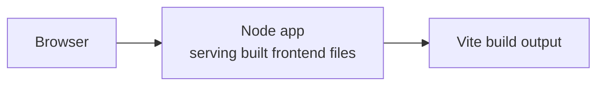
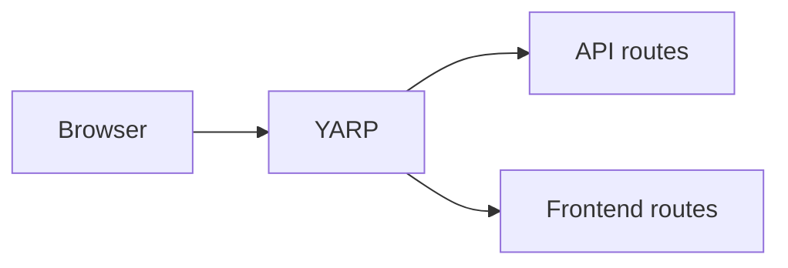
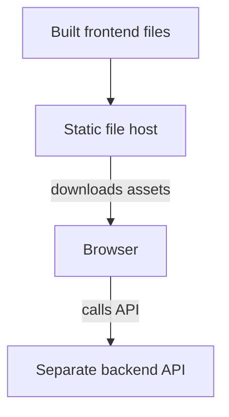

import { Aside, Tabs, TabItem } from '@astrojs/starlight/components';
import AppHostLangPivot from '@components/AppHostLangPivot.astro';
import LearnMore from '@components/LearnMore.astro';

For Vite and other JavaScript frontends, there are three common production deployment models:

- A backend service serves the built frontend files.
- A reverse proxy serves the built frontend files.
- A standalone static frontend talks directly to a separately hosted backend.

All three models use `AddViteApp` for local development and for producing the frontend build output during publishing. The difference is which resource becomes the production entrypoint and whether the browser talks to the backend directly.

These same production models also apply to `AddJavaScriptApp`. The difference
is that `AddViteApp` knows about Vite's development conventions, while
`AddJavaScriptApp` makes fewer assumptions and leaves the run and build commands
under your control. This article is deployment-target agnostic: it explains the
JavaScript hosting models you can use with Aspire, not the full steps for a
specific deployment target.

## Deployment rule

For deployment, `AddViteApp` and `AddJavaScriptApp` should be treated as frontend build resources, not as the final production web server.

To deploy a JavaScript frontend, you must choose which other resource owns the public HTTP surface in production:

- Use `PublishWithContainerFiles(...)` when your backend or web server will serve the built frontend files.
- Use `PublishWithStaticFiles(...)` when your reverse proxy, gateway, or <abbr title="Backend for Frontend" data-tooltip-placement="top">BFF</abbr> will serve the built frontend files.

If you only add a Vite or JavaScript app and reference backend services, Aspire still needs one of these production hosting patterns to know who serves the built frontend in deployment.

<Aside type="tip">
  If you expected `AddViteApp(...).PublishAsDockerFile()` to behave like a
  standalone Nginx- or Apache-style static web container by default, that is not
  the primary deployment model Aspire is guiding you toward. The intended
  default is that another resource serves the built frontend assets in
  production.
</Aside>

<Aside type="note">
  The Vite dev server is a development concern. During publish, Aspire is no
  longer relying on that dev server to handle proxying or route fallback. If you
  use Vite dev-server routing or proxy configuration locally, you should assume
  the production-serving resource needs its own equivalent routing
  configuration.
</Aside>

## Deployment models

| Model                                  | Production entrypoint      | Aspire publish API          | Best for                                                                          |
| -------------------------------------- | -------------------------- | --------------------------- | --------------------------------------------------------------------------------- |
| Backend serves frontend               | API or web server          | `PublishWithContainerFiles` | Apps where one service serves both the API and the frontend                      |
| Reverse proxy serves frontend         | Reverse proxy              | `PublishWithStaticFiles`    | Apps that want a gateway or BFF in front of APIs and static frontend assets      |
| Static frontend calls backend directly | Static site + separate API | Custom / less integrated    | Apps that intentionally keep frontend hosting separate and can manage CORS/config |

<Aside type="caution">
  `AddViteApp` already registers its local development endpoint. Do not call
  `.WithHttpEndpoint()` on a Vite resource.
</Aside>

## Model 1: Backend serves the built frontend

Use this model when your backend, API, or server is responsible for serving static frontend files in production from `wwwroot`, `static`, or a similar directory.

This model only works if that backend or server can actually serve the built frontend assets. In other words, the deployed application service must be both the API host and the static file host for the frontend.

<Aside type="note">
  `PublishWithContainerFiles(...)` only copies the built frontend assets into
  the destination container. The important requirement is easy to miss in the
  helper name: the destination app must be configured to serve those files.
</Aside>



<Tabs syncKey='aspire-lang'>
<TabItem id='csharp' label='C#'>
```csharp title="C# — AppHost.cs"
var builder = DistributedApplication.CreateBuilder(args);

var app = builder
    .AddNodeApp("app", "./api", "src/index.js")
    .WithHttpEndpoint(port: 3000, env: "PORT")
    .WithExternalHttpEndpoints();

var frontend = builder
    .AddViteApp("frontend", "./frontend")
    .WithReference(app)
    .WaitFor(app);

app.PublishWithContainerFiles(frontend, "./static");

builder.Build().Run();
```
</TabItem>
<TabItem id='typescript' label='TypeScript'>
```typescript title="TypeScript — apphost.ts" twoslash
import { createBuilder } from './.modules/aspire.js';

const builder = await createBuilder();

const app = await builder
  .addNodeApp('app', './api', 'src/index.js')
  .withHttpEndpoint({ env: 'PORT' })
  .withExternalHttpEndpoints();

const frontend = await builder
  .addViteApp('frontend', './frontend')
  .withReference(app)
  .waitFor(app);

await app.publishWithContainerFiles(frontend, './static');

await builder.build().run();
```
</TabItem>
</Tabs>

### How it works

1. `AddViteApp` runs the Vite dev server during `aspire run`.
2. During publish, Aspire builds the frontend and extracts its production output.
3. `PublishWithContainerFiles` copies those files into the Node app container.
4. The Node app becomes the deployed HTTP endpoint and serves the frontend files.

### Why Aspire supports this model

This model keeps the production topology simple. The frontend build output becomes part of the same deployable unit as the backend, so one service owns the application surface, static files, and API behavior together.

It also maps well to frameworks that already know how to serve static files from `wwwroot`, `static`, or a similar folder. Instead of introducing an extra gateway or frontend-serving container, Aspire lets the backend stay responsible for the final HTTP response.

### When to use this model

- Your backend already serves static files, or you are willing to make it do so.
- You want one deployed service to host both the API and the frontend.
- You want the same resource to own routing, auth, and static asset hosting.

### Implications

- Your backend container gets larger because it now contains both backend code and frontend assets.
- Frontend and backend are deployed together, which is convenient when they change together but less flexible if you want to scale or release them independently.
- Authentication, caching, headers, and fallback routing are handled where the backend serves the files.
- This usually gives the simplest mental model: one deployed service, one public endpoint, one place to troubleshoot.
- This is the default pattern Aspire is steering you toward for Vite frontends unless you intentionally introduce a gateway or BFF to own the public surface.

## Model 2: Reverse proxy serves the built frontend

Use this model when a reverse proxy should be the public entrypoint for your app, either as a gateway or as a backend-for-frontend (BFF).

This model works well when you want a dedicated gateway or BFF in front of the rest of the application. In Aspire, YARP is the built-in example, but the same topology also applies when you use another reverse proxy such as Nginx or Caddy.



<Tabs syncKey='aspire-lang'>
<TabItem id='csharp' label='C#'>
```csharp title="C# — AppHost.cs"
var builder = DistributedApplication.CreateBuilder(args);

var api = builder
    .AddNodeApp("api", "./api", "src/index.js")
    .WithHttpEndpoint(port: 3000, env: "PORT");
var frontend = builder
    .AddViteApp("frontend", "./frontend");

builder
    .AddYarp("app")
    .WithConfiguration(c =>
    {
        c.AddRoute("/api/{**catch-all}", api)
            .WithTransformPathRemovePrefix("/api");
    })
    .WithExternalHttpEndpoints()
    .PublishWithStaticFiles(frontend);

builder.Build().Run();
```
</TabItem>
<TabItem id='typescript' label='TypeScript'>
```typescript title="TypeScript — apphost.ts" twoslash
import { createBuilder } from './.modules/aspire.js';

const builder = await createBuilder();

const api = await builder
  .addNodeApp('api', './api', 'src/index.js')
  .withHttpEndpoint({ env: 'PORT' });
const frontend = await builder.addViteApp('frontend', './frontend');

const apiEndpoint = await api.getEndpoint('http');

await builder
  .addYarp('gateway')
  .withExternalHttpEndpoints()
  .publishWithStaticFiles(frontend)
  .withConfiguration(async (yarp) => {
    (
      await yarp.addRouteFromEndpoint('/api/{**catch-all}', apiEndpoint)
    ).withTransformPathRemovePrefix('/api');
  });

await builder.build().run();
```
</TabItem>
</Tabs>

<Aside type="note">
  `AddViteApp` is still fine in this model but it's important to
  understand that the Vite development server endpoint is not used at
  publish-time.
</Aside>

### Dev-only gateway wiring

If your gateway or BFF needs to know about the frontend dev server during local
development, gate that wiring to run mode only:

<Tabs syncKey='aspire-lang'>
<TabItem id='csharp' label='C#'>
```csharp title="C# — AppHost.cs"
var frontend = builder
    .AddViteApp("frontend", "./frontend");

var gateway = builder
    .AddYarp("app")
    .WithExternalHttpEndpoints()
    .PublishWithStaticFiles(frontend);

if (builder.ExecutionContext.IsRunMode)
{
    gateway.WaitFor(frontend);
    gateway.WithEnvironment("FRONTEND_DEV_URL", frontend.GetEndpoint("http"));
}
```
</TabItem>
<TabItem id='typescript' label='TypeScript'>
```typescript title="TypeScript — apphost.ts"
const frontend = await builder.addViteApp('frontend', './frontend');

const gateway = await builder
  .addYarp('gateway')
  .withExternalHttpEndpoints()
  .publishWithStaticFiles(frontend);

if (await builder.executionContext.isRunMode()) {
  const frontendDevEndpoint = await frontend.getEndpoint('http');
  await gateway.waitFor(frontend);
  await gateway.withEnvironment('FRONTEND_DEV_URL', frontendDevEndpoint);
}
```
</TabItem>
</Tabs>

<Aside type="caution">
  Dev-only waits, references, and environment variables that point at the
  frontend development server can be correct in run mode, but wrong in
  publish/deploy if you leave them unconditional. Publish must not depend on the
  frontend development endpoint.
</Aside>

### How it works

1. The reverse proxy owns the public URL surface for both frontend and backend routes.
2. API requests such as `/api/*` are routed to the backend service.
3. During publish, Aspire builds the frontend and `PublishWithStaticFiles` copies the output into the proxy resource.
4. In production, the proxy serves frontend routes itself while continuing to proxy API routes.

### Why Aspire supports this model

This model keeps the public entrypoint separate from the application services behind it. The reverse proxy becomes the stable edge for the app, while the frontend build and any backend services remain behind that gateway or BFF.

It is a good fit when you want one place to centralize routing, transforms, headers, and gateway or BFF concerns. YARP is Aspire's first-class option here, which is why the example uses it, but the architectural tradeoffs are the same for other reverse proxies.

### When to use this model

- You want a gateway or BFF in front of your application.
- You already use a reverse proxy for API routing, aggregation, path transforms, or BFF-style concerns.
- You want one public endpoint in both development and production.

### Implications

- The reverse proxy owns the public endpoint, so backend services can stay internal behind the gateway or BFF.
- Frontend hosting is decoupled from any individual backend service, which can make routing cleaner in multi-service apps.
- Route rules now matter directly because the proxy decides which requests go to APIs and which requests go to the frontend.
- You now have a dedicated gateway/BFF in the deployment, which adds one more moving part but also gives you more control over ingress behavior.
- This is often the better choice when the frontend needs BFF-style behavior or when a standalone Vite build would otherwise need deployment-time configuration from backend resources.

## A third model you may be considering

Another common deployment shape is:

- The frontend is deployed to its own static file host.
- The backend is deployed to separate compute.
- The browser calls the backend directly.



This is a natural model for many SPA teams, especially when they already think
in terms of "static site + API". It can work, but it is not the primary Aspire
deployment story for `AddViteApp` and `AddJavaScriptApp`.

<Tabs syncKey='aspire-lang'>
<TabItem id='csharp' label='C#'>
```csharp title="C# — AppHost.cs"
var builder = DistributedApplication.CreateBuilder(args);

var api = builder
    .AddNodeApp("api", "./api", "src/index.js")
    .WithHttpEndpoint(port: 3000, env: "PORT")
    .WithExternalHttpEndpoints();

builder
    .AddViteApp("frontend", "./frontend")
    .WithExternalHttpEndpoints()
    .PublishAsDockerFile();

builder.Build().Run();
```
</TabItem>
<TabItem id='typescript' label='TypeScript'>
```typescript title="TypeScript — apphost.ts" twoslash
import { createBuilder } from './.modules/aspire.js';

const builder = await createBuilder();

const api = await builder
  .addNodeApp('api', './api', 'src/index.js')
  .withHttpEndpoint({ env: 'PORT' })
  .withExternalHttpEndpoints();

await builder
  .addViteApp('frontend', './frontend')
  .withExternalHttpEndpoints()
  .publishAsDockerFile();

await builder.build().run();
```
</TabItem>
</Tabs>

The following example looks reasonable, but it is a trap in publish/deploy:

<Tabs syncKey='aspire-lang'>
<TabItem id='csharp' label='C#'>
```csharp title="C# — AppHost.cs"
var builder = DistributedApplication.CreateBuilder(args);

var api = builder
    .AddProject("api", "../Api/Api.csproj")
    .WithExternalHttpEndpoints();

builder
    .AddViteApp("frontend", "./frontend")
    .WithReference(api)
    .WithEnvironment("VITE_API_BASE_URL", api.GetEndpoint("https"))
    .PublishAsDockerFile();

builder.Build().Run();
```
</TabItem>
<TabItem id='typescript' label='TypeScript'>
```typescript title="TypeScript — apphost.ts" twoslash
import { createBuilder } from './.modules/aspire.js';

const builder = await createBuilder();

const api = await builder.addProject('api', '../Api/Api.csproj');
await api.withExternalHttpEndpoints();

await builder
  .addViteApp('frontend', './frontend')
  .withReference(api)
  .withEnvironment('VITE_API_BASE_URL', await api.getEndpoint('https'))
  .publishAsDockerFile();

await builder.build().run();
```
</TabItem>
</Tabs>

### Pits of failure

- **Pit 1 — Runtime environment on the Vite resource**

  Example: `WithEnvironment(...)` / `withEnvironment(...)` on `AddViteApp` /
  `addViteApp` to set `VITE_API_BASE_URL`.

  Associated failure: Vite usually reads `VITE_*` values at build time, so the
  deployed browser app does not learn its backend URL from the Vite resource at
  runtime.

- **Pit 2 — Switching the same value to a build arg**

  Example: `WithBuildArg(...)` / `withBuildArg(...)` to set the backend URL
  during the frontend image build.

  Associated failure: the backend URL is usually not known when the frontend
  image is being built.

- **Pit 3 — Trying to wire both sides of the relationship**

  Example: the frontend needs the backend URL, while the backend also needs the
  frontend origin for CORS.

  Associated failure: this creates a deployment-time cycle between the frontend
  and backend. In publish/deploy, the Vite resource is a build resource, not the
  runtime web server, so it cannot be the place where the browser discovers the
  backend URL.

<Aside type="caution" title="If publish throws this exception">
  If publish throws `The given key 'Aspire.Hosting.JavaScript.ViteAppResource'
  was not present in the dictionary.`, treat that as a modeling problem, not as
  a missing dictionary entry. Move that runtime relationship to the backend,
  reverse proxy, or other deployed resource that actually serves the frontend or
  owns the public HTTP surface.
</Aside>

### Why people fall into this model

This model looks familiar if you are used to deploying:

- A Vite or React app to a static site host.
- An API to another host.
- Frontend JavaScript that calls the API directly from the browser.

It can seem like the most obvious path because it keeps the frontend as "just a
static site" and avoids adding a backend-served frontend or reverse proxy layer.

### Why it gets harder

This model pushes more work onto the browser/frontend boundary:

- The browser now talks to a different origin, so you often need to configure CORS.
- The frontend needs to know the backend URL for each environment.
- Vite apps usually consume those values at build time, which means the backend
  URL must be known when the frontend is built or injected through a separate
  runtime configuration pattern.
- Local Vite proxy behavior often hides these production concerns until you try
  to deploy.

### What this means in Aspire

Aspire can still orchestrate the frontend build and the backend resource, but
this topology is less integrated than the two primary models above. In
particular, Aspire does not automatically solve:

- Passing the final deployed backend URL into an already-built SPA.
- Browser-to-API cross-origin concerns.
- The split ownership between a standalone static site host and a separate API host.

If this is the model you want, plan for explicit runtime configuration and CORS
management. Otherwise, the backend-serves-frontend or reverse-proxy-serves-frontend
models are usually easier to reason about in Aspire.

## New publish methods (Aspire 13.3+)

Aspire 13.3 introduces three dedicated publish extension methods on JavaScript resources. These are marked `[Experimental]`. In C# AppHosts, suppress the `ASPIREEXTENSION001` diagnostic when you use these APIs.

### `PublishAsStaticWebsite`

Use `PublishAsStaticWebsite` to deploy a built static frontend via a YARP reverse proxy container. This is the recommended method for static-output frameworks such as Vite, React, Vue, and Astro (static mode).

YARP serves the built static files directly and can optionally proxy API requests to a backend service using [service discovery](/fundamentals/service-discovery/).

<AppHostLangPivot>
  <div slot="csharp">

```csharp title="C# — AppHost.cs"
#pragma warning disable ASPIREEXTENSION001

var builder = DistributedApplication.CreateBuilder(args);

var api = builder.AddProject("api", "../Api/Api.csproj");

var frontend = builder.AddViteApp("frontend", "./frontend");

// Serve built frontend files + proxy /api/* to the API
frontend.PublishAsStaticWebsite(
    apiPath: "/api",
    apiTarget: api,
    configure: options =>
    {
        options.OutputPath = "dist";
        options.StripPrefix = false;
    });

builder.Build().Run();
```

  </div>
  <div slot="typescript">

```typescript title="TypeScript — apphost.ts"
import { createBuilder } from './.modules/aspire.js';

const builder = await createBuilder();

const api = await builder.addProject('api', '../Api/Api.csproj');

// Serve built frontend files + proxy /api/* to the API
await builder.addViteApp('frontend', './frontend').publishAsStaticWebsite({
  apiPath: '/api',
  apiTarget: api,
  outputPath: 'dist',
  stripPrefix: false,
});

await builder.build().run();
```

  </div>
</AppHostLangPivot>

#### `PublishAsStaticWebsiteOptions`

| Option | Default | Description |
|---|---|---|
| `OutputPath` | `dist` | The build output directory that contains the static files to serve. |
| `StripPrefix` | `false` | Whether to strip the path prefix before forwarding to the API backend. Set to `true` if the API does not expect the route prefix in the request path. |
| `TargetEndpointName` | Service discovery | The endpoint name on the API resource to use for proxying. When unset, YARP uses service discovery and prefers HTTPS when available. |

The API has two forms:

- **Without proxy**: In C#, call `PublishAsStaticWebsite(configure?)`. In TypeScript, call `publishAsStaticWebsite({ ... })` without `apiPath` or `apiTarget`. This serves only the built static files.
- **With proxy**: In C#, call `PublishAsStaticWebsite(apiPath, apiTarget, configure?)`. In TypeScript, call `publishAsStaticWebsite({ apiPath, apiTarget, ... })`. This adds a YARP route to forward matching requests to the API resource.

:::note
`StripPrefix` defaults to `false`, which means the full request path (including the prefix) is forwarded to the backend. Set `StripPrefix = true` if the backend API does not expect the path prefix.
:::

#### Dev-mode API proxying

`PublishAsStaticWebsite` only takes effect at publish time. In **run mode**, each framework still uses its own dev server, and the browser hits the dev server's origin — not YARP. To keep the same `/api/*` shape working in development, the dev server itself needs a small proxy config that forwards `/api/*` to the backend resource.

When the frontend references a backend resource — either explicitly via `WithReference` or implicitly when you pass `apiTarget` to `PublishAsStaticWebsite` — Aspire exposes the backend's URL through service-discovery environment variables. The variable name follows the pattern `<RESOURCENAME>_<SCHEME>` in upper case. For a backend resource named `api` with an `http` endpoint, that's `API_HTTP`. If you rename the resource (for example `weather`) or use `https`, the variable becomes `WEATHER_HTTP` or `API_HTTPS`. `apiTarget` adds the reference for you, so no extra `WithReference` call is required when you use `PublishAsStaticWebsite(apiPath, apiTarget)`.

Each framework reads that variable from its own dev-server config:

- **Vite, React, Vue**: add `server.proxy` in `vite.config.ts` and read `process.env.API_HTTP`.
- **Astro**: add `vite.server.proxy` in `astro.config.mjs` and read `process.env.API_HTTP`.
- **Angular**: add a `proxy.conf.js` (not `.json`) that reads `process.env.API_HTTP`, then reference it from `angular.json` under `serve.options.proxyConfig`.

Once that's in place, `/api/*` resolves to the backend in both dev (via the framework's dev proxy) and production (via YARP) — no `VITE_*` build-time variables, no CORS configuration. Substitute the actual variable name your resource produces (`<RESOURCENAME>_<SCHEME>`) if you don't name your backend `api`.

### `PublishAsNodeServer`

Use `PublishAsNodeServer` for SSR frameworks that produce a self-contained Node.js server artifact, such as SvelteKit and TanStack Start.

Aspire generates a container that runs the built artifact directly using the Node.js runtime.

<AppHostLangPivot>
  <div slot="csharp">

```csharp title="C# — AppHost.cs"
#pragma warning disable ASPIREEXTENSION001

var builder = DistributedApplication.CreateBuilder(args);

var svelteApp = builder.AddJavaScriptApp("svelte-app", "./svelte-app")
    .WithHttpEndpoint(port: 3000, env: "PORT");

svelteApp.PublishAsNodeServer("build/index.js", outputPath: "build");

builder.Build().Run();
```

  </div>
  <div slot="typescript">

```typescript title="TypeScript — apphost.ts"
import { createBuilder } from './.modules/aspire.js';

const builder = await createBuilder();

await builder
  .addJavaScriptApp('svelte-app', './svelte-app')
  .withHttpEndpoint({ port: 3000, env: 'PORT' })
  .publishAsNodeServer('build/index.js', { outputPath: 'build' });

await builder.build().run();
```

  </div>
</AppHostLangPivot>

The generated container automatically sets `HOST=0.0.0.0` and `HOSTNAME=0.0.0.0` so the Node.js server binds to all interfaces and is reachable inside the container network.

Use this method for frameworks where:

- The build output is a Node.js entrypoint file (for example, `build/index.js` for SvelteKit).
- The server is started by running `node <entrypoint>` directly.

### `PublishAsNpmScript`

Use `PublishAsNpmScript` for SSR frameworks that start using an npm (or compatible) script as the entrypoint — Nuxt, Astro SSR, and Remix are typical examples.

Aspire generates a multi-stage Dockerfile that installs production `node_modules` and uses the package manager run script as the container entrypoint with `exec` for proper `SIGTERM` signal handling.

<AppHostLangPivot>
  <div slot="csharp">

```csharp title="C# — AppHost.cs"
#pragma warning disable ASPIREEXTENSION001

var builder = DistributedApplication.CreateBuilder(args);

var nuxtApp = builder.AddJavaScriptApp("nuxt-app", "./nuxt-app")
    .WithHttpEndpoint(port: 3000, env: "PORT");

nuxtApp.PublishAsNpmScript();

builder.Build().Run();
```

  </div>
  <div slot="typescript">

```typescript title="TypeScript — apphost.ts"
import { createBuilder } from './.modules/aspire.js';

const builder = await createBuilder();

await builder
  .addJavaScriptApp('nuxt-app', './nuxt-app')
  .withHttpEndpoint({ port: 3000, env: 'PORT' })
  .publishAsNpmScript({ startScriptName: 'start' });

await builder.build().run();
```

  </div>
</AppHostLangPivot>

The generated container automatically sets `HOST=0.0.0.0` and `HOSTNAME=0.0.0.0` so the server binds to all interfaces inside the container network.

Use this method for frameworks where:

- Production start is defined as an npm script (for example, `"start": "node .output/server/index.mjs"`).
- The framework uses `node_modules` from a production install, not a bundled standalone artifact.

### Framework reference

The following table summarizes which publish method fits each common framework, the build output it expects, and any framework-side configuration required:

| Framework | Recommended method | Entry point | Configuration required |
|---|---|---|---|
| Vite / React / Vue | `PublishAsStaticWebsite` | N/A (YARP serves `dist/`) | None |
| Angular | `PublishAsStaticWebsite` | N/A (YARP serves `dist/`) | `outputPath` in `angular.json` so the build writes to `dist/` directly |
| Astro (static output) | `PublishAsStaticWebsite` | N/A (YARP serves `dist/`) | None |
| SvelteKit | `PublishAsNodeServer` | `build/index.js` | `@sveltejs/adapter-node` |
| TanStack Start | `PublishAsNodeServer` | `.output/server/index.mjs` | None (Nitro `node-server` preset by default) |
| Next.js | `AddNextJsApp` | `server.js` (in `.next/standalone/`) | `output: "standalone"` in `next.config.*` |
| Nuxt | `PublishAsNpmScript` | `node .output/server/index.mjs` (via `start`) | `NUXT_` prefix on `runtimeConfig` env vars |
| Astro SSR | `PublishAsNpmScript` | `node ./dist/server/entry.mjs` (via `start`) | `@astrojs/node`, `prerender: false` per page |
| Remix / React Router | `PublishAsNpmScript` | `react-router-serve` (via `start`) | None |
| Qwik City | `PublishAsNpmScript` | `node server/entry.node-server.js` (via `start`) | Node server adapter, Node 20+ |

### Framework-specific gotchas

These are issues that aren't always called out in framework deployment docs but matter for the corresponding publish method to actually work.

The SSR examples below assume a backend resource named `api` referenced from the frontend (via `WithReference` or by passing `apiTarget` to `PublishAsStaticWebsite`). Aspire then exposes its URL as `API_HTTP` following the `<RESOURCENAME>_<SCHEME>` convention from [Dev-mode API proxying](#dev-mode-api-proxying). If your backend has a different name or scheme, substitute the matching variable.

#### Nuxt

- **Directory structure**: Nuxt 4 places pages in `app/pages/`, not a root `pages/` directory.
- **Environment variables**: Nuxt maps [`runtimeConfig`](https://nuxt.com/docs/getting-started/configuration#runtime-config) keys to env vars with a `NUXT_` prefix. To pass the backend URL, set `NUXT_API_HTTP` on the resource so Nuxt sees it as `runtimeConfig.apiHttp`.
- **Server API routes**: The recommended pattern for calling external APIs from Nuxt is a [server API route](https://nuxt.com/docs/guide/directory-structure/server) (`server/api/<name>.ts`) that uses `useRuntimeConfig()`, consumed from a page via [`useAsyncData`](https://nuxt.com/docs/api/composables/use-async-data).
- **Publish method**: Always use `PublishAsNpmScript` for Nuxt. The Nitro `.output/` looks self-contained, but server-side data fetching via `useAsyncData` / `useFetch` fails without the full `node_modules` available at runtime.

#### Astro SSR

- **Adapter**: Use [`@astrojs/node`](https://docs.astro.build/en/guides/integrations-guide/node/) so Astro produces a Node SSR build.
- **Pre-rendering**: Astro [pre-renders pages](https://docs.astro.build/en/guides/on-demand-rendering/) at build time by default, even with the Node adapter. Add `export const prerender = false` to any page that needs to run at request time.
- **Environment variables**: Use `process.env.API_HTTP`, not `import.meta.env.API_HTTP`. `import.meta.env` values are resolved at build time and baked into the output.
- **Runtime dependencies**: The built `entry.mjs` imports unbundled `@astrojs/*` packages, so SSR Astro must use `PublishAsNpmScript`. The [official Docker recipe](https://docs.astro.build/en/recipes/docker/#multi-stage-build-using-ssr) confirms `node_modules` must be copied into the runtime image.

#### SvelteKit

- **Adapter**: The default `@sveltejs/adapter-auto` does not produce a deployable Node.js artifact. Install [`@sveltejs/adapter-node`](https://svelte.dev/docs/kit/adapter-node) and update `svelte.config.js` to use it.
- **Server-side data**: Use a [`+page.server.ts`](https://svelte.dev/docs/kit/load) `load` function for server-side fetching. `process.env.API_HTTP` is available inside the load function.
- **Output shape**: The `build/` directory is fully self-contained — no `node_modules` are required at runtime, which makes SvelteKit a good fit for `PublishAsNodeServer`.

#### Next.js

- **Standalone output**: Set [`output: "standalone"`](https://nextjs.org/docs/app/api-reference/config/next-config-js/output) in `next.config.*`. Without this, the build output requires `node_modules` at runtime and the generated container won't run. `AddNextJsApp` validates this configuration at deploy time.
- **Copy shape**: The standalone build produces three directories that must be copied separately into the runtime image: `.next/standalone/` (server + bundled deps), `.next/static/` (client assets), and `public/` (static files). `AddNextJsApp` handles this automatically; see the [official with-docker example](https://github.com/vercel/next.js/tree/canary/examples/with-docker) if you need to do it manually.
- **Server components**: Default App Router components are [server components](https://nextjs.org/docs/app/getting-started/server-and-client-components). Use `async` directly in the component body to fetch data — no special loader pattern needed.

#### TanStack Start

- **Nitro preset**: Uses [Nitro](https://nitro.build/deploy/runtimes/node) with the `node-server` preset by default, which produces a self-contained `.output/server/index.mjs`. This is why TanStack Start works with `PublishAsNodeServer` out of the box. See [TanStack Start hosting](https://tanstack.com/start/latest/docs/framework/react/hosting) for other deployment targets.
- **Server functions**: Use [`createServerFn`](https://tanstack.com/start/latest/docs/framework/react/server-functions) for server-side data loading from route loaders.
- **Environment variables**: `process.env.API_HTTP` is available inside server functions at runtime.

#### Remix / React Router

- **Server binary**: `react-router-serve` lives in `node_modules` — it's not bundled into the build output. This is why Remix needs `PublishAsNpmScript` rather than `PublishAsNodeServer`. See the [React Router deployment guide](https://reactrouter.com/start/framework/deploying) and the [`node-custom-server` template](https://github.com/remix-run/react-router-templates/tree/main/node-custom-server) for production server patterns.
- **Port binding**: Pass `-- --port "$PORT"` as `runScriptArguments` so the server listens on Aspire's assigned port.

#### Qwik City

- **Node version**: Qwik uses Vite 7, which requires Node 20+. Set `engines.node` in `package.json` accordingly.
- **Server adapter**: Requires the [Qwik Node adapter](https://qwik.dev/docs/deployments/node/). Add `adaptors/node-server/vite.config.ts` with `nodeServerAdapter()` and a corresponding `src/entry.node-server.tsx`.
- **Build steps**: Requires both `npm run build.client` and `npm run build.server`. The default `npm run build` runs both via `qwik build`.
- **SSR data loading**: Use [`routeLoader$`](https://qwik.dev/docs/route-loader/) for server-side data loading. Read the backend URL via `process.env['API_HTTP']`.

#### Angular

- **Vite-based**: Angular 17+ uses Vite internally via `@angular/build`. `AddViteApp` works correctly — Aspire injects `--port` into `ng serve`.
- **Dev proxy**: Angular doesn't expose `vite.config.ts`. Use a [`proxy.conf.js`](https://angular.dev/tools/cli/serve) (not `.json`) that reads `process.env.API_HTTP`, referenced from `angular.json` under `serve.options.proxyConfig`.
- **Output path**: Set [`outputPath`](https://angular.dev/reference/configs/workspace-config) in `angular.json` to `{ "base": "dist", "browser": "" }` so the production build writes directly to `dist/` for `PublishAsStaticWebsite`.

#### Vite / React / Vue (static)

- **Preview is not production**: Both [Vite](https://vite.dev/guide/cli.html#vite-preview) and the framework docs explicitly state that `vite preview` is not a production server. Always use `PublishAsStaticWebsite`.
- **API calls**: Use the `apiPath` / `apiTarget` options on `PublishAsStaticWebsite` so the backend is reachable through YARP. Don't use `VITE_*` env vars for runtime API URLs — they're baked at build time.
- **Dev proxy**: Add [`server.proxy`](https://vite.dev/config/server-options.html#server-proxy) in `vite.config.ts` reading `process.env.API_HTTP` to forward `/api/*` to the backend in dev mode.

<LearnMore>
  For setting up `AddNextJsApp` with its deploy-time `output: "standalone"` validation, see [JavaScript integration — Add Next.js application](/integrations/frameworks/javascript/#add-nextjs-application).
</LearnMore>

## How to choose

Choose **reverse proxy serves frontend** when you want a gateway or BFF to stay in front of everything and route both frontend and backend traffic.

Choose the **standalone static frontend + direct browser-to-backend** model only
when you intentionally want separate frontend and backend hosting and are
willing to manage backend URL configuration and CORS explicitly.

In practice, the decision is usually about **who should own the public HTTP surface in production**:

- If that should be your backend, use `PublishWithContainerFiles`.
- If that should be your gateway or BFF, use `PublishWithStaticFiles`.

## What `AddViteApp` means in production

`AddViteApp` is best thought of as a development server plus a frontend build resource:

- In run mode, it gives you the Vite dev server and HMR.
- In publish mode, it produces frontend build artifacts.
- Another resource serves those artifacts in production.

That distinction is easy to miss if you only read the JavaScript integration page or release notes. This article exists to make the production story explicit.

The important implication is that local Vite behavior does not automatically become production behavior. Routing and proxy setup often have to be expressed twice: once for local development and once for the resource that serves or routes traffic in deployment.

## How this also applies to `AddJavaScriptApp`

The same production decision applies to `AddJavaScriptApp`:

- Another resource can serve the built assets.
- Or a gateway/BFF can serve them.

The difference is that `AddJavaScriptApp` does not assume a particular development server. You choose the run script and the build script, but production still depends on deciding which deployed resource owns the final HTTP surface.

## Common mistakes

- Expecting `AddViteApp` to be the deployed production web server.
- Exposing the Vite resource instead of the backend or reverse proxy resource that serves the built files.
- Adding `AddViteApp` plus `.WithReference(...)` and assuming that is enough to deploy the frontend.
- Using `.WithEnvironment(...)` on `AddViteApp` to pass the API URL to the deployed SPA.
- Calling `.WithHttpEndpoint()` on `AddViteApp`.
- Using `VITE_*` variables for values that must be resolved at runtime in an already-built SPA.

<LearnMore>
  For runtime configuration guidance, see [JavaScript
  integration](/integrations/frameworks/javascript/#pass-runtime-configuration-to-spa-frontends).
</LearnMore>

## See also

- [Deploy your first Aspire app](/get-started/deploy-first-app/)
- [JavaScript integration](/integrations/frameworks/javascript/)
- [Publishing and deployment overview](/deployment/overview/)
- [Node.js hosting extensions](/integrations/frameworks/nodejs-extensions/)
