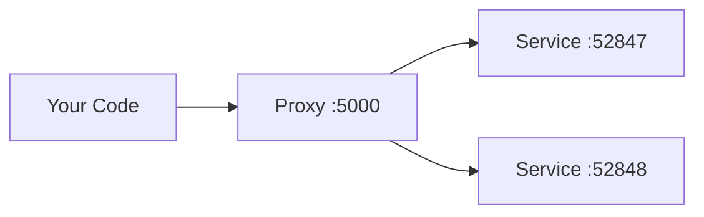

import { Aside, Tabs, TabItem } from '@astrojs/starlight/components';
import LearnMore from '@components/LearnMore.astro';
import { Image } from 'astro:assets';
import networkingProxies from '@assets/fundamentals/networking/networking-proxies-1x.png';
import proxyWithReplicas from '@assets/fundamentals/networking/proxy-with-replicas-1x.png';
import proxyHostPortAndRandomPort from '@assets/fundamentals/networking/proxy-host-port-and-random-port-1x.png';
import proxyWithRandomPorts from '@assets/fundamentals/networking/proxy-with-random-ports-1x.png';
import proxyWithDockerPortMapping from '@assets/fundamentals/networking/proxy-with-docker-port-mapping-1x.png';

One of the advantages of developing with Aspire is that it enables you to develop, test, and debug cloud-native apps locally. Inner-loop networking is a key aspect of Aspire that allows your apps to communicate with each other in your development environment. In this article, you learn how Aspire handles various networking scenarios with proxies, endpoints, endpoint configurations, and container networking.

## The proxy mental model

Think of Aspire's networking like a hotel front desk:

- **Clients** (your code calling APIs) always talk to the **front desk** (proxy) at a known, stable address
- The front desk routes requests to the **actual room** (your service) wherever it happens to be
- If you have **multiple rooms** (replicas), the front desk handles which one to connect to

This design solves several problems:

| Problem              | How the proxy helps                                                                       |
| -------------------- | ----------------------------------------------------------------------------------------- |
| **Port conflicts**   | Two services can't both use port 5000—but the proxy can allocate different ports for each |
| **Replicas**         | Multiple instances of a service need load balancing—the proxy handles this automatically  |
| **Service restarts** | When a service restarts on a new port, the proxy's address stays the same                 |



<Aside type="tip" title="Key insight">
  You never need to know the actual port your service runs on. Just use the
  proxy address, and Aspire handles the rest.
</Aside>

## Networking in the inner loop

The inner loop is the process of developing and testing your app locally before deploying it to a target environment. Aspire provides several tools and features to simplify and enhance the networking experience in the inner loop, such as:

- **Endpoints/Endpoint configurations**: Endpoints are the connections between your app and the services it depends on, such as databases, message queues, or APIs. Endpoints provide information such as the service name, host port, scheme, and environment variable. Aspire can create endpoints automatically from resource configuration, and you can also add them explicitly by calling `WithEndpoint`.
- **Proxies**: Aspire automatically launches a proxy for each service binding you add to your app, and assigns a port for the proxy to listen on. The proxy then forwards the requests to the port that your app listens on, which might be different from the proxy port. This way, you can avoid port conflicts and access your app and services using consistent and predictable URLs.
- **Container networks**: Aspire creates and manages dedicated networks for container resources so containers can discover and communicate with each other during local development.

## How endpoints work

A service binding in Aspire involves two integrations: a **service** representing an external resource your app requires (for example, a database, message queue, or API), and a **binding** that establishes a connection between your app and the service and provides necessary information.

Aspire can create service bindings automatically from resource configuration, and you can create additional bindings explicitly by using `WithEndpoint`.

Upon creating a binding, whether implicit or explicit, Aspire launches a lightweight reverse proxy on a specified port, handling routing and load balancing for requests from your app to the service. The proxy is an Aspire implementation detail, requiring no configuration or management concern.

To help visualize how endpoints work, consider the Aspire starter templates inner-loop networking diagram:

<Image
  src={networkingProxies}
  alt="Aspire Starter Application template inner loop networking diagram."
/>

## How container networks are managed

When you add one or more container resources, Aspire creates a dedicated container bridge network to enable service discovery between containers. This bridge network is a virtual network that lets containers communicate with each other and provides a DNS server for container-to-container service discovery using DNS names.

The network's lifetime depends on the container resources:

- If all containers have a session lifetime, the network is also session-based and is cleaned up when the AppHost process ends.
- If any container has a persistent lifetime, the network is persistent and remains running after the AppHost process terminates. Aspire reuses this network on subsequent runs, allowing persistent containers to keep communicating even when the AppHost isn't running.

For more information on container lifetimes, see [Persistent container lifetimes](/app-host/persistent-containers/).

Here are the naming conventions for container networks:

- **Session networks**: `aspire-session-network-<unique-id>-<app-host-name>`
- **Persistent networks**: `aspire-persistent-network-<project-hash>-<app-host-name>`

Each AppHost instance gets its own network resources. The only differences are the network's lifetime and name; service discovery works the same way for both.

Containers register themselves on the network using their resource name. Aspire uses this name for service discovery between containers. For example, a `pgadmin` container can connect to a database resource named `postgres` using `postgres:5432`.

<Aside type="note">
  Host services, such as projects or other executables, don't use container
  networks. They rely on exposed container ports for service discovery and
  communication with containers. For more details on service discovery, see
  [service discovery](/fundamentals/service-discovery/).
</Aside>

### Container network aliases

By default, containers are accessible on the container network using their **resource name** as a DNS alias. For example, a container added with `AddContainer("mydb", ...)` is reachable at `mydb:5432` from other containers.

Sometimes you need additional aliases—for example, when a third-party tool expects a specific hostname, or when migrating from an existing Docker Compose setup. Use `WithContainerNetworkAlias` to add custom DNS names:

<Tabs syncKey="aspire-lang">
<TabItem id="csharp" label="C#">

```csharp title="AppHost.cs"
var redis = builder.AddRedis("cache")
    .WithContainerNetworkAlias("redis-primary")
    .WithContainerNetworkAlias("session-store");
```

</TabItem>
<TabItem id="typescript" label="TypeScript">

```typescript title="apphost.ts" twoslash
import { createBuilder } from './.modules/aspire.js';

const builder = await createBuilder();

const redis = await builder.addRedis('cache');
await redis.withContainerNetworkAlias('redis-primary');
await redis.withContainerNetworkAlias('session-store');
```

</TabItem>
</Tabs>

Now other containers can connect to Redis using any of these names:

- `cache:6379` (default resource name)
- `redis-primary:6379` (custom alias)
- `session-store:6379` (custom alias)

<Aside type="tip" title="When to use network aliases">
  - **Third-party integrations**: Some tools hardcode hostnames like `redis` or
  `postgres` - **Migration from Docker Compose**: Match existing service names
  your apps expect - **Multi-purpose containers**: One Redis instance serving as
  both cache and session store
</Aside>

When containers need to reach host-based services, Aspire uses the **container tunnel** to provide reliable connectivity. For more information, see [Container networking](/fundamentals/container-networking/).

Some endpoint behavior depends on the resource type. Keep those details with the docs for that resource type instead of duplicating them in this overview.

<LearnMore>
  For .NET-specific endpoint behavior, see [C# launch
  profiles](/integrations/dotnet/launch-profiles/) and [Project
  resources](/integrations/dotnet/project-resources/).
</LearnMore>

## Ports and proxies

When defining a service binding, the host port is _always_ given to the proxy that sits in front of the service. This allows single or multiple replicas of a service to behave similarly. Additionally, all resource dependencies that use the `WithReference` API rely of the proxy endpoint from the environment variable.

The same proxy pattern applies when a service runs multiple replicas. The browser still connects to one stable host port while the proxy fans out traffic to whichever replica is available:

The preceding code results in the following networking diagram:

<Image
  src={proxyWithReplicas}
  alt="Aspire frontend app networking diagram with specific host port and two replicas."
/>

The preceding diagram depicts the following:

- A web browser as an entry point to the app.
- A host port of 5066.
- The frontend proxy sitting between the web browser and the frontend service replicas, listening on port 5066.
- The `frontend_0` frontend service replica listening on the randomly assigned port 65001.
- The `frontend_1` frontend service replica listening on the randomly assigned port 65002.

For a JavaScript app that reads its listener port from an environment variable, expose a stable host port like this:

<Tabs syncKey="aspire-lang">
<TabItem id="csharp" label="C#">

```csharp title="AppHost.cs"
builder.AddJavaScriptApp("frontend", "./frontend")
       .WithHttpEndpoint(port: 5066, env: "PORT");
```

</TabItem>
<TabItem id="typescript" label="TypeScript">

```typescript title="apphost.ts" twoslash
import { createBuilder } from './.modules/aspire.js';

const builder = await createBuilder();

const frontend = await builder.addJavaScriptApp('frontend', './frontend');
await frontend.withHttpEndpoint({ port: 5066, env: 'PORT' });
```

</TabItem>
</Tabs>

There are two ports defined:

- A host port of 5066.
- A random proxy port that the underlying service will be bound to.

<Image
  src={proxyHostPortAndRandomPort}
  alt="Aspire frontend app networking diagram with specific host port and random port."
/>

The preceding diagram depicts the following:

- A web browser as an entry point to the app.
- A host port of 5066.
- The frontend proxy sitting between the web browser and the frontend service, listening on port 5066.
- The frontend service listening on random port of 65001.

The underlying service still listens on its own port, and Aspire makes that allocated port available to the app through the `PORT` environment variable.

<Aside type="tip">
  To avoid an endpoint being proxied, set the `IsProxied` property to `false`
  when calling the `WithEndpoint` extension method. For more information, see
  [Endpoint extensions: additional considerations](#additional-considerations).
</Aside>

## Omit the host port

When you omit the host port, Aspire generates a random port for both host and service port. This is useful when you want to avoid port conflicts and don't care about the host or service port. Consider the following code:

<Tabs syncKey="aspire-lang">
<TabItem id="csharp" label="C#">

```csharp title="AppHost.cs"
builder.AddJavaScriptApp("frontend", "./frontend")
       .WithHttpEndpoint(env: "PORT");
```

</TabItem>
<TabItem id="typescript" label="TypeScript">

```typescript title="apphost.ts" twoslash
import { createBuilder } from './.modules/aspire.js';

const builder = await createBuilder();

const frontend = await builder.addJavaScriptApp('frontend', './frontend');
await frontend.withHttpEndpoint({ env: 'PORT' });
```

</TabItem>
</Tabs>

In this scenario, both the host and service ports are random, as shown in the following diagram:

<Image
  src={proxyWithRandomPorts}
  alt="Aspire frontend app networking diagram with random host port and proxy port."
/>

The preceding diagram depicts the following:

- A web browser as an entry point to the app.
- A random host port of 65000.
- The frontend proxy sitting between the web browser and the frontend service, listening on port 65000.
- The frontend service listening on a random port of 65001.

## Container ports

When you add a container resource, Aspire automatically assigns a random port to the container. To specify a container port, configure the container resource with the desired port:

<Tabs syncKey="aspire-lang">
<TabItem id="csharp" label="C#">

```csharp title="AppHost.cs"
builder.AddContainer("frontend", "mcr.microsoft.com/dotnet/samples", "aspnetapp")
           .WithHttpEndpoint(port: 8000, targetPort: 8080);
```

</TabItem>
<TabItem id="typescript" label="TypeScript">

```typescript title="apphost.ts" twoslash
import { createBuilder } from './.modules/aspire.js';

const builder = await createBuilder();

const frontend = await builder.addContainer('frontend', {
  image: 'mcr.microsoft.com/dotnet/samples',
  tag: 'aspnetapp',
});
await frontend.withHttpEndpoint({ port: 8000, targetPort: 8080 });
```

</TabItem>
</Tabs>

The preceding code:

- Creates a container resource named `frontend`, from the `mcr.microsoft.com/dotnet/samples:aspnetapp` image.
- Exposes an `http` endpoint by binding the host to port 8000 and mapping it to the container's port 8080.

Consider the following diagram:

<Image
  src={proxyWithDockerPortMapping}
  alt="Aspire frontend app networking diagram with a docker host."
/>

## Endpoint extension methods

Any resource that implements the `IResourceWithEndpoints` interface can use the `WithEndpoint` extension methods. There are several overloads of this extension, allowing you to specify the scheme, container port, host port, environment variable name, and whether the endpoint is proxied.

There's also an overload that allows you to specify a delegate to configure the endpoint. This is useful when you need to configure the endpoint based on the environment or other factors. Consider the following code:

```csharp title="AppHost.cs"
builder.AddContainer("apiService", "nginx")
       .WithEndpoint(
             endpointName: "admin",
             callback: static endpoint =>
        {
            endpoint.Port = 17003;
           endpoint.UriScheme = "http";
           endpoint.Transport = "http";
       });
```

The preceding code provides a callback delegate to configure the endpoint. The endpoint is named `admin` and configured to use the `http` scheme and transport, as well as the 17003 host port. Consumers can reference this endpoint by name with a URI such as `http://_admin.apiservice`. The `_` sentinel indicates that the `admin` segment is the endpoint name belonging to the `apiservice` service. For more information, see [Service discovery](/fundamentals/service-discovery/).

<Aside type="note">
  TypeScript AppHost supports configuring endpoints with option objects, but the
  callback overload that mutates `EndpointAnnotation` isn't yet available.
</Aside>

### Additional considerations

When calling the `WithEndpoint` extension method, the `callback` overload exposes the raw `EndpointAnnotation`, which allows the consumer to customize many aspects of the endpoint.

The `AllocatedEndpoint` property allows you to get or set the endpoint for a service. The `IsExternal` and `IsProxied` properties determine how the endpoint is managed and exposed: `IsExternal` decides if it should be publicly accessible, while `IsProxied` ensures DCP manages it, allowing for internal port differences and replication.

<Aside type="tip">
  If you're hosting an external executable that runs its own proxy and
  encounters port binding issues due to DCP already binding the port, try
  setting the `IsProxied` property to `false`. This prevents DCP from managing
  the proxy, allowing your executable to bind the port successfully.
</Aside>

The `Name` property identifies the service, whereas the `Port` and `TargetPort` properties specify the desired and listening ports, respectively.

For network communication, the `Protocol` property supports **TCP** and **UDP**, with potential for more in the future, and the `Transport` property indicates the transport protocol (**HTTP**, **HTTP2**, **HTTP3**). Lastly, if the service is URI-addressable, the `UriScheme` property provides the URI scheme for constructing the service URI.

For more information, see the available properties of the [EndpointAnnotation properties](https://learn.microsoft.com/dotnet/api/aspire.hosting.applicationmodel.endpointannotation#properties).

For project-resource-specific endpoint filtering, see [Project resources](/integrations/dotnet/project-resources/).

### Excluding endpoints from service discovery

By default, every endpoint on a resource is included when another resource references it via `WithReference(resource)`. Some resources expose auxiliary endpoints—such as admin dashboards or health-check ports—that consumer services should not discover automatically. Use the `ExcludeReferenceEndpoint` property on `EndpointAnnotation` to opt an endpoint out of the default reference set:

```csharp title="AppHost.cs"
builder.AddContainer("myservice", "myimage")
    .WithHttpEndpoint(name: "management", port: 8080)
    .WithEndpoint("management", ep => ep.ExcludeReferenceEndpoint = true);
```

<Aside type="note">
  TypeScript AppHost support for setting `ExcludeReferenceEndpoint` isn't yet
  available.
</Aside>

When `ExcludeReferenceEndpoint` is `true`, the endpoint is **not** injected into dependent services by a plain `WithReference(resource)` call. It can still be referenced explicitly by name:

```csharp title="AppHost.cs"
var myService = builder.AddContainer("myservice", "myimage")
    .WithHttpEndpoint(name: "api", port: 5000)
    .WithHttpEndpoint(name: "management", port: 8080)
    .WithEndpoint("management", ep => ep.ExcludeReferenceEndpoint = true);

// Consumer only gets the "api" endpoint — "management" is excluded
var api = builder.AddProject<Projects.Api>("api")
    .WithReference(myService);

// Opt in explicitly when the management endpoint is actually needed
var adminApp = builder.AddProject<Projects.Admin>("admin")
    .WithReference(myService.GetEndpoint("management"));
```

<Aside type="note">
  TypeScript AppHost support for resolving a specific named endpoint with
  `GetEndpoint` isn't yet available.
</Aside>

The following built-in Aspire integrations already apply this pattern to their auxiliary endpoints:

| Resource                   | Excluded endpoint                        |
| -------------------------- | ---------------------------------------- |
| Keycloak                   | Management dashboard (`management`)      |
| Azure Cosmos DB Emulator   | Health-check endpoint (`emulatorHealth`) |
| Azure Event Hubs Emulator  | Health-check endpoint (`emulatorHealth`) |
| Azure Service Bus Emulator | Health-check endpoint (`emulatorHealth`) |

:::note
`ExcludeReferenceEndpoint` defaults to `false`. Existing endpoints continue to behave as before unless the property is explicitly set to `true`.
:::

## Troubleshooting

### Port already in use

**Symptom**: Error message like `Address already in use` or `Failed to bind to port`

**Common causes**:

- Another instance of your app is still running
- A previous Aspire session didn't shut down cleanly
- Another application is using the same port

**Solutions**:

1. Stop any running Aspire sessions with `Ctrl+C` or close the dashboard
2. Check for processes using the port: `netstat -ano | findstr :5000` (Windows) or `lsof -i :5000` (macOS/Linux)
3. Let Aspire assign random ports by removing explicit port numbers from `WithEndpoint`

### Can't connect to container

**Symptom**: Timeouts or connection refused when connecting to a container resource

**Common causes**:

- The container hasn't finished starting
- Missing `WaitFor()` dependency
- Container is on the container network but you're connecting from the host

**Solutions**:

1. Add `.WaitFor(container)` to ensure the container is ready before dependent services start
2. Add `.WithHttpHealthCheck()` or `.WithHealthCheck()` to the container resource
3. Ensure host services use the **exposed port** (not the container's internal port):

<Tabs syncKey="aspire-lang">
<TabItem id="csharp" label="C#">

```csharp
// Container exposes port 5432 to host
var db = builder.AddPostgres("db");

// Host service connects via exposed port (handled by WithReference)
var api = builder.AddJavaScriptApp("api", "./api")
    .WithHttpEndpoint(env: "PORT")
    .WithReference(db); // Correct - uses exposed port
```

</TabItem>
<TabItem id="typescript" label="TypeScript">

```typescript
// Container exposes port 5432 to host
const db = await builder.addPostgres('db');

// Host service connects via exposed port (handled by withReference)
const api = await builder.addJavaScriptApp('api', './api');
await api.withHttpEndpoint({ env: 'PORT' });
await api.withReference(db); // Correct - uses exposed port
```

</TabItem>
</Tabs>

### Service not discoverable

**Symptom**: Service discovery fails with "service not found" or DNS resolution errors

**Solutions**:

1. Verify `WithReference()` is set up between producer and consumer
2. Check the endpoint name in the URI matches exactly (case-sensitive)
3. Review [service discovery troubleshooting](/fundamentals/service-discovery/#troubleshooting)
