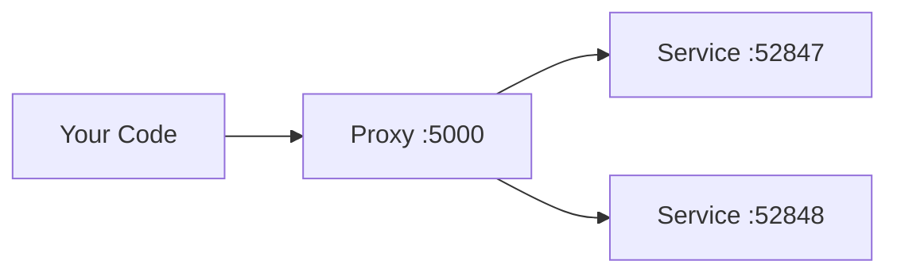

import AppHostTabs from '@components/AppHostTabs.astro';

import { Aside } from '@astrojs/starlight/components';
import { Kbd } from 'starlight-kbd/components';
import LearnMore from '@components/LearnMore.astro';
import { Image } from 'astro:assets';
import networkingProxies from '@assets/fundamentals/networking/networking-proxies-1x.png';
import proxyWithReplicas from '@assets/fundamentals/networking/proxy-with-replicas-1x.png';
import proxyHostPortAndRandomPort from '@assets/fundamentals/networking/proxy-host-port-and-random-port-1x.png';
import proxyWithRandomPorts from '@assets/fundamentals/networking/proxy-with-random-ports-1x.png';
import proxyWithDockerPortMapping from '@assets/fundamentals/networking/proxy-with-docker-port-mapping-1x.png';

One of the advantages of developing with Aspire is that it enables you to develop, test, and debug cloud-native apps locally. Inner-loop networking is a key aspect of Aspire that allows your apps to communicate with each other in your development environment. In this article, you learn how Aspire handles various networking scenarios with proxies, endpoints, endpoint configurations, and container networking.

## The proxy mental model

Think of Aspire's networking like a hotel front desk:

- **Clients** (your code calling APIs) always talk to the **front desk** (proxy) at a known, stable address
- The front desk routes requests to the **actual room** (your service) wherever it happens to be
- If you have **multiple rooms** (replicas), the front desk handles which one to connect to

This design solves several problems:

| Problem              | How the proxy helps                                                                       |
| -------------------- | ----------------------------------------------------------------------------------------- |
| **Port conflicts**   | Two services can't both use port 5000—but the proxy can allocate different ports for each |
| **Replicas**         | Multiple instances of a service need load balancing—the proxy handles this automatically  |
| **Service restarts** | When a service restarts on a new port, the proxy's address stays the same                 |


```mermaid
flowchart LR
    Client["Your Code"]
    Proxy["Proxy :5000"]
    App1["Service :52847"]
    App2["Service :52848"]

    Client --> Proxy
    Proxy --> App1
    Proxy --> App2
```

<Aside type="tip" title="Key insight">
  You never need to know the actual port your service runs on. Just use the
  proxy address, and Aspire handles the rest.
</Aside>

## Networking in the inner loop

The inner loop is the process of developing and testing your app locally before deploying it to a target environment. Aspire provides several tools and features to simplify and enhance the networking experience in the inner loop, such as:

- **Endpoints/Endpoint configurations**: Endpoints are the connections between your app and the services it depends on, such as databases, message queues, or APIs. Endpoints provide information such as the service name, host port, scheme, and environment variable. Aspire can create endpoints automatically from resource configuration, and you can also add them explicitly by calling `WithEndpoint`.
- **Proxies**: Aspire automatically launches a proxy for each proxied service binding you add to your app, and assigns a port for the proxy to listen on. The proxy then forwards the requests to the port that your app listens on, which might be different from the proxy port. This way, you can avoid port conflicts and access your app and services using consistent and predictable URLs.
- **Proxyless endpoints**: Endpoints with `IsProxied` set to `false` connect directly to the resource instead of routing through an Aspire-managed proxy. Starting in Aspire 13.4, endpoints on persistent executables and projects are proxyless by default. Persistent containers use proxied endpoints by default, the same as session containers.
- **Container networks**: Aspire creates and manages dedicated networks for container resources so containers can discover and communicate with each other during local development.

## How endpoints work

A service binding in Aspire involves two integrations: a **service** representing an external resource your app requires (for example, a database, message queue, or API), and a **binding** that establishes a connection between your app and the service and provides necessary information.

Aspire can create service bindings automatically from resource configuration, and you can create additional bindings explicitly by using `WithEndpoint`.

Upon creating a proxied binding, whether implicit or explicit, Aspire launches a lightweight reverse proxy on a specified port, handling routing and load balancing for requests from your app to the service. The proxy is an Aspire implementation detail, requiring no configuration or management concern.

To help visualize how endpoints work, consider the Aspire starter templates inner-loop networking diagram:

<Image
  src={networkingProxies}
  alt="Aspire Starter Application template inner loop networking diagram."
/>

## How container networks are managed

When you add one or more container resources, Aspire creates a dedicated container bridge network to enable service discovery between containers. This bridge network is a virtual network that lets containers communicate with each other and provides a DNS server for container-to-container service discovery using DNS names.

The network's lifetime depends on the container resources:

- If all containers have a session lifetime, the network is also session-based and is cleaned up when the AppHost process ends.
- If any container has a persistent lifetime, the network is persistent and remains running after the AppHost process terminates. Aspire reuses this network on subsequent runs, allowing persistent containers to keep communicating even when the AppHost isn't running.

For more information on resource lifetimes, see [Resource lifetimes](/app-host/resource-lifetimes/).

Here are the naming conventions for container networks:

- **Session networks**: `aspire-session-network-<unique-id>-<app-host-name>`
- **Persistent networks**: `aspire-persistent-network-<project-hash>-<app-host-name>`

Each AppHost instance gets its own network resources. The only differences are the network's lifetime and name; service discovery works the same way for both.

Containers register themselves on the network using their resource name. Aspire uses this name for service discovery between containers. For example, a `pgadmin` container can connect to a database resource named `postgres` using `postgres:5432`.

<Aside type="note">
  Host services, such as projects or other executables, don't use container
  networks. They rely on exposed container ports for service discovery and
  communication with containers. For more details on service discovery, see
  [service discovery](/fundamentals/service-discovery/).
</Aside>

### Container network aliases

By default, containers are accessible on the container network using their **resource name** as a DNS alias. For example, a container added with `AddContainer("mydb", ...)` is reachable at `mydb:5432` from other containers.

Sometimes you need additional aliases—for example, when a third-party tool expects a specific hostname, or when migrating from an existing Docker Compose setup. Use `WithContainerNetworkAlias` to add custom DNS names:

<AppHostTabs limitations={{
  python: 'The verified Python SDK does not include the Redis integration method used by this example.',
  go: 'The verified Go SDK does not include the Redis integration method used by this example.',
  java: 'The verified Java SDK does not include the Redis integration method used by this example.',
  rust: 'The verified Rust SDK does not include the Redis integration method used by this example.',
}}>
<Fragment slot="csharp">

```csharp title="AppHost.cs"
var redis = builder.AddRedis("cache")
    .WithContainerNetworkAlias("redis-primary")
    .WithContainerNetworkAlias("session-store");
```

</Fragment>
<Fragment slot="typescript">

```typescript title="apphost.mts" twoslash
import { createBuilder } from './.aspire/modules/aspire.mjs';

const builder = await createBuilder();

const redis = await builder.addRedis('cache');
await redis.withContainerNetworkAlias('redis-primary');
await redis.withContainerNetworkAlias('session-store');
```

</Fragment>
</AppHostTabs>

Now other containers can connect to Redis using any of these names:

- `cache:6379` (default resource name)
- `redis-primary:6379` (custom alias)
- `session-store:6379` (custom alias)

<Aside type="tip" title="When to use network aliases">
  - **Third-party integrations**: Some tools hardcode hostnames like `redis` or
  `postgres` - **Migration from Docker Compose**: Match existing service names
  your apps expect - **Multi-purpose containers**: One Redis instance serving as
  both cache and session store
</Aside>

When containers need to reach host-based services, Aspire uses the **container tunnel** to provide reliable connectivity. For more information, see [Container networking](/fundamentals/container-networking/).

Some endpoint behavior depends on the resource type. Keep those details with the docs for that resource type instead of duplicating them in this overview.

<LearnMore>
  For .NET-specific endpoint behavior, see [C# launch
  profiles](/integrations/dotnet/launch-profiles/) and [Project
  resources](/integrations/dotnet/project-resources/).
</LearnMore>

## Ports and proxies

When defining a proxied service binding, the host port is given to the proxy that sits in front of the service. This allows single or multiple replicas of a service to behave similarly. Additionally, resource dependencies that use the `WithReference` API rely on the proxied endpoint from the environment variable unless the endpoint is configured as proxyless.

The same proxy pattern applies when a service runs multiple replicas. The browser still connects to one stable host port while the proxy fans out traffic to whichever replica is available:

The preceding code results in the following networking diagram:

<Image
  src={proxyWithReplicas}
  alt="Aspire frontend app networking diagram with specific host port and two replicas."
/>

The preceding diagram depicts the following:

- A web browser as an entry point to the app.
- A host port of 5066.
- The frontend proxy sitting between the web browser and the frontend service replicas, listening on port 5066.
- The `frontend_0` frontend service replica listening on the randomly assigned port 65001.
- The `frontend_1` frontend service replica listening on the randomly assigned port 65002.

For a JavaScript app that reads its listener port from an environment variable, expose a stable host port like this:

<AppHostTabs limitations={{
  python: 'The verified Python SDK does not include the JavaScript hosting integration method used by this example.',
  go: 'The verified Go SDK does not include the JavaScript hosting integration method used by this example.',
  java: 'The verified Java SDK does not include the JavaScript hosting integration method used by this example.',
  rust: 'The verified Rust SDK does not include the JavaScript hosting integration method used by this example.',
}}>
<Fragment slot="csharp">

```csharp title="AppHost.cs"
builder.AddJavaScriptApp("frontend", "./frontend")
       .WithHttpEndpoint(port: 5066, env: "PORT");
```

</Fragment>
<Fragment slot="typescript">

```typescript title="apphost.mts" twoslash
import { createBuilder } from './.aspire/modules/aspire.mjs';

const builder = await createBuilder();

const frontend = await builder.addJavaScriptApp('frontend', './frontend');
await frontend.withHttpEndpoint({ port: 5066, env: 'PORT' });
```

</Fragment>
</AppHostTabs>

There are two ports defined:

- A host port of 5066.
- A random proxy port that the underlying service will be bound to.

<Image
  src={proxyHostPortAndRandomPort}
  alt="Aspire frontend app networking diagram with specific host port and random port."
/>

The preceding diagram depicts the following:

- A web browser as an entry point to the app.
- A host port of 5066.
- The frontend proxy sitting between the web browser and the frontend service, listening on port 5066.
- The frontend service listening on random port of 65001.

The underlying service still listens on its own port, and Aspire makes that allocated port available to the app through the `PORT` environment variable.

<Aside type="tip">
  To avoid an endpoint being proxied, set the `IsProxied` property to `false`
  when calling the `WithEndpoint` extension method. Proxyless endpoints require
  a target port. For more information, see [Proxyless
  endpoints](#proxyless-endpoints).
</Aside>

### Proxyless endpoints

Most endpoints are proxied by default. A proxyless endpoint skips the Aspire-managed proxy and exposes the resource's listener directly. Use a proxyless endpoint when a proxy would interfere with the resource's lifetime or networking behavior.

Starting in Aspire 13.4, endpoints on persistent executables and projects are proxyless by default. This lets the persistent resource keep using its direct endpoint across AppHost runs instead of depending on a new proxy instance each time. This also ensures that the ports your service is reachable on stay stable whether the AppHost is running or not. Persistent containers use proxied endpoints by default, the same as session containers, so integrations that depend on endpoint allocation before startup continue to work.

The following example configures a proxyless HTTP endpoint for an nginx container:

<AppHostTabs>
<Fragment slot="csharp">

```csharp title="AppHost.cs"
builder.AddContainer("web", "nginx")
    .WithHttpEndpoint(targetPort: 80, isProxied: false);
```

</Fragment>
<Fragment slot="typescript">

```typescript title="apphost.mts" twoslash
import { createBuilder } from './.aspire/modules/aspire.mjs';

const builder = await createBuilder();

const web = await builder.addContainer('web', {
  image: 'nginx',
  tag: 'latest',
});
await web.withHttpEndpoint({ targetPort: 80, isProxied: false });
```

</Fragment>
<Fragment slot="python">

```python title="apphost.py"
from aspire_app import create_builder

with create_builder() as builder:
    web = builder.add_container("web", "nginx")
    web.with_http_endpoint(target_port=80, is_proxied=False)
    builder.run()
```

</Fragment>
<Fragment slot="go">

```go title="apphost.go"
package main

import (
	"log"

	"apphost/modules/aspire"
)

func main() {
	builder, err := aspire.CreateBuilder()
	if err != nil {
		log.Fatal(aspire.FormatError(err))
	}

	web := builder.
		AddContainer("web", "nginx").
		WithHttpEndpoint(&aspire.WithHttpEndpointOptions{
			TargetPort: aspire.Float64Ptr(80),
			IsProxied: aspire.BoolPtr(false),
		})
	if err := web.Err(); err != nil {
		log.Fatal(aspire.FormatError(err))
	}

	app, err := builder.Build()
	if err != nil {
		log.Fatal(aspire.FormatError(err))
	}
	if err := app.Run(); err != nil {
		log.Fatal(aspire.FormatError(err))
	}
}
```

</Fragment>
<Fragment slot="java">

```java title="AppHost.java"
import aspire.*;

void main() throws Exception {
    var builder = DistributedApplication.CreateBuilder();

    var web = builder.addContainer("web", "nginx");
    web.withHttpEndpoint(
        new WithHttpEndpointOptions().targetPort(80).isProxied(false));

    builder.build().run();
}
```

</Fragment>
<Fragment slot="rust">

```rust title="apphost.rs"
#[path = ".aspire/modules/mod.rs"]
mod aspire;

use aspire::*;
use serde_json::json;

fn main() -> Result<(), Box<dyn std::error::Error>> {
    let builder = create_builder(None)?;

    let web = builder.add_container("web", json!("nginx"))?;
    web.with_http_endpoint(None, Some(80.0), None, None, Some(false))?;

    let app = builder.build()?;
    app.run(None)?;
    Ok(())
}
```

</Fragment>
</AppHostTabs>

### Allocate ports for dynamic proxyless endpoints

Proxyless endpoints can omit the public host `port`. Starting in Aspire 13.5, Aspire allocates a public host port for each dynamic proxyless endpoint before workload resources are created. The allocated port is then available to configuration that resolves endpoint properties, such as `GetEndpoint(...).Property(EndpointProperty.Port)`.

If you set `port`, Aspire uses that value as the public host port. If you omit `port`, Aspire allocates one from the proxyless endpoint port range. The default range is `10000-32767`, and you can override it with the `ASPIRE_PROXYLESS_ENDPOINT_PORT_RANGE` environment variable in `start-end` format. Container endpoints still require `targetPort` so Aspire knows which port inside the container receives traffic.

This lets you write patterns like the following, where a container exposes its allocated public port in an environment variable:

<AppHostTabs>
<Fragment slot="csharp">

```csharp title="AppHost.cs"
var database = builder.AddContainer("database", "image")
    .WithEndpoint(name: "tcp", targetPort: 5432, isProxied: false);

database.WithEnvironment("PUBLIC_PORT", database.GetEndpoint("tcp").Property(EndpointProperty.Port));
```

</Fragment>
<Fragment slot="typescript">

```typescript title="apphost.mts" twoslash
import { EndpointProperty, createBuilder } from './.aspire/modules/aspire.mjs';

const builder = await createBuilder();

const database = await builder.addContainer('database', {
  image: 'image',
  tag: 'latest',
});
await database.withEndpoint({ name: 'tcp', targetPort: 5432, isProxied: false });

await database.withEnvironment('PUBLIC_PORT', database.getEndpoint('tcp').property(EndpointProperty.Port));
```

</Fragment>
<Fragment slot="python">

```python title="apphost.py"
from aspire_app import create_builder

with create_builder() as builder:
    database = builder.add_container("database", "image")
    database.with_endpoint(
        name="tcp", target_port=5432, is_proxied=False
    )
    public_port = database.get_endpoint("tcp").property("Port")
    database.with_env("PUBLIC_PORT", public_port)
    builder.run()
```

</Fragment>
<Fragment slot="go">

```go title="apphost.go"
package main

import (
	"log"

	"apphost/modules/aspire"
)

func main() {
	builder, err := aspire.CreateBuilder()
	if err != nil {
		log.Fatal(aspire.FormatError(err))
	}

	database := builder.
		AddContainer("database", "image").
		WithEndpoint(&aspire.WithEndpointOptions{
			Name:       aspire.StringPtr("tcp"),
			TargetPort: aspire.Float64Ptr(5432),
			IsProxied:  aspire.BoolPtr(false),
		})
	database.WithEnvironment(
		"PUBLIC_PORT",
		database.GetEndpoint("tcp").Property(aspire.EndpointPropertyPort),
	)
	if err := database.Err(); err != nil {
		log.Fatal(aspire.FormatError(err))
	}

	app, err := builder.Build()
	if err != nil {
		log.Fatal(aspire.FormatError(err))
	}
	if err := app.Run(); err != nil {
		log.Fatal(aspire.FormatError(err))
	}
}
```

</Fragment>
<Fragment slot="java">

```java title="AppHost.java"
import aspire.*;

void main() throws Exception {
    var builder = DistributedApplication.CreateBuilder();

    var database = builder.addContainer("database", "image");
    database.withEndpoint(new WithEndpointOptions()
        .name("tcp")
        .targetPort(5432)
        .isProxied(false));
    database.withEnvironment(
        "PUBLIC_PORT",
        database.getEndpoint("tcp").property(EndpointProperty.PORT));

    builder.build().run();
}
```

</Fragment>
<Fragment slot="rust">

```rust title="apphost.rs"
#[path = ".aspire/modules/mod.rs"]
mod aspire;

use aspire::*;
use serde_json::json;

fn main() -> Result<(), Box<dyn std::error::Error>> {
    let builder = create_builder(None)?;

    let database = builder.add_container("database", json!("image"))?;
    database.with_endpoint(
        None,
        Some(5432.0),
        None,
        Some("tcp"),
        None,
        Some(false),
        None,
        None,
    )?;
    let public_port = database
        .get_endpoint("tcp")?
        .property(EndpointProperty::Port)?;
    database.with_environment(
        "PUBLIC_PORT",
        serialize_handle(&public_port),
    )?;

    let app = builder.build()?;
    app.run(None)?;
    Ok(())
}
```

</Fragment>
</AppHostTabs>

In this example, `PUBLIC_PORT` is set to the endpoint's allocated public host port before the container is created. Because the endpoint is proxyless and doesn't specify `port`, Aspire allocates a port from the proxyless endpoint port range.

:::note
For persistent resources, Aspire stores allocated proxyless endpoint ports in user secrets when user secrets are available and reuses them on later AppHost runs. If Aspire can't persist the allocated port, configure a fixed public `port` or use a proxied endpoint to avoid recreating the persistent resource on each run.
:::

## Omit the host port

For proxied endpoints, when you omit the host port, Aspire generates a random port for both host and service port. This is useful when you want to avoid port conflicts and don't care about the host or service port. Consider the following code:

<AppHostTabs limitations={{
  python: 'The verified Python SDK does not include the JavaScript hosting integration method used by this example.',
  go: 'The verified Go SDK does not include the JavaScript hosting integration method used by this example.',
  java: 'The verified Java SDK does not include the JavaScript hosting integration method used by this example.',
  rust: 'The verified Rust SDK does not include the JavaScript hosting integration method used by this example.',
}}>
<Fragment slot="csharp">

```csharp title="AppHost.cs"
builder.AddJavaScriptApp("frontend", "./frontend")
       .WithHttpEndpoint(env: "PORT");
```

</Fragment>
<Fragment slot="typescript">

```typescript title="apphost.mts" twoslash
import { createBuilder } from './.aspire/modules/aspire.mjs';

const builder = await createBuilder();

const frontend = await builder.addJavaScriptApp('frontend', './frontend');
await frontend.withHttpEndpoint({ env: 'PORT' });
```

</Fragment>
</AppHostTabs>

In this scenario, both the host and service ports are random, as shown in the following diagram:

<Image
  src={proxyWithRandomPorts}
  alt="Aspire frontend app networking diagram with random host port and proxy port."
/>

The preceding diagram depicts the following:

- A web browser as an entry point to the app.
- A random host port of 65000.
- The frontend proxy sitting between the web browser and the frontend service, listening on port 65000.
- The frontend service listening on a random port of 65001.

## Container ports

When you add a container resource, Aspire automatically assigns a random port to the container. To specify a container port, configure the container resource with the desired port:

<AppHostTabs>
<Fragment slot="csharp">

```csharp title="AppHost.cs"
builder.AddContainer("frontend", "mcr.microsoft.com/dotnet/samples", "aspnetapp")
           .WithHttpEndpoint(port: 8000, targetPort: 8080);
```

</Fragment>
<Fragment slot="typescript">

```typescript title="apphost.mts" twoslash
import { createBuilder } from './.aspire/modules/aspire.mjs';

const builder = await createBuilder();

const frontend = await builder.addContainer('frontend', {
  image: 'mcr.microsoft.com/dotnet/samples',
  tag: 'aspnetapp',
});
await frontend.withHttpEndpoint({ port: 8000, targetPort: 8080 });
```

</Fragment>
<Fragment slot="python">

```python title="apphost.py"
from aspire_app import create_builder

with create_builder() as builder:
    frontend = builder.add_container(
        "frontend", "mcr.microsoft.com/dotnet/samples:aspnetapp"
    )
    frontend.with_http_endpoint(port=8000, target_port=8080)
    builder.run()
```

</Fragment>
<Fragment slot="go">

```go title="apphost.go"
package main

import (
	"log"

	"apphost/modules/aspire"
)

func main() {
	builder, err := aspire.CreateBuilder()
	if err != nil {
		log.Fatal(aspire.FormatError(err))
	}

	frontend := builder.
		AddContainer("frontend", "mcr.microsoft.com/dotnet/samples:aspnetapp").
		WithHttpEndpoint(&aspire.WithHttpEndpointOptions{
			Port:       aspire.Float64Ptr(8000),
			TargetPort: aspire.Float64Ptr(8080),
		})
	if err := frontend.Err(); err != nil {
		log.Fatal(aspire.FormatError(err))
	}

	app, err := builder.Build()
	if err != nil {
		log.Fatal(aspire.FormatError(err))
	}
	if err := app.Run(); err != nil {
		log.Fatal(aspire.FormatError(err))
	}
}
```

</Fragment>
<Fragment slot="java">

```java title="AppHost.java"
import aspire.*;

void main() throws Exception {
    var builder = DistributedApplication.CreateBuilder();

    var frontend = builder.addContainer(
        "frontend", "mcr.microsoft.com/dotnet/samples:aspnetapp");
    frontend.withHttpEndpoint(
        new WithHttpEndpointOptions().port(8000).targetPort(8080));

    builder.build().run();
}
```

</Fragment>
<Fragment slot="rust">

```rust title="apphost.rs"
#[path = ".aspire/modules/mod.rs"]
mod aspire;

use aspire::*;
use serde_json::json;

fn main() -> Result<(), Box<dyn std::error::Error>> {
    let builder = create_builder(None)?;

    let frontend = builder.add_container(
        "frontend",
        json!("mcr.microsoft.com/dotnet/samples:aspnetapp"),
    )?;
    frontend.with_http_endpoint(
        Some(8000.0),
        Some(8080.0),
        None,
        None,
        None,
    )?;

    let app = builder.build()?;
    app.run(None)?;
    Ok(())
}
```

</Fragment>
</AppHostTabs>

The preceding code:

- Creates a container resource named `frontend`, from the `mcr.microsoft.com/dotnet/samples:aspnetapp` image.
- Exposes an `http` endpoint by binding the host to port 8000 and mapping it to the container's port 8080.

Consider the following diagram:

<Image
  src={proxyWithDockerPortMapping}
  alt="Aspire frontend app networking diagram with a docker host."
/>

## Endpoint extension methods

Any resource that implements the `IResourceWithEndpoints` interface can use the `WithEndpoint` extension methods. There are several overloads of this extension, allowing you to specify the scheme, container port, host port, environment variable name, and whether the endpoint is proxied.

There's also an overload that allows you to specify a delegate to configure the endpoint. This is useful when you need to configure the endpoint based on the environment or other factors. Consider the following code:

<AppHostTabs limitations={{
  rust: 'The Rust SDK currently emits the endpoint callback as Fn(Vec<Value>) -> Value instead of a typed EndpointUpdateContext callback, so this shape is not usable as canonical Rust code.',
}}>
<Fragment slot="csharp">

```csharp title="AppHost.cs"
builder.AddContainer("apiService", "nginx")
    .WithEndpoint(
        endpointName: "admin",
        callback: static endpoint =>
        {
            endpoint.Port = 17003;
            endpoint.UriScheme = "http";
            endpoint.Transport = "http";
        });
```

</Fragment>
<Fragment slot="typescript">

```typescript title="apphost.mts" twoslash
import { createBuilder } from './.aspire/modules/aspire.mjs';

const builder = await createBuilder();

const apiService = await builder.addContainer('apiService', {
  image: 'nginx',
  tag: 'latest',
});
await apiService.withEndpointCallback(
  'admin',
  async (endpoint) => {
    endpoint.setPort(17003).setUriScheme('http').setTransport('http');
  },
  { createIfNotExists: true }
);
```

</Fragment>
<Fragment slot="python">

```python title="apphost.py"
from aspire_app import create_builder

with create_builder() as builder:
    api_service = builder.add_container("apiService", "nginx")

    def configure_admin(endpoint):
        endpoint.port = 17003
        endpoint.uri_scheme = "http"
        endpoint.transport = "http"

    api_service.with_endpoint_callback(
        "admin", configure_admin, create_if_not_exists=True
    )
    builder.run()
```

</Fragment>
<Fragment slot="go">

```go title="apphost.go"
package main

import (
	"log"

	"apphost/modules/aspire"
)

func main() {
	builder, err := aspire.CreateBuilder()
	if err != nil {
		log.Fatal(aspire.FormatError(err))
	}

	apiService := builder.AddContainer("apiService", "nginx")
	apiService.WithEndpointCallback(
		"admin",
		func(endpoint aspire.EndpointUpdateContext) {
			endpoint.
				SetPort(aspire.Float64Ptr(17003)).
				SetUriScheme("http").
				SetTransport("http")
		},
		&aspire.WithEndpointCallbackOptions{CreateIfNotExists: aspire.BoolPtr(true)},
	)
	if err := apiService.Err(); err != nil {
		log.Fatal(aspire.FormatError(err))
	}

	app, err := builder.Build()
	if err != nil {
		log.Fatal(aspire.FormatError(err))
	}
	if err := app.Run(); err != nil {
		log.Fatal(aspire.FormatError(err))
	}
}
```

</Fragment>
<Fragment slot="java">

```java title="AppHost.java"
import aspire.*;

void main() throws Exception {
    var builder = DistributedApplication.CreateBuilder();

    var apiService = builder.addContainer("apiService", "nginx");
    apiService.withEndpointCallback(
        "admin",
        endpoint -> endpoint
            .setPort(17003)
            .setUriScheme("http")
            .setTransport("http"),
        true);

    builder.build().run();
}
```

</Fragment>
</AppHostTabs>

The preceding code provides a callback delegate to configure the endpoint. The endpoint is named `admin` and configured to use the `http` scheme and transport, as well as the 17003 host port. Consumers can reference this endpoint by name with a URI such as `http://_admin.apiservice`. The `_` sentinel indicates that the `admin` segment is the endpoint name belonging to the `apiservice` service. For more information, see [Service discovery](/fundamentals/service-discovery/).

### Additional considerations

When calling the `WithEndpoint` extension method, the `callback` overload exposes the raw `EndpointAnnotation`, which allows the consumer to customize many aspects of the endpoint.

The `AllocatedEndpoint` property allows you to get or set the endpoint for a service. The `IsExternal` and `IsProxied` properties determine how the endpoint is managed and exposed: `IsExternal` decides if it should be publicly accessible, while `IsProxied` ensures DCP manages it, allowing for internal port differences and replication.

<Aside type="tip">
  If you're hosting an external executable that runs its own proxy and
  encounters port binding issues due to DCP already binding the port, try
  setting the `IsProxied` property to `false`. This prevents DCP from managing
  the proxy, allowing your executable to bind the port successfully. Set
  `TargetPort` on the endpoint so Aspire knows which port the executable listens
  on.
</Aside>

The `Name` property identifies the service, whereas the `Port` and `TargetPort` properties specify the desired and listening ports, respectively. `TargetPort` is required for proxyless endpoints, including endpoints with `IsProxied` set to `false` and, starting in Aspire 13.4, endpoints on persistent executables and projects by default.

For network communication, the `Protocol` property supports **TCP** and **UDP**, with potential for more in the future, and the `Transport` property indicates the transport protocol (**HTTP**, **HTTP2**, **HTTP3**). Lastly, if the service is URI-addressable, the `UriScheme` property provides the URI scheme for constructing the service URI.

For more information, see the available properties of the [EndpointAnnotation properties](https://learn.microsoft.com/dotnet/api/aspire.hosting.applicationmodel.endpointannotation#properties).

For project-resource-specific endpoint filtering, see [Project resources](/integrations/dotnet/project-resources/).

### Excluding endpoints from service discovery

By default, every endpoint on a resource is included when another resource references it via `WithReference(resource)`. Some resources expose auxiliary endpoints—such as admin dashboards or health-check ports—that consumer services should not discover automatically. Use the `ExcludeReferenceEndpoint` property on `EndpointAnnotation` to opt an endpoint out of the default reference set:

<AppHostTabs limitations={{
  rust: 'The Rust SDK currently emits the endpoint callback as Fn(Vec<Value>) -> Value instead of a typed EndpointUpdateContext callback, so this shape is not usable as canonical Rust code.',
}}>
<Fragment slot="csharp">

```csharp title="AppHost.cs"
builder.AddContainer("myservice", "myimage")
    .WithHttpEndpoint(name: "management", port: 8080)
    .WithEndpoint("management", ep => ep.ExcludeReferenceEndpoint = true);
```

</Fragment>
<Fragment slot="typescript">

```typescript title="apphost.mts" twoslash
import { createBuilder } from './.aspire/modules/aspire.mjs';

const builder = await createBuilder();

const myService = await builder.addContainer('myservice', {
  image: 'myimage',
  tag: 'latest',
});
await myService.withHttpEndpoint({ name: 'management', port: 8080 });
await myService.withEndpointCallback('management', async (endpoint) => {
  endpoint.setExcludeReferenceEndpoint(true);
});
```

</Fragment>
<Fragment slot="python">

```python title="apphost.py"
from aspire_app import create_builder

with create_builder() as builder:
    service = builder.add_container("myservice", "myimage")
    service.with_http_endpoint(name="management", port=8080)

    def exclude_management(endpoint):
        endpoint.exclude_reference_endpoint = True

    service.with_endpoint_callback("management", exclude_management)
    builder.run()
```

</Fragment>
<Fragment slot="go">

```go title="apphost.go"
package main

import (
	"log"

	"apphost/modules/aspire"
)

func main() {
	builder, err := aspire.CreateBuilder()
	if err != nil {
		log.Fatal(aspire.FormatError(err))
	}

	service := builder.
		AddContainer("myservice", "myimage").
		WithHttpEndpoint(&aspire.WithHttpEndpointOptions{
			Name: aspire.StringPtr("management"),
			Port: aspire.Float64Ptr(8080),
		})
	service.WithEndpointCallback(
		"management",
		func(endpoint aspire.EndpointUpdateContext) {
			endpoint.SetExcludeReferenceEndpoint(true)
		},
	)
	if err := service.Err(); err != nil {
		log.Fatal(aspire.FormatError(err))
	}

	app, err := builder.Build()
	if err != nil {
		log.Fatal(aspire.FormatError(err))
	}
	if err := app.Run(); err != nil {
		log.Fatal(aspire.FormatError(err))
	}
}
```

</Fragment>
<Fragment slot="java">

```java title="AppHost.java"
import aspire.*;

void main() throws Exception {
    var builder = DistributedApplication.CreateBuilder();

    var service = builder.addContainer("myservice", "myimage");
    service.withHttpEndpoint(
        new WithHttpEndpointOptions().name("management").port(8080));
    service.withEndpointCallback(
        "management",
        endpoint -> endpoint.setExcludeReferenceEndpoint(true));

    builder.build().run();
}
```

</Fragment>
</AppHostTabs>

When `ExcludeReferenceEndpoint` is `true`, the endpoint is **not** injected into dependent services by a plain `WithReference(resource)` call. It can still be referenced explicitly by name:

<AppHostTabs limitations={{
  rust: 'The Rust SDK currently emits the endpoint callback as Fn(Vec<Value>) -> Value instead of a typed EndpointUpdateContext callback, so this endpoint-exclusion sample is not usable as canonical Rust code.',
}}>
<Fragment slot="csharp">

```csharp title="AppHost.cs"
var myService = builder.AddContainer("myservice", "myimage")
    .WithHttpEndpoint(name: "api", port: 5000)
    .WithHttpEndpoint(name: "management", port: 8080)
    .WithEndpoint("management", ep => ep.ExcludeReferenceEndpoint = true);

// Consumer only gets the "api" endpoint — "management" is excluded
var api = builder.AddProject<Projects.Api>("api")
    .WithReference(myService);

// Opt in explicitly when the management endpoint is actually needed
var adminApp = builder.AddProject<Projects.Admin>("admin")
    .WithReference(myService.GetEndpoint("management"));
```

</Fragment>
<Fragment slot="typescript">

```typescript title="apphost.mts" twoslash
import { createBuilder } from './.aspire/modules/aspire.mjs';

const builder = await createBuilder();

const myService = await builder.addContainer('myservice', {
  image: 'myimage',
  tag: 'latest',
});
await myService.withHttpEndpoint({ name: 'api', port: 5000 });
await myService.withHttpEndpoint({ name: 'management', port: 8080 });
await myService.withEndpointCallback('management', async (endpoint) => {
  endpoint.setExcludeReferenceEndpoint(true);
});

const api = await builder.addProject('api', '../Api/Api.csproj');
await api.withReference(myService);

const adminApp = await builder.addProject('admin', '../Admin/Admin.csproj');
await adminApp.withReference(myService.getEndpoint('management'));
```

</Fragment>
<Fragment slot="python">

```python title="apphost.py"
from aspire_app import create_builder

with create_builder() as builder:
    service = builder.add_container("myservice", "myimage")
    service.with_http_endpoint(name="api", port=5000)
    service.with_http_endpoint(name="management", port=8080)

    def exclude_management(endpoint):
        endpoint.exclude_reference_endpoint = True

    service.with_endpoint_callback("management", exclude_management)

    api = builder.add_project("api", "../Api/Api.csproj")
    api.with_reference(service)

    admin = builder.add_project("admin", "../Admin/Admin.csproj")
    admin.with_reference(service.get_endpoint("management"))
    builder.run()
```

</Fragment>
<Fragment slot="go">

```go title="apphost.go"
package main

import (
	"log"

	"apphost/modules/aspire"
)

func main() {
	builder, err := aspire.CreateBuilder()
	if err != nil {
		log.Fatal(aspire.FormatError(err))
	}

	service := builder.
		AddContainer("myservice", "myimage").
		WithHttpEndpoint(&aspire.WithHttpEndpointOptions{
			Name: aspire.StringPtr("api"),
			Port: aspire.Float64Ptr(5000),
		}).
		WithHttpEndpoint(&aspire.WithHttpEndpointOptions{
			Name: aspire.StringPtr("management"),
			Port: aspire.Float64Ptr(8080),
		})
	service.WithEndpointCallback(
		"management",
		func(endpoint aspire.EndpointUpdateContext) {
			endpoint.SetExcludeReferenceEndpoint(true)
		},
	)

	api := builder.AddProject("api", "../Api/Api.csproj").WithReference(service)
	admin := builder.
		AddProject("admin", "../Admin/Admin.csproj").
		WithReference(service.GetEndpoint("management"))
	if err := api.Err(); err != nil {
		log.Fatal(aspire.FormatError(err))
	}
	if err := admin.Err(); err != nil {
		log.Fatal(aspire.FormatError(err))
	}

	app, err := builder.Build()
	if err != nil {
		log.Fatal(aspire.FormatError(err))
	}
	if err := app.Run(); err != nil {
		log.Fatal(aspire.FormatError(err))
	}
}
```

</Fragment>
<Fragment slot="java">

```java title="AppHost.java"
import aspire.*;

void main() throws Exception {
    var builder = DistributedApplication.CreateBuilder();

    var service = builder.addContainer("myservice", "myimage");
    service.withHttpEndpoint(
        new WithHttpEndpointOptions().name("api").port(5000));
    service.withHttpEndpoint(
        new WithHttpEndpointOptions().name("management").port(8080));
    service.withEndpointCallback(
        "management",
        endpoint -> endpoint.setExcludeReferenceEndpoint(true));

    var api = builder.addProject("api", "../Api/Api.csproj");
    api.withReference(service);

    var admin = builder.addProject("admin", "../Admin/Admin.csproj");
    admin.withReference(service.getEndpoint("management"));

    builder.build().run();
}
```

</Fragment>
</AppHostTabs>

The following built-in Aspire integrations already apply this pattern to their auxiliary endpoints:

| Resource                   | Excluded endpoint                        |
| -------------------------- | ---------------------------------------- |
| Keycloak                   | Management dashboard (`management`)      |
| Azure Cosmos DB Emulator   | Health-check endpoint (`emulatorHealth`) |
| Azure Event Hubs Emulator  | Health-check endpoint (`emulatorHealth`) |
| Azure Service Bus Emulator | Health-check endpoint (`emulatorHealth`) |

:::note
`ExcludeReferenceEndpoint` defaults to `false`. Existing endpoints continue to behave as before unless the property is explicitly set to `true`.
:::

## Troubleshooting

### Port already in use

**Symptom**: Error message like `Address already in use` or `Failed to bind to port`

**Common causes**:

- Another instance of your app is still running
- A previous Aspire session didn't shut down cleanly
- Another application is using the same port

**Solutions**:
1. Stop any running Aspire sessions with <Kbd windows="Ctrl+C" mac="⌃+C" linux="Ctrl+C" /> or close the dashboard
2. Check for processes using the port: `netstat -ano | findstr :5000` (Windows) or `lsof -i :5000` (macOS/Linux)
3. Let Aspire assign random ports by removing explicit port numbers from `WithEndpoint`

### Can't connect to container

**Symptom**: Timeouts or connection refused when connecting to a container resource

**Common causes**:

- The container hasn't finished starting
- Missing `WaitFor()` dependency
- Container is on the container network but you're connecting from the host

**Solutions**:

1. Add `.WaitFor(container)` to ensure the container is ready before dependent services start
2. Add `.WithHttpHealthCheck()` or `.WithHealthCheck()` to the container resource
3. Ensure host services use the **exposed port** (not the container's internal port):

<AppHostTabs limitations={{
  python: 'The verified Python SDK does not include the JavaScript and PostgreSQL integration methods used by this example.',
  go: 'The verified Go SDK does not include the JavaScript and PostgreSQL integration methods used by this example.',
  java: 'The verified Java SDK does not include the JavaScript and PostgreSQL integration methods used by this example.',
  rust: 'The verified Rust SDK does not include the JavaScript and PostgreSQL integration methods used by this example.',
}}>
<Fragment slot="csharp">

```csharp
// Container exposes port 5432 to host
var db = builder.AddPostgres("db");

// Host service connects via exposed port (handled by WithReference)
var api = builder.AddJavaScriptApp("api", "./api")
    .WithHttpEndpoint(env: "PORT")
    .WithReference(db); // Correct - uses exposed port
```

</Fragment>
<Fragment slot="typescript">

```typescript
// Container exposes port 5432 to host
const db = await builder.addPostgres('db');

// Host service connects via exposed port (handled by withReference)
const api = await builder.addJavaScriptApp('api', './api');
await api.withHttpEndpoint({ env: 'PORT' });
await api.withReference(db); // Correct - uses exposed port
```

</Fragment>
</AppHostTabs>

### Service not discoverable

**Symptom**: Service discovery fails with "service not found" or DNS resolution errors

**Solutions**:

1. Verify `WithReference()` is set up between producer and consumer
2. Check the endpoint name in the URI matches exactly (case-sensitive)
3. Review [service discovery troubleshooting](/fundamentals/service-discovery/#troubleshooting)
