import { Aside, Code, FileTree, Steps, TabItem, Tabs } from '@astrojs/starlight/components';
import LearnMore from '@components/LearnMore.astro';
import SimpleAppHostCode from '@components/SimpleAppHostCode.astro';
import PivotSelector from '@components/PivotSelector.astro';
import Pivot from '@components/Pivot.astro';

Aspire's AppHost is the code-first place where you declare your application's services and their relationships. Instead of managing scattered configuration files, you describe the architecture in code. Aspire then handles local orchestration so you can focus on building features.

<PivotSelector
    title="Select your API platform"
    key="lang"
    options={[
        { id: "csharp", title: "C#" },
        { id: "python", title: "Python" },
        { id: "nodejs", title: "Node.js" },
        { id: "go", title: "Go" },
        { id: "java", title: "Java" },
    ]}
/>

## Defining your architecture

Consider a simple three-tier architecture where the front end talks to an API, and the API talks to a database:

```mermaid
architecture-beta

  service db(logos:postgresql)[PostgreSQL]
  service api(logos:dotnet)[API service]
  service frontend(logos:react)[React front end]

  api:R --> L:db
  frontend:R --> L:api
```

<Pivot id="csharp">

This architecture demonstrates a **.NET API** connecting to a **PostgreSQL database**, with a **React front end** consuming the API. The .NET API uses ASP.NET Core and connects to PostgreSQL using Entity Framework or a connection string. The React front end is built with Vite and communicates with the API over HTTP.

To build this architecture step-by-step, see the [Build your first app](/get-started/first-app/?lang=csharp) quickstart.

</Pivot>
<Pivot id="python">

This architecture demonstrates a **Python API** (using FastAPI/Uvicorn) connecting to a **PostgreSQL database**, with a **React front end** consuming the API. The Python API uses frameworks like FastAPI or Flask and connects to PostgreSQL using libraries like psycopg2 or SQLAlchemy. The React front end is built with Vite and communicates with the API over HTTP.

To build this architecture step-by-step, see the [Build your first app](/get-started/first-app/?lang=python) quickstart.

<Aside type="tip">
The Python integration is provided by the [CommunityToolkit.Aspire.Hosting.Python.Extensions](https://www.nuget.org/packages/CommunityToolkit.Aspire.Hosting.Python.Extensions) NuGet package. Learn more in the [Python integration](/integrations/frameworks/python/) documentation.
</Aside>

</Pivot>
<Pivot id="nodejs">

This architecture demonstrates a **Node.js API** connecting to a **PostgreSQL database**, with a **React front end** consuming the API. The Node.js API uses frameworks like Express or Fastify and connects to PostgreSQL using libraries like pg or Prisma. The React front end is built with Vite and communicates with the API over HTTP.

<Aside type="tip">
The JavaScript/Node.js integration is provided by the [Aspire.Hosting.JavaScript](https://www.nuget.org/packages/Aspire.Hosting.JavaScript) NuGet package. Learn more in the [JavaScript integration](/integrations/frameworks/javascript/) documentation.
</Aside>

</Pivot>
<Pivot id="go">

This architecture demonstrates a **Go API** connecting to a **PostgreSQL database**, with a **React front end** consuming the API. The Go API uses the standard library's `net/http` package or frameworks like Gin or Echo and connects to PostgreSQL using libraries like pgx or database/sql. The React front end is built with Vite and communicates with the API over HTTP.

<Aside type="tip">
The Go integration is provided by the [CommunityToolkit.Aspire.Hosting.Golang](https://www.nuget.org/packages/CommunityToolkit.Aspire.Hosting.Golang) NuGet package. Learn more in the [Go integration](/integrations/frameworks/go-apps/) documentation.
</Aside>

</Pivot>
<Pivot id="java">

This architecture demonstrates a **Java API** (using Spring Boot) connecting to a **PostgreSQL database**, with a **React front end** consuming the API. The Java API uses Spring Boot with Spring Data JPA and connects to PostgreSQL using JDBC or Spring Data. The React front end is built with Vite and communicates with the API over HTTP.

<Aside type="tip">
The Java integration is provided by the [CommunityToolkit.Aspire.Hosting.Java](https://www.nuget.org/packages/CommunityToolkit.Aspire.Hosting.Java) NuGet package. Learn more in the [Java integration](/integrations/frameworks/java/) documentation.
</Aside>

</Pivot>

You can represent that architecture in an AppHost like this:

<Pivot id="csharp">
<SimpleAppHostCode lang="csharp" />
</Pivot>
<Pivot id="python">
<SimpleAppHostCode lang="python" />
</Pivot>
<Pivot id="nodejs">
<SimpleAppHostCode lang="nodejs" />
</Pivot>
<Pivot id="go">
<SimpleAppHostCode lang="go" />
</Pivot>
<Pivot id="java">
<SimpleAppHostCode lang="java" />
</Pivot>

The AppHost models your distributed application declaratively. Each tab above shows the same three-tier architecture—**PostgreSQL database**, **API service**, and **React front end**—but with different API implementations. Switching tabs changes only the API resource type:

<Pivot id="csharp">

Uses `AddProject<Projects.Api>()` to reference a .NET project.

</Pivot>
<Pivot id="python">

Uses `AddUvicornApp()` with `WithUv()` for ASGI apps like FastAPI.

</Pivot>
<Pivot id="nodejs">

Uses `AddNodeApp()` with `WithNpm()` for Node.js applications.

</Pivot>
<Pivot id="go">

Uses `AddGolangApp()` for Go applications.

</Pivot>
<Pivot id="java">

Uses `AddSpringApp()` for Spring Boot applications.

</Pivot>

In all cases, the PostgreSQL database and React front end remain identical. Aspire's `WithReference()` method establishes dependencies between resources, and `WaitFor()` ensures services start in the correct order.

Aspire presents the same, consistent model regardless of the language or framework used: services, resources, and the connections between them.

### Dissecting the AppHost code

Below we highlight the key parts of a typical AppHost to explain what each step does.

<Pivot id="csharp">
<SimpleAppHostCode lang="csharp" collapse={['3-16']} />
</Pivot>
<Pivot id="python">
<SimpleAppHostCode lang="python" collapse={['3-17']} />
</Pivot>
<Pivot id="nodejs">
<SimpleAppHostCode lang="nodejs" collapse={['3-17']} />
</Pivot>
<Pivot id="go">
<SimpleAppHostCode lang="go" collapse={['3-17']} />
</Pivot>
<Pivot id="java">
<SimpleAppHostCode lang="java" collapse={['3-17']} />
</Pivot>

In the non-collapsed lines you:

<Steps>

1. Create the distributed application builder with `DistributedApplication.CreateBuilder(args)`.
1. Call `Build()` to materialize the configuration into a runnable AppHost.
1. Call `Run()` to start orchestration; services launch in dependency order.

</Steps>

The AppHost is the blueprint for your distributed application—Aspire manages the rest.

#### Adding a PostgreSQL resource

With the builder ready, define resources and services. The snippet below shows how to add a PostgreSQL server and a database:

<Pivot id="csharp">
<SimpleAppHostCode lang="csharp" mark={{ range: '4-6' }} collapse={['8-17']} />
</Pivot>
<Pivot id="python">
<SimpleAppHostCode lang="python" mark={{ range: '4-6' }} collapse={['8-18']} />
</Pivot>
<Pivot id="nodejs">
<SimpleAppHostCode lang="nodejs" mark={{ range: '4-6' }} collapse={['8-18']} />
</Pivot>
<Pivot id="go">
<SimpleAppHostCode lang="go" mark={{ range: '4-6' }} collapse={['8-18']} />
</Pivot>
<Pivot id="java">
<SimpleAppHostCode lang="java" mark={{ range: '4-6' }} collapse={['8-18']} />
</Pivot>

How this works:

- `AddPostgres("db")` registers a PostgreSQL container named `db`.
  - This returns an `IResourceBuilder<PostgresServerResource>` so you can chain configuration fluent-style.
- `.AddDatabase("appdata")` creates a database named `appdata` on that server.
- `.WithDataVolume()` provisions a volume so data persists across container restarts.

<LearnMore>
  Learn more about the official [PostgreSQL integration](/integrations/databases/postgres/postgres-get-started/).
</LearnMore>

#### Adding an API resource and declaring a dependency

Next, register the API service and wire it to the PostgreSQL resource:

<Pivot id="csharp">
<SimpleAppHostCode lang="csharp" mark={{ range: '9-11' }} collapse={['1-6', '13-17']} />
</Pivot>
<Pivot id="python">
<SimpleAppHostCode lang="python" mark={{ range: '9-12' }} collapse={['1-6', '14-18']} />
</Pivot>
<Pivot id="nodejs">
<SimpleAppHostCode lang="nodejs" mark={{ range: '9-12' }} collapse={['1-6', '14-18']} />
</Pivot>
<Pivot id="go">
<SimpleAppHostCode lang="go" mark={{ range: '9-12' }} collapse={['1-6', '14-18']} />
</Pivot>
<Pivot id="java">
<SimpleAppHostCode lang="java" mark={{ range: '9-12' }} collapse={['1-6', '14-18']} />
</Pivot>

What this does:

<Pivot id="csharp">

- `AddProject<Projects.Api>("api")` registers the API project as a service named `api`.
- `WithReference(postgres)` injects connection details (host, port, credentials, connection string) into the API configuration.
- `WaitFor(postgres)` delays the API startup until PostgreSQL is healthy, avoiding brittle startup timing issues.

</Pivot>
<Pivot id="python">

- `AddUvicornApp("api", "../api", "main:app")` registers a Uvicorn-based Python app as a service named `api`, pointing to the `main:app` entry point.
- `WithUv()` configures the app to use the [uv](https://docs.astral.sh/uv/) package manager for dependency installation.
- `WithReference(postgres)` injects connection details into the API configuration.
- `WaitFor(postgres)` delays the API startup until PostgreSQL is healthy.

</Pivot>
<Pivot id="nodejs">

- `AddNodeApp("api", "../api", "server.js")` registers a Node.js app as a service named `api`, with `server.js` as the entry point.
- `WithNpm()` configures the app to use npm for dependency installation.
- `WithReference(postgres)` injects connection details into the API configuration.
- `WaitFor(postgres)` delays the API startup until PostgreSQL is healthy.

</Pivot>
<Pivot id="go">

- `AddGolangApp("api", "../api")` registers a Go app as a service named `api`.
- `WithHttpEndpoint(env: "PORT")` configures the port and sets the PORT environment variable.
- `WithReference(postgres)` injects connection details into the API configuration.
- `WaitFor(postgres)` delays the API startup until PostgreSQL is healthy.

</Pivot>
<Pivot id="java">

- `AddSpringApp("api", "../api", "../agents/opentelemetry-javaagent.jar")` registers a Spring Boot app as a service named `api`, specifying the OpenTelemetry agent path.
- `WithHttpEndpoint(port: 8080)` exposes the Spring Boot app on port 8080.
- `WithReference(postgres)` injects connection details into the API configuration.
- `WaitFor(postgres)` delays the API startup until PostgreSQL is healthy.

</Pivot>

Now that the `api` service is defined, you can attach the front end.

#### Adding a front end resource

Register the front end project, declare its dependency on the API, and let the AppHost provide the API address automatically.

<Aside type="note">
This example uses a Node.js (React) front end, but Aspire treats front ends as executable services—any language or framework works.
</Aside>

<Pivot id="csharp">
<SimpleAppHostCode lang="csharp" mark={{ range: '14-16' }} collapse={['1-11']} />
</Pivot>
<Pivot id="python">
<SimpleAppHostCode lang="python" mark={{ range: '15-17' }} collapse={['1-12']} />
</Pivot>
<Pivot id="nodejs">
<SimpleAppHostCode lang="nodejs" mark={{ range: '15-17' }} collapse={['1-12']} />
</Pivot>
<Pivot id="go">
<SimpleAppHostCode lang="go" mark={{ range: '15-17' }} collapse={['1-12']} />
</Pivot>
<Pivot id="java">
<SimpleAppHostCode lang="java" mark={{ range: '15-17' }} collapse={['1-12']} />
</Pivot>

Key points:

- `.AddViteApp("front end", "../frontend")` registers the (Vite-based) front end project as a service named `front end`.
- `.WithHttpEndpoint(env: "PORT", targetPort: 3000)` exposes the app on port `3000`; the `PORT` environment variable can override it.
- `.WithReference(api)` injects the API base address into the front end configuration.

In short: define the backend first (DB → API), then point the UI at the API. The AppHost captures the dependency graph, connection flows, and startup order.

#### Configuration and networking

These dependencies and connections are automatically managed by Aspire. The AppHost generates configuration values like connection strings and endpoints, injecting them into services as needed. in the AppHost when you add resources, you name them (e.g., `db`, `api`, `front end`); Aspire uses these names for DNS resolution, so services can communicate using predictable addresses. Consuming services also rely on these names for configuration injection.

```mermaid
architecture-beta

  service db(logos:postgresql)[pg]
  service epr(iconoir:server-connection)[Endpoint Reference]
  service api(logos:dotnet)[api]
  service ctr(iconoir:server-connection)[Connection String Reference]
  service frontend(logos:react)[front end]

  db:L <-- R:ctr
  ctr:L <-- R:api
  api:L <-- R:epr
  epr:L <-- R:frontend
```

<Pivot id="csharp">

The .NET API receives a **ConnectionStringReference** from PostgreSQL and publishes an **EndpointReference** that the React front end consumes. This creates a clear dependency chain: `PostgreSQL → .NET API → React front end`.

</Pivot>
<Pivot id="python">

The Python API receives a **ConnectionStringReference** from PostgreSQL and publishes an **EndpointReference** that the React front end consumes. This creates a clear dependency chain: `PostgreSQL → Python API → React front end`.

</Pivot>
<Pivot id="nodejs">

The Node.js API receives a **ConnectionStringReference** from PostgreSQL and publishes an **EndpointReference** that the React front end consumes. This creates a clear dependency chain: `PostgreSQL → Node.js API → React front end`.

</Pivot>
<Pivot id="go">

The Go API receives a **ConnectionStringReference** from PostgreSQL and publishes an **EndpointReference** that the React front end consumes. This creates a clear dependency chain: `PostgreSQL → Go API → React front end`.

</Pivot>
<Pivot id="java">

The Java API receives a **ConnectionStringReference** from PostgreSQL and publishes an **EndpointReference** that the React front end consumes. This creates a clear dependency chain: `PostgreSQL → Java API → React front end`.

</Pivot>

**How these resources communicate**

<Steps>

1. `pg` publishes a `ConnectionStringReference` (host, port, database, user, password)—a strongly typed bundle Aspire understands.
1. `api` declares a dependency on that reference; Aspire injects the connection string into its config with a unique configuration-flow process that injects settings values, including secrets, parameters, and connection strings for both local runs and deployments.
1. `api` then publishes an `EndpointReference` (its base URL) after its HTTP endpoint is allocated.
1. `front end` depends on that endpoint; Aspire injects the API base URL so no hard-coded addresses are needed.

</Steps>

<Aside type="tip">
Aspire replaces ad-hoc run scripts, scattered environment variables, and fragile copy-pasted connection strings with a single, declarative source of truth. By modeling services, resources, and their dependencies in code, it delivers typed configuration (endpoints, credentials, connection strings) directly where needed—reducing setup drift, accelerating onboarding, and letting you evolve the architecture without rewriting glue.
</Aside>

## How the AppHost works

When you run the AppHost, Aspire performs these core responsibilities:

<Steps>

1. **Service discovery**: Aspire discovers services and resources declared in the AppHost.
1. **Dependency resolution**: Services start in the correct order based on declared dependencies.
1. **Configuration injection**: Connection strings, endpoints, and other config values are injected automatically.
1. **Health monitoring**: Aspire observes service health and can restart services when necessary.

</Steps>

<LearnMore>
  Dive deeper into Aspire's orchestration and the [Resource model](/architecture/resource-model/).
</LearnMore>

## AppHost structure

The template AppHost is structured in the following ways:

<Tabs syncKey="apphost-type">
  <TabItem label="File-based AppHost" icon="seti:c-sharp">
    <FileTree>
    - **AspireApp.AppHost**
        - apphost.cs  dev-time orchestrator
        - apphost.run.json
    </FileTree>
  </TabItem>
  <TabItem label="Project-based AppHost" icon="seti:html">
    <FileTree>
    - **AspireApp.AppHost**
        - Properties
          - launchSettings.json
        - appsettings.Development.json
        - appsettings.json
        - AspireApp.AppHost.csproj
        - AppHost.cs  dev-time orchestrator
    </FileTree>
  </TabItem>
</Tabs>

## AppHost lifecycle events

You can hook into lifecycle events to run custom logic during startup and resource allocation.

<Steps>

1. `BeforeStartEvent`: Raised before the AppHost begins starting services.
1. `AfterEndpointsAllocatedEvent`: Raised after endpoints are allocated for services.
1. `AfterResourcesCreatedEvent`: Raised after all resources are created.

</Steps>

<LearnMore>
  For finer-grained lifecycle control, see the [well-known lifecycle events](/architecture/resource-model/#well-known-lifecycle-events).
</LearnMore>

## Best practices

- Keep the AppHost minimal to start; add complexity only as required.
- Define explicit dependencies with `.WithReference(...)` to make wiring obvious.
- Use separate configurations for development, testing, and production.
- Pick clear, descriptive names for resources to make debugging and logging easier.
