import { Image } from 'astro:assets';
import {
  Aside,
  Steps,
  Tabs,
  TabItem,
  FileTree,
} from '@astrojs/starlight/components';
import { Kbd } from 'starlight-kbd/components';
import Expand from '@components/Expand.astro';
import LearnMore from '@components/LearnMore.astro';
import ThemeImage from '@components/ThemeImage.astro';

import azureIcon from '@assets/icons/azure-icon.png';
import dockerIcon from '@assets/icons/docker.svg';

In this tutorial, you take the app you created in the [Build your first Aspire app — TypeScript AppHost](/get-started/first-app-typescript-apphost/) quickstart and deploy it. This can be broken down into several key steps:

<Steps>

1. [Add deployment package](#add-deployment-package) — Add the hosting package for your target.
1. [Update your AppHost](#update-your-apphost) — Configure the environment API.
1. [Deploy your app](#deploy-your-app) — Deploy using the Aspire CLI.
1. [Verify your deployment](#verify-your-deployment) — Ensure your app is running as expected.
1. [Clean up resources](#clean-up-resources) — Remove any deployed resources to avoid incurring costs.

</Steps>

The following diagram shows the architecture of the sample app you're deploying:

```mermaid
architecture-beta
  group docker(logos:docker-icon)[NodeJS and static site server container]

  service api(logos:nodejs-icon)[API service] in docker
  service http(iconoir:server-connection)[https] in docker
  service frontend(logos:react)[React front end] in docker

  frontend:L --> R:http
  http:L --> R:api
```



The React (Vite) & Express starter template consists of two resources that are deployed as a single container. The Express server hosts both the API and the static frontend files generated by React.

<LearnMore>
  This tutorial uses the **backend serves frontend** deployment model. For the
  other production patterns available to `AddViteApp` and `AddJavaScriptApp`,
  including reverse proxy and gateway/BFF approaches, see [Deploy JavaScript
  apps](/deployment/javascript-apps/).
</LearnMore>

## Prerequisites

Depending on where you want to deploy your Aspire app, ensure you have the following prerequisites installed and configured:

<Tabs syncKey="deploy-target">
  <TabItem id="docker-compose" label="Docker Compose">
    <div class="sl-flex sl-gap-4 sl-items-center sl-mb-4">
      <div>
        <Image
          src={dockerIcon}
          alt="Docker logo"
          class="icon md"
          data-zoom-off
        />
      </div>
      <ul>
        <li>
          <a href="https://www.docker.com/products/docker-desktop">Docker Desktop</a>
          {' '}installed and running.
        </li>
        <li>
          <a href="https://podman.io/getting-started/installation">Podman (alternative to Docker)</a>
          {' '}installed and running. For more information, see <a href="/get-started/prerequisites/#install-an-oci-compliant-container-runtime">OCI-compatible container runtime</a>.
        </li>
      </ul>
    </div>
  </TabItem>
  <TabItem id="azure" label="Azure">
    <div class="sl-flex sl-gap-4 sl-items-center sl-mb-4">
      <div>
        <Image src={azureIcon} alt="Azure logo" class="icon md" data-zoom-off />
      </div>
      <ul>
        <li>
          <a href="https://azure.microsoft.com/free/">Azure account</a> with an active subscription.
        </li>
        <li>
          <a href="https://learn.microsoft.com/cli/azure/install-azure-cli">Azure CLI</a>
          {' '}installed and configured. You should be logged in using <code>az login</code>.
        </li>
      </ul>
    </div>
  </TabItem>
</Tabs>

## Add deployment package

In the root directory of your Aspire app that you created in the previous quickstart, add the appropriate hosting deployment package by running the following command in your terminal:

<Tabs syncKey="deploy-target">
    <TabItem id="docker-compose" label="Docker Compose">

        [Docker Compose](https://docs.docker.com/compose/) is a tool for defining and running multi-container Docker applications. It allows you to use a YAML file to configure your application's services, networks, and volumes, making it easier to manage and deploy complex applications locally or in various environments.

        ```bash title="Aspire CLI — Add Docker Compose"
        aspire add docker
        ```

        The Aspire CLI is interactive, be sure to select the appropriate search result for the [📦 Aspire.Hosting.Docker](https://www.nuget.org/packages/Aspire.Hosting.Docker) version you want to add.

    </TabItem>
    <TabItem id="azure" label="Azure">

        ```bash title="Aspire CLI — Add Azure App Containers"
        aspire add azure-appcontainers
        ```

        The Aspire CLI is interactive, be sure to select the appropriate search result for the [📦 Aspire.Hosting.Azure.AppContainers](https://www.nuget.org/packages/Aspire.Hosting.Azure.AppContainers) version you want to add.

    </TabItem>

    If prompted for additional selections, use the <Kbd windows="↑" mac="↑" /> and <Kbd windows="↓" mac="↓" /> keys to navigate the options. Press <Kbd windows="Enter" mac="Return" /> to confirm your selection.

    <LearnMore>
    Learn more about the `aspire add` command in the [reference docs](/reference/cli/commands/aspire-add/).
    </LearnMore>

</Tabs>

## Update your AppHost

In the AppHost, chain a call to the appropriate environment API method to configure the deployment environment for your target.

<Tabs syncKey="deploy-target">
    <TabItem id="docker-compose" label="Docker Compose">

        ```typescript title="TypeScript — apphost.ts" {5-6}
        import { createBuilder } from './.modules/aspire.js';

        const builder = await createBuilder();

        // Add the following line to configure the Docker Compose environment
        await builder.addDockerComposeEnvironment("env");

        const app = await builder
            .addNodeApp("app", "./api", "src/index.ts")
            .withHttpEndpoint({ env: "PORT" })
            .withExternalHttpEndpoints();

        const frontend = await builder
            .addViteApp("frontend", "./frontend")
            .withReference(app)
            .waitFor(app);

        await app.publishWithContainerFiles(frontend, "./static");

        await builder.build().run();
        ```

        - `addDockerComposeEnvironment` — Configures the Docker Compose environment for deployment. This call implicitly adds support for containerizing resources in the AppHost as part of deployment.
        - `withExternalHttpEndpoints` — Exposes HTTP endpoints for the resource when deployed.

    </TabItem>
    <TabItem id="azure" label="Azure">

        ```typescript title="TypeScript — apphost.ts" {5-6}
        import { createBuilder } from './.modules/aspire.js';

        const builder = await createBuilder();

        // Add the following line to configure the Azure App Container environment
        await builder.addAzureContainerAppEnvironment("env");

        const app = await builder
            .addNodeApp("app", "./api", "src/index.ts")
            .withHttpEndpoint({ env: "PORT" })
            .withExternalHttpEndpoints();

        const frontend = await builder
            .addViteApp("frontend", "./frontend")
            .withReference(app)
            .waitFor(app);

        await app.publishWithContainerFiles(frontend, "./static");

        await builder.build().run();
        ```

        - `addAzureContainerAppEnvironment` — Configures the Azure App Container environment for deployment. This call implicitly adds support for containerizing resources in the AppHost as part of deployment.
        - `withExternalHttpEndpoints` — Exposes HTTP endpoints for the resource when deployed.

    </TabItem>

</Tabs>

<Aside type="tip" title="CLI protip" icon="forward-slash">
  After installing a new deployment package, you can run `aspire do diagnostics`
  in your terminal to see the available deploy steps. For more information, see
  the [aspire do diagnostics](/reference/cli/commands/aspire-do/) reference
  docs.
</Aside>

## Deploy your app

Now that you've added the deployment package and updated your AppHost, you can deploy your Aspire app.

<Tabs syncKey="deploy-target">

    <TabItem id="docker-compose" label="Docker Compose">

    Deploying to Docker Compose builds the container images and starts the services locally using Docker Compose.

    ```bash title="Aspire CLI — Deploy your app"
    aspire deploy
    ```

    Consider the following example output:

    <Expand summary="Example output for deploying Express/React app to Docker Compose"
            backgroundColor="--sl-color-bg">

    ```bash title="Aspire CLI - Deploy Express/React app with Docker Compose"
    13:23:29 (pipeline execution) → Starting pipeline execution...
    13:23:29 (publish-env) → Starting publish-env...
    13:23:29 (build-prereq) → Starting build-prereq...
    13:23:29 (deploy-prereq) → Starting deploy-prereq...
    13:23:29 (build-prereq) ✓ build-prereq completed successfully
    13:23:29 (deploy-prereq) i [INF] Initializing deployment for environment 'Production'
    13:23:29 (publish-env) i [INF] Generating Compose output
    13:23:29 (deploy-prereq) i [INF] Setting default deploy tag 'aspire-deploy-20251107192329' for compute resource(s).
    13:23:29 (deploy-prereq) ✓ deploy-prereq completed successfully
    13:23:29 (build-frontend) → Starting build-frontend...
    13:23:29 (build-frontend) i [INF] Building container image for resource frontend
    13:23:29 (build-frontend) i [INF] Building image: frontend
    13:23:29 (publish-env) → Writing the Docker Compose file to the output path.
    13:23:29 (publish-env) ✓ Docker Compose file written successfully to ./aspire-app/aspire-output/docker-compose.yaml. (0.0s)
    13:23:29 (publish-env) ✓ publish-env completed successfully
    13:23:29 (publish) → Starting publish...
    13:23:29 (publish) ✓ publish completed successfully
    13:23:51 (build-frontend) i [INF] docker buildx for frontend succeeded.
    13:23:51 (build-frontend) i [INF] Building image for frontend completed
    13:23:51 (build-frontend) ✓ build-frontend completed successfully
    13:23:51 (build-app) → Starting build-app...
    13:23:51 (build-app) i [INF] Building container image for resource app
    13:23:51 (build-app) i [INF] Building image: app
    13:24:07 (build-app) i [INF] docker buildx for app succeeded.
    13:24:07 (build-app) i [INF] Building image for app completed
    13:24:07 (build-app) ✓ build-app completed successfully
    13:24:07 (build) → Starting build...
    13:24:07 (build) ✓ build completed successfully
    13:24:07 (prepare-env) → Starting prepare-env...
    13:24:07 (prepare-env) ✓ prepare-env completed successfully
    13:24:07 (docker-compose-up-env) → Starting docker-compose-up-env...
    13:24:07 (docker-compose-up-env) → Running docker compose up for env
    13:24:13 (docker-compose-up-env) ✓ Service env is now running with Docker Compose locally (5.6s)
    13:24:13 (docker-compose-up-env) ✓ docker-compose-up-env completed successfully
    13:24:13 (print-env-dashboard-summary) → Starting print-env-dashboard-summary...
    13:24:13 (print-app-summary) → Starting print-app-summary...
    13:24:13 (print-env-dashboard-summary) i [INF] Successfully deployed env-dashboard to http://localhost:54633.
    13:24:13 (print-app-summary) i [INF] Successfully deployed app to http://localhost:54463.
    13:24:13 (print-env-dashboard-summary) ✓ print-env-dashboard-summary completed successfully
    13:24:13 (print-app-summary) ✓ print-app-summary completed successfully
    13:24:13 (deploy) → Starting deploy...
    13:24:13 (deploy) ✓ deploy completed successfully
    13:24:13 (pipeline execution) ✓ Completed successfully
    ------------------------------------------------------------
    ✓ 13/13 steps succeeded • Total time: 44.1s

    Steps Summary:
    44.0 s  ✓ pipeline execution
    22.2 s  ✓ build-frontend
    16.3 s  ✓ build-app
    5.6 s  ✓ docker-compose-up-env
    0.0 s  ✓ publish-env
    0.0 s  ✓ deploy-prereq
    0.0 s  ✓ build-prereq
    0.0 s  ✓ print-env-dashboard-summary
    0.0 s  ✓ print-app-summary
    0.0 s  ✓ deploy
    0.0 s  ✓ build
    0.0 s  ✓ prepare-env
    0.0 s  ✓ publish

    ✓ PIPELINE SUCCEEDED
    ------------------------------------------------------------
    ```

    </Expand>

    </TabItem>
    <TabItem id="azure" label="Azure">

    When deploying to Azure, the `aspire deploy` command is interactive. To avoid prompts (for example, when running in CI/CD), set the following environment variables:

    - `Azure__SubscriptionId`: Target Azure subscription ID.
    - `Azure__Location`: Azure region (for example, eastus).
    - `Azure__ResourceGroup`: Resource group name to create or reuse.

    Deploying to Azure App Containers builds the container images and deploys the services to Azure App Containers.

    ```bash title="Aspire CLI — Deploy your app"
    aspire deploy
    ```

    Consider the following example output:

    <Expand summary="Example output for deploying Express/React app to Azure App Containers"
            backgroundColor="--sl-color-bg">

    ```bash title="Aspire CLI - Deploy Express/React app to Azure App Containers"
    09:24:18 (pipeline execution) → Starting pipeline execution...
    09:24:18 (deploy-prereq) → Starting deploy-prereq...
    09:24:18 (build-prereq) → Starting build-prereq...
    09:24:18 (deploy-prereq) i [INF] Initializing deployment for environment 'Production'
    09:24:18 (build-prereq) ✓ build-prereq completed successfully
    09:24:18 (deploy-prereq) i [INF] Setting default deploy tag 'aspire-deploy-20251110152418' for compute resource(s).
    09:24:18 (deploy-prereq) ✓ deploy-prereq completed successfully
    09:24:18 (validate-azure-login) → Starting validate-azure-login...
    09:24:18 (build-frontend) → Starting build-frontend...
    09:24:18 (build-frontend) i [INF] Building container image for resource frontend
    09:24:18 (build-frontend) i [INF] Building image: frontend
    09:24:19 (validate-azure-login) ✓ Azure CLI authentication validated successfully
    09:24:19 (create-provisioning-context) → Starting create-provisioning-context...
    09:24:19 (create-provisioning-context) i [INF] Using DefaultAzureCredential for provisioning.
    09:24:22 (create-provisioning-context) ✓ create-provisioning-context completed successfully
    09:24:22 (provision-env) → Starting provision-env...
    09:24:22 (provision-env) → Deploying env
    09:24:22 (provision-env) ✓ Using existing deployment for env (0.0s)
    09:24:22 (provision-env) ✓ provision-env completed successfully
    09:24:22 (login-to-acr-env) → Starting login-to-acr-env...
    09:24:22 (build-frontend) i [INF] docker buildx for frontend succeeded.
    09:24:22 (build-frontend) i [INF] Building image for frontend completed
    09:24:22 (build-frontend) ✓ build-frontend completed successfully
    09:24:22 (build-app) → Starting build-app...
    09:24:22 (build-app) i [INF] Building container image for resource app
    09:24:22 (build-app) i [INF] Building image: app
    09:24:25 (login-to-acr-env) ✓ Successfully logged in to ACR (3.2s)
    09:24:25 (login-to-acr-env) ✓ login-to-acr-env completed successfully
    09:24:27 (build-app) i [INF] docker buildx for app succeeded.
    09:24:27 (build-app) i [INF] Building image for app completed
    09:24:27 (build-app) ✓ build-app completed successfully
    09:24:27 (push-app) → Starting push-app...
    09:24:27 (push-app) → Pushing app to ACR
    09:25:06 (push-app) ✓ Successfully pushed app to ACR (38.5s)
    09:25:06 (push-app) ✓ push-app completed successfully
    09:25:06 (provision-app-containerapp) → Starting provision-app-containerapp...
    09:25:06 (provision-app-containerapp) → Deploying app-containerapp
    09:25:29 (provision-app-containerapp) ✓ Successfully provisioned app-containerapp (23.6s)
    09:25:29 (provision-app-containerapp) ✓ provision-app-containerapp completed successfully
    09:25:29 (print-app-summary) → Starting print-app-summary...
    09:25:29 (provision-azure-bicep-resources) → Starting provision-azure-bicep-resources...
    09:25:29 (provision-azure-bicep-resources) ✓ provision-azure-bicep-resources completed successfully
    09:25:29 (print-dashboard-url-env) → Starting print-dashboard-url-env...
    09:25:29 (print-app-summary) i [INF] Successfully deployed app to {DEPLOY_URL}
    09:25:29 (print-app-summary) ✓ print-app-summary completed successfully
    09:25:29 (print-dashboard-url-env) ✓ Dashboard available at dashboard URL
    09:25:29 (deploy) → Starting deploy...
    09:25:29 (deploy) ✓ deploy completed successfully
    09:25:29 (pipeline execution) ✓ Completed successfully
    ------------------------------------------------------------
    ✓ 15/15 steps succeeded • Total time: 71.6s

    Steps Summary:
    71.5 s  ✓ pipeline execution
    38.5 s  ✓ push-app
    23.6 s  ✓ provision-app-containerapp
    4.8 s  ✓ build-frontend
    4.7 s  ✓ build-app
    3.2 s  ✓ login-to-acr-env
    3.1 s  ✓ create-provisioning-context
    1.3 s  ✓ validate-azure-login
    0.0 s  ✓ provision-env
    0.0 s  ✓ deploy-prereq
    0.0 s  ✓ print-app-summary
    0.0 s  ✓ build-prereq
    0.0 s  ✓ print-dashboard-url-env
    0.0 s  ✓ provision-azure-bicep-resources
    0.0 s  ✓ deploy

    ✓ PIPELINE SUCCEEDED
    ------------------------------------------------------------
    ```

    </Expand>

    </TabItem>

</Tabs>

When you call `aspire deploy`, the Aspire CLI builds the container images for your resources, pushes them to the target environment (if applicable), and deploys the resources according to the configuration in your AppHost.

<Aside type="note" title="Common pitfall..." icon="seti:todo">
If you call `aspire deploy` and you see output similar to the following, be sure that you've actually [updated your AppHost](#update-your-apphost) to include the appropriate environment API for your target. This output indicates that there are no deploy steps configured for your target environment.

```bash title="Aspire CLI - Empty deployment output"
14:17:26 (pipeline execution) → Starting pipeline execution...
14:17:26 (deploy) → Starting deploy...
14:17:26 (deploy) ✓ deploy completed successfully
14:17:26 (pipeline execution) ✓ Completed successfully
------------------------------------------------------------
✓ 2/2 steps succeeded • Total time: 0.0s

Steps Summary:
0.0 s  ✓ pipeline execution
0.0 s  ✓ deploy

✓ PIPELINE SUCCEEDED
------------------------------------------------------------
```

</Aside>

<LearnMore>
  Additional information about this command can be found in the [`aspire
  deploy`](/reference/cli/commands/aspire-deploy/) reference docs.
</LearnMore>

### Post deployment output

After a deployment, the Aspire CLI writes to the provided output path (or the default output path if none is provided) a set of files based on your deployment target. This may include files such as Docker Compose files, Kubernetes manifests, or cloud provider-specific configuration files.

<Tabs syncKey="deploy-target">
    <TabItem id="docker-compose" label="Docker Compose">

        <FileTree>
        - aspire-output
          - .env
          - .env.Production
          - app.Dockerfile
          - docker-compose.yaml
        </FileTree>

        The `aspire-output` directory contains the generated environment variables, an `app.Dockerfile`, and the Docker Compose configuration. The best part is, these files are opaque to you as a developer—you don't need to write them yourself!

        The `app.Dockerfile` is generated as a multi-stage Dockerfile to build the Express API and also serve the React front end:

        ```dockerfile title="./aspire-output/app.Dockerfile"
        ARG FRONTEND_IMAGENAME=frontend:latest

        FROM node:22-slim AS builder

        WORKDIR /app

        COPY package*.json ./
        RUN npm ci --production

        COPY . .

        FROM ${FRONTEND_IMAGENAME} AS frontend_stage

        FROM node:22-slim AS app

        COPY --from=frontend_stage /app/dist /app/./static
        COPY --from=builder /app /app

        USER node
        WORKDIR /app
        ENTRYPOINT ["node", "--import", "tsx", "src/index.ts"]
        ```

        Finally, the `docker-compose.yaml` file defines the service:

        ```yaml title="./aspire-output/docker-compose.yaml"
        services:
          env-dashboard:
            image: "mcr.microsoft.com/dotnet/nightly/aspire-dashboard:latest"
            expose:
            - "18888"
            - "18889"
            networks:
            - "aspire"
            restart: "always"
          app:
            image: "${APP_IMAGE}"
            environment:
            PORT: "8000"
            OTEL_EXPORTER_OTLP_ENDPOINT: "http://env-dashboard:18889"
            OTEL_EXPORTER_OTLP_PROTOCOL: "grpc"
            OTEL_SERVICE_NAME: "app"
            ports:
            - "8000"
            networks:
            - "aspire"
        networks:
          aspire:
            driver: "bridge"
        ```

    </TabItem>
    <TabItem id="azure" label="Azure">

    After deploying to Azure App Containers, the Aspire CLI saves the deployment state file to your local machine.

        <FileTree>
        - $HOME
          - .aspire/deployments/[AppHost-Sha256]/production.json
        </FileTree>

    <Aside type="tip" title="AppHost SHA256">
    The deployment state is saved in a directory named after the SHA256 hash of your full AppHost path. This ensures that deployments for different applications or versions are kept separate.
    </Aside>

    </TabItem>

</Tabs>

## Verify your deployment

import javascriptStarterDarkPng from '@assets/get-started/javascript-starter-dark.png';
import javascriptStarterLightPng from '@assets/get-started/javascript-starter-light.png';

To verify that your application is running as expected after deployment, follow the instructions for your chosen deployment target below.

<Tabs syncKey="deploy-target">
    <TabItem id="docker-compose" label="Docker Compose">

        When deploying to Docker Compose, the `aspire deploy` command displays the URLs where your services are running. Look for the `print-*-summary` steps in the deployment output, which show the localhost URLs for each service that has been configured with `withExternalHttpEndpoints`.

        In the deployment output, you'll see lines similar to the following:

        ```bash title="Aspire CLI - Deployment summary"
        13:24:13 (print-env-dashboard-summary) i [INF] Successfully deployed env-dashboard to http://localhost:54633.
        13:24:13 (print-app-summary) i [INF] Successfully deployed app to http://localhost:54463.
        ```

        Open your web browser and navigate to the URL shown for your app (for example, `http://localhost:54463`) to see your deployed application.

        <ThemeImage
            light={javascriptStarterLightPng}
            dark={javascriptStarterDarkPng}
            alt="Deployed Express/React application running in Docker Compose"
        />

        The front end displays the weather forecast data in a stunning React template. In this example, both the API service and the React front end are running within the same Docker container.

    </TabItem>

    <TabItem id="azure" label="Azure">

        When deploying to Azure App Containers, you can verify that your Express/React application is running by navigating to the URL provided in the deployment output. Look for a line similar to the following in the output:

        ```bash title="Aspire CLI - Deployment summary"
        09:25:29 (print-app-summary) i [INF] Successfully deployed app to
            https://{NAME}.{LOCATION}.azurecontainerapps.io
        ```

        Open your web browser and navigate to the provided URL to see your deployed application.

        <ThemeImage
            light={javascriptStarterLightPng}
            dark={javascriptStarterDarkPng}
            alt="Deployed Express/React application running on Azure App Containers"
        />

        The front end displays the weather forecast data in a stunning React template. In this example, both the API service and the React front end are running within the same Docker container.

    </TabItem>

</Tabs>

## Clean up resources

After deploying your application, it's important to clean up resources to avoid incurring unnecessary costs or consuming local system resources.

<Tabs syncKey="deploy-target">
    <TabItem id="docker-compose" label="Docker Compose">
        To clean up resources after deploying with Docker Compose, you can stop and remove the running containers using the following command:

        ```bash title="Aspire CLI - Stop and remove containers"
        aspire do docker-compose-down-env
        ```
    </TabItem>
    <TabItem id="azure" label="Azure">
        To clean up resources after deploying to Azure, you can use the Azure CLI to delete the resource group that contains your application. This will remove all resources within the resource group.

        ```bash title="Azure CLI - Delete resource group"
        az group delete --name <RESOURCE_GROUP_NAME> --yes --no-wait
        ```
    </TabItem>

</Tabs>

<LearnMore>
  For a deep-dive into the related foundational concepts, see [Pipelines and app
  topology](/get-started/pipelines/).
</LearnMore>

You've just built your first Aspire app and deployed it to production—congratulations! 🎉 Now you might be wondering: "How do I make sure all these services actually work together correctly?" That's where integration testing comes in. Aspire makes it easy to test your entire application stack, including service-to-service communication and resource dependencies. Ready to learn how? [Write your first test](/testing/write-your-first-test/)
