import { Aside, CardGrid, LinkCard, Steps, Tabs, TabItem, Icon, FileTree } from '@astrojs/starlight/components';
import { Kbd } from 'starlight-kbd/components'
import Expand from '@components/Expand.astro';
import LearnMore from '@components/LearnMore.astro';
import InstallPackage from '@components/InstallPackage.astro';
import PivotSelector from '@components/PivotSelector.astro';
import Pivot from '@components/Pivot.astro';
import ThemeImage from '@components/ThemeImage.astro';

<PivotSelector
    title="Select your programming language to get started"
    key="lang"
    options={[
        { id: "csharp", title: "C#" },
        { id: "python", title: "Python" },
        { id: "javascript", title: "JavaScript (coming soon)", disabled: true },
    ]}
/>

In this tutorial, you take the app you created in the [Build your first Aspire app](/get-started/first-app) quickstart and deploy it. This can be broken down into several key steps:

<Steps>
1. [Add deployment package](#add-deployment-package) — Add the hosting package for your target.
1. [Update your AppHost](#update-your-apphost) — Configure the environment API.
1. [Deploy your app](#deploy-your-app) — Deploy using the Aspire CLI.
1. [Verify your deployment](#verify-your-deployment) — Ensure your app is running as expected.
1. [Clean up resources](#clean-up-resources) — Remove any deployed resources to avoid incurring costs.
</Steps>

The following diagram shows the architecture of the sample app you're deploying:

```mermaid
architecture-beta
group api-docker(logos:docker-icon)[API container]
group f-docker(logos:docker-icon)[Frontend container]

service api(logos:dotnet)[API Service] in api-docker
service http(iconoir:server-connection)[http]
service frontend(logos:react)[React front end] in f-docker

frontend:L --> R:http
http:L --> R:api
```

<Pivot id="csharp">

</Pivot>
<Pivot id="python">

</Pivot>

```mermaid
architecture-beta
group docker(logos:docker-icon)[Python and React container]  
group uv[Uv environment] in docker

service svr(logos:fastapi)[fastAPI] in uv
service api(logos:python)[API service] in uv
service http(iconoir:server-connection)[http] in docker
service frontend(logos:react)[React front end] in docker

api:L --> R:svr
http:L --> R:api
frontend:L --> R:http
```

## Add deployment package

In the root directory of your Aspire solution that you created in the previous quickstart, add the appropriate hosting deployment package by running the following command in your terminal:

<Tabs syncKey="deploy-target">
    <TabItem id="azure" label="Azure">

        ```bash title="Aspire CLI — Add Azure App Containers"
        aspire add azure-appcontainers
        ```

        The Aspire CLI is interactive, be sure to select the appropriate search result for the [📦 Aspire.Hosting.Azure.AppContainers](https://www.nuget.org/packages/Aspire.Hosting.Azure.AppContainers) version you want to add.

    </TabItem>
    <TabItem id="docker-compose" label="Docker Compose" icon="seti:docker">

        [Docker Compose](https://docs.docker.com/compose/) is a tool for defining and running multi-container Docker applications. It allows you to use a YAML file to configure your application's services, networks, and volumes, making it easier to manage and deploy complex applications locally or in various environments.

        ```bash title="Aspire CLI — Add Docker Compose"
        aspire add docker
        ```

        The Aspire CLI is interactive, be sure to select the appropriate search result for the [📦 Aspire.Hosting.Docker](https://www.nuget.org/packages/Aspire.Hosting.Docker) version you want to add.

    </TabItem>

    <LearnMore>
    Learn more about the `aspire add` command in the [reference docs](/reference/cli/commands/aspire-add/).
    </LearnMore>
</Tabs>

## Update your AppHost

In the AppHost, be sure to add the appropriate environment API.

<Tabs syncKey="deploy-target">
    <TabItem id="azure" label="Azure">

        <Pivot id="csharp">
            ```csharp title="C# — AppHost.cs project-based orchestrator" {3-4}
            var builder = DistributedApplication.CreateBuilder(args);

            // Add the following line to configure the Azure App Container environment
            builder.AddAzureContainerAppEnvironment("env");

            var apiService = builder.AddProject<Projects.AspireApp_ApiService>("apiservice")
                .WithHttpHealthCheck("/health");

            builder.AddProject<Projects.AspireApp_Web>("webfrontend")
                .WithExternalHttpEndpoints()
                .WithHttpHealthCheck("/health")
                .WithReference(apiService)
                .WaitFor(apiService);

            builder.Build().Run();
            ```
        </Pivot>
        <Pivot id="python">
            ```csharp title="C# — apphost.cs file-based orchestrator" {4,8-9}
            #:sdk Aspire.AppHost.Sdk@13.0.0
            #:package Aspire.Hosting.JavaScript@13.0.0
            #:package Aspire.Hosting.Python@13.0.0
            #:package Aspire.Hosting.Azure.AppContainers@13.0.0

            var builder = DistributedApplication.CreateBuilder(args);

            // Add the following line to configure the Azure App Container environment
            builder.AddAzureContainerAppEnvironment("env");

            var app = builder.AddUvicornApp("app", "./app", "main:app")
                .WithUv()
                .WithExternalHttpEndpoints()
                .WithHttpHealthCheck("/health");

            var frontend = builder.AddViteApp("frontend", "./frontend")
                .WithReference(app)
                .WaitFor(app);

            app.PublishWithContainerFiles(frontend, "./static");

            builder.Build().Run();
            ```
        </Pivot>

        - `AddAzureContainerAppEnvironment` — Configures the Azure App Container environment for deployment.

    </TabItem>
    <TabItem id="docker-compose" label="Docker Compose" icon="seti:docker">

        <Pivot id="csharp">
            ```csharp title="C# — AppHost.cs project-based orchestrator" {3-4}
            var builder = DistributedApplication.CreateBuilder(args);

            // Add the following line to configure the Docker Compose environment
            builder.AddDockerComposeEnvironment("env");

            var apiService = builder.AddProject<Projects.AspireApp_ApiService>("apiservice")
                .WithHttpHealthCheck("/health");

            builder.AddProject<Projects.AspireApp_Web>("webfrontend")
                .WithExternalHttpEndpoints()
                .WithHttpHealthCheck("/health")
                .WithReference(apiService)
                .WaitFor(apiService);

            builder.Build().Run();
            ```
        </Pivot>
        <Pivot id="python">
            ```csharp title="C# — apphost.cs file-based orchestrator" {4,8-9}
            #:sdk Aspire.AppHost.Sdk@13.0.0
            #:package Aspire.Hosting.JavaScript@13.0.0
            #:package Aspire.Hosting.Python@13.0.0
            #:package Aspire.Hosting.Docker@13.0.0

            var builder = DistributedApplication.CreateBuilder(args);

            // Add the following line to configure the Docker Compose environment
            builder.AddDockerComposeEnvironment("env");

            var app = builder.AddUvicornApp("app", "./app", "main:app")
                .WithUv()
                .WithExternalHttpEndpoints()
                .WithHttpHealthCheck("/health");

            var frontend = builder.AddViteApp("frontend", "./frontend")
                .WithReference(app)
                .WaitFor(app);

            app.PublishWithContainerFiles(frontend, "./static");

            builder.Build().Run();
            ```
        </Pivot>

        - `AddDockerComposeEnvironment` — Configures the Docker Compose environment for deployment.

    </TabItem>

    <LearnMore>
    For a deep-dive into the foundational concepts, see [Deployment and app topology](/get-started/deployment/).
    </LearnMore>
</Tabs>

<Aside type="tip" title="CLI protip" icon="forward-slash">
After installing a new deployment package, you can run `aspire do diagnostics` in your terminal to see the available deploy steps. For more information, see the [aspire do diagnostics](/reference/cli/commands/aspire-do/) reference docs.
</Aside>

## Deploy your app

Now that you've added the deployment package and updated your AppHost, you can deploy your Aspire app.

```bash title="Aspire CLI — Deploy your app"
aspire deploy
```

<Aside type="note" title="Common pitfall..." icon="seti:todo">
If you call `aspire deploy` and you see output similar to the following, be sure that you've actually [updated your AppHost](#update-your-apphost) to include the appropriate environment API for your target. This output indicates that there are no deploy steps configured for your target environment.

```bash title="Aspire CLI - Empty deployment output"
14:17:26 (pipeline execution) → Starting pipeline execution...
14:17:26 (deploy) → Starting deploy...
14:17:26 (deploy) ✓ deploy completed successfully
14:17:26 (pipeline execution) ✓ Completed successfully
------------------------------------------------------------
✓ 2/2 steps succeeded • Total time: 0.0s

Steps Summary:
   0.0 s  ✓ pipeline execution
   0.0 s  ✓ deploy

✓ PIPELINE SUCCEEDED
------------------------------------------------------------
```
</Aside>

<Tabs syncKey="deploy-target">
    <TabItem id="azure" label="Azure">

    <Pivot id="csharp">
    ```bash

    ```
    </Pivot>
    <Pivot id="python">
    ```bash
    ```
    </Pivot>

    </TabItem>
    <TabItem id="docker-compose" label="Docker Compose" icon="seti:docker">

    Deploying to Docker Compose builds the container images and starts the services locally using Docker Compose. Consider the following example output:

    <Pivot id="csharp">
    
    ```bash title="Aspire CLI - Deploy ASP.NET Core/Blazor app with Docker Compose"
    14:28:15 (pipeline execution) → Starting pipeline execution...
    14:28:15 (build-prereq) → Starting build-prereq...
    14:28:15 (publish-env) → Starting publish-env...
    14:28:15 (deploy-prereq) → Starting deploy-prereq...
    14:28:15 (build-prereq) ✓ build-prereq completed successfully
    14:28:15 (deploy-prereq) i [INF] Initializing deployment for environment 'Production'
    14:28:15 (publish-env) i [INF] Generating Compose output
    14:28:15 (deploy-prereq) i [INF] Setting default deploy tag 'aspire-deploy-20251107202815' for compute resource(s).
    14:28:15 (deploy-prereq) ✓ deploy-prereq completed successfully
    14:28:15 (build-webfrontend) → Starting build-webfrontend...
    14:28:15 (build-apiservice) → Starting build-apiservice...
    14:28:15 (publish-env) → Writing the Docker Compose file to the output path.
    14:28:15 (build-webfrontend) i [INF] Building container image for resource webfrontend
    14:28:15 (build-apiservice) i [INF] Building container image for resource apiservice
    14:28:15 (build-webfrontend) i [INF] Building image: webfrontend
    14:28:15 (publish-env) ✓ Docker Compose file written successfully to .\AspireApp\AspireApp.AppHost\aspire-output\docker-compose.yaml. (0.0s)
    14:28:15 (publish-env) ✓ publish-env completed successfully
    14:28:15 (publish) → Starting publish...
    14:28:15 (publish) ✓ publish completed successfully
    14:28:28 (build-webfrontend) i [INF] Building image for webfrontend completed
    14:28:28 (build-apiservice) i [INF] Building image: apiservice
    14:28:28 (build-webfrontend) ✓ build-webfrontend completed successfully
    14:28:32 (build-apiservice) i [INF] Building image for apiservice completed
    14:28:32 (build-apiservice) ✓ build-apiservice completed successfully
    14:28:32 (build) → Starting build...
    14:28:32 (build) ✓ build completed successfully
    14:28:32 (prepare-env) → Starting prepare-env...
    14:28:32 (prepare-env) ✓ prepare-env completed successfully
    14:28:32 (docker-compose-up-env) → Starting docker-compose-up-env...
    14:28:32 (docker-compose-up-env) → Running docker compose up for env
    14:28:35 (docker-compose-up-env) ✓ Service env is now running with Docker Compose locally (2.3s)
    14:28:35 (docker-compose-up-env) ✓ docker-compose-up-env completed successfully
    14:28:35 (deploy) → Starting deploy...
    14:28:35 (deploy) ✓ deploy completed successfully
    14:28:35 (pipeline execution) ✓ Completed successfully
    ------------------------------------------------------------
    ✓ 11/11 steps succeeded • Total time: 20.0s

    Steps Summary:
    19.9 s  ✓ pipeline execution
    17.6 s  ✓ build-apiservice
    12.9 s  ✓ build-webfrontend
    2.3 s  ✓ docker-compose-up-env
    0.0 s  ✓ publish-env
    0.0 s  ✓ deploy-prereq
    0.0 s  ✓ build-prereq
    0.0 s  ✓ build
    0.0 s  ✓ prepare-env
    0.0 s  ✓ deploy
    0.0 s  ✓ publish

    ✓ PIPELINE SUCCEEDED
    ------------------------------------------------------------
    ```

    </Pivot>
    <Pivot id="python">

    ```bash title="Aspire CLI - Deploy Python/React app with Docker Compose"
    13:23:29 (pipeline execution) → Starting pipeline execution...
    13:23:29 (publish-env) → Starting publish-env...
    13:23:29 (build-prereq) → Starting build-prereq...
    13:23:29 (deploy-prereq) → Starting deploy-prereq...
    13:23:29 (build-prereq) ✓ build-prereq completed successfully
    13:23:29 (deploy-prereq) i [INF] Initializing deployment for environment 'Production'
    13:23:29 (publish-env) i [INF] Generating Compose output
    13:23:29 (deploy-prereq) i [INF] Setting default deploy tag 'aspire-deploy-20251107192329' for compute resource(s).
    13:23:29 (deploy-prereq) ✓ deploy-prereq completed successfully
    13:23:29 (build-frontend) → Starting build-frontend...
    13:23:29 (build-frontend) i [INF] Building container image for resource frontend
    13:23:29 (build-frontend) i [INF] Building image: frontend
    13:23:29 (publish-env) → Writing the Docker Compose file to the output path.
    13:23:29 (publish-env) ✓ Docker Compose file written successfully to ./aspire-app/aspire-output/docker-compose.yaml. (0.0s)
    13:23:29 (publish-env) ✓ publish-env completed successfully
    13:23:29 (publish) → Starting publish...
    13:23:29 (publish) ✓ publish completed successfully
    13:23:51 (build-frontend) i [INF] docker buildx for frontend:5ee04da8ac438e73afdb5ab3a7b551d3be1a5feb succeeded.
    13:23:51 (build-frontend) i [INF] Building image for frontend completed
    13:23:51 (build-frontend) ✓ build-frontend completed successfully
    13:23:51 (build-app) → Starting build-app...
    13:23:51 (build-app) i [INF] Building container image for resource app
    13:23:51 (build-app) i [INF] Building image: app
    13:24:07 (build-app) i [INF] docker buildx for app:5d592d0c1d2f417b0c14c4c4a9efb4f0760be8e4 succeeded.
    13:24:07 (build-app) i [INF] Building image for app completed
    13:24:07 (build-app) ✓ build-app completed successfully
    13:24:07 (build) → Starting build...
    13:24:07 (build) ✓ build completed successfully
    13:24:07 (prepare-env) → Starting prepare-env...
    13:24:07 (prepare-env) ✓ prepare-env completed successfully
    13:24:07 (docker-compose-up-env) → Starting docker-compose-up-env...
    13:24:07 (docker-compose-up-env) → Running docker compose up for env
    13:24:13 (docker-compose-up-env) ✓ Service env is now running with Docker Compose locally (5.6s)
    13:24:13 (docker-compose-up-env) ✓ docker-compose-up-env completed successfully
    13:24:13 (deploy) → Starting deploy...
    13:24:13 (deploy) ✓ deploy completed successfully
    13:24:13 (pipeline execution) ✓ Completed successfully
    ------------------------------------------------------------
    ✓ 11/11 steps succeeded • Total time: 44.1s

    Steps Summary:
    44.0 s  ✓ pipeline execution
    22.2 s  ✓ build-frontend
    16.3 s  ✓ build-app
    5.6 s  ✓ docker-compose-up-env
    0.0 s  ✓ publish-env
    0.0 s  ✓ deploy-prereq
    0.0 s  ✓ build-prereq
    0.0 s  ✓ deploy
    0.0 s  ✓ build
    0.0 s  ✓ prepare-env
    0.0 s  ✓ publish

    ✓ PIPELINE SUCCEEDED
    ------------------------------------------------------------
    ```

    </Pivot>

    </TabItem>
</Tabs>

<LearnMore>
Additional information about this command can be found in the [`aspire deploy`](/reference/cli/commands/aspire-deploy/) reference docs.
</LearnMore>

### Post deployment output

After a deployment, the Aspire CLI writes to the provided output path (or the default output path if none is provided) a set of files based on your deployment target. This may include files such as Docker Compose files, Kubernetes manifests, or cloud provider-specific configuration files.

<Tabs syncKey="deploy-target">
    <TabItem id="azure" label="Azure">
        <FileTree>
        - ./output
        </FileTree>
    </TabItem>
    <TabItem id="docker-compose" label="Docker Compose" icon="seti:docker">

    <Pivot id="csharp">
        <FileTree>
        - aspire-output
          - .env
          - .env.Production
          - docker-compose.yaml
        </FileTree>

        The `aspire-output` directory contains the generated environment variables and the Docker Compose configuration. The best part is, these files are opaque to you as a developer—you don't need to write them yourself!

        The `.env.Production` file contains the name of the app image:

        ```dotenv title="./aspire-output/.env.Production"
        # Container image name for apiservice
        APISERVICE_IMAGE=apiservice:latest

        # Default container port for apiservice
        APISERVICE_PORT=8080

        # Container image name for webfrontend
        WEBFRONTEND_IMAGE=webfrontend:latest

        # Default container port for webfrontend
        WEBFRONTEND_PORT=8080
        ```

        Finally, the `docker-compose.yaml` file defines the services for both the API and front end:

        ```yaml title="./aspire-output/docker-compose.yaml"
        services:
        env-dashboard:
            image: "mcr.microsoft.com/dotnet/nightly/aspire-dashboard:latest"
            expose:
            - "18888"
            - "18889"
            networks:
            - "aspire"
            restart: "always"
        apiservice:
            image: "${APISERVICE_IMAGE}"
            environment:
            OTEL_DOTNET_EXPERIMENTAL_OTLP_EMIT_EXCEPTION_LOG_ATTRIBUTES: "true"
            OTEL_DOTNET_EXPERIMENTAL_OTLP_EMIT_EVENT_LOG_ATTRIBUTES: "true"
            OTEL_DOTNET_EXPERIMENTAL_OTLP_RETRY: "in_memory"
            ASPNETCORE_FORWARDEDHEADERS_ENABLED: "true"
            HTTP_PORTS: "${APISERVICE_PORT}"
            OTEL_EXPORTER_OTLP_ENDPOINT: "http://env-dashboard:18889"
            OTEL_EXPORTER_OTLP_PROTOCOL: "grpc"
            OTEL_SERVICE_NAME: "apiservice"
            expose:
            - "${APISERVICE_PORT}"
            networks:
            - "aspire"
        webfrontend:
            image: "${WEBFRONTEND_IMAGE}"
            environment:
            OTEL_DOTNET_EXPERIMENTAL_OTLP_EMIT_EXCEPTION_LOG_ATTRIBUTES: "true"
            OTEL_DOTNET_EXPERIMENTAL_OTLP_EMIT_EVENT_LOG_ATTRIBUTES: "true"
            OTEL_DOTNET_EXPERIMENTAL_OTLP_RETRY: "in_memory"
            ASPNETCORE_FORWARDEDHEADERS_ENABLED: "true"
            HTTP_PORTS: "${WEBFRONTEND_PORT}"
            APISERVICE_HTTP: "http://apiservice:${APISERVICE_PORT}"
            services__apiservice__http__0: "http://apiservice:${APISERVICE_PORT}"
            APISERVICE_HTTPS: "https://apiservice:${APISERVICE_PORT}"
            OTEL_EXPORTER_OTLP_ENDPOINT: "http://env-dashboard:18889"
            OTEL_EXPORTER_OTLP_PROTOCOL: "grpc"
            OTEL_SERVICE_NAME: "webfrontend"
            ports:
            - "${WEBFRONTEND_PORT}"
            depends_on:
            apiservice:
                condition: "service_started"
            networks:
            - "aspire"
        networks:
        aspire:
            driver: "bridge"
        ```

    </Pivot>
    <Pivot id="python">
        <FileTree>
        - aspire-output
          - .env
          - .env.Production
          - app.Dockerfile
          - docker-compose.yaml
        </FileTree>

        The `aspire-output` directory contains the generated environment variables, an `app.Dockerfile`, and the Docker Compose configuration. The best part is, these files are opaque to you as a developer—you don't need to write them yourself!

        The `.env.Production` file contains the name of the app image:

        ```dotenv title="./aspire-output/.env.Production"
        APP_IMAGE=app:5d592d0c1d2f417b0c14c4c4a9efb4f0760be8e4
        ```

        The `app.Dockerfile` is generated as a multi-stage Dockerfile to build the Python and also serve the React front end using Uvicorn:

        ```dockerfile title="./aspire-output/app.Dockerfile"
        ARG FRONTEND_IMAGENAME=frontend:50f0ed07a5b8f57b3213e99d96b2e8ff68a1d5d7

        FROM ghcr.io/astral-sh/uv:python3.13-bookworm-slim AS builder

        # Enable bytecode compilation and copy mode for the virtual environment
        ENV UV_COMPILE_BYTECODE=1
        ENV UV_LINK_MODE=copy

        WORKDIR /app

        # Copy pyproject.toml to install dependencies
        COPY pyproject.toml /app/

        # Install dependencies and generate lock file
        # Uses BuildKit cache mount to speed up repeated builds
        RUN --mount=type=cache,target=/root/.cache/uv \
            uv sync --no-install-project --no-dev

        # Copy the rest of the application source and install the project
        COPY . /app
        RUN --mount=type=cache,target=/root/.cache/uv \
            uv sync --no-dev

        FROM ${FRONTEND_IMAGENAME} AS frontend_stage

        FROM python:3.13-slim-bookworm AS app

        COPY --from=frontend_stage /app/dist /app/./static

        # ------------------------------
        # 🚀 Runtime stage
        # ------------------------------
        # Create non-root user for security
        RUN groupadd --system --gid 999 appuser && useradd --system --gid 999 --uid 999 --create-home appuser

        # Copy the application and virtual environment from builder
        COPY --from=builder --chown=appuser:appuser /app /app

        # Add virtual environment to PATH and set VIRTUAL_ENV
        ENV PATH=/app/.venv/bin:${PATH}
        ENV VIRTUAL_ENV=/app/.venv
        ENV PYTHONDONTWRITEBYTECODE=1
        ENV PYTHONUNBUFFERED=1

        # Use the non-root user to run the application
        USER appuser

        # Set working directory
        WORKDIR /app

        # Run the application
        ENTRYPOINT ["uvicorn"]
        ```

        Finally, the `docker-compose.yaml` file defines the services for both the API and front end:

        ```yaml title="./aspire-output/docker-compose.yaml"
        services:
        env-dashboard:
            image: "mcr.microsoft.com/dotnet/nightly/aspire-dashboard:latest"
            expose:
            - "18888"
            - "18889"
            networks:
            - "aspire"
            restart: "always"
        app:
            image: "${APP_IMAGE}"
            command:
            - "main:app"
            - "--host"
            - "0.0.0.0"
            - "--port"
            - "8000"
            environment:
            OTEL_TRACES_EXPORTER: "otlp"
            OTEL_LOGS_EXPORTER: "otlp"
            OTEL_METRICS_EXPORTER: "otlp"
            OTEL_PYTHON_LOGGING_AUTO_INSTRUMENTATION_ENABLED: "true"
            PORT: "8000"
            OTEL_EXPORTER_OTLP_ENDPOINT: "http://env-dashboard:18889"
            OTEL_EXPORTER_OTLP_PROTOCOL: "grpc"
            OTEL_SERVICE_NAME: "app"
            ports:
            - "8000"
            networks:
            - "aspire"
        networks:
        aspire:
            driver: "bridge"
        ```

    </Pivot>

    </TabItem>
</Tabs>

## Verify your deployment

import csharpStarterPng from "@assets/get-started/csharp-starter.png";
import pythonStarterDarkPng from "@assets/get-started/python-starter-dark.png";
import pythonStarterLightPng from "@assets/get-started/python-starter-light.png";

To verify that your application is running as expected after deployment, follow the instructions for your chosen deployment target below.

<Tabs syncKey="deploy-target">
    <TabItem id="azure" label="Azure">

        <Pivot id="csharp">

        </Pivot>
        <Pivot id="python">

        </Pivot>

    </TabItem>
    <TabItem id="docker-compose" label="Docker Compose" icon="seti:docker">

        When deploying to Docker Compose, you verify that your application is running by navigating to `http://localhost:{PORT}` in your web browser, where `{PORT}` is the port number you configured for your web frontend service in your Aspire application.

        ```bash title="Docker CLI - List running containers"
        docker ps
        ```        

        <Pivot id="csharp">

        After running the above command, look for an image with a name starting with `webfrontend:latest` and a `COMMAND` value similar to `dotnet /app/AspireApp.W...`. This indicates that your ASP.NET Core/Blazor application is running successfully.
        

        ```bash title="Docker CLI - List running containers" "0.0.0.0:55445->80/tcp"
        CONTAINER ID  IMAGE               COMMAND                CREATED         STATUS        PORTS                  NAMES
        d4f1e8c3b6a1  webfrontend:latest  "dotnet /app/Aspire…"  10 seconds ago  Up 8 seconds  0.0.0.0:55445->80/tcp  aspire_app_webfrontend_1
        a1b2c3d4e5f6  apiservice:latest   "dotnet /app/Aspire…"  10 seconds ago  Up 8 seconds                         aspire_app_apiservice_1
        ```

        Find the port number in the `PORTS` column—it will look similar to `0.0.0.0:55445->80/tcp`. Open your web browser and navigate to `http://localhost:55445` (replace `55445` with your actual port number) to see your deployed application.

        <ThemeImage
            light={csharpStarterPng}
            dark={csharpStarterPng}
            alt="Deployed ASP.NET Core/Blazor application running in Docker Compose"
        />

        The front end displays the weather forecast data in the ASP.NET Core Blazor application.

        </Pivot>
        <Pivot id="python">
        
        After running the above command, look for an image with a name starting with `app:` followed by a SHA hash (for example, `app:1b50e6124ca45c2d2539808a72664d40cfeed109`) and a `COMMAND` value of `uvicorn main:app...`. This indicates that your Python/React application is running successfully.
        
        ```bash title="Docker CLI - List running containers" "0.0.0.0:53588->80/tcp"
        CONTAINER ID  IMAGE          COMMAND              CREATED         STATUS         PORTS                  NAMES
        e7b8c9d0f1a2  app:1b50e6...  "uvicorn main:app…"  15 seconds ago  Up 12 seconds  0.0.0.0:53588->80/tcp  aspire_app_frontend_1
        ```

        Find the port number in the `PORTS` column—it will look similar to `0.0.0.0:53588->80/tcp`. Open your web browser and navigate to `http://localhost:53588` (replace `53588` with your actual port number) to see your deployed application.

        <ThemeImage
            light={pythonStarterLightPng}
            dark={pythonStarterDarkPng}
            alt="Deployed Python/React application running in Docker Compose"
        />

        The front end displays the weather forecast data in a stunning React template. In this example, both the API service and the React front end are running within the same Docker container.

        </Pivot>

    </TabItem>

    <LearnMore>
    For a deep-dive into the related foundational concepts, see [Deployment and app topology](/get-started/deployment/).
    </LearnMore>

</Tabs>

## Clean up resources

If you have deployed your application to a cloud provider such as Azure, it's important to clean up any resources you created during the deployment process to avoid incurring unnecessary costs. Likewise, if you have deployed your application locally using Docker Compose, you should stop and remove the running containers.
