import { Aside, Steps, Tabs, TabItem } from '@astrojs/starlight/components';
import LearnMore from '@components/LearnMore.astro';

When you compose your distributed app in Aspire's **AppHost**, you're not just defining services for local development and orchestration—you're also setting up the foundation for deployment. The same composition you use to run and debug locally is leveraged when you publish your app, ensuring consistency from development through to production.

## Reusable app topology

Aspire doesn't get in the way of your existing deployment workflows. Instead, it provides a consistent way to define your application architecture that can be deployed across different environments and platforms.

Continuing from the three-tier architecture example, you can deploy the same app topology to various environments, whether it's a local machine, a cloud provider, or your own servers.

```mermaid
architecture-beta

  service db(logos:postgresql)[PostgreSQL]
  service api(logos:dotnet)[API Service]
  service frontend(logos:react)[Frontend]

  api:R --> L:db
  frontend:R --> L:api
```

This table shows how you can deploy the same resources across different platforms:

| Resource | Local | AWS | Azure | On-Premises |
|-|-|-|-|-|
| Frontend | `npm run dev` | Elastic Container Service | Container Apps | Custom |
| API Service | `dotnet run --project ../<API_PROJECT>.csproj` | AWS Lambda | Functions | Custom |
| PostgreSQL | `docker.io/library/postgres` | Relational Database Service | Database for Postgres | Custom |

<Aside type="note">
    Aspire's AppHost allows you to define your app's architecture in a way that is platform-agnostic, meaning you can run the same code locally or deploy it to any environment without changes.
</Aside>

## Publishing vs deploying

People often use the terms interchangeably, but in Aspire they describe two related, sequential phases:

| Aspect | Publishing (`aspire publish`) | Deploying (`aspire deploy`) |
| - | - | - |
| Primary goal | Serialize the AppHost-defined resources into deployment artifacts | Run publish then execute deployment callbacks for target environments |
| Core mechanism | Invokes `PublishingCallbackAnnotation` for each resource in declaration order | Invokes `PublishingCallbackAnnotation` then `DeployingCallbackAnnotation` in order |
| Typical outputs | Container images, build outputs, YAML / Compose / infra templates, parameter/config skeletons | Running workloads, provisioned infra, applied secrets, rollout status |
| Output location (default) | Current directory unless `--output-path` provided | `./deploy` directory unless `--output-path` provided |
| Project resolution order | `--project` > `.aspire/settings.json` > directory scan | Same as publish (it internally performs publish first) |
| Frequency | Every artifact change (CI build) | Release / environment promotion |
| Rollback focus | Immutable artifact + manifest versioning | Rapid revert to prior published set |

In short: publishing transforms your AppHost model into versioned deployment assets; deploying (preview) publishes then executes environment-specific deployment logic.

## Publishing phase

During publishing, Aspire provides tooling to generate deployment manifests and related configuration from the AppHost topology:

<Steps>
1. **Project selection**: Determine the AppHost: explicit `--project`, existing `.aspire/settings.json`, or directory scan writing `appHostPath` into that file.
1. **Build & start**: Build the AppHost and resources (ensures annotations have runtime context if needed).
1. **Publishing callbacks**: Execute each `PublishingCallbackAnnotation` to serialize resources (manifests, templates, artifact metadata) to the output directory.
1. **Artifact emission**: Write generated manifests & config scaffolding (secrets remain placeholders) and optionally push built images.
1. **Repeatability**: Output can be committed or packaged for downstream deployment automation.
</Steps>

<Aside type="tip">
  Use `--output-path` to direct artifacts (default: current directory). Commit manifest generators or lockfiles; prefer digest-pinned image references for provenance.
</Aside>

## Deployment phase

Deployment consumes published artifacts and applies them to a specific environment (dev/staging/prod):

- **Provision & Bind**: Create or reference managed resources (databases, caches, message brokers) and bind connection information.
- **Secrets Injection**: Populate secret stores (e.g., Kubernetes Secrets, Azure Key Vault) with real values referenced by the published manifests.
- **Apply Manifests**: `kubectl apply`, `az deployment`, `docker compose up`, or cloud-native deployment actions executed by CI/CD.
- **Rollout & Health**: Monitor rollout status, perform readiness / liveness checks, run smoke tests.
- **Post-Deploy Ops**: Set up or confirm telemetry pipelines, scaling rules, alerting thresholds.

If a deployment fails, you generally roll back by redeploying a previously published (unchanged) artifact set—highlighting why the phases are distinct.

## Publishing vs deploying

People often use the terms interchangeably, but in Aspire they describe two related, sequential phases:

| Aspect | Publishing (`aspire publish`) | Deploying (`aspire deploy`) |
| - | - | - |
| Primary goal | Serialize the AppHost-defined resources into deployment artifacts | Run publish then execute deployment callbacks for target environments |
| Core mechanism | Invokes `PublishingCallbackAnnotation` for each resource in declaration order | Invokes `PublishingCallbackAnnotation` then `DeployingCallbackAnnotation` in order |
| Typical outputs | Container images, build outputs, YAML / Compose / infra templates, parameter/config skeletons | Running workloads, provisioned infra, applied secrets, rollout status |
| Output location (default) | Current directory unless `--output-path` provided | `./deploy` directory unless `--output-path` provided |
| Project resolution order | `--project` > `.aspire/settings.json` > directory scan | Same as publish (it internally performs publish first) |
| Frequency | Every artifact change (CI build) | Release / environment promotion |
| Rollback focus | Immutable artifact + manifest versioning | Rapid revert to prior published set |

In short: publishing transforms your AppHost model into versioned deployment assets; deploying (preview) publishes then executes environment-specific deployment logic.

## Publishing phase

During publishing, Aspire provides tooling to generate deployment manifests and related configuration from the AppHost topology:

<Steps>
1. **Project selection**: Determine the AppHost: explicit `--project`, existing `.aspire/settings.json`, or directory scan writing `appHostPath` into that file.
1. **Build & start**: Build the AppHost and resources (ensures annotations have runtime context if needed).
1. **Publishing callbacks**: Execute each `PublishingCallbackAnnotation` to serialize resources (manifests, templates, artifact metadata) to the output directory.
1. **Artifact emission**: Write generated manifests & config scaffolding (secrets remain placeholders) and optionally push built images.
1. **Repeatability**: Output can be committed or packaged for downstream deployment automation.
</Steps>

<Aside type="tip">
  Use `--output-path` to direct artifacts (default: current directory). Commit manifest generators or lockfiles; prefer digest-pinned image references for provenance.
</Aside>

<LearnMore>
  Learn about the [`aspire publish` command](/reference/cli/commands/aspire-publish/).
</LearnMore>

## Deployment phase

Deployment first performs all publish steps, then executes deployment callbacks. It begins with **project selection & publish** using the same resolution order as the standalone publish phase to ensure artifacts are current. It then runs the **deploying callbacks**, executing each `DeployingCallbackAnnotation` to apply or orchestrate environment‑specific actions such as provisioning, applying manifests, or patching configuration. After callbacks run, you have the **applied outputs**: provisioned or updated resources, resolved secrets, and rolled‑out workloads. Throughout the process, **observation** logic inside callbacks (or surrounding automation) can surface progress and status for CI/CD pipelines. 

Rollback typically re-runs deployment using a previously published artifact set—no regeneration required—reinforcing the separation between creating artifacts and applying them.

<LearnMore>
  Learn about the [`aspire deploy` command](/reference/cli/commands/aspire-deploy/).
</LearnMore>

## Development to production consistency

Aspire ensures that your local development environment closely matches production. The **same architecture**—services, dependencies, and topology—defined in your AppHost flows unchanged across environments. You layer **environment-specific configuration** (secrets, scaling, connection endpoints) without rewriting the topology itself. This gives you **deployment flexibility** to target Kubernetes, container platforms, or traditional hosting without altering application code.

## Deployment options

Aspire's deployment capabilities are flexible and extensible, adapting to your preferred infrastructure. You can target **container orchestrators** like Kubernetes or Docker Swarm, run on **cloud platforms** such as Azure Container Apps or AWS ECS, stick with **traditional hosting** on VMs or bare metal, or assemble **hybrid deployments** where different tiers land in different environments.

## Best practices for production

Adopt **environment separation** so development, staging, and production have distinct configuration boundaries. Apply rigorous **secret management** using managed secret stores instead of embedding sensitive values in manifests. Leverage **monitoring and observability** via Aspire's built‑in telemetry to establish baselines and alerting early. Design with **scalability** in mind (stateless services, externalized state, horizontal scaling policies). Finally, enforce **security** best practices appropriate to your platform—least privilege, network segmentation, image provenance, and timely patching.

<LearnMore>
  Learn more about [resource publishing and deployment manifests](/architecture/resource-publishing/).
</LearnMore>