import { FileTree, Steps } from '@astrojs/starlight/components';
import { Kbd } from 'starlight-kbd/components';
import LearnMore from '@components/LearnMore.astro';
import PivotSelector from '@components/PivotSelector.astro';
import Pivot from '@components/Pivot.astro';
import ThemeImage from '@components/ThemeImage.astro';
import csharpDashboardLight from '@assets/get-started/csharp-aspire-dashboard-light.png';
import csharpDashboardDark from '@assets/get-started/csharp-aspire-dashboard-dark.png';
import javascriptDashboardLight from '@assets/get-started/javascript-aspire-dashboard-light.png';
import javascriptDashboardDark from '@assets/get-started/javascript-aspire-dashboard-dark.png';

<PivotSelector
  title="Select your programming language"
  key="aspire-lang"
  options={[
    { id: 'csharp', title: 'C#' },
    { id: 'typescript', title: 'TypeScript' },
  ]}
/>

<Pivot id="csharp">
This quickstart uses the starter template that generates a C# AppHost. You'll create the solution, review the generated AppHost, and run it locally with Aspire.

This starter template uses modern C#:

- [Minimal APIs](https://learn.microsoft.com/aspnet/core/fundamentals/minimal-apis) for lightweight HTTP APIs
- [Blazor](https://learn.microsoft.com/aspnet/core/blazor) for interactive web UIs using C#
- [Service defaults](/get-started/csharp-service-defaults/) for shared configuration of observability and resilience

The following diagram shows the architecture of the sample app you're creating:



</Pivot>
<Pivot id="typescript">

```mermaid
architecture-beta

  service api(logos:dotnet)[API service]
  service frontend(aspire:blazor)[Blazor frontend]

  frontend:L --> R:api
```

This quickstart uses the JavaScript starter template, which generates a TypeScript AppHost in `apphost.ts`. You'll create the solution, review the generated TypeScript AppHost, and run it locally with Aspire.

This starter template combines a modern JavaScript stack:

- [Express](https://expressjs.com/) for building APIs with Node.js
- [React](https://react.dev/) for building user interfaces with JavaScript
- [TypeScript](https://www.typescriptlang.org/) for type-safe development across the entire stack

The following diagram shows the architecture of the sample app you're creating:


</Pivot>

## Create a new app

<Pivot id="csharp">

To create your first Aspire application, use the [Aspire CLI](/get-started/install-cli/) to generate a new solution from a template. These template include multiple projects, such as an API service, a web frontend, and an [Aspire AppHost](/get-started/app-host/).

<Steps>

1. Create a new Aspire solution from a template:

    ```bash title="Create a new aspire solution"
    aspire new aspire-starter -n AspireApp -o AspireApp
    ```

    The template provides several projects, including an API service, web frontend, and AppHost.

        :::tip[CLI flags]{icon='list-format'}

        The following flags are used in the command:

        - `-n`: specifies the name of the solution.
        - `-o`: specifies the output directory.

        :::

    <LearnMore>
        For further CLI reference, see [`aspire new`](/reference/cli/commands/aspire-new/) command information.
    </LearnMore>

    If prompted for additional selections, use the <Kbd windows="↑" mac="↑" /> and <Kbd windows="↓" mac="↓" /> keys to navigate the options. Press <Kbd windows="Enter" mac="Return" /> to confirm your selection.

</Steps>

</Pivot>
<Pivot id="typescript">
To create your first Aspire application, use the [Aspire CLI](/get-started/install-cli/) to generate a new solution from a template. These template include multiple projects, such as an API service, a web frontend, and an [Aspire AppHost](/get-started/app-host/).

<Steps>

1. Create a new Aspire solution from a template:

    ```bash title="Create a new aspire solution"
    aspire new aspire-ts-starter -n aspire-app -o aspire-app
    ```

    The template provides several projects, including an API service, web frontend, and AppHost.

        :::tip[CLI flags]{icon='list-format'}
        The following flags are used in the command:

        - `-n`: specifies the name of the solution.
        - `-o`: specifies the output directory.
        :::

    <LearnMore>
        For further CLI reference, see [`aspire new`](/reference/cli/commands/aspire-new/) command information.
    </LearnMore>

    If prompted for additional selections, use the <Kbd windows="↑" mac="↑" /> and <Kbd windows="↓" mac="↓" /> keys to navigate the options. Press <Kbd windows="Enter" mac="Return" /> to confirm your selection.

    :::note[AI agent environments]
    When prompted "Would you like to configure AI agent environments for this project?", select `y`. This sets up workspace configurations (such as the Aspire skill file and <abbr title="Model Context Protocol" data-tooltip-placement="top">MCP</abbr> server settings) for your project, enabling a richer experience with AI coding assistants. For more information, see [Use AI coding agents](/get-started/ai-coding-agents/) and the [`aspire agent init`](/reference/cli/commands/aspire-agent-init/) reference.
    :::

</Steps>

</Pivot>

## Review the template code

<Pivot id="csharp">
<Steps>

1. Examine the created template structure. The Aspire CLI creates a new folder with the name you provided in the current directory. This folder contains the solution file and several projects, including:

    <FileTree>
    - AspireApp.sln
    - AspireApp.ApiService  mock weather data API
        - Properties/
        - appsettings.Development.json
        - appsettings.json
        - AspireApp.ApiService.csproj
        - Program.cs
    - **AspireApp.AppHost** dev-time orchestrator
        - Properties/
        - appsettings.Development.json
        - appsettings.json
        - AspireApp.AppHost.csproj
        - AppHost.cs
    - AspireApp.ServiceDefaults
        - Extensions.cs
        - AspireApp.ServiceDefaults.csproj
    - AspireApp.Web  ASP.NET Core Blazor frontend
        - Properties/
        - wwwroot/
        - appsettings.Development.json
        - appsettings.json
        - AspireApp.Web.csproj
        - Program.cs
        - WeatherApiClient.cs
    </FileTree>

    This solution structure is based on the Aspire templates. If they're not installed already, the CLI will install them for you.

1. Explore the AppHost code that orchestrates your app.

    The [AppHost](/get-started/app-host/) is the heart of your Aspire application. It defines which services run, how they connect, and in what order they start. Let's look at the generated code:

    ```csharp title="C# — AppHost.cs project-based orchestrator"
    var builder = DistributedApplication.CreateBuilder(args);

    var apiService = builder.AddProject<Projects.AspireApp_ApiService>("apiservice")
        .WithHttpHealthCheck("/health");

    builder.AddProject<Projects.AspireApp_Web>("webfrontend")
        .WithExternalHttpEndpoints()
        .WithHttpHealthCheck("/health")
        .WithReference(apiService)
        .WaitFor(apiService);

    builder.Build().Run();
    ```

    _What's happening here?_

    - `CreateBuilder` creates the distributed application builder
    - `AddProject` registers your API service and web frontend
    - `WithReference` connects services. It injects the API's URL as an environment variable and sets up service discovery so you can use service names instead of hardcoded URLs
    - `WaitFor` ensures the API is healthy before starting the frontend, preventing connection errors from race conditions
    - `WithHttpHealthCheck` monitors service health

    :::note[Code-first orchestration]
    Your application topology is defined in code, making it easy to understand, modify, and version control. Learn more about the [AppHost](/get-started/app-host/).
    :::

</Steps>

</Pivot>
<Pivot id="typescript">

<Steps>

1. Examine the created template structure. The Aspire CLI creates a new folder with the name you provided in the current directory. This folder contains the solution file and several projects, including:

    <FileTree>
    - aspire-app/
        - api/  Express mock weather data API
            - src/
                - index.ts
                - instrumentation.ts
            - package.json
            - tsconfig.json
        - frontend/  Vite + React web frontend
            - public/
                - Aspire.png
                - github.svg
            - src/
                - App.css
                - App.tsx
                - index.css
                - main.tsx
                - vite-env.d.ts
            - .dockerignore
            - eslint.config.js
            - index.html
            - package.json
            - tsconfig.json
            - vite.config.ts
        - **apphost.ts** dev-time orchestrator
        - aspire.config.json
        - package.json
    </FileTree>

    This solution structure is based on the Aspire templates. If they're not installed already, the CLI will install them for you.

1. Explore the AppHost code that orchestrates your app.

    The [AppHost](/get-started/app-host/) is the heart of your Aspire application. It defines which services run, how they connect, and in what order they start. Let's look at the generated code:

    ```typescript title="TypeScript — apphost.ts"
    import { createBuilder } from './.modules/aspire.js';

    const builder = await createBuilder();

    // Run the Express API and expose its HTTP endpoint externally.
    const app = await builder
        .addNodeApp("app", "./api", "src/index.ts")
        .withHttpEndpoint({ env: "PORT" })
        .withExternalHttpEndpoints();

    // Run the Vite frontend after the API and inject the API URL for local proxying.
    const frontend = await builder
        .addViteApp("frontend", "./frontend")
        .withReference(app)
        .waitFor(app);

    // Bundle the frontend build output into the API container for publish/deploy.
    await app.publishWithContainerFiles(frontend, "./static");

    await builder.build().run();
    ```

    _What's happening here?_

    - `createBuilder` creates the distributed application builder
    - `addNodeApp` adds a Node.js application (the Express API)
    - `addViteApp` registers your React frontend
    - `withReference` connects the frontend to the API. It injects the API's URL and sets up service discovery
    - `waitFor` ensures the API is running before starting the frontend, preventing connection errors
    - `publishWithContainerFiles` bundles the frontend for production deployment

    <LearnMore>
    This template uses a TypeScript AppHost. To learn more about how multi-language AppHosts work, see [Multi-language architecture](/architecture/multi-language-architecture/).
    </LearnMore>

    :::note[Code-first orchestration]
    Your application topology is defined in code, making it easy to understand, modify, and version control. Learn more about the [AppHost](/get-started/app-host/).
    :::

</Steps>
</Pivot>

## Run the app

<Pivot id="csharp">

<Steps>

1. Change to the output directory:

    ```bash title="Change directories"
    cd ./AspireApp
    ```

1. Call `aspire run` to start dev-time orchestration:

    ```bash title="Run dev-time orchestration"
    aspire run
    ```

    When you run this command, the Aspire CLI:

    - Automatically finds the AppHost
    - Builds your solution
    - Launches dev-time orchestration

    Once the dashboard is ready, its URL (with a login token highlighted in the example output below) appears in your terminal. The dashboard provides a live, real-time view of your running resources and their current states.

    ```bash title="Example output" mark={8}
    🔍  Finding apphosts...
    AspireApp.AppHost/AspireApp.AppHost.csproj

    🗄  Created settings file at 'aspire.config.json'.

         AppHost:  AspireApp.AppHost/AspireApp.AppHost.csproj

       Dashboard:  https://localhost:17068/login?t=ea559845d54cea66b837dc0ff33c3bd3

            Logs:  %USERPROFILE%/.aspire/cli/logs/apphost-13024-2025-10-31-19-40-58.log

                   Press CTRL+C to stop the apphost and exit.
    ```

    <LearnMore>
         For further CLI reference, see [`aspire run`](/reference/cli/commands/aspire-run/) command information.
    </LearnMore>

1. Explore the running distributed application. From the dashboard, open the `HTTPS` endpoint from each resource.

    <ThemeImage 
        light={csharpDashboardLight}
        dark={csharpDashboardDark}
        label='Aspire dashboard Resources page'
        alt={`Aspire dashboard Resources page displaying two running resources: apiservice and webfrontend. Both are marked as Running with green check icons. The table lists columns for Name, State, Start time, Source, URLs, and Actions.`} />

    <LearnMore>
        To learn more, see [Aspire dashboard overview](/dashboard/overview/).
    </LearnMore>

</Steps>

</Pivot>
<Pivot id="typescript">

<Steps>

1. Change to the output directory:

    ```bash title="Change directories"
    cd ./aspire-app
    ```

1. Call `aspire run` to start dev-time orchestration:

    ```bash title="Run dev-time orchestration"
    aspire run
    ```

    When you run this command, the Aspire CLI:

    - Automatically finds the AppHost
    - Builds your solution
    - Launches dev-time orchestration

    Once the dashboard is ready, its URL (with a login token highlighted in the example output below) appears in your terminal. The dashboard provides a live, real-time view of your running resources and their current states.

    ```bash title="Example output" mark={6}
    🔍  Finding apphosts...
    apphost.ts

         AppHost:  apphost.ts

       Dashboard:  https://localhost:17174/login?t=afb274c630f48b1c4ddfe139011c1cb7

            Logs:  %USERPROFILE%/.aspire/logs/cli_20260318T134627_f31ad598.log

                   Press CTRL+C to stop the apphost and exit.
    ```

    <LearnMore>
        For further CLI reference, see [`aspire run`](/reference/cli/commands/aspire-run/) command information.
    </LearnMore>

1. Explore the running distributed application. From the dashboard, open the `HTTPS` endpoint from each resource.

    <ThemeImage 
        light={javascriptDashboardLight}
        dark={javascriptDashboardDark}
        label='Aspire dashboard Resources page'
        alt={`Aspire dashboard Resources page displaying two running and two finished resources: app and frontend. Both app and frontend are marked as Running with green check icons while their installer resources show as Finished. The table lists columns for Name, State, Start time, Source, URLs, and Actions.`} />

    <LearnMore>
        To learn more, see [Aspire dashboard overview](/dashboard/overview/).
    </LearnMore>

</Steps>
</Pivot>

## Stop the app

<Pivot id="csharp">
<Steps>

1. Stop the AppHost and close the dashboard by pressing <Kbd windows="Ctrl+C" mac="⌘+C" /> in your terminal.

    ```bash title="Stop dev-time orchestration"
    🛑  Stopping Aspire.
    ```

    **🥳 Congratulations! You've created your first Aspire app.**

</Steps>

<LearnMore>
    You might be eager to deploy this app next and we'll show you how Aspire handles that, but you're probably also wondering: "How do I test all this?" Aspire doesn't just orchestrate locally and deploy, it also helps you test service and resource integrations too. Ready to dive in? [Write your first test](/testing/write-your-first-test/) 💜
</LearnMore>

</Pivot>

<Pivot id="typescript">

<Steps>

1. Stop the AppHost and close the dashboard by pressing <Kbd windows="Ctrl+C" mac="⌘+C" /> in your terminal.

    ```bash title="Stop dev-time orchestration"
    🛑  Stopping Aspire.
    ```

    **🥳 Congratulations! You've created your first Aspire app.**

</Steps>

<LearnMore>
    Ready to deploy? Follow the [Deploy your first Aspire app — TypeScript AppHost](/get-started/deploy-first-app/) tutorial to ship your app to Docker Compose or Azure. Or, if you're wondering "How do I test all this?" Aspire helps you test service and resource integrations too. [Write your first test](/testing/write-your-first-test/) 💜
</LearnMore>

</Pivot>

## See also

- Having trouble? Check out our [Troubleshooting guide](/get-started/troubleshooting/) for solutions to common problems.
- Prefer a GUI? The [Aspire VS Code extension](/get-started/aspire-vscode-extension/) lets you create, run, and debug Aspire apps from VS Code.
