import { Aside, Steps, Tabs, TabItem } from '@astrojs/starlight/components';
import LearnMore from '@components/LearnMore.astro';

When you compose your distributed app in Aspire's **AppHost**, you're not just defining services for local development and orchestration—you're also setting up the foundation for deployment. The same composition you use to run and debug locally is leveraged when you publish your app, ensuring consistency from development through to production.

## Reusable app topology

Aspire doesn't get in the way of your existing deployment workflows. Instead, it provides a consistent way to define your application architecture that can be deployed across different environments and platforms.

Continuing from the three-tier architecture example, you can deploy the same app topology to various environments, whether it's a local machine, a cloud provider, or your own servers.

```mermaid
architecture-beta

  service db(logos:postgresql)[PostgreSQL]
  service api(logos:dotnet)[API Service]
  service frontend(logos:react)[Frontend]

  api:R --> L:db
  frontend:R --> L:api
```

This table shows how you can deploy the same resources across different platforms:

| Resource | Local | AWS | Azure | On-Premises |
|-|-|-|-|-|
| Frontend | `npm run dev` | Elastic Container Service | Container Apps | Custom |
| API Service | `dotnet run --project ../<API_PROJECT>.csproj` | AWS Lambda | Functions | Custom |
| PostgreSQL | `docker.io/library/postgres` | Relational Database Service | Database for Postgres | Custom |

<Aside type="note">
    Aspire's AppHost allows you to define your app's architecture in a way that is platform-agnostic, meaning you can run the same code locally or deploy it to any environment without changes.
</Aside>

Aspire uses  a pipeline-based deployment system that enables extensible, composable deployment workflows. This system allows you to customize how your applications are deployed while maintaining consistency across different environments.

<Aside type="note">
  Pipeline-based deployment is an experimental feature in Aspire 13. APIs and functionality may change in future releases.
</Aside>

## Overview

The pipeline deployment system breaks deployment into discrete, well-defined steps that can be customized, extended, and composed. Instead of a monolithic deployment process, you can:

- **Extend deployments**: Add custom deployment steps for specific resources or scenarios
- **Control execution order**: Declare dependencies between steps to ensure proper sequencing
- **Run selective steps**: Execute only specific steps and their dependencies for faster iterations
- **Parallelize operations**: Independent steps can run concurrently for improved performance

## Core concepts

### Pipeline steps

A pipeline step represents a discrete unit of work in the application pipeline. Each step has:

- **Name**: A unique identifier for the step
- **Action**: The work to be performed during deployment
- **Dependencies**: Other steps that must complete before this step runs

Common pipeline steps that are involved in deployment include:

- Infrastructure provisioning
- Building container images
- Pushing images to registries
- Deploying compute resources
- Configuring networking and permissions

### Pipeline execution

The pipeline system executes steps in three phases:

1. **Registration**: Steps are collected from resource annotations and pipeline API calls
2. **Resolution**: Dependencies are validated and execution order is determined
3. **Execution**: Steps run in dependency order with support for parallel execution

Steps with no dependencies on each other can run in parallel.

### Dependency management

Steps declare their relationship to other steps using dependency declarations:

- **DependsOn**: This step must run after another step completes
- **RequiredBy**: Another step must run after this step

The pipeline system validates dependencies to ensure:
- No circular dependencies exist
- All referenced steps are registered
- Execution order respects all declared dependencies

## Deployment patterns

## Well-Known Steps

Aspire registers a default set of well-known steps that pipelines can build on. Resources can add steps that depend on or are required by these well-known steps to integrate into the deployment workflow.

- `WellKnownSteps.Deploy`: The entry-point for the `aspire deploy` command
- `WellKnownSteps.Publish`: The entry-point for the `aspire publish` command
- `WellKnownSteps.DeployPrereqs`: Defines steps that are pre-requisites for deployment
- `WellKnownSteps.PublishPrereqs`: Defines steps that are pre-requisites for publishing

### Resource-contributed steps

Resources can contribute their own pipeline steps through annotations. This allows libraries and integrations to define the deployment logic needed for their resources without requiring changes to the application code.

For example, a static site resource might contribute steps for:
1. Building the site artifacts
2. Configuring storage permissions
3. Uploading files to storage

### Application-specific steps

Applications can add custom steps directly through the pipeline API. This is useful for application-specific tasks that don't belong to a particular resource.

## Execution control

### Running specific steps

You can run individual steps and their dependencies using the `aspire do` command. This is useful for:

- **Incremental deployments**: Run only the necessary steps after making changes
- **Troubleshooting**: Re-run a specific step without repeating the entire deployment
- **Selective operations**: Execute infrastructure provisioning separately from application deployment

The system automatically includes all dependencies of the specified step, ensuring the deployment remains consistent.

### Parallel execution

Steps that don't depend on each other can execute in parallel, improving deployment speed. The pipeline system:

- Analyzes dependencies to identify parallelizable steps
- Executes independent steps concurrently
- Waits for dependencies before starting dependent steps
- Handles failures gracefully by stopping dependent steps

## Progress and visibility

### Activity reporting

The pipeline system integrates with Aspire's activity reporter to provide detailed progress information:

- **Steps**: High-level operations in the pipeline
- **Tasks**: Individual operations within a step
- **Log messages**: Detailed output from pipeline operations
- **Status**: Success, failure, or warning states

This information is displayed in the CLI and can be consumed by CI/CD systems.

### Error handling

When a step fails:
- Dependent steps are skipped automatically
- Error details are captured and reported
- The pipeline preserves the original stack trace for debugging

## Integration with CI/CD

### Command-line integration

The deployment pipeline integrates naturally with CI/CD systems through command-line arguments:

- Run full deployments: `aspire deploy`
- Run specific steps: `aspire do --step provision-infra`