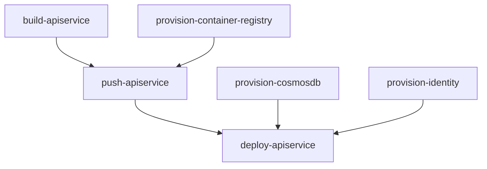
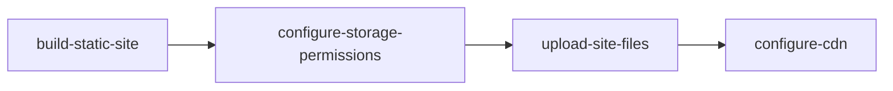

import { Aside, Steps, Tabs, TabItem } from '@astrojs/starlight/components';
import LearnMore from '@components/LearnMore.astro';

When you compose your distributed app in Aspire's **AppHost**, you're not just defining services for local development and orchestration—you're also setting up the foundation for deployment. The same composition you use to run and debug locally is leveraged when you publish your app, ensuring consistency from development through to production.

## Reusable app topology

Aspire doesn't get in the way of your existing deployment workflows. Instead, it provides a consistent way to define your application architecture that can be deployed across different environments and platforms.

Continuing from the three-tier architecture example, you can deploy the same app topology to various environments, whether it's a local machine, a cloud provider, or your own servers.


This table shows how you can deploy the same resources across different platforms:

| Resource | Local | AWS | Azure | On-Premises |
|-|-|-|-|-|
| Frontend | `npm run dev` | Elastic Container Service | Container Apps | Custom |
| API Service | `dotnet run --project ../<API_PROJECT>.csproj` | AWS Lambda | Functions | Custom |
| PostgreSQL | `docker.io/library/postgres` | Relational Database Service | Database for Postgres | Custom |

<Aside type="tip">
Aspire's AppHost allows you to define your app's architecture in a way that is platform-agnostic, meaning you can run the same code locally or deploy it to any environment without changes.
</Aside>

Aspire uses a pipeline-based deployment system that enables extensible, composable deployment workflows. This system allows you to customize how your applications are deployed while maintaining consistency across different environments.

<Aside type="note">
Pipeline-based deployment is an experimental feature in Aspire 13. APIs and functionality may change in future releases.
</Aside>

## Overview

The pipeline deployment system provides a flexible, concurrent model for deploying cloud applications. Pipelines break deployment into discrete, well-defined steps that can be optimized for performance and reliability while maintaining clear visibility into the deployment process.

### Why pipelines matter

Modern cloud applications require sophisticated deployment orchestration to handle the complexity of distributed systems. Aspire's pipeline system provides:

- **Intelligent concurrency**: Independent operations run in parallel, maximizing resource utilization and minimizing total deployment time
- **Granular control**: Each step can be executed, monitored, and retried independently with specific error reporting and targeted recovery capabilities
- **Smart dependency management**: Steps wait only for their actual dependencies, ensuring optimal execution order while maintaining correctness
- **Comprehensive observability**: Real-time progress reporting at both step and sub-task levels provides clear visibility into deployment operations
- **Flexible execution**: Run complete deployments or selective step execution based on your specific needs

### Core capabilities

The pipeline deployment system enables several key capabilities:

- **Extend deployments**: Add custom deployment steps for specific resources or scenarios
- **Control execution order**: Declare dependencies between steps to ensure proper sequencing
- **Run selective steps**: Execute only specific steps and their dependencies for faster iterations
- **Parallelize operations**: Independent steps can run concurrently for improved performance
- **State persistence**: Cache deployment state and parameters across multiple deployment runs
- **Intelligent granularity**: Balance between fine-grained control and deployment efficiency

## Core concepts

The pipeline system is built around several fundamental concepts that work together to provide flexible, efficient deployment orchestration.

### Pipeline steps

A pipeline step represents a discrete unit of work in the application pipeline. Each step encapsulates a specific aspect of the deployment process, making the overall operation more manageable and debuggable.

Each step has:

- **Name**: A unique identifier for the step
- **Action**: The work to be performed during deployment  
- **Dependencies**: Other steps that must complete before this step runs
- **Resource context**: Access to the application's resource model and configuration

Pipeline steps operate at different levels of granularity. For example, when deploying a typical web application with a frontend, API service, database, and storage, the pipeline might include:

**Infrastructure steps** (can run in parallel):
- `provision-cosmosdb`: Provision the CosmosDB database
- `provision-storage`: Provision Azure Storage account  
- `provision-aca-env`: Provision Azure Container Apps environment
- `provision-container-registry`: Set up the container image registry

**Build steps** (can run in parallel):
- `build-apiservice`: Build container image for the API service
- `build-webfrontend`: Build container image for the frontend

**Deployment steps** (depend on builds and infrastructure):
- `push-apiservice`: Push API service image to registry
- `push-webfrontend`: Push frontend image to registry
- `deploy-apiservice`: Deploy API service to compute platform
- `deploy-webfrontend`: Deploy frontend to compute platform

This granular approach allows the pipeline to maximize parallelism—databases can be provisioned while container images are building, and as soon as both the container registry and an image are ready, the image can be pushed immediately without waiting for other unrelated operations.

### Step execution phases

The pipeline system operates through three distinct phases:

<Steps>

1. #### Registration phase
    Steps are collected from two sources:
    - **Resource annotations**: Steps contributed by resources in your application model (e.g., a database resource contributes its provisioning step)
    - **Pipeline API calls**: Steps added directly through pipeline configuration in your AppHost

    This decentralized approach allows both framework components and user code to participate in the deployment process without requiring changes to a central configuration.

1. #### Resolution phase  
    The pipeline system analyzes all registered steps to:
    - **Validate dependencies**: Ensure all referenced steps exist and no circular dependencies are present
    - **Calculate execution order**: Determine the optimal sequence that respects all dependency constraints
    - **Identify concurrency opportunities**: Group steps that can run in parallel

1. #### Execution phase
    Steps run according to the resolved plan:
    - **Parallel execution**: Independent steps start simultaneously
    - **Dependency waiting**: Steps wait only for their specific dependencies, not for unrelated operations
    - **Progress reporting**: Real-time status updates for both individual steps and overall pipeline progress
    - **Error isolation**: Failed steps don't block unrelated operations

</Steps>

### Dependency management

Dependencies in Aspire pipelines are explicit and purpose-driven, unlike traditional deployment systems where dependencies might be implicit or overly broad.

Steps declare their relationships using:

- `PipelineStep.DependsOn`: This step must run after another step completes successfully
- `PipelineStep.RequiredBy`: Another step must run after this step (inverse dependency declaration)

**Example dependency relationships:**



In this example:
- `push-apiservice` depends on both the image being built AND the registry being available
- `deploy-apiservice` can start as soon as its image is pushed, the database is provisioned, and managed identity is configured
- `provision-cosmosdb` and `build-apiservice` can run in parallel since they don't depend on each other

The pipeline system validates dependencies to ensure:
- **No circular dependencies**: Step A cannot depend on Step B if Step B depends on Step A
- **All references exist**: All dependency declarations reference actual registered steps  
- **Logical consistency**: The dependency graph represents a valid execution plan

## Deployment patterns

Aspire's pipeline system is designed around intelligent orchestration of deployment operations, ensuring that your applications deploy efficiently and reliably across different environments.

### Optimal granularity design

The pipeline system uses fine-grained steps to provide precise control and visibility while maintaining deployment efficiency:

**Resource-level granularity**: Each infrastructure resource (databases, storage accounts, container registries) is provisioned as a separate step, enabling:
- **Precise error reporting**: When a specific resource fails, you know exactly what went wrong
- **Targeted retry capabilities**: Retry only the failed resource without affecting successfully provisioned components
- **Progress transparency**: Clear visibility into which resources are provisioning and their current status
- **Flexible recovery**: Ability to fix issues and continue from the point of failure

**Operation-level organization**: Related operations are grouped logically while maintaining independence:
- **Build operations**: Multiple container images can build in parallel using available system resources
- **Push operations**: Images can be pushed to registries as soon as they're built and the registry is available
- **Deployment operations**: Services deploy as soon as their dependencies (images, infrastructure) are ready

## Well-known steps

Aspire registers a default set of well-known steps that serve as integration points for the deployment pipeline. These steps provide a standardized way for resources and applications to participate in common deployment workflows.

### Entry point steps

- **`WellKnownSteps.Deploy`**: The primary entry point for the `aspire deploy` command. This step orchestrates the complete deployment process including infrastructure provisioning, image building, and application deployment.

- **`WellKnownSteps.Publish`**: The entry point for the `aspire publish` command, which typically generates deployment artifacts without executing the actual deployment.

- **`WellKnownSteps.Build`**: The entry point for the `aspire do build` command, which builds container images for compute resources defined in the application.

- **`WellKnownSteps.Push`**: The entry point for the `aspire do push` command, which pushes container images to registries after they have been built.

### Prerequisite steps

- **`WellKnownSteps.BuildPrereq`**: Defines steps that are pre-requisites for building, such as dependency resolution, environment setup, and build tool validation.

- **`WellKnownSteps.DeployPrereqs`**: Defines steps that are pre-requisites for deployment, such as authentication, environment validation, and prerequisite resource checks.

- **`WellKnownSteps.PublishPrereqs`**: Defines steps that are pre-requisites for publishing, such as build environment setup and artifact preparation.

- **`WellKnownSteps.PushPrereq`**: Defines steps that are pre-requisites for pushing container images, such as registry authentication and connection validation.

These well-known steps create a contract that allows different parts of the system to integrate predictably. For example, a custom authentication step can declare itself as required by `DeployPrereqs`, ensuring it runs before any deployment operations begin.

### Resource-contributed steps

Resources in your application model can contribute their own pipeline steps through annotations. This pattern allows libraries and integrations to encapsulate their deployment logic without requiring changes to your application code.

**How resource-contributed steps work:**

<Steps>

1. **Annotation-based registration**: Resources use annotations to declare their pipeline steps
2. **Automatic discovery**: The pipeline system automatically discovers steps from all resources during the registration phase  
3. **Dependency integration**: Resource steps can depend on well-known steps or other resource steps

</Steps>

**Example: Static site resource contributing steps**

A static site resource might contribute multiple related steps:



Each step handles a specific aspect of static site deployment:

<Steps>

1. **Building site artifacts**: Compile, optimize, and prepare static files
2. **Configuring storage permissions**: Set up appropriate access controls  
3. **Uploading files**: Transfer built artifacts to cloud storage
4. **Configuring CDN**: Set up content distribution and routing

</Steps>

This approach keeps deployment logic close to the resource definition while allowing the pipeline system to optimize execution order and handle dependencies automatically.

### Application-specific steps

Applications can add custom steps directly through the pipeline API for scenarios that don't belong to a particular resource but are specific to the application's deployment requirements.

**Common application-specific step scenarios:**

- **Database migrations**: Running schema updates or data transformations
- **Smoke tests**: Validating deployed services before marking deployment as complete
- **Configuration updates**: Updating external services or third-party integrations
- **Notification workflows**: Sending deployment status updates to team communication channels

**Example: Adding a custom validation step**

```csharp title="C# — AppHost.cs"
var builder = DistributedApplication.CreateBuilder(args);

// Add custom deployment validation
builder.Pipeline.AddStep("validate-deployment", async context =>
{
    // Custom validation logic
    await ValidateApiHealth(context);
    await ValidateDatabaseConnection(context);
}, requiredBy: WellKnownPipelineSteps.Deploy);

// Define resources
var database = builder.AddPostgres("myapp-db");
var api = builder.AddProject<Api>("api").WithReference(database);
```

This pattern enables applications to extend the deployment process with custom logic while benefiting from the pipeline's dependency management and execution coordination.

## Execution control

The pipeline system provides sophisticated mechanisms for controlling how and when deployment steps are executed, giving you precise control over the deployment process.

### Running specific steps

The `aspire do` command allows you to execute individual steps and their dependencies, providing fine-grained control over the deployment process. This capability addresses several real-world deployment scenarios where running the entire pipeline isn't necessary or desired.

**Use cases for selective step execution:**

- **Incremental deployments**: After making changes to only your frontend code, run just the frontend-related steps rather than rebuilding and redeploying your entire application
- **Troubleshooting and retry**: If a specific step fails (e.g., database provisioning times out), you can retry just that step and its dependents without repeating successful operations
- **Development workflows**: During development, you might want to provision infrastructure once, then repeatedly deploy code changes without reprovisioning resources
- **Selective operations**: Separate infrastructure provisioning from application deployment to align with organizational policies or approval processes

**How selective execution works:**

When you specify a step to run, the pipeline system automatically:

<Steps>

1. **Includes all dependencies**: Ensures prerequisite steps are executed in the correct order
2. **Skips unnecessary steps**: Avoids running steps that aren't required for your target step
3. **Maintains consistency**: Validates that the deployment state remains coherent

</Steps>

**Example selective execution scenarios:**

```bash
# Provision only infrastructure resources
aspire do provision-infra

# Deploy only a specific service after code changes  
aspire do deploy-apiservice

# Run database migrations without full redeployment
aspire do migrate-database
```

### Parallel execution and performance optimization

The pipeline system is designed to maximize deployment performance through intelligent parallel execution while maintaining correctness and reliability.

**Concurrency analysis and optimization:**

The system performs sophisticated dependency analysis to identify and leverage opportunities for parallelization:

- **Independent operations**: Steps with no dependencies on each other execute simultaneously, fully utilizing available system resources
- **Resource grouping**: Related operations (such as multiple image builds) are coordinated to use shared resources efficiently  
- **Critical path optimization**: The system identifies the longest dependency chain and optimizes execution to minimize total deployment time
- **Resource-aware scheduling**: CPU-intensive, I/O-intensive, and network operations are balanced to avoid resource contention

**Real-world performance benefits:**

A typical web application deployment demonstrates the effectiveness of pipeline parallelization:

**Pipeline execution delivers optimal performance**: 5-7 minutes total
- Infrastructure provisioning (parallel): 3 minutes (limited by slowest resource)
- Image building (parallel): 2 minutes (limited by slowest build)  
- Deployment operations: 2-3 minutes (respecting dependencies)

**Intelligent resource utilization:**

- **CPU-intensive operations** (container image building): Fully utilize available build capacity across multiple cores
- **I/O-intensive operations** (image pushing, file uploads): Execute concurrently with appropriate rate limiting to avoid overwhelming network resources
- **Cloud API operations** (resource provisioning): Run in parallel while respecting cloud provider rate limits and quotas

**Failure handling and resilience:**

The pipeline system provides robust failure handling during parallel execution:

<Steps>

1. **Immediate failure detection**: Failed steps are identified and reported quickly without waiting for unrelated operations to complete
2. **Smart dependency cascade prevention**: When a step fails, only its dependent steps are cancelled, allowing unrelated operations to continue
3. **Partial success preservation**: Successfully completed steps maintain their state and don't need to be repeated during retry operations
4. **Error isolation**: Failures in one part of the pipeline are contained and don't affect independent operations

</Steps>

The system maintains comprehensive logging and state information to support efficient debugging and recovery, ensuring that developers can quickly identify and resolve issues while preserving all successful work.

## Using the aspire do command

The `aspire do` command is the primary interface for interacting with the pipeline system. It provides fine-grained control over pipeline execution, allowing you to run specific steps, debug issues, and optimize deployment workflows.

### Basic usage

The command automatically resolves dependencies and executes steps in the correct order:

```bash title="Bash — Basic aspire do usage"
# Run the default deployment pipeline
aspire do deploy

# Build all container images
aspire do build

# Push images to registry
aspire do push

# Generate deployment artifacts
aspire do publish
```

### Command options

The `aspire do` command supports several options for customizing execution:

```bash title="Bash — aspire do with options"
# Custom output path for artifacts
aspire do publish --output-path ./artifacts

# Target specific environment
aspire do deploy --environment Production

# Verbose logging for troubleshooting
aspire do deploy --log-level debug

# Include exception details in logs
aspire do deploy --include-exception-details
```

<LearnMore>
For complete command reference, see [aspire do command](/reference/cli/commands/aspire-do/).
</LearnMore>

### Discovering available steps

Before executing pipeline steps, you can discover what steps are available using the `diagnostics` step:

```bash title="Bash — Discover pipeline steps"
aspire do diagnostics
```

This command displays:
- All available steps and their dependencies
- Execution order with parallelization indicators
- Step dependencies and target resources
- Configuration issues like orphaned steps or circular dependencies

**Example diagnostics output:**

```
Pipeline Steps:
  ✓ build-apiservice (parallel)
  ✓ build-frontend (parallel)
  ✓ provision-database (parallel)
  → push-apiservice (depends on: build-apiservice, provision-registry)
  → push-frontend (depends on: build-frontend, provision-registry)
  → deploy-apiservice (depends on: push-apiservice, provision-database)
  → deploy-frontend (depends on: push-frontend, deploy-apiservice)
```

## Custom pipeline steps

The pipeline system allows you to add custom steps to handle application-specific deployment requirements. You can add steps at two levels: application-level steps and resource-level steps.

### Application-level steps

Use `builder.Pipeline.AddStep` to add custom steps that apply to your entire application:

```csharp title="C# — Application-level custom step"
var builder = DistributedApplication.CreateBuilder(args);

// Add a custom validation step
builder.Pipeline.AddStep("validate", async (context) =>
{
    context.Logger.LogInformation("Running validation checks...");
    
    // Your custom validation logic
    await ValidateApiEndpoints(context);
    await CheckDatabaseConnection(context);
    
    context.Logger.LogInformation("Validation completed successfully");
}, requiredBy: WellKnownPipelineSteps.Deploy);

// Define resources
var database = builder.AddPostgres("db");
var api = builder.AddProject<Projects.Api>("api").WithReference(database);

builder.Build().Run();
```

You can then run this custom step:

```bash title="Bash — Run custom step"
aspire do validate
```

### Resource-level steps

Resources can contribute their own pipeline steps using `WithPipelineStepFactory`:

```csharp title="C# — Resource-level custom step"
var api = builder.AddProject<Projects.Api>("api")
    .WithPipelineStepFactory(context =>
    {
        return new PipelineStep()
        {
            Name = "custom-api-deploy",
            Action = async (pipelineContext, cancellationToken) =>
            {
                // Custom deployment logic for this resource
                pipelineContext.Logger.LogInformation("Custom API deployment starting...");
                
                // Your deployment logic here
                await DeployApiAsync(pipelineContext, cancellationToken);
                
                pipelineContext.Logger.LogInformation("Custom API deployment completed");
            },
            RequiredBySteps = [WellKnownPipelineSteps.Deploy]
        };
    });
```

### Step dependencies

Control step execution order using dependencies:

```csharp title="C# — Step with dependencies"
// Step that depends on other steps
builder.Pipeline.AddStep("database-migration", async (context) =>
{
    context.Logger.LogInformation("Running database migrations...");
    await RunMigrations(context);
}, 
dependsOn: ["deploy-database"],
requiredBy: ["deploy-apiservice"]);
```

**Dependency types:**

- **`dependsOn`**: This step runs after the specified steps complete
- **`requiredBy`**: This step must complete before the specified steps run

### Pipeline configuration

Resources can also customize how they participate in the pipeline using `WithPipelineConfiguration`:

```csharp title="C# — Custom pipeline configuration"
var api = builder.AddProject<Projects.Api>("api")
    .WithPipelineConfiguration(config =>
    {
        // Skip this resource during certain pipeline steps
        config.SkipStep(WellKnownPipelineSteps.Push);
        
        // Or add custom behavior
        config.OnStepStarting = (step) =>
        {
            Console.WriteLine($"Starting step: {step.Name}");
        };
    });
```

## Common use cases

### Multi-environment deployments

Create environment-specific pipeline steps:

```csharp title="C# — Multi-environment deployment"
var builder = DistributedApplication.CreateBuilder(args);

// Add environment-specific validation
builder.Pipeline.AddStep("validate-production", async (context) =>
{
    if (context.Environment == "Production")
    {
        context.Logger.LogInformation("Running production-specific validations...");
        await ValidateProductionReadiness(context);
    }
}, requiredBy: WellKnownPipelineSteps.Deploy);

// Add post-deployment smoke tests
builder.Pipeline.AddStep("smoke-tests", async (context) =>
{
    context.Logger.LogInformation("Running smoke tests...");
    await RunSmokeTests(context);
}, 
dependsOn: [WellKnownPipelineSteps.Deploy]);

builder.Build().Run();
```

Deploy to different environments:

```bash title="Bash — Deploy to specific environment"
# Deploy to staging
aspire do deploy --environment Staging

# Deploy to production
aspire do deploy --environment Production
```

### Custom build steps

Add custom build logic that integrates with the pipeline:

```csharp title="C# — Custom build step"
var builder = DistributedApplication.CreateBuilder(args);

// Add custom pre-build step
builder.Pipeline.AddStep("generate-assets", async (context) =>
{
    context.Logger.LogInformation("Generating static assets...");
    await GenerateStaticAssets(context);
}, requiredBy: WellKnownPipelineSteps.Build);

// Add custom post-build step
builder.Pipeline.AddStep("optimize-images", async (context) =>
{
    context.Logger.LogInformation("Optimizing container images...");
    await OptimizeImages(context);
}, 
dependsOn: [WellKnownPipelineSteps.Build],
requiredBy: [WellKnownPipelineSteps.Push]);

builder.Build().Run();
```

### Database migrations

Integrate database migrations into the deployment pipeline:

```csharp title="C# — Database migrations step"
var builder = DistributedApplication.CreateBuilder(args);

var database = builder.AddPostgres("db");

// Add migration step that runs after database is provisioned
builder.Pipeline.AddStep("migrate-database", async (context) =>
{
    context.Logger.LogInformation("Running database migrations...");
    
    // Get database connection string from context
    var connectionString = await GetConnectionString(context, database);
    
    // Run migrations
    await RunDatabaseMigrations(connectionString, context.Logger);
    
    context.Logger.LogInformation("Database migrations completed");
}, 
dependsOn: ["provision-database"],
requiredBy: ["deploy-apiservice"]);

var api = builder.AddProject<Projects.Api>("api").WithReference(database);

builder.Build().Run();
```

## Migrating from publishing callbacks

Aspire 13.0 replaces the publishing callback system with the more flexible pipeline system. If you're upgrading from Aspire 9.x, you'll need to migrate your code.

### What changed

The old publishing callback system has been removed and replaced with pipeline steps:

**Removed APIs:**
- `WithPublishingCallback` extension method
- `PublishingContext` and `PublishingCallbackAnnotation`
- `DeployingContext` and `DeployingCallbackAnnotation`
- `IDistributedApplicationPublisher` interface

**New APIs:**
- `WithPipelineStepFactory` extension method
- `PipelineStep` class
- `builder.Pipeline.AddStep` method

### Migration steps

<Steps>

1. **Identify publishing callbacks** in your code that use `WithPublishingCallback`
2. **Convert to pipeline steps** using `WithPipelineStepFactory` or `builder.Pipeline.AddStep`
3. **Update dependencies** using `DependsOn` and `RequiredBySteps` properties
4. **Test the migration** using `aspire do diagnostics` and `aspire do deploy`

</Steps>

### Before and after examples

#### Resource-level callback

**Before (Aspire 9.x):**

```csharp title="C# — Old publishing callback"
var api = builder.AddProject<Projects.Api>("api")
    .WithPublishingCallback(async (context, cancellationToken) =>
    {
        // Custom deployment logic
        await CustomDeployAsync(context, cancellationToken);
    });
```

**After (Aspire 13.0):**

```csharp title="C# — New pipeline step"
var api = builder.AddProject<Projects.Api>("api")
    .WithPipelineStepFactory(context =>
    {
        return new PipelineStep()
        {
            Name = "custom-deploy-api",
            Action = async (pipelineContext, cancellationToken) =>
            {
                // Custom deployment logic
                await CustomDeployAsync(pipelineContext, cancellationToken);
            },
            RequiredBySteps = [WellKnownPipelineSteps.Deploy]
        };
    });
```

#### Application-level callback

**Before (Aspire 9.x):**

```csharp title="C# — Old application-level callback"
builder.Services.AddLifecycleHook<CustomPublishingHook>();

public class CustomPublishingHook : IDistributedApplicationLifecycleHook
{
    public async Task AfterEndpointsAllocatedAsync(
        DistributedApplicationModel model,
        CancellationToken cancellationToken)
    {
        // Custom logic
        await SendDeploymentNotification();
    }
}
```

**After (Aspire 13.0):**

```csharp title="C# — New pipeline step"
builder.Pipeline.AddStep("notify-deployment", async (context) =>
{
    // Custom logic
    await SendDeploymentNotification(context);
}, 
dependsOn: [WellKnownPipelineSteps.Deploy]);
```

#### Complex deployment workflow

**Before (Aspire 9.x):**

```csharp title="C# — Old complex callback"
var api = builder.AddProject<Projects.Api>("api")
    .WithPublishingCallback(async (context, cancellationToken) =>
    {
        // Multiple deployment steps
        await ProvisionInfrastructure(context);
        await BuildAndPushImages(context);
        await RunDatabaseMigrations(context);
        await DeployApplication(context);
        await RunSmokeTests(context);
    });
```

**After (Aspire 13.0):**

```csharp title="C# — New pipeline steps with dependencies"
// Break down into discrete steps with dependencies
builder.Pipeline.AddStep("provision-infra", async (context) =>
{
    await ProvisionInfrastructure(context);
}, requiredBy: [WellKnownPipelineSteps.Build]);

builder.Pipeline.AddStep("migrate-database", async (context) =>
{
    await RunDatabaseMigrations(context);
}, 
dependsOn: ["provision-infra"],
requiredBy: ["deploy-application"]);

var api = builder.AddProject<Projects.Api>("api")
    .WithPipelineStepFactory(context =>
    {
        return new PipelineStep()
        {
            Name = "deploy-application",
            Action = async (ctx, ct) => await DeployApplication(ctx, ct),
            DependsOn = [WellKnownPipelineSteps.Build, WellKnownPipelineSteps.Push]
        };
    });

builder.Pipeline.AddStep("smoke-tests", async (context) =>
{
    await RunSmokeTests(context);
}, dependsOn: ["deploy-application"]);
```

### Benefits of the new system

The pipeline system provides several advantages over publishing callbacks:

- **Better visibility**: Use `aspire do diagnostics` to see all steps and their dependencies
- **Selective execution**: Run specific steps with `aspire do <step-name>`
- **Parallel execution**: Independent steps run concurrently automatically
- **Clearer dependencies**: Explicit dependency declaration with `DependsOn` and `RequiredBySteps`
- **Better error handling**: Failed steps don't block unrelated operations
- **Reusability**: Steps can be reused across different deployment scenarios

<Aside type="tip">
After migrating, use `aspire do diagnostics` to verify that your pipeline steps are correctly configured and that dependencies are properly declared.
</Aside>
