import { Image } from 'astro:assets';
import { LinkButton, Steps } from '@astrojs/starlight/components';
import githubIcon from '@assets/icons/github-icon.png';

<Image
  src={githubIcon}
  alt="GitHub logo"
  width={100}
  height={100}
  class:list={'float-inline-left icon'}
  data-zoom-off
/>

[GitHub Models](https://github.com/marketplace/models) provides access to a broad catalog of AI models — including OpenAI's GPT models, DeepSeek, Microsoft's Phi models, and more — through GitHub's infrastructure and your existing GitHub token. The Aspire GitHub Models integration lets you model a GitHub Model resource as a first-class resource in your AppHost, then hand the connection information to any consuming app — regardless of language.

## Why use GitHub Models with Aspire

Adding GitHub Models through Aspire — rather than hard-coding API keys and endpoints in each service — gives you:

- **Centralized credential management.** The GitHub token is stored once as a secret parameter in the AppHost and injected into each consuming app automatically.
- **Typed model resources with connection strings.** Each GitHub Model resource composes a connection string from the endpoint, API key, and model identifier, giving consuming apps a single named connection.
- **Consistent connection info across languages.** Once you reference a model resource from a consuming app, Aspire injects connection properties as environment variables in a predictable format that works from C#, TypeScript, Python, Go, or any other language.
- **Automatic `GITHUB_TOKEN` fallback.** In Codespaces and GitHub Actions the ambient `GITHUB_TOKEN` is used automatically — no extra secrets to configure.
- **A first-class C# client integration.** C# apps can use `Aspire.Azure.AI.Inference` or `Aspire.OpenAI` for dependency injection, health checks, and OpenTelemetry, all wired up from the same resource name.

## How the pieces fit together

The GitHub Models integration has two sides: a **hosting integration** that you use in your AppHost to model the GitHub Model resource, and a **connection story** for consuming apps that reference it.

```mermaid
architecture-beta

  group apphost(server)[AppHost]
  group consumer(server)[Consuming app]

  service hosting(server)[Hosting integration] in apphost
  service githubmodels(internet)[GitHub Models API] in apphost
  service model(database)[chat model] in apphost

  service client(iconoir:server-connection)[Client integration] in consumer
  service app(server)[App] in consumer

  hosting:R --> L:githubmodels
  githubmodels:R --> L:model
  model:R --> L:client
  client:R --> L:app
```

The **hosting integration** lives in your AppHost project and models the GitHub Model resource. The **client integration** lives in each consuming app and uses the connection information Aspire injects to call the GitHub Models API.

Getting there is a two-step process: model the GitHub Model resource in your AppHost, then connect to the API from each app that needs it.

<Steps>

1. ### Model GitHub Models in your AppHost

    Add the GitHub Models hosting integration to your AppHost, then declare a model resource and reference it from the apps that need to call the API. The [GitHub Models hosting integration](/integrations/ai/github-models/github-models-host/) reference walks through every capability — adding model resources, API key parameters, organization configuration, and health checks — with side-by-side C# and TypeScript examples.

    <LinkButton
        variant='secondary'
        iconPlacement='end'
        icon='right-arrow'
        href='/integrations/ai/github-models/github-models-host/'>
        Set up GitHub Models in the AppHost
    </LinkButton>

2. ### Connect from your consuming app

    When you reference a GitHub Model resource from a consuming app, Aspire injects its connection information as environment variables. See [Connect to GitHub Models](/integrations/ai/github-models/github-models-connect/) for the connection properties reference and per-language examples for C#, Go, Python, and TypeScript — including the full C# client integration.

    <LinkButton
        variant='secondary'
        iconPlacement='end'
        icon='right-arrow'
        href='/integrations/ai/github-models/github-models-connect/'>
        Connect to GitHub Models
    </LinkButton>

</Steps>

## See also

- [GitHub Models on GitHub Marketplace](https://github.com/marketplace/models)
- [GitHub Models documentation](https://docs.github.com/github-models)
