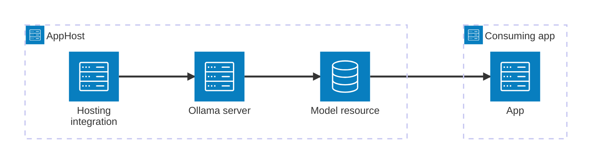

import { Image } from 'astro:assets';
import { Badge, LinkButton, Steps } from '@astrojs/starlight/components';
import ollamaIcon from '@assets/icons/ollama-icon.png';

<Badge text="⭐ Community Toolkit" variant="tip" size="large" />

<Image
  src={ollamaIcon}
  alt="Ollama logo"
  width={100}
  height={100}
  class:list={'float-inline-left icon'}
  data-zoom-off
/>

[Ollama](https://ollama.com/) is an open-source platform for running large language models (LLMs) locally. The Aspire Ollama integration — from the [Aspire Community Toolkit](https://github.com/CommunityToolkit/Aspire) — lets you model an Ollama server and its models as first-class resources in your AppHost, then hand the connection information to any consuming app — regardless of language.

## Why use Ollama with Aspire

Adding Ollama through Aspire — rather than wiring up containers and connection strings by hand — gives you:

- **Zero-config local development.** Aspire runs Ollama from the [`docker.io/ollama/ollama`](https://hub.docker.com/r/ollama/ollama) container image and automatically downloads the models you declare.
- **Consistent connection info across languages.** Once you reference a model from a consuming app, Aspire injects connection properties as environment variables in a predictable format that works from C#, TypeScript, Python, Go, or any other language.
- **Built-in health checks.** The hosting integration automatically registers health checks for both the Ollama server and each model resource, so the dashboard and your orchestrator can tell when a model has finished downloading and is ready.
- **Dashboard observability.** The Ollama server and its model sub-resources appear in the Aspire dashboard with logs, status, and download progress alongside your other services.
- **A first-class C# client integration.** C# apps can use `CommunityToolkit.Aspire.OllamaSharp` for dependency injection wired up from the same resource name, plus `Microsoft.Extensions.AI` abstractions for portable AI code.
- **GPU and data-volume support.** Enable GPU acceleration with a single method call, and persist downloaded models across container restarts with a named data volume.

## How the pieces fit together

The Ollama integration has two sides: a **hosting integration** that you use in your AppHost to model the Ollama server and model resources, and a **connection story** for consuming apps that reference them.

The **hosting integration** lives in your AppHost project and models the Ollama server and its models as resources. Consuming apps receive connection information through Aspire's standard environment-variable injection.

Getting there is a two-step process: model the Ollama resources in your AppHost, then connect to them from each app that needs them.

<Steps>

1. ### Model Ollama in your AppHost

    Add the Ollama hosting integration to your AppHost, then declare an Ollama server, one or more models, and reference them from the apps that need to use them. The [Ollama hosting integration](/integrations/ai/ollama/ollama-host/) article walks through every capability — adding models, HuggingFace models, data volumes, GPU enablement, Open WebUI, and more.

    <LinkButton
        variant='secondary'
        iconPlacement='end'
        icon='right-arrow'
        href='/integrations/ai/ollama/ollama-host/'>
        Set up Ollama in the AppHost
    </LinkButton>

2. ### Connect from your consuming app

    When you reference an Ollama model resource from a consuming app, Aspire injects its connection information as environment variables. See [Connect to Ollama](/integrations/ai/ollama/ollama-connect/) for the connection properties reference and per-language examples for C#, Go, Python, and TypeScript — including the full C# client integration.

    <LinkButton
        variant='secondary'
        iconPlacement='end'
        icon='right-arrow'
        href='/integrations/ai/ollama/ollama-connect/'>
        Connect to Ollama
    </LinkButton>

</Steps>

## See also

- [Ollama](https://ollama.com/)
- [Open WebUI](https://openwebui.com)
- [Aspire Community Toolkit GitHub repo](https://github.com/CommunityToolkit/Aspire)
- [OllamaSharp](https://github.com/awaescher/OllamaSharp)
- [Microsoft.Extensions.AI](https://devblogs.microsoft.com/dotnet/introducing-microsoft-extensions-ai-preview/)

