import { Image } from 'astro:assets';
import { LinkButton, Steps } from '@astrojs/starlight/components';
import openaiIcon from '@assets/icons/openai-icon.png';

<Image
  src={openaiIcon}
  alt="OpenAI logo"
  width={100}
  height={100}
  class:list={'float-inline-left icon'}
  data-zoom-off
/>

[OpenAI](https://platform.openai.com/) provides access to chat/completions, embeddings, image, and audio models via a REST API. The Aspire OpenAI integration lets you model an OpenAI account (endpoint + API key) and one or more model resources as first-class resources in your AppHost, then hand the connection information to any consuming app — regardless of language.

## Why use OpenAI with Aspire

Adding OpenAI through Aspire — rather than hard-coding API keys and endpoints in each service — gives you:

- **Centralized credential management.** The API key is stored once as a secret parameter in the AppHost and injected into each consuming app automatically.
- **Model resources with typed connection strings.** Each model resource composes a connection string from the parent endpoint, API key, and model name, giving consuming apps a single named connection.
- **Consistent connection info across languages.** Once you reference a model resource from a consuming app, Aspire injects connection properties as environment variables in a predictable format that works from C#, TypeScript, Python, Go, or any other language.
- **Endpoint override for compatible gateways.** Swap the default `https://api.openai.com/v1` endpoint for an Azure OpenAI endpoint or any OpenAI-compatible proxy without changing consuming apps.
- **A first-class C# client integration.** C# apps can use the `Aspire.OpenAI` package for dependency injection, health checks, and OpenTelemetry, all wired up from the same resource name.

## How the pieces fit together

The OpenAI integration has two sides: a **hosting integration** that you use in your AppHost to model the OpenAI resource and its models, and a **connection story** for consuming apps that reference those model resources.

```mermaid
architecture-beta

  group apphost(server)[AppHost]
  group consumer(server)[Consuming app]

  service hosting(server)[Hosting integration] in apphost
  service openai(internet)[OpenAI API] in apphost
  service model(database)[chat model] in apphost

  service client(iconoir:server-connection)[Client integration] in consumer
  service app(server)[App] in consumer

  hosting:R --> L:openai
  openai:R --> L:model
  model:R --> L:client
  client:R --> L:app
```

The **hosting integration** lives in your AppHost project and models the OpenAI parent resource and model resources. The **client integration** lives in each consuming app and uses the connection information Aspire injects to call the OpenAI API.

Getting there is a two-step process: model the OpenAI resources in your AppHost, then connect to the API from each app that needs it.

<Steps>

1. ### Model OpenAI in your AppHost

    Add the OpenAI hosting integration to your AppHost, then declare an OpenAI parent resource and one or more model resources, and reference them from the apps that need to call the API. The [OpenAI hosting integration](/integrations/ai/openai/openai-host/) article walks through every capability — adding models, API key parameters, endpoint overrides, and health checks — with side-by-side C# and TypeScript examples.

    <LinkButton
        variant='secondary'
        iconPlacement='end'
        icon='right-arrow'
        href='/integrations/ai/openai/openai-host/'>
        Set up OpenAI in the AppHost
    </LinkButton>

2. ### Connect from your consuming app

    When you reference an OpenAI model resource from a consuming app, Aspire injects its connection information as environment variables. See [Connect to OpenAI](/integrations/ai/openai/openai-connect/) for the connection properties reference and per-language examples for C#, Go, Python, and TypeScript — including the full C# client integration.

    <LinkButton
        variant='secondary'
        iconPlacement='end'
        icon='right-arrow'
        href='/integrations/ai/openai/openai-connect/'>
        Connect to OpenAI
    </LinkButton>

</Steps>

## See also

- [OpenAI API documentation](https://platform.openai.com/docs)
