import { Image } from 'astro:assets';
import { LinkButton, Steps } from '@astrojs/starlight/components';
import garnetIcon from '@assets/icons/garnet-icon.png';

<Image
  src={garnetIcon}
  alt="Garnet logo"
  width={100}
  height={100}
  class:list={'float-inline-left icon'}
  data-zoom-off
/>

[Garnet](https://github.com/microsoft/garnet/) is an open-source, high-performance in-memory cache and key/value store from Microsoft Research that speaks the Redis serialization protocol (RESP). The Aspire Garnet integration lets you model a Garnet server as a first-class resource in your AppHost, then hand the connection information to any consuming app — regardless of language.

## Why use Garnet with Aspire

Adding Garnet through Aspire — rather than wiring up containers and connection strings by hand — gives you:

- **Zero-config local development.** Aspire runs Garnet from the [`ghcr.io/microsoft/garnet`](https://github.com/microsoft/garnet/pkgs/container/garnet) container image with credentials generated automatically for you.
- **Consistent connection info across languages.** Once you reference the Garnet resource from a consuming app, Aspire injects connection properties as environment variables in a predictable format that works from C#, TypeScript, Python, Go, or any other language.
- **Built-in health checks.** The hosting integration automatically registers a health check so the dashboard and your orchestrator can tell when Garnet is ready.
- **Dashboard observability.** The Garnet resource shows up in the Aspire dashboard with logs, status, and telemetry alongside your other services.
- **Reuse the C# Redis client integration.** Because Garnet is RESP-compatible, C# apps can use the `Aspire.StackExchange.Redis` package for dependency injection, health checks, and OpenTelemetry — all wired up from the same resource name.

## How the pieces fit together

The Garnet integration has two sides: a **hosting integration** that you use in your AppHost to model the Garnet resource, and a **connection story** for consuming apps that reference it.

```mermaid
architecture-beta

  group apphost(server)[AppHost]
  group consumer(server)[Consuming app]

  service hosting(server)[Hosting integration] in apphost
  service garnet(server)[Garnet server] in apphost

  service client(iconoir:server-connection)[Client integration] in consumer
  service app(server)[App] in consumer

  hosting:R --> L:garnet
  garnet:R --> L:client
  client:R --> L:app
```

The **hosting integration** lives in your AppHost project and models the Garnet server as a resource. The **client integration** lives in each consuming app and uses the connection information Aspire injects to talk to Garnet.

Getting there is a two-step process: model the Garnet resource in your AppHost, then connect to it from each app that needs it.

<Steps>

1. ### Model Garnet in your AppHost

    Add the Garnet hosting integration to your AppHost, then declare a Garnet resource and reference it from the apps that need to talk to the cache. The [Garnet Hosting integration](/integrations/caching/garnet/garnet-host/) article walks through every capability — data volumes, data bind mounts, persistence snapshots, and custom parameters — with side-by-side C# and TypeScript examples.

    <LinkButton
        variant='secondary'
        iconPlacement='end'
        icon='right-arrow'
        href='/integrations/caching/garnet/garnet-host/'>
        Set up Garnet in the AppHost
    </LinkButton>

2. ### Connect from your consuming app

    When you reference a Garnet resource from a consuming app, Aspire injects its connection information as environment variables. See [Connect to Garnet](/integrations/caching/garnet/garnet-connect/) for the connection properties reference and per-language examples for C#, Go, Python, and TypeScript — including the full C# client integration that's shared with Redis.

    <LinkButton
        variant='secondary'
        iconPlacement='end'
        icon='right-arrow'
        href='/integrations/caching/garnet/garnet-connect/'>
        Connect to Garnet
    </LinkButton>

</Steps>

## See also

- [Valkey integration](/integrations/caching/valkey/valkey-get-started/) — Valkey shares the same client integration as Garnet and Redis.
- [Redis integration](/integrations/caching/redis/redis-get-started/) — Garnet shares the same client integration as Redis.
- [Redis distributed caching](/integrations/caching/redis-distributed/redis-distributed-get-started/)
- [Redis output caching](/integrations/caching/redis-output/redis-output-get-started/)
