import { Image } from 'astro:assets';
import { LinkButton, Steps } from '@astrojs/starlight/components';
import redisIcon from '@assets/icons/redis-icon.png';

<Image
  src={redisIcon}
  alt="Redis logo"
  width={100}
  height={100}
  class:list={'float-inline-left icon'}
  data-zoom-off
/>

The [Redis®](#registered-trademark) distributed caching integration is the [`IDistributedCache`](https://learn.microsoft.com/dotnet/api/microsoft.extensions.caching.distributed.idistributedcache) flavor of the Redis client integration for ASP.NET Core. It uses the same [Redis hosting integration](/integrations/caching/redis/redis-host/) (`Aspire.Hosting.Redis`) to model the Redis container in your AppHost, but the consuming-app side is provided by `Aspire.StackExchange.Redis.DistributedCaching` — a C#-only library that registers an `IDistributedCache` implementation backed by Redis. TypeScript, Go, and Python consumers should use the [regular Redis client integration](/integrations/caching/redis/redis-client/) directly.

## Why use Redis distributed caching with Aspire

Adding the Redis distributed caching integration through Aspire — rather than wiring up connection strings and service registrations by hand — gives you:

- **Drop-in `IDistributedCache` implementation.** One line registers a fully functional `IDistributedCache` backed by Redis, compatible with session state, data protection, and `[OutputCache]`.
- **Automatic service registration.** `AddRedisDistributedCache` handles `IDistributedCache`, the underlying `IConnectionMultiplexer`, and all required plumbing in a single call.
- **Built-in health checks.** The integration registers a health check that verifies the Redis instance is reachable before your app reports healthy.
- **OpenTelemetry out of the box.** Logging, distributed tracing, and metrics are wired up automatically through the standard Aspire telemetry pipeline.
- **Works with ASP.NET Core higher-level abstractions.** Because `IDistributedCache` is the standard ASP.NET Core caching abstraction, this integration works transparently with output caching, session state, and ASP.NET Core Data Protection.

## How the pieces fit together

The Redis distributed caching integration has two sides: the **hosting integration** in your AppHost that models the Redis resource, and the **C# client integration** in consuming apps that registers `IDistributedCache`.

```mermaid
architecture-beta

  group apphost(server)[AppHost]
  group consumer(server)[Consuming app]

  service hosting(server)[Hosting integration] in apphost
  service redis(server)[Redis server] in apphost

  service client(iconoir:server-connection)[StackExchange Redis distributed cache client] in consumer
  service app(server)[App] in consumer

  hosting:R --> L:redis
  redis:R --> L:client
  client:R --> L:app
```

The **hosting integration** lives in your AppHost project and models the Redis server as a resource. The **client integration** lives in each consuming C# app and uses the connection information Aspire injects to register `IDistributedCache`.

Getting there is a two-step process: model the Redis resource in your AppHost, then register `IDistributedCache` in your consuming app.

<Steps>

1. ### Model Redis in your AppHost

    Add the Redis hosting integration to your AppHost, declare a Redis resource, and reference it from the apps that need distributed caching. The [Redis distributed caching AppHost](/integrations/caching/redis-distributed/redis-distributed-host/) article covers the installation and the basic `AddRedis` call. For the full AppHost API surface — data volumes, persistence, Redis Insight, Redis Commander, parameters, and more — see the [Redis Hosting integration](/integrations/caching/redis/redis-host/) reference.

    <LinkButton
        variant='secondary'
        iconPlacement='end'
        icon='right-arrow'
        href='/integrations/caching/redis-distributed/redis-distributed-host/'>
        Set up Redis distributed caching in the AppHost
    </LinkButton>

2. ### Connect from your consuming app

    Once the Redis resource is referenced from your consuming project, Aspire injects the connection information. See [Connect to Redis distributed caching](/integrations/caching/redis-distributed/redis-distributed-connect/) for the connection properties reference, how to call `AddRedisDistributedCache`, keyed clients, configuration options, health checks, telemetry, and usage examples.

    <LinkButton
        variant='secondary'
        iconPlacement='end'
        icon='right-arrow'
        href='/integrations/caching/redis-distributed/redis-distributed-connect/'>
        Connect to Redis distributed caching
    </LinkButton>

</Steps>

## See also

- [Redis integration](/integrations/caching/redis/redis-get-started/) — the primary Redis integration with `IConnectionMultiplexer`.
- [Redis output caching](/integrations/caching/redis-output/redis-output-get-started/) — ASP.NET Core output caching backed by Redis.
- [Redis hosting extensions](/integrations/caching/redis-extensions/) — community toolkit extensions for the Redis hosting integration.

:::tip[Registered trademark]{icon="information"}

Redis is a registered trademark of Redis Ltd. Any rights therein are reserved to
Redis Ltd. Any use by Microsoft is for referential purposes only and does not
indicate any sponsorship, endorsement or affiliation between Redis and
Microsoft.

:::
