import { Image } from 'astro:assets';
import { LinkButton, Steps } from '@astrojs/starlight/components';
import redisIcon from '@assets/icons/redis-icon.png';

<Image
  src={redisIcon}
  alt="Redis logo"
  width={100}
  height={100}
  class:list={'float-inline-left icon'}
  data-zoom-off
/>

The [Redis®](#registered-trademark) output caching integration is the `[OutputCache]`-flavored layer over the [Redis hosting integration](/integrations/caching/redis/redis-get-started/). It registers an [ASP.NET Core Output Caching](https://learn.microsoft.com/aspnet/core/performance/caching/output) store backed by [Redis](https://redis.io/) using the `Aspire.StackExchange.Redis.OutputCaching` package — so your controllers and minimal API endpoints can use `[OutputCache]` or `services.AddOutputCache()` without any manual connection wiring.

## Why use Redis output caching with Aspire

Adding Redis output caching through Aspire gives you:

- **Drop-in `IOutputCacheStore` implementation.** A single `AddRedisOutputCache` call replaces the default in-memory store with a Redis-backed one that works across app replicas.
- **Automatic registration.** Aspire wires up the Redis connection from the AppHost reference — no connection strings to manage by hand.
- **`[OutputCache]` attribute support.** Works with the standard `[OutputCache(Duration = 60)]` attribute, `CacheOutput()` extension, and `services.AddOutputCache()` — no special API needed.
- **Built-in health checks.** The client integration registers a health check that verifies the Redis instance is reachable and command-ready.
- **OpenTelemetry telemetry.** Logging, distributed tracing, and metrics are configured automatically through OpenTelemetry.

## How the pieces fit together

The Redis output caching integration has two sides: a **hosting integration** that you use in your AppHost to model the Redis resource, and a **client integration** that the consuming ASP.NET Core app uses to register the output cache store.

```mermaid
architecture-beta

  group apphost(server)[AppHost]
  group consumer(server)[ASP NET Core app]

  service hosting(server)[Hosting integration] in apphost
  service redis(server)[Redis server] in apphost

  service client(iconoir:server-connection)[StackExchange Redis output cache client] in consumer
  service app(server)[App] in consumer

  hosting:R --> L:redis
  redis:R --> L:client
  client:R --> L:app
```

The **hosting integration** lives in your AppHost project and models the Redis server as a resource. The **client integration** lives in your ASP.NET Core project and uses the connection information Aspire injects to register `IOutputCacheStore`.

Getting there is a two-step process: model the Redis resource in your AppHost, then connect to it from each app that needs output caching.

<Steps>

1. ### Set up Redis in your AppHost

    Add the Redis hosting integration to your AppHost, then declare a Redis resource and reference it from the apps that need it. See [Set up Redis output caching in the AppHost](/integrations/caching/redis-output/redis-output-host/) for the installation steps and basic resource declaration. For the full AppHost API surface — data volumes, persistence, parameters, Redis Insights, and more — refer to the main [Redis Hosting integration](/integrations/caching/redis/redis-host/).

    <LinkButton
        variant='secondary'
        iconPlacement='end'
        icon='right-arrow'
        href='/integrations/caching/redis-output/redis-output-host/'>
        Set up Redis output caching in the AppHost
    </LinkButton>

2. ### Connect from your ASP.NET Core app

    When you reference a Redis resource from a consuming project, Aspire injects its connection information as environment variables. See [Connect to Redis output caching](/integrations/caching/redis-output/redis-output-connect/) for the connection properties reference, the `AddRedisOutputCache` registration, configuration patterns, health checks, telemetry, and usage examples with `[OutputCache]`.

    <LinkButton
        variant='secondary'
        iconPlacement='end'
        icon='right-arrow'
        href='/integrations/caching/redis-output/redis-output-connect/'>
        Connect to Redis output caching
    </LinkButton>

</Steps>

## See also

- [Redis integration](/integrations/caching/redis/redis-get-started/) — the underlying hosting and client integration this builds on.
- [Redis distributed caching](/integrations/caching/redis-distributed/redis-distributed-get-started/) — `IDistributedCache` variant backed by the same Redis resource.
- [Redis hosting extensions](/integrations/caching/redis-extensions/) — community toolkit extensions for the Redis hosting integration.

:::tip[Registered trademark]{icon="information"}

Redis is a registered trademark of Redis Ltd. Any rights therein are reserved to
Redis Ltd. Any use by Microsoft is for referential purposes only and does not
indicate any sponsorship, endorsement or affiliation between Redis and
Microsoft.

:::
