import { Image } from 'astro:assets';
import { LinkButton, Steps } from '@astrojs/starlight/components';
import redisIcon from '@assets/icons/redis-icon.png';

<Image
  src={redisIcon}
  alt="Redis logo"
  width={100}
  height={100}
  class:list={'float-inline-left icon'}
  data-zoom-off
/>

[Redis®](#registered-trademark) is the original RESP-compatible (Redis Serialization Protocol) in-memory data store — a high-performance key/value cache, message queue, and primary data platform used by millions of applications worldwide. The Aspire Redis integration lets you model a Redis server as a first-class resource in your AppHost, then hand the connection information to any consuming app — regardless of language. Valkey and Garnet are drop-in alternatives that speak the same protocol and work with the same client libraries.

## Why use Redis with Aspire

Adding Redis through Aspire — rather than wiring up containers and connection strings by hand — gives you:

- **Zero-config local development.** Aspire runs Redis from the [`docker.io/library/redis`](https://hub.docker.com/_/redis/) container image with a password generated automatically for you.
- **Consistent connection info across languages.** Once you reference the Redis resource from a consuming app, Aspire injects connection properties as environment variables in a predictable format that works from C#, TypeScript, Python, Go, or any other language.
- **Built-in health checks.** The hosting integration automatically registers a health check so the dashboard and your orchestrator can tell when Redis is ready.
- **Dashboard observability.** The Redis resource shows up in the Aspire dashboard with logs, status, and telemetry alongside your other services.
- **First-class C# client integration.** C# apps use the `Aspire.StackExchange.Redis` package for automatic dependency injection, health checks, and OpenTelemetry tracing — all wired up from the same resource name.
- **Management UIs.** Optionally attach [Redis Insight](https://redis.io/insight/) or [Redis Commander](https://joeferner.github.io/redis-commander/) as sub-resources to get a web-based dashboard for your Redis data.

## How the pieces fit together

The Redis integration has two sides: a **hosting integration** that you use in your AppHost to model the Redis resource, and a **connection story** for consuming apps that reference it.

```mermaid
architecture-beta

  group apphost(server)[AppHost]
  group consumer(server)[Consuming app]

  service hosting(server)[Hosting integration] in apphost
  service redis(server)[Redis server] in apphost

  service client(iconoir:server-connection)[Client integration] in consumer
  service app(server)[App] in consumer

  hosting:R --> L:redis
  redis:R --> L:client
  client:R --> L:app
```

The **hosting integration** lives in your AppHost project and models the Redis server as a resource. The **client integration** lives in each consuming app and uses the connection information Aspire injects to talk to Redis.

Getting there is a two-step process: model the Redis resource in your AppHost, then connect to it from each app that needs it.

<Steps>

1. ### Model Redis in your AppHost

    Add the Redis hosting integration to your AppHost, then declare a Redis resource and reference it from the apps that need it. The [Redis Hosting integration](/integrations/caching/redis/redis-host/) reference walks through every capability — data volumes, data bind mounts, persistence snapshots, Redis Insight, Redis Commander, and custom parameters — with side-by-side C# and TypeScript examples.

    <LinkButton
        variant='secondary'
        iconPlacement='end'
        icon='right-arrow'
        href='/integrations/caching/redis/redis-host/'>
        Set up Redis in the AppHost
    </LinkButton>

2. ### Connect from your consuming app

    When you reference a Redis resource from a consuming app, Aspire injects its connection information as environment variables. See [Connect to Redis](/integrations/caching/redis/redis-connect/) for the connection properties reference and per-language examples for C#, Go, Python, and TypeScript — including the full C# client integration built on `Aspire.StackExchange.Redis`.

    <LinkButton
        variant='secondary'
        iconPlacement='end'
        icon='right-arrow'
        href='/integrations/caching/redis/redis-connect/'>
        Connect to Redis
    </LinkButton>

</Steps>

## See also

- [Redis distributed caching](/integrations/caching/redis-distributed/redis-distributed-get-started/)
- [Redis output caching](/integrations/caching/redis-output/redis-output-get-started/)
- [Redis hosting extensions](/integrations/caching/redis-extensions/) — Community Toolkit extensions including DbGate.
- [Valkey integration](/integrations/caching/valkey/valkey-get-started/) — RESP-compatible open-source Redis fork.
- [Garnet integration](/integrations/caching/garnet/garnet-get-started/) — Microsoft's high-performance RESP-compatible server.

:::tip[Registered trademark]{icon="information"}

Redis is a registered trademark of Redis Ltd. Any rights therein are reserved to
Redis Ltd. Any use by Microsoft is for referential purposes only and does not
indicate any sponsorship, endorsement or affiliation between Redis and Microsoft.

:::
