import { Image } from 'astro:assets';
import { LinkButton, Steps } from '@astrojs/starlight/components';
import valkeyIcon from '@assets/icons/valkey-icon.png';

<Image
  src={valkeyIcon}
  alt="Valkey logo"
  width={100}
  height={100}
  class:list={'float-inline-left icon'}
  data-zoom-off
/>

[Valkey](https://valkey.io/) is an open-source, in-memory key/value datastore forked from Redis. It speaks the Redis serialization protocol (RESP), so it works with the same client libraries Redis does and is a drop-in cache, message queue, or primary key/value store. The Aspire Valkey integration lets you model a Valkey server as a first-class resource in your AppHost, then hand the connection information to any consuming app — regardless of language.

## Why use Valkey with Aspire

Adding Valkey through Aspire — rather than wiring up containers and connection strings by hand — gives you:

- **Zero-config local development.** Aspire runs Valkey from the [`docker.io/valkey/valkey`](https://hub.docker.com/r/valkey/valkey) container image with credentials generated automatically for you.
- **Consistent connection info across languages.** Once you reference the Valkey resource from a consuming app, Aspire injects connection properties as environment variables in a predictable format that works from C#, TypeScript, Python, Go, or any other language.
- **Built-in health checks.** The hosting integration automatically registers a health check so the dashboard and your orchestrator can tell when Valkey is ready.
- **Dashboard observability.** The Valkey resource shows up in the Aspire dashboard with logs, status, and telemetry alongside your other services.
- **Reuse the C# Redis client integration.** Because Valkey is RESP-compatible, C# apps can use the `Aspire.StackExchange.Redis` package for dependency injection, health checks, and OpenTelemetry — all wired up from the same resource name.

## How the pieces fit together

The Valkey integration has two sides: a **hosting integration** that you use in your AppHost to model the Valkey resource, and a **connection story** for consuming apps that reference it.

```mermaid
architecture-beta

  group apphost(server)[AppHost]
  group consumer(server)[Consuming app]

  service hosting(server)[Hosting integration] in apphost
  service valkey(server)[Valkey server] in apphost

  service client(iconoir:server-connection)[Client integration] in consumer
  service app(server)[App] in consumer

  hosting:R --> L:valkey
  valkey:R --> L:client
  client:R --> L:app
```

The **hosting integration** lives in your AppHost project and models the Valkey server as a resource. The **client integration** lives in each consuming app and uses the connection information Aspire injects to talk to Valkey.

Getting there is a two-step process: model the Valkey resource in your AppHost, then connect to it from each app that needs it.

<Steps>

1. ### Model Valkey in your AppHost

    Add the Valkey hosting integration to your AppHost, then declare a Valkey resource and reference it from the apps that need to talk to the cache. The [Valkey Hosting integration](/integrations/caching/valkey/valkey-host/) article walks through every capability — data volumes, data bind mounts, persistence snapshots, and custom parameters — with side-by-side C# and TypeScript examples.

    <LinkButton
        variant='secondary'
        iconPlacement='end'
        icon='right-arrow'
        href='/integrations/caching/valkey/valkey-host/'>
        Set up Valkey in the AppHost
    </LinkButton>

2. ### Connect from your consuming app

    When you reference a Valkey resource from a consuming app, Aspire injects its connection information as environment variables. See [Connect to Valkey](/integrations/caching/valkey/valkey-connect/) for the connection properties reference and per-language examples for C#, Go, Python, and TypeScript — including the full C# client integration that's shared with Redis.

    <LinkButton
        variant='secondary'
        iconPlacement='end'
        icon='right-arrow'
        href='/integrations/caching/valkey/valkey-connect/'>
        Connect to Valkey
    </LinkButton>

</Steps>

## See also

- [Redis integration](/integrations/caching/redis/redis-get-started/) — Valkey shares the same client integration as Redis.
- [Redis distributed caching](/integrations/caching/redis-distributed/redis-distributed-get-started/)
- [Redis output caching](/integrations/caching/redis-output/redis-output-get-started/)
