import { Image } from 'astro:assets';
import { LinkButton, Steps } from '@astrojs/starlight/components';
import aiFoundryIcon from '@assets/icons/azure-ai-foundry-icon.png';

<Image
  src={aiFoundryIcon}
  alt="Azure AI Foundry logo"
  width={100}
  height={100}
  class:list={'float-inline-left icon'}
  data-zoom-off
/>

[Azure AI Foundry](https://learn.microsoft.com/azure/ai-foundry/) provides a unified platform for developing, testing, and deploying AI applications. The Aspire Azure AI Foundry integration lets you model a Foundry account, model deployments, Foundry projects, and hosted agents as first-class resources in your AppHost, then hand the connection information to any consuming app — regardless of language.

## Why use Azure AI Foundry with Aspire

Adding Azure AI Foundry through Aspire — rather than hard-coding endpoints and API keys in each service — gives you:

- **Centralized credential management.** Endpoint and API key are stored once in the AppHost and injected into each consuming app automatically.
- **Model deployments as first-class resources.** Each deployment composes a connection string from the parent Foundry endpoint, API key, and model name, giving consuming apps a single named connection.
- **Foundry Projects for agents.** Model Foundry projects with `AddProject`, attach model deployments, web-search tools, and hosted or prompt agents, and reference them from consuming services.
- **Consistent connection info across languages.** Once you reference a deployment from a consuming app, Aspire injects connection properties as environment variables in a predictable format that works from C#, TypeScript, Python, Go, or any other language.
- **Foundry Local for offline development.** Use `RunAsFoundryLocal()` to run models locally without an Azure subscription.
- **An upgrade path to the cloud.** The same AppHost model provisions Azure Cognitive Services accounts and deployments when you publish.

## How the pieces fit together

The Azure AI Foundry integration has two sides: a **hosting integration** that you use in your AppHost to model the Foundry resource and its deployments, and a **connection story** for consuming apps that reference those deployment resources.

```mermaid
architecture-beta

  group apphost(server)[AppHost]
  group consumer(server)[Consuming app]

  service hosting(server)[Hosting integration] in apphost
  service foundry(internet)[Azure AI Foundry] in apphost
  service model(database)[chat deployment] in apphost

  service client(iconoir:server-connection)[Client SDK] in consumer
  service app(server)[App] in consumer

  hosting:R --> L:foundry
  foundry:R --> L:model
  model:R --> L:client
  client:R --> L:app
```

The **hosting integration** lives in your AppHost project and models the Foundry account and deployment resources. The **client / SDK** lives in each consuming app and uses the connection information Aspire injects to call the Azure AI Foundry API.

Getting there is a two-step process: model the Azure AI Foundry resources in your AppHost, then connect to the API from each app that needs it.

<Steps>

1. ### Model Azure AI Foundry in your AppHost

    Add the Azure AI Foundry hosting integration to your AppHost, then declare a Foundry account, one or more model deployments, and reference them from the apps that need to call the API. The [Azure AI Foundry hosting integration](/integrations/cloud/azure/azure-ai-foundry/azure-ai-foundry-host/) reference walks through every capability — adding deployments, Foundry projects, hosted agents, prompt agents, role assignments, Foundry Local, and more — with side-by-side C# and TypeScript examples.

    <LinkButton
        variant='secondary'
        iconPlacement='end'
        icon='right-arrow'
        href='/integrations/cloud/azure/azure-ai-foundry/azure-ai-foundry-host/'>
        Set up Azure AI Foundry in the AppHost
    </LinkButton>

2. ### Connect from your consuming app

    When you reference a Foundry deployment from a consuming app, Aspire injects its connection information as environment variables. See [Connect to Azure AI Foundry](/integrations/cloud/azure/azure-ai-foundry/azure-ai-foundry-connect/) for the connection properties reference and per-language examples for C#, Go, Python, and TypeScript — including the full C# client integration via Microsoft.Extensions.AI.

    <LinkButton
        variant='secondary'
        iconPlacement='end'
        icon='right-arrow'
        href='/integrations/cloud/azure/azure-ai-foundry/azure-ai-foundry-connect/'>
        Connect to Azure AI Foundry
    </LinkButton>

</Steps>

## See also

- [Azure AI Foundry documentation](https://learn.microsoft.com/azure/ai-foundry/)
- [Azure AI Inference integration](/integrations/cloud/azure/azure-ai-inference/azure-ai-inference-get-started/)
