import { Image } from 'astro:assets';
import { Badge, LinkButton, Steps } from '@astrojs/starlight/components';
import aiFoundryIcon from '@assets/icons/azure-ai-foundry-icon.png';

<Image
  src={aiFoundryIcon}
  alt="Azure AI Inference logo"
  width={100}
  height={100}
  class:list={'float-inline-left icon'}
  data-zoom-off
/>

<Badge text="🧪 Preview" variant="note" size="large" />

[Azure AI Inference](https://learn.microsoft.com/azure/ai-services/openai/inference-api/) provides a unified REST API for calling AI models deployed in Azure AI Foundry and Azure AI Services. The Aspire Azure AI Inference integration lets you register an existing Azure AI Inference endpoint as a named connection in your AppHost, then inject the connection information into any consuming app — regardless of language.

## Why use Azure AI Inference with Aspire

Adding an Azure AI Inference connection through Aspire — rather than hard-coding endpoints and API keys in each service — gives you:

- **Centralized credential management.** The API key and endpoint are stored once in the AppHost configuration and injected into each consuming app automatically.
- **Consistent connection info across languages.** Once you reference the connection from a consuming app, Aspire injects the connection string as an environment variable in a predictable format that works from C#, TypeScript, Python, Go, or any other language.
- **A first-class C# client integration.** C# apps can use the `Aspire.Azure.AI.Inference` package for dependency injection, health checks, and OpenTelemetry, all wired up from the same connection name.

## How the pieces fit together

Azure AI Inference doesn't have a dedicated Aspire hosting integration. Instead, you register an existing endpoint as a named connection string in your AppHost and reference it from consuming apps.

```mermaid
architecture-beta

  group apphost(server)[AppHost]
  group consumer(server)[Consuming app]

  service endpoint(internet)[Azure AI Inference endpoint] in apphost

  service client(iconoir:server-connection)[Client integration] in consumer
  service app(server)[App] in consumer

  endpoint:R --> L:client
  client:R --> L:app
```



Getting there is a two-step process: register the connection string in your AppHost, then connect to the endpoint from each app that needs it.

<Steps>

1. ### Register the Azure AI Inference connection in your AppHost

    Add a named connection string to your AppHost that points to your existing Azure AI Inference endpoint. Aspire injects the connection information into each consuming app that references it.

    ```csharp title="C# — AppHost.cs"
    var builder = DistributedApplication.CreateBuilder(args);

    var aiInference = builder.AddConnectionString("ai-foundry");

    builder.AddProject<Projects.ExampleProject>("myapp")
        .WithReference(aiInference);

    // After adding all resources, run the app...
    builder.Build().Run();
    ```

    Store the connection string in your AppHost's configuration — typically in User Secrets during local development — under the `ConnectionStrings` key:

    ```json title="JSON — User Secrets"
    {
      "ConnectionStrings": {
        "ai-foundry": "Endpoint=https://{endpoint}/;Key={apikey};DeploymentId={deploymentName}"
      }
    }
    ```

2. ### Connect from your consuming app

    When you reference the connection from a consuming app, Aspire injects the connection string as an environment variable. See [Connect to Azure AI Inference](/integrations/cloud/azure/azure-ai-inference/azure-ai-inference-connect/) for the connection string format, per-language examples for C#, Go, Python, and TypeScript, and the full C# client integration reference.

    <LinkButton
        variant='secondary'
        iconPlacement='end'
        icon='right-arrow'
        href='/integrations/cloud/azure/azure-ai-inference/azure-ai-inference-connect/'>
        Connect to Azure AI Inference
    </LinkButton>

</Steps>

## See also

- [Azure AI Inference documentation](https://learn.microsoft.com/azure/ai-services/openai/inference-api/)
- [Azure AI Foundry](https://ai.azure.com/)
