import { Image } from 'astro:assets';
import { LinkButton, Steps } from '@astrojs/starlight/components';
import searchIcon from '@assets/icons/azure-search-icon.png';

<Image
  src={searchIcon}
  alt="Azure AI Search logo"
  width={100}
  height={100}
  class:list={'float-inline-left icon'}
  data-zoom-off
/>

[Azure AI Search](https://learn.microsoft.com/azure/search/) is an enterprise-ready information retrieval system for your heterogeneous content that you ingest into a search index and surface to users through queries and apps. It comes with a comprehensive set of advanced search technologies, built for high-performance applications at any scale. The Aspire Azure AI Search integration lets you model an Azure AI Search service as a first-class resource in your AppHost, then hand the connection information to any consuming app — regardless of language.

## Why use Azure AI Search with Aspire

Adding Azure AI Search through Aspire — rather than wiring up connection strings and credentials by hand — gives you:

- **Automatic Azure provisioning.** Aspire generates and applies Bicep to provision your Azure AI Search service with sensible defaults. The app must configure the appropriate Azure subscription and location. For more information, see [Local provisioning: Configuration](/integrations/cloud/azure/local-provisioning/#configuration).
- **Role-based access by default.** The hosting integration generates role assignments (`SearchIndexDataContributor` and `SearchServiceContributor`) automatically, so consuming apps authenticate with managed identity rather than API keys.
- **Consistent connection info across languages.** Once you reference the search resource from a consuming app, Aspire injects connection properties as environment variables in a predictable format that works from C#, TypeScript, Python, Go, or any other language.
- **Dashboard observability.** The search resource shows up in the Aspire dashboard with status and telemetry alongside your other services.
- **A first-class C# client integration.** C# apps can use the `Aspire.Azure.Search.Documents` package for dependency injection, health checks, and OpenTelemetry, all wired up from the same resource name.
- **Support for existing services.** Connect to an already-deployed Azure AI Search instance without changing your AppHost model.

## How the pieces fit together

The Azure AI Search integration has two sides: a **hosting integration** that you use in your AppHost to model the search resource, and a **connection story** for consuming apps that reference it.

```mermaid
architecture-beta

  group apphost(server)[AppHost]
  group consumer(server)[Consuming app]

  service hosting(server)[Hosting integration] in apphost
  service search(server)[Azure AI Search] in apphost

  service client(iconoir:server-connection)[Client integration] in consumer
  service app(server)[App] in consumer

  hosting:R --> L:search
  search:R --> L:client
  client:R --> L:app
```

The **hosting integration** lives in your AppHost project and models the Azure AI Search service as a resource. The **client integration** lives in each consuming app and uses the connection information Aspire injects to talk to the search service.

Getting there is a two-step process: model the Azure AI Search resource in your AppHost, then connect to it from each app that needs it.

<Steps>

1. ### Model Azure AI Search in your AppHost

    Add the Azure AI Search hosting integration to your AppHost, then declare an Azure AI Search resource and reference it from the apps that need to talk to the service. The [Azure AI Search Hosting integration](/integrations/cloud/azure/azure-ai-search/azure-ai-search-host/) reference walks through every capability — adding resources, connecting to existing services, customizing provisioning infrastructure, and role assignments — with side-by-side C# and TypeScript examples.

    <LinkButton
        variant='secondary'
        iconPlacement='end'
        icon='right-arrow'
        href='/integrations/cloud/azure/azure-ai-search/azure-ai-search-host/'>
        Set up Azure AI Search in the AppHost
    </LinkButton>

2. ### Connect from your consuming app

    When you reference an Azure AI Search resource from a consuming app, Aspire injects its connection information as environment variables. See [Connect to Azure AI Search](/integrations/cloud/azure/azure-ai-search/azure-ai-search-connect/) for the connection properties reference and per-language examples for C#, Go, Python, and TypeScript — including the full C# client integration.

    <LinkButton
        variant='secondary'
        iconPlacement='end'
        icon='right-arrow'
        href='/integrations/cloud/azure/azure-ai-search/azure-ai-search-connect/'>
        Connect to Azure AI Search
    </LinkButton>

</Steps>

## See also

- [Azure AI Search documentation](https://learn.microsoft.com/azure/search/)
- [Local provisioning: Configuration](/integrations/cloud/azure/local-provisioning/#configuration)
- [Use existing Azure resources](/integrations/cloud/azure/overview/#use-existing-azure-resources)
