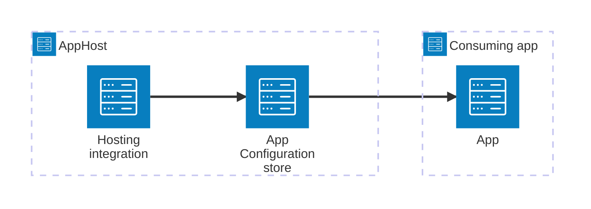

---
title: Get started with Azure App Configuration integrations
description: Understand why you use the Aspire Azure App Configuration integrations and how they fit together.
prev: false
---

import { Image } from 'astro:assets';
import { LinkButton, Steps } from '@astrojs/starlight/components';
import appConfigIcon from '@assets/icons/azure-appconfig-icon.png';

<Image
  src={appConfigIcon}
  alt="Azure App Configuration logo"
  width={100}
  height={100}
  class:list={'float-inline-left icon'}
  data-zoom-off
/>

[Azure App Configuration](https://learn.microsoft.com/azure/azure-app-configuration/) provides a managed service for centrally managing application settings and feature flags. Modern programs — especially programs running in a cloud — generally have many distributed components. Spreading configuration settings across these components can lead to hard-to-troubleshoot errors during deployment. The Aspire Azure App Configuration integration lets you model an App Configuration store as a first-class resource in your AppHost, then hand the endpoint to any consuming app — regardless of language.

## Why use Azure App Configuration with Aspire

Adding Azure App Configuration through Aspire — rather than wiring up endpoint URLs and credentials by hand — gives you:

- **Zero-friction local development.** Aspire can run the Azure App Configuration emulator from the `azure-app-configuration/app-configuration-emulator` container image, so you can develop without a real Azure subscription.
- **Consistent connection info across languages.** Once you reference the App Configuration resource from a consuming app, Aspire injects the endpoint as an environment variable in a predictable format that works from C#, TypeScript, Python, Go, or any other language.
- **Role-based access control.** The hosting integration automatically provisions role assignments so your app can authenticate to the store using its managed identity.
- **Dashboard observability.** The App Configuration resource shows up in the Aspire dashboard with logs and status alongside your other services.
- **A first-class C# client integration.** C# apps can use the `Aspire.Microsoft.Extensions.Configuration.AzureAppConfiguration` package for automatic configuration provider registration and feature flag support — all wired up from the same resource name.

## How the pieces fit together

The Azure App Configuration integration has two sides: a **hosting integration** that you use in your AppHost to model the store resource, and a **connection story** for consuming apps that reference it.

The **hosting integration** lives in your AppHost project and models the App Configuration store as a resource. Consuming apps read the endpoint Aspire injects to talk to the store.

Getting there is a two-step process: model the App Configuration resource in your AppHost, then connect to it from each app that needs it.

<Steps>

1. ### Model Azure App Configuration in your AppHost

    Add the Azure App Configuration hosting integration to your AppHost, then declare a store resource and reference it from the apps that need to read configuration. The [Azure App Configuration Hosting integration](/integrations/cloud/azure/azure-app-configuration/azure-app-configuration-host/) article walks through every capability — provisioning, emulator, role assignments, and infrastructure customization — with side-by-side C# and TypeScript examples.

    <LinkButton
        variant='secondary'
        iconPlacement='end'
        icon='right-arrow'
        href='/integrations/cloud/azure/azure-app-configuration/azure-app-configuration-host/'>
        Set up Azure App Configuration in the AppHost
    </LinkButton>

2. ### Connect from your consuming app

    When you reference an Azure App Configuration resource from a consuming app, Aspire injects its endpoint as an environment variable. See [Connect to Azure App Configuration](/integrations/cloud/azure/azure-app-configuration/azure-app-configuration-connect/) for the connection properties reference and per-language examples for C#, Go, Python, and TypeScript.

    <LinkButton
        variant='secondary'
        iconPlacement='end'
        icon='right-arrow'
        href='/integrations/cloud/azure/azure-app-configuration/azure-app-configuration-connect/'>
        Connect to Azure App Configuration
    </LinkButton>

</Steps>

## See also

- [Azure App Configuration documentation](https://learn.microsoft.com/azure/azure-app-configuration/)
- [Local provisioning: Configuration](/integrations/cloud/azure/local-provisioning/)