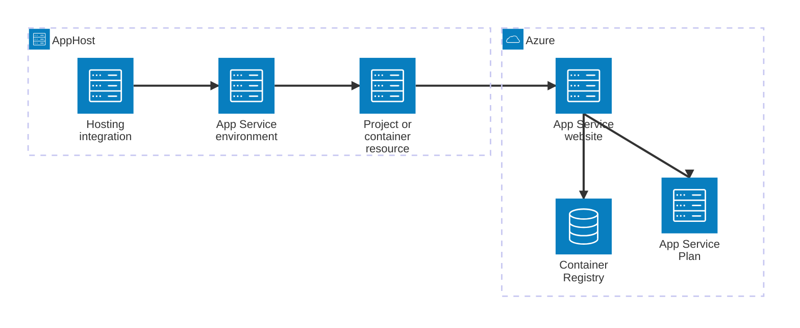

import { Image } from 'astro:assets';
import { Badge, LinkButton, Steps } from '@astrojs/starlight/components';
import appServiceIcon from '@assets/icons/azure-app-services.svg';

<Image
  src={appServiceIcon}
  alt="Azure App Service logo"
  height={100}
  width={100}
  class:list={'float-inline-left icon'}
  data-zoom-off
/>

<Badge text="🧪 Preview" variant="note" size="large" />

[Azure App Service](https://learn.microsoft.com/azure/app-service/) is a fully managed platform for building, deploying, and scaling web apps. Aspire apps run locally during development but require scalable, production-ready infrastructure for staging and production. The Aspire Azure App Service integration lets you model an App Service environment (App Service Plan) as a first-class resource in your AppHost and automatically deploy web-facing project resources and Dockerfile-backed containers to it.

## Why use Azure App Service with Aspire

Adding an Azure App Service environment through Aspire — rather than configuring deployment infrastructure by hand — gives you:

- **Zero extra local setup.** During development your projects run locally as usual. The App Service environment is only provisioned when you publish.
- **Automatic deployment targeting.** Once an App Service environment is in your AppHost, all supported compute resources (project resources and Dockerfile-backed containers) are deployed to it automatically — no extra wiring required.
- **Optional customization.** Use `PublishAsAzureAppServiceWebsite` (C#) or `publishAsAzureAppServiceWebsite` (TypeScript) only when you need to customize the generated website — for example to add application settings, tags, or deployment slots.
- **Deployment slots.** Stage changes safely by configuring a named deployment slot for the environment so that new deployments land in staging before you swap them to production.
- **Bicep-backed provisioning.** The hosting integration generates all required Azure resources — App Service Plan, Azure Container Registry, and managed identity — from the same C# or TypeScript AppHost code. No hand-authored Bicep required.

## How the pieces fit together

Azure App Service is a **deployment target**, not a data service. There is no client library to install in consuming apps. Instead, the hosting integration wires the App Service environment into the Aspire manifest so that [`aspire deploy`](/reference/cli/commands/aspire-deploy/) knows where to send each compute resource.

Getting there is a two-step process: model the App Service environment in your AppHost, then understand how your deployed apps read their runtime configuration.

<Steps>

1. ### Set up App Service in your AppHost

    Add the Azure App Service hosting integration to your AppHost, then declare an App Service environment. The [Azure App Service Hosting integration](/integrations/cloud/azure/azure-app-service/azure-app-service-host/) reference walks through every capability — deployment slots, infrastructure customization, application settings, and more — with side-by-side C# and TypeScript examples.

    <LinkButton
        variant='secondary'
        iconPlacement='end'
        icon='right-arrow'
        href='/integrations/cloud/azure/azure-app-service/azure-app-service-host/'>
        Set up App Service in the AppHost
    </LinkButton>

2. ### Runtime configuration in deployed apps

    When Aspire deploys a project to App Service, it injects connection strings and resource references as environment variables — the same values your app reads locally. See [Azure App Service runtime configuration](/integrations/cloud/azure/azure-app-service/azure-app-service-connect/) for details on how deployed apps consume those environment variables.

    <LinkButton
        variant='secondary'
        iconPlacement='end'
        icon='right-arrow'
        href='/integrations/cloud/azure/azure-app-service/azure-app-service-connect/'>
        Runtime configuration
    </LinkButton>

</Steps>

## See also

- [Local Azure provisioning](/integrations/cloud/azure/local-provisioning/)
- [Deploy your first Aspire app](/get-started/deploy-first-app/)
