import { Image } from 'astro:assets';
import { LinkButton, Steps } from '@astrojs/starlight/components';
import cacheRedisIcon from '@assets/icons/azure-cacheredis-icon.png';

<Image
  src={cacheRedisIcon}
  alt="Azure Cache for Redis logo"
  width={100}
  height={100}
  class:list={'float-inline-left icon'}
  data-zoom-off
/>

[Azure Cache for Redis](https://learn.microsoft.com/azure/azure-cache-for-redis/cache-overview) provides a fully managed, in-memory data store based on [Redis](https://redis.io/). It improves application performance and scalability by caching frequently accessed data in server memory. The Aspire Azure Cache for Redis integration lets you model a managed Redis cache as a first-class resource in your AppHost, then hand the connection information to any consuming app — regardless of language.

## Why use Azure Cache for Redis with Aspire

Adding Azure Cache for Redis through Aspire — rather than wiring up connection strings by hand — gives you:

- **Zero-config local development.** Aspire runs a Redis container locally during development so you don't need to provision an Azure resource until you're ready to deploy.
- **Consistent connection info across languages.** Once you reference the cache from a consuming app, Aspire injects connection properties as environment variables in a predictable format that works from C#, TypeScript, Python, Go, or any other language.
- **Managed identity by default.** The hosting integration configures Microsoft Entra ID (role-based) authentication out of the box, avoiding passwords in connection strings.
- **Automatic Azure provisioning.** Aspire generates Bicep for the Azure Cache for Redis resource so you can deploy to Azure without writing infrastructure code by hand.
- **Dashboard observability.** The cache resource shows up in the Aspire dashboard with logs, status, and telemetry alongside your other services.
- **Reuse the C# Redis client integration.** C# apps use the `Aspire.StackExchange.Redis` package for automatic dependency injection, health checks, and OpenTelemetry — the same client used for self-hosted Redis and Valkey.

## How the pieces fit together

The Azure Cache for Redis integration has two sides: a **hosting integration** that you use in your AppHost to model the managed Redis resource, and a **connection story** for consuming apps that reference it.

```mermaid
architecture-beta

  group apphost(server)[AppHost]
  group consumer(server)[Consuming app]

  service hosting(server)[Hosting integration] in apphost
  service redis(server)[Azure Managed Redis] in apphost

  service client(iconoir:server-connection)[Client integration] in consumer
  service app(server)[App] in consumer

  hosting:R --> L:redis
  redis:R --> L:client
  client:R --> L:app
```

The **hosting integration** lives in your AppHost project and models the Azure Cache for Redis resource. The **connection story** lives in each consuming app and uses the connection information Aspire injects to talk to the cache.

Getting there is a two-step process: model the Azure Cache for Redis resource in your AppHost, then connect to the cache from each app that needs it.

<Steps>

1. ### Model Azure Cache for Redis in your AppHost

    Add the Azure Cache for Redis hosting integration to your AppHost, then declare a managed Redis resource and reference it from the apps that need to talk to the cache. The [Azure Cache for Redis Hosting integration](/integrations/cloud/azure/azure-cache-redis/azure-cache-redis-host/) reference walks through every capability — running as a local container for development, Entra ID versus access key authentication, connecting to an existing instance, and Bicep provisioning customization — with side-by-side C# and TypeScript examples.

    <LinkButton
        variant='secondary'
        iconPlacement='end'
        icon='right-arrow'
        href='/integrations/cloud/azure/azure-cache-redis/azure-cache-redis-host/'>
        Set up Azure Cache for Redis in the AppHost
    </LinkButton>

2. ### Connect from your consuming app

    When you reference an Azure Cache for Redis resource from a consuming app, Aspire injects its connection information as environment variables. See [Connect to Azure Cache for Redis](/integrations/cloud/azure/azure-cache-redis/azure-cache-redis-connect/) for the connection properties reference and per-language examples for C#, Go, Python, and TypeScript — including the full C# client integration built on `Aspire.StackExchange.Redis`.

    <LinkButton
        variant='secondary'
        iconPlacement='end'
        icon='right-arrow'
        href='/integrations/cloud/azure/azure-cache-redis/azure-cache-redis-connect/'>
        Connect to Azure Cache for Redis
    </LinkButton>

</Steps>

## See also

- [Redis integration](/integrations/caching/redis/redis-get-started/) — Azure Cache for Redis shares the same C# client integration as Redis.
- [Redis distributed caching](/integrations/caching/redis-distributed/redis-distributed-get-started/)
- [Redis output caching](/integrations/caching/redis-output/redis-output-get-started/)
- [Valkey integration](/integrations/caching/valkey/valkey-get-started/) — RESP-compatible open-source Redis alternative.
