import { Image } from 'astro:assets';
import { Aside, CardGrid, LinkButton, LinkCard, Steps } from '@astrojs/starlight/components';
import InstallPackage from '@components/InstallPackage.astro';
import containerRegistryIcon from '@assets/icons/azure-container-registry-icon.svg';

<Image
  src={containerRegistryIcon}
  alt="Azure Container Registry logo"
  width={100}
  height={100}
  class:list={'float-inline-left icon'}
  data-zoom-off
/>

[Azure Container Registry](https://learn.microsoft.com/azure/container-registry/) is a managed, private Docker container registry service that simplifies storing, managing, and deploying container images. The Aspire Azure Container Registry integration lets you model a registry as a first-class resource in your AppHost and wire it to compute environments so images are pushed and pulled securely during deployment.

## Why use Azure Container Registry with Aspire

Modeling an Azure Container Registry through Aspire — rather than manually configuring a registry and propagating credentials — gives you:

- **Automatic credential flow.** When you attach a registry to a compute environment such as Azure Container Apps, Aspire provisions the necessary role assignments and managed-identity bindings so images are pulled without storing credentials in configuration.
- **Declarative infrastructure.** The hosting integration generates the Azure Bicep that provisions the registry alongside the rest of your app's infrastructure, keeping everything version-controlled.
- **Fine-grained access control.** Use role assignments — such as `AcrPush` — to grant individual project resources permission to push images to the registry.
- **Automated image cleanup.** Schedule ACR purge tasks to remove old images and control storage costs without manual intervention.
- **Reference existing registries.** Use a registry your team already manages by referencing it with `publishAsExisting` or `asExisting` rather than provisioning a new one.

## How the pieces fit together

Azure Container Registry is a **publish-target** integration. Unlike database or cache integrations, there is no runtime client library for your app to call — the registry is consumed by the deployment pipeline when container images are pushed and by compute environments when they pull images.

```mermaid
architecture-beta

  group apphost(server)[AppHost]
  group deploy(cloud)[Deployment]

  service hosting(server)[Hosting integration] in apphost
  service acr(logos:microsoft-azure)[Azure Container Registry] in apphost

  service compute(logos:microsoft-azure)[Compute environment] in deploy
  service pipeline(server)[Image push pipeline] in deploy

  hosting:R --> L:acr
  acr:R --> L:compute
  acr:B --> T:pipeline
```



The **hosting integration** lives in your AppHost project and models the registry resource. At deployment time, the compute environment pulls images from the registry using the credentials Aspire provisions, and your CI/CD pipeline pushes images to it.

Getting there is a two-step process: model the registry in your AppHost, then understand how it is consumed at deploy time.

<Steps>

1. ### Model Azure Container Registry in your AppHost

    Add the Azure Container Registry hosting integration to your AppHost, then declare a registry resource and wire it to a compute environment. The [Azure Container Registry Hosting integration](/integrations/cloud/azure/azure-container-registry/azure-container-registry-host/) reference walks through every capability — provisioning a new registry, referencing an existing one, scheduling image cleanup with purge tasks, role assignments, and customizing the generated Bicep — with side-by-side C# and TypeScript examples.

    <LinkButton
        variant='secondary'
        iconPlacement='end'
        icon='right-arrow'
        href='/integrations/cloud/azure/azure-container-registry/azure-container-registry-host/'>
        Set up Azure Container Registry in the AppHost
    </LinkButton>

2. ### Use the registry at deploy time

    When your app deploys, Aspire uses the registry resource to wire up image push and pull workflows. See [Connect to Azure Container Registry](/integrations/cloud/azure/azure-container-registry/azure-container-registry-connect/) for the registry outputs reference — including `loginServer` — and guidance on integrating the registry into your deployment pipeline.

    <LinkButton
        variant='secondary'
        iconPlacement='end'
        icon='right-arrow'
        href='/integrations/cloud/azure/azure-container-registry/azure-container-registry-connect/'>
        Use Azure Container Registry at deploy time
    </LinkButton>

</Steps>

## See also

- [Azure Container Registry documentation](https://learn.microsoft.com/azure/container-registry/)
- [Configure Azure Container Apps environments](/integrations/cloud/azure/configure-container-apps/)

<Image
  src={containerRegistryIcon}
  alt="Azure Container Registry logo"
  height={80}
  width={80}
  class:list={'float-inline-left icon'}
  data-zoom-off
/>

[Azure Container Registry](https://learn.microsoft.com/azure/container-registry) is a managed Docker container registry service that simplifies the storage, management, and deployment of container images. The Aspire integration allows you to provision or reference an existing Azure Container Registry and seamlessly integrate it with your app's compute environments.

In this introduction, you'll see how to install and use the Aspire Azure Container Registry integration in a simple configuration. If you already have this knowledge, see [Azure Container Registry Hosting integration](/integrations/cloud/azure/azure-container-registry/azure-container-registry-host/) for full reference details.

<Aside type="note">
    To follow this guide, you must have created an Aspire solution to work with. To learn how to do that, see [Build your first Aspire app](/get-started/first-app/).
</Aside>

## Key capabilities

Aspire apps often build and run container images locally but require secure registries for staging and production environments. The Azure Container Registry integration provides the following capabilities:

- Provision or reference an existing Azure Container Registry.
- Attach the registry to any compute-environment resource (for example, Azure Container Apps, Docker, Kubernetes) to ensure proper credential flow.
- Grant fine-grained ACR role assignments to other Azure resources.

## Supported scenarios

The Azure Container Registry integration supports the following scenarios:

- **Provisioning a new registry**: Automatically create a new Azure Container Registry for your app.
- **Referencing an existing registry**: Use an existing Azure Container Registry by providing its name and resource group.
- **Credential management**: Automatically flow credentials to compute environments for secure image pulls.
- **Role assignments**: Assign specific roles (for example, `AcrPush`) to enable services to push images to the registry.

## Set up hosting integration

To begin, install the Aspire Azure Container Registry Hosting integration in your Aspire AppHost project. This integration allows you to create and manage Azure Container Registry resources from your Aspire hosting projects:

<InstallPackage packageName="Aspire.Hosting.Azure.ContainerRegistry" />

Next, in the AppHost project, create an Azure Container Registry resource and wire it to a compute environment:

```csharp title="C# — AppHost.cs"
var builder = DistributedApplication.CreateBuilder(args);

// Add (or reference) the registry
var acr = builder.AddAzureContainerRegistry("my-acr");

// Wire an environment to that registry
builder.AddAzureContainerAppEnvironment("env")
       .WithAzureContainerRegistry(acr);

builder.Build().Run();
```

The preceding code:

- Creates a new Azure Container Registry named `my-acr`.
- Attaches the registry to an Azure Container Apps environment named `env`.

## Continue learning

For more information on how the Azure Container Registry integration works, see:

<CardGrid>
    <LinkCard
        href="/integrations/cloud/azure/azure-container-registry/azure-container-registry-host/"
        title="Hosting integration"
        description="Learn more about the Hosting integration" />
</CardGrid>
