import { Image } from 'astro:assets';
import { LinkButton, Steps } from '@astrojs/starlight/components';
import cosmosDbIcon from '@assets/icons/azure-cosmosdb-icon.png';

<Image
  src={cosmosDbIcon}
  alt="Azure Cosmos DB logo"
  width={100}
  height={100}
  class:list={'float-inline-left icon'}
  data-zoom-off
/>

[Azure Cosmos DB](https://learn.microsoft.com/azure/cosmos-db/) is a fully managed, globally distributed NoSQL database built for modern app development. The Aspire Azure Cosmos DB integration lets you model a Cosmos DB account, its databases, and containers as first-class resources in your AppHost, then hand the connection information to any consuming app — regardless of language.

## Why use Azure Cosmos DB with Aspire

Adding Azure Cosmos DB through Aspire — rather than wiring up endpoints and connection strings by hand — gives you:

- **Zero-config local development.** Aspire runs the [Azure Cosmos DB Emulator](https://learn.microsoft.com/azure/cosmos-db/local-emulator) from the `mcr.microsoft.com/cosmosdb/emulator` container image with no configuration required. A Linux-based preview emulator with a built-in Data Explorer is also available.
- **Consistent connection info across languages.** Once you reference a Cosmos DB account, database, or container from a consuming app, Aspire injects connection properties as environment variables in a predictable format that works from C#, TypeScript, Python, Go, or any other language.
- **Built-in health checks.** The hosting integration automatically registers a health check so the dashboard and your orchestrator can tell when the account is ready.
- **Dashboard observability.** The Cosmos DB resource shows up in the Aspire dashboard with logs, status, and telemetry alongside your other services.
- **A first-class C# client integration.** C# apps can use the `Aspire.Microsoft.Azure.Cosmos` package for dependency injection, health checks, and OpenTelemetry — all wired up from the same resource name. An Entity Framework Core variant is also available.
- **An upgrade path to managed Azure.** The same AppHost model generates Bicep automatically and provisions a real Azure Cosmos DB account when you deploy.

## How the pieces fit together

The Azure Cosmos DB integration has two sides: a **hosting integration** that you use in your AppHost to model the Cosmos DB resources, and a **connection story** for consuming apps that reference them.

```mermaid
architecture-beta

  group apphost(server)[AppHost]
  group consumer(server)[Consuming app]

  service hosting(server)[Hosting integration] in apphost
  service cosmos(database)[Cosmos DB account] in apphost
  service db(database)[cosmosdb] in apphost

  service client(iconoir:server-connection)[Client integration] in consumer
  service app(server)[App] in consumer

  hosting:R --> L:cosmos
  cosmos:R --> L:db
  db:R --> L:client
  client:R --> L:app
```

The **hosting integration** lives in your AppHost project and models the Cosmos DB account, databases, and containers as resources. The **client integration** lives in each consuming app and uses the connection information Aspire injects to talk to Cosmos DB.

Getting there is a two-step process: model the Cosmos DB resources in your AppHost, then connect to the account or database from each app that needs it.

<Steps>

1. ### Model Azure Cosmos DB in your AppHost

    Add the Azure Cosmos DB hosting integration to your AppHost, then declare a Cosmos DB account, add databases and containers, and reference them from the apps that need them. The [Azure Cosmos DB Hosting integration](/integrations/cloud/azure/azure-cosmos-db/azure-cosmos-db-host/) article walks through every capability — running the emulator, adding databases and containers, partition keys, access key authentication, and infrastructure customization — with side-by-side C# and TypeScript examples.

    <LinkButton
        variant='secondary'
        iconPlacement='end'
        icon='right-arrow'
        href='/integrations/cloud/azure/azure-cosmos-db/azure-cosmos-db-host/'>
        Set up Azure Cosmos DB in the AppHost
    </LinkButton>

2. ### Connect from your consuming app

    When you reference a Cosmos DB resource from a consuming app, Aspire injects its connection information as environment variables. See [Connect to Azure Cosmos DB](/integrations/cloud/azure/azure-cosmos-db/azure-cosmos-db-connect/) for the connection properties reference and per-language examples for C#, Go, Python, and TypeScript — including the full C# client integration that registers a `CosmosClient`.

    <LinkButton
        variant='secondary'
        iconPlacement='end'
        icon='right-arrow'
        href='/integrations/cloud/azure/azure-cosmos-db/azure-cosmos-db-connect/'>
        Connect to Azure Cosmos DB
    </LinkButton>

</Steps>

## See also

- [Azure Cosmos DB for NoSQL documentation](https://learn.microsoft.com/azure/cosmos-db/nosql/)
- [Azure Cosmos DB Emulator](https://learn.microsoft.com/azure/cosmos-db/local-emulator)
- [Entity Framework Core — Azure Cosmos DB integration](/integrations/databases/efcore/azure-cosmos-db/azure-cosmos-db-get-started/)