import { Image } from 'astro:assets';
import { LinkButton, Steps } from '@astrojs/starlight/components';
import eventHubsIcon from '@assets/icons/azure-eventhubs-icon.png';

<Image
  src={eventHubsIcon}
  alt="Azure Event Hubs logo"
  width={100}
  height={100}
  class:list={'float-inline-left icon'}
  data-zoom-off
/>

[Azure Event Hubs](https://learn.microsoft.com/azure/event-hubs/) is a native data-streaming service in the cloud that can stream millions of events per second, with low latency, from any source to any destination. The Aspire Azure Event Hubs integration lets you model an Event Hubs namespace and its hubs as first-class resources in your AppHost, then hand the connection information to any consuming app — regardless of language.

## Why use Azure Event Hubs with Aspire

Adding Azure Event Hubs through Aspire — rather than wiring up connection strings by hand — gives you:

- **Zero-config local development.** Aspire can run an Azure Event Hubs emulator locally using the `mcr.microsoft.com/azure-messaging/eventhubs-emulator/latest` container image, so you can develop and test without an Azure subscription.
- **Consistent connection info across languages.** Once you reference a hub from a consuming app, Aspire injects connection properties as environment variables in a predictable format that works from C#, TypeScript, Python, Go, or any other language.
- **Built-in health checks.** The hosting integration automatically registers a health check so the Aspire dashboard and your orchestrator can tell when Event Hubs is ready.
- **Dashboard observability.** The Event Hubs resource shows up in the Aspire dashboard with logs, status, and telemetry alongside your other services.
- **A first-class C# client integration.** C# apps can use the `Aspire.Azure.Messaging.EventHubs` package for dependency injection, health checks, and OpenTelemetry, all wired up from the same resource name.
- **An upgrade path to managed Azure.** The same AppHost model provisions real Azure Event Hubs namespaces via generated Bicep when you're ready to deploy.

## How the pieces fit together

The Azure Event Hubs integration has two sides: a **hosting integration** that you use in your AppHost to model the namespace and hub resources, and a **connection story** for consuming apps that reference them.

```mermaid
architecture-beta

  group apphost(server)[AppHost]
  group consumer(server)[Consuming app]

  service hosting(server)[Hosting integration] in apphost
  service ns(server)[Event Hubs namespace] in apphost
  service hub(database)[messages hub] in apphost

  service client(iconoir:server-connection)[Client integration] in consumer
  service app(server)[App] in consumer

  hosting:R --> L:ns
  ns:R --> L:hub
  hub:R --> L:client
  client:R --> L:app
```

The **hosting integration** lives in your AppHost project and models the Event Hubs namespace, hubs, and consumer groups as resources. The **client integration** lives in each consuming app and uses the connection information Aspire injects to send and receive events.

Getting there is a two-step process: model the Event Hubs resources in your AppHost, then connect from each app that needs them.

<Steps>

1. ### Model Azure Event Hubs in your AppHost

    Add the Azure Event Hubs hosting integration to your AppHost, then declare a namespace, one or more hubs, optional consumer groups, and reference them from the apps that need to send or receive events. The [Azure Event Hubs Hosting integration](/integrations/cloud/azure/azure-event-hubs/azure-event-hubs-host/) reference walks through every capability — adding hubs, consumer groups, the local emulator, provisioning infrastructure, and role assignments — with side-by-side C# and TypeScript examples.

    <LinkButton
        variant='secondary'
        iconPlacement='end'
        icon='right-arrow'
        href='/integrations/cloud/azure/azure-event-hubs/azure-event-hubs-host/'>
        Set up Azure Event Hubs in the AppHost
    </LinkButton>

2. ### Connect from your consuming app

    When you reference an Azure Event Hubs resource from a consuming app, Aspire injects its connection information as environment variables. See [Connect to Azure Event Hubs](/integrations/cloud/azure/azure-event-hubs/azure-event-hubs-connect/) for the connection properties reference and per-language examples for C#, Go, Python, and TypeScript — including the full C# client integration.

    <LinkButton
        variant='secondary'
        iconPlacement='end'
        icon='right-arrow'
        href='/integrations/cloud/azure/azure-event-hubs/azure-event-hubs-connect/'>
        Connect to Azure Event Hubs
    </LinkButton>

</Steps>
