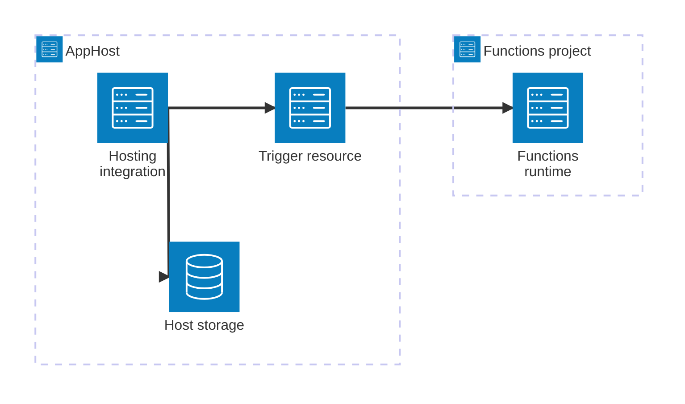

import { Image } from 'astro:assets';
import { LinkButton, Steps } from '@astrojs/starlight/components';
import functionsIcon from '@assets/icons/azure-functionapps-icon.png';

<Image
  src={functionsIcon}
  alt="Azure Functions logo"
  width={100}
  height={100}
  class:list={'float-inline-left icon'}
  data-zoom-off
/>

[Azure Functions](https://learn.microsoft.com/azure/azure-functions/) is a serverless compute service that lets you run event-triggered code without having to explicitly provision or manage infrastructure. The Aspire Azure Functions integration lets you model a Functions project as a first-class compute resource in your AppHost, wire it up to storage, messaging, and database resources, and configure bindings automatically through Aspire-injected environment variables.

## Why use Azure Functions with Aspire

Adding Azure Functions through Aspire — rather than configuring host JSON and connection strings by hand — gives you:

- **Zero-config local development.** Aspire starts a local Azure Functions host, wires up Azurite for the required host storage, and injects connection strings for any Azure resource you reference from the AppHost.
- **Consistent resource references.** Trigger and binding configuration for Service Bus, Storage, Cosmos DB, and Event Hubs is automatically injected into the Functions host at run time.
- **Dashboard observability.** The Functions project shows up in the Aspire dashboard with logs, status, and telemetry alongside your other services.
- **KEDA-based deployment.** When deployed to Azure Container Apps, the integration configures KEDA auto-scaling rules for your functions automatically.
- **Durable Task Scheduler support.** Attach a local or existing Durable Task Scheduler with `AddDurableTaskScheduler` and a named task hub.

## How the pieces fit together

The Azure Functions integration has one side: a **hosting integration** that you use in your AppHost to model the Functions project as a compute resource. Azure Functions is not a backing service — it consumes other resources rather than providing connection information to them.

The **hosting integration** lives in your AppHost project and models the Azure Functions project and its resource dependencies. At run time, the Functions project reads Aspire-injected environment variables to connect to triggers and bindings.

Getting there is a two-step process: model the Functions project in your AppHost, then configure your function bindings to read the injected connection information.

<Steps>

1. ### Model Azure Functions in your AppHost

    Add the Azure Functions hosting integration to your AppHost, then declare a Functions project and reference the Azure resources it needs. The [Azure Functions Hosting integration](/integrations/cloud/azure/azure-functions/azure-functions-host/) reference walks through every capability — host storage, resource references, external HTTP endpoints, Durable Task Scheduler, and more — with side-by-side C# and TypeScript examples.

    <LinkButton
        variant='secondary'
        iconPlacement='end'
        icon='right-arrow'
        href='/integrations/cloud/azure/azure-functions/azure-functions-host/'>
        Set up Azure Functions in the AppHost
    </LinkButton>

2. ### Configure runtime bindings

    When your AppHost references other Azure resources from the Functions project, Aspire injects connection information as environment variables into the Functions host. See [Azure Functions runtime configuration](/integrations/cloud/azure/azure-functions/azure-functions-connect/) for how to read those values in .NET isolated worker, TypeScript/JavaScript, and Python functions, and for cross-links to binding-specific integration articles.

    <LinkButton
        variant='secondary'
        iconPlacement='end'
        icon='right-arrow'
        href='/integrations/cloud/azure/azure-functions/azure-functions-connect/'>
        Configure runtime bindings
    </LinkButton>

</Steps>

## Supported triggers

The following table lists the supported triggers for Azure Functions in the Aspire integration:

| Trigger | Attribute | Details |
|--|--|--|
| Azure Event Hubs trigger | `EventHubTrigger` | [📦 Aspire.Hosting.Azure.EventHubs](https://www.nuget.org/packages/Aspire.Hosting.Azure.EventHubs) |
| Azure Service Bus trigger | `ServiceBusTrigger` | [📦 Aspire.Hosting.Azure.ServiceBus](https://www.nuget.org/packages/Aspire.Hosting.Azure.ServiceBus) |
| Azure Storage Blobs trigger | `BlobTrigger` | [📦 Aspire.Hosting.Azure.Storage](https://www.nuget.org/packages/Aspire.Hosting.Azure.Storage) |
| Azure Storage Queues trigger | `QueueTrigger` | [📦 Aspire.Hosting.Azure.Storage](https://www.nuget.org/packages/Aspire.Hosting.Azure.Storage) |
| Azure CosmosDB trigger | `CosmosDbTrigger` | [📦 Aspire.Hosting.Azure.CosmosDB](https://www.nuget.org/packages/Aspire.Hosting.Azure.CosmosDB) |
| HTTP trigger | `HttpTrigger` | Supported without any additional resource dependencies. |
| Timer trigger | `TimerTrigger` | Supported without any additional resource dependencies — relies on implicit host storage. |

:::caution
Other Azure Functions triggers and bindings are not currently supported in the Aspire Azure Functions integration.
:::

## See also

- [Azure Functions and Aspire integration](https://learn.microsoft.com/azure/azure-functions/dotnet-aspire-integration)
- [Azure Service Bus integration](/integrations/cloud/azure/azure-service-bus/azure-service-bus-get-started/)
- [Azure Blob Storage integration](/integrations/cloud/azure/azure-storage-blobs/azure-storage-blobs-get-started/)
