import { Image } from 'astro:assets';
import { LinkButton, Steps } from '@astrojs/starlight/components';
import keyVaultIcon from '@assets/icons/azure-keyvault-icon.png';

<Image
  src={keyVaultIcon}
  alt="Azure Key Vault logo"
  width={100}
  height={100}
  class:list={'float-inline-left icon'}
  data-zoom-off
/>

[Azure Key Vault](https://learn.microsoft.com/azure/key-vault/general/overview) helps safeguard cryptographic keys and secrets used by cloud applications and services. The Aspire Azure Key Vault integration lets you model a Key Vault resource as a first-class resource in your AppHost, then hand the vault URI and secret references to any consuming app — regardless of language.

## Why use Azure Key Vault with Aspire

Adding Azure Key Vault through Aspire — rather than wiring up vault URIs and credentials by hand — gives you:

- **Consistent connection info across languages.** Once you reference the Key Vault from a consuming app, Aspire injects the vault URI as an environment variable in a predictable format that works from C#, TypeScript, Python, Go, or any other language.
- **Role-based access managed for you.** Aspire automatically creates the Azure RBAC role assignments your services need to access the vault, and lets you customize them.
- **Secret references in the AppHost.** You can reference Key Vault secrets directly from your AppHost to pass secret values to other resources without storing them in plain text.
- **Dashboard observability.** The Key Vault resource shows up in the Aspire dashboard with status alongside your other services.
- **A first-class C# client integration.** C# apps can use the `Aspire.Azure.Security.KeyVault` package for dependency injection, health checks, and OpenTelemetry, all wired up from the same resource name.
- **Azure provisioning built in.** Aspire generates the Bicep needed to provision your Key Vault in Azure with the right SKU and RBAC settings.

## How the pieces fit together

The Azure Key Vault integration has two sides: a **hosting integration** that you use in your AppHost to model the Key Vault resource, and a **connection story** for consuming apps that reference it.

```mermaid
architecture-beta

  group apphost(server)[AppHost]
  group consumer(server)[Consuming app]

  service hosting(server)[Hosting integration] in apphost
  service kv(server)[Azure Key Vault] in apphost

  service client(iconoir:server-connection)[Client integration] in consumer
  service app(server)[App] in consumer

  hosting:R --> L:kv
  kv:R --> L:client
  client:R --> L:app
```

The **hosting integration** lives in your AppHost project and models the Key Vault resource. The **client integration** lives in each consuming app and uses the vault URI that Aspire injects to talk to Azure Key Vault.

Getting there is a two-step process: model the Key Vault resource in your AppHost, then connect to it from each app that needs it.

<Steps>

1. ### Model Azure Key Vault in your AppHost

    Add the Azure Key Vault hosting integration to your AppHost, then declare a Key Vault resource and reference it from the apps that need to access secrets. The [Azure Key Vault Hosting integration](/integrations/cloud/azure/azure-key-vault/azure-key-vault-host/) article walks through every capability — connecting to existing vaults, role assignments, secret references, and infrastructure customization — with side-by-side C# and TypeScript examples.

    <LinkButton
        variant='secondary'
        iconPlacement='end'
        icon='right-arrow'
        href='/integrations/cloud/azure/azure-key-vault/azure-key-vault-host/'>
        Set up Azure Key Vault in the AppHost
    </LinkButton>

2. ### Connect from your consuming app

    When you reference an Azure Key Vault resource from a consuming app, Aspire injects the vault URI as an environment variable. See [Connect to Azure Key Vault](/integrations/cloud/azure/azure-key-vault/azure-key-vault-connect/) for the connection properties reference and per-language examples for C#, Go, Python, and TypeScript — including the full C# client integration.

    <LinkButton
        variant='secondary'
        iconPlacement='end'
        icon='right-arrow'
        href='/integrations/cloud/azure/azure-key-vault/azure-key-vault-connect/'>
        Connect to Azure Key Vault
    </LinkButton>

</Steps>

## See also

- [Azure Key Vault documentation](https://learn.microsoft.com/azure/key-vault/)
- [Local Azure provisioning](/integrations/cloud/azure/local-provisioning/)
