---
title: Get started with the Azure OpenAI integrations
description: Understand how the Aspire Azure OpenAI integrations fit together — provision an Azure OpenAI resource in your AppHost, then connect to it from any consuming app.
prev: false
---

import { Image } from 'astro:assets';
import { LinkButton, Steps } from '@astrojs/starlight/components';
import openaiIcon from '@assets/icons/azure-openai-icon.png';

<Image
  src={openaiIcon}
  alt="Azure OpenAI logo"
  width={100}
  height={100}
  class:list={'float-inline-left icon'}
  data-zoom-off
/>

[Azure OpenAI Service](https://learn.microsoft.com/azure/ai-services/openai/) provides access to OpenAI's powerful language and embedding models with the security and enterprise promise of Azure. The Aspire Azure OpenAI integration lets you model an Azure OpenAI account and one or more model deployments as first-class resources in your AppHost, then hand the connection information to any consuming app — regardless of language.

## Why use Azure OpenAI with Aspire

Adding Azure OpenAI through Aspire — rather than hard-coding endpoints and credentials in each service — gives you:

- **Managed-identity by default.** Aspire provisions Azure OpenAI with `disableLocalAuth: true` and automatically creates the `CognitiveServicesOpenAIUser` role assignment for each consuming app, so no API key is ever stored in your code or configuration.
- **Consistent connection info across languages.** Once you reference the deployment from a consuming app, Aspire injects connection properties as environment variables in a predictable format that works from C#, TypeScript, Python, Go, or any other language.
- **Declarative Bicep provisioning.** Aspire generates Bicep for the Azure Cognitive Services account and role assignments from your C# or TypeScript AppHost code — no hand-authoring required.
- **Dashboard observability.** The Azure OpenAI resource and its deployments show up in the Aspire dashboard with status and telemetry alongside your other services.
- **A first-class C# client integration.** C# apps can use the `Aspire.Azure.AI.OpenAI` package for dependency injection, health checks, and OpenTelemetry, all wired up from the same resource name.
- **A path to existing Azure resources.** Point to an already-deployed Azure OpenAI account in your Azure subscription without re-provisioning anything.

## How the pieces fit together

The Azure OpenAI integration has two sides: a **hosting integration** that you use in your AppHost to provision the Azure OpenAI resource and its deployments, and a **connection story** for consuming apps that reference those deployments.

```mermaid
architecture-beta

  group apphost(server)[AppHost]
  group consumer(server)[Consuming app]

  service hosting(server)[Hosting integration] in apphost
  service openai(cloud)[Azure OpenAI] in apphost
  service deployment(database)[chat deployment] in apphost

  service client(iconoir:server-connection)[Client integration] in consumer
  service app(server)[App] in consumer

  hosting:R --> L:openai
  openai:R --> L:deployment
  deployment:R --> L:client
  client:R --> L:app
```

The **hosting integration** lives in your AppHost project and models the Azure OpenAI account and deployment resources. The **client integration** lives in each consuming app and uses the connection information Aspire injects to call the Azure OpenAI API.

Getting there is a two-step process: model the Azure OpenAI resources in your AppHost, then connect to the API from each app that needs it.

<Steps>

1. ### Model Azure OpenAI in your AppHost

    Add the Azure OpenAI hosting integration to your AppHost, then declare an Azure OpenAI account and one or more model deployments, and reference them from the apps that need to call the API. The [Azure OpenAI hosting integration](/integrations/cloud/azure/azure-openai/azure-openai-host/) reference walks through every capability — adding deployments, connecting to existing accounts, managed identity and role assignments, Bicep provisioning, and infrastructure customization — with side-by-side C# and TypeScript examples.

    <LinkButton
        variant='secondary'
        iconPlacement='end'
        icon='right-arrow'
        href='/integrations/cloud/azure/azure-openai/azure-openai-host/'>
        Set up Azure OpenAI in the AppHost
    </LinkButton>

2. ### Connect from your consuming app

    When you reference an Azure OpenAI deployment from a consuming app, Aspire injects its connection information as environment variables. See [Connect to Azure OpenAI](/integrations/cloud/azure/azure-openai/azure-openai-connect/) for the connection properties reference and per-language examples for C#, Go, Python, and TypeScript — including the full C# client integration.

    <LinkButton
        variant='secondary'
        iconPlacement='end'
        icon='right-arrow'
        href='/integrations/cloud/azure/azure-openai/azure-openai-connect/'>
        Connect to Azure OpenAI
    </LinkButton>

</Steps>

## See also

- [Azure OpenAI Service documentation](https://learn.microsoft.com/azure/ai-services/openai/)
- [Local provisioning: Configuration](/integrations/cloud/azure/local-provisioning/#configuration)
