import { Image } from 'astro:assets';
import { LinkButton, Steps } from '@astrojs/starlight/components';
import postgresqlIcon from '@assets/icons/azure-postgresql-icon.png';

<Image
  src={postgresqlIcon}
  alt="Azure Database for PostgreSQL logo"
  width={80}
  height={80}
  class:list={'float-inline-left icon'}
  data-zoom-off
/>

[Azure Database for PostgreSQL](https://learn.microsoft.com/azure/postgresql/) — Flexible Server is a fully managed relational database service built on the open-source PostgreSQL engine. It delivers mission-critical workloads with predictable performance, built-in high availability, and dynamic scalability. The Aspire Azure PostgreSQL integration lets you model an Azure PostgreSQL flexible server and its databases as first-class resources in your AppHost, then hand the connection information to any consuming app — regardless of language.

## Why use Azure Database for PostgreSQL with Aspire

Adding Azure PostgreSQL through Aspire — rather than managing connection strings and credentials by hand — gives you:

- **Managed identity by default.** Aspire configures [Microsoft Entra ID](https://learn.microsoft.com/azure/postgresql/flexible-server/concepts-azure-ad-authentication) authentication so no passwords are stored in your app configuration.
- **Easy local development.** Call `runAsContainer` (TypeScript) or `RunAsContainer` (C#) to run a local PostgreSQL container with auto-generated credentials instead of provisioning an Azure resource during development.
- **Consistent connection info across languages.** Once you reference the database from a consuming app, Aspire injects connection properties as environment variables in a predictable format that works from C#, TypeScript, Python, Go, or any other language.
- **Built-in health checks.** The hosting integration automatically registers a health check so the dashboard and your orchestrator can tell when the server is ready.
- **Dashboard observability.** The database resource shows up in the Aspire dashboard with logs, status, and telemetry alongside your other services.
- **Automatic Bicep generation.** When you publish your app, Aspire generates Azure Bicep for the flexible server, firewall rules, and role assignments so you don't need to write infrastructure-as-code by hand.
- **An upgrade path from local PostgreSQL.** If you already use the [PostgreSQL Hosting integration](/integrations/databases/postgres/postgres-host/), switching to Azure PostgreSQL is a single-line change in your AppHost.

## How the pieces fit together

The Azure PostgreSQL integration has two sides: a **hosting integration** that you use in your AppHost to model the flexible server and database resources, and a **connection story** for consuming apps that reference them.

```mermaid
architecture-beta

  group apphost(server)[AppHost]
  group consumer(server)[Consuming app]

  service hosting(server)[Hosting integration] in apphost
  service server(logos:postgresql)[Azure PG Flexible Server] in apphost
  service db(database)[postgresdb] in apphost

  service client(iconoir:server-connection)[Client and env vars] in consumer
  service app(server)[App] in consumer

  hosting:R --> L:server
  server:R --> L:db
  db:R --> L:client
  client:R --> L:app
```

The **hosting integration** lives in your AppHost project and models the Azure PostgreSQL flexible server and databases as resources. The **connection story** lives in each consuming app and uses the connection information Aspire injects to talk to the database.

Getting there is a two-step process: model the Azure PostgreSQL resources in your AppHost, then connect to the database from each app that needs it.

<Steps>

1. ### Model Azure PostgreSQL in your AppHost

    Add the Azure PostgreSQL hosting integration to your AppHost, then declare a flexible server, one or more databases, and reference them from the apps that need to talk to the database. The [Azure PostgreSQL Hosting integration](/integrations/cloud/azure/azure-postgresql/azure-postgresql-host/) article walks through every capability — adding databases, run-as-container for local dev, password authentication, existing server connections, Bicep customization, and more — with side-by-side C# and TypeScript examples.

    <LinkButton
        variant='secondary'
        iconPlacement='end'
        icon='right-arrow'
        href='/integrations/cloud/azure/azure-postgresql/azure-postgresql-host/'>
        Set up Azure PostgreSQL in the AppHost
    </LinkButton>

2. ### Connect from your consuming app

    When you reference an Azure PostgreSQL database from a consuming app, Aspire injects its connection information as environment variables. See [Connect to Azure PostgreSQL](/integrations/cloud/azure/azure-postgresql/azure-postgresql-connect/) for the connection properties reference and per-language examples for C#, Go, Python, and TypeScript — including the full C# client integration.

    <LinkButton
        variant='secondary'
        iconPlacement='end'
        icon='right-arrow'
        href='/integrations/cloud/azure/azure-postgresql/azure-postgresql-connect/'>
        Connect to Azure PostgreSQL
    </LinkButton>

</Steps>

## See also

- [PostgreSQL integrations](/integrations/databases/postgres/postgres-get-started/) — the non-Azure variant for pure local-container development.
- [PostgreSQL Entity Framework Core integrations](/integrations/databases/efcore/postgres/postgresql-get-started/) — use EF Core with the same Azure PostgreSQL resource.
