import { Image } from 'astro:assets';
import { LinkButton, Steps } from '@astrojs/starlight/components';
import serviceBusIcon from '@assets/icons/azure-servicebus-icon.png';

<Image
  src={serviceBusIcon}
  alt="Azure Service Bus logo"
  width={100}
  height={100}
  class:list={'float-inline-left icon'}
  data-zoom-off
/>

[Azure Service Bus](https://learn.microsoft.com/azure/service-bus-messaging/) is a fully managed enterprise message broker with message queues and publish-subscribe topics. The Aspire Azure Service Bus integration lets you model a Service Bus namespace and its queues, topics, and subscriptions as first-class resources in your AppHost, then hand the connection information to any consuming app — regardless of language.

## Why use Azure Service Bus with Aspire

Adding Azure Service Bus through Aspire — rather than wiring up connection strings and environment variables by hand — gives you:

- **Local emulator support.** Aspire can run the [Azure Service Bus Emulator](https://learn.microsoft.com/azure/service-bus-messaging/overview-emulator) as a container for local development, so you can develop and test messaging flows without an Azure subscription.
- **Consistent connection info across languages.** Once you reference a Service Bus resource from a consuming app, Aspire injects connection properties as environment variables in a predictable format that works from C#, TypeScript, Python, Go, or any other language.
- **Built-in health checks.** The hosting integration automatically registers a health check so the dashboard and your orchestrator can tell when the Service Bus resource is ready.
- **Dashboard observability.** Service Bus resources appear in the Aspire dashboard with logs, status, and telemetry alongside your other services.
- **A first-class C# client integration.** C# apps can use the `Aspire.Azure.Messaging.ServiceBus` package for automatic dependency injection of `ServiceBusClient`, health checks, and OpenTelemetry.
- **Role-based access control.** When provisioning in Azure, Aspire automatically generates Bicep that assigns the Azure Service Bus Data Owner role to your app's managed identity.

## How the pieces fit together

The Azure Service Bus integration has two sides: a **hosting integration** that you use in your AppHost to model the namespace and its resources, and a **connection story** for consuming apps that reference those resources.

```mermaid
architecture-beta

  group apphost(server)[AppHost]
  group consumer(server)[Consuming app]

  service hosting(server)[Hosting integration] in apphost
  service namespace(logos:microsoft-azure)[Service Bus namespace] in apphost
  service queue(server)[Queue or topic] in apphost

  service client(iconoir:server-connection)[Client integration] in consumer
  service app(server)[App] in consumer

  hosting:R --> L:namespace
  namespace:R --> L:queue
  queue:R --> L:client
  client:R --> L:app
```

The **hosting integration** lives in your AppHost project and models the Azure Service Bus namespace, queues, topics, and subscriptions as resources. The **client integration** lives in each consuming app and uses the connection information Aspire injects to talk to Service Bus.

Getting there is a two-step process: model the Service Bus resources in your AppHost, then connect from each app that needs them.

<Steps>

1. ### Model Azure Service Bus in your AppHost

    Add the Azure Service Bus hosting integration to your AppHost, then declare a Service Bus namespace and reference its queues or topics from the apps that need them. The [Azure Service Bus Hosting integration](/integrations/cloud/azure/azure-service-bus/azure-service-bus-host/) reference walks through every capability — adding queues, topics, subscriptions, the local emulator, existing namespaces, and provisioning customization — with side-by-side C# and TypeScript examples.

    <LinkButton
        variant='secondary'
        iconPlacement='end'
        icon='right-arrow'
        href='/integrations/cloud/azure/azure-service-bus/azure-service-bus-host/'>
        Set up Azure Service Bus in the AppHost
    </LinkButton>

2. ### Connect from your consuming app

    When you reference a Service Bus resource from a consuming app, Aspire injects its connection information as environment variables. See [Connect to Azure Service Bus](/integrations/cloud/azure/azure-service-bus/azure-service-bus-connect/) for the connection properties reference and per-language examples for C#, Go, Python, and TypeScript — including the full C# client integration.

    <LinkButton
        variant='secondary'
        iconPlacement='end'
        icon='right-arrow'
        href='/integrations/cloud/azure/azure-service-bus/azure-service-bus-connect/'>
        Connect to Azure Service Bus
    </LinkButton>

</Steps>

## See also

- [Azure Service Bus documentation](https://learn.microsoft.com/azure/service-bus-messaging/)
- [Azure Service Bus Emulator overview](https://learn.microsoft.com/azure/service-bus-messaging/overview-emulator)
