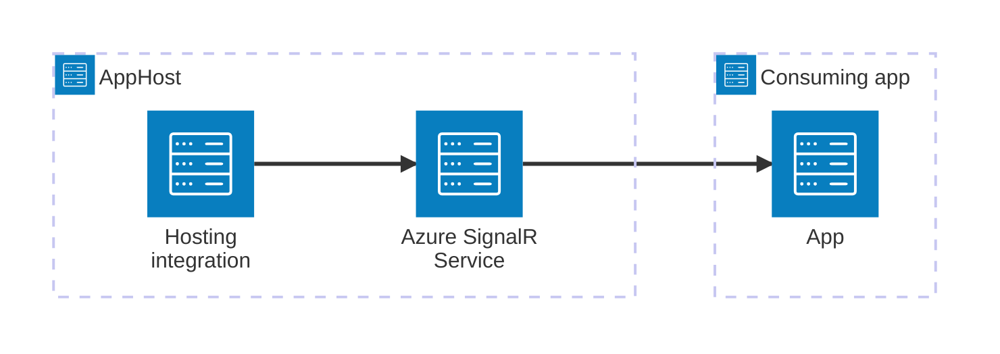

import { Image } from 'astro:assets';
import { LinkButton, Steps } from '@astrojs/starlight/components';
import signalrIcon from '@assets/icons/azure-signalr-icon.png';

<Image
  src={signalrIcon}
  alt="Azure SignalR Service icon"
  width={100}
  height={100}
  class:list={'float-inline-left icon'}
  data-zoom-off
/>

[Azure SignalR Service](https://learn.microsoft.com/azure/azure-signalr/) is a fully managed real-time messaging service that simplifies adding real-time web functionality to applications. The Aspire Azure SignalR Service integration lets you model a SignalR resource as a first-class resource in your AppHost, then hand the connection information to any consuming app.

## Why use Azure SignalR Service with Aspire

Adding Azure SignalR Service through Aspire — rather than wiring up connection strings and configuration by hand — gives you:

- **Consistent connection info.** Once you reference the SignalR resource from a consuming app, Aspire injects the endpoint as environment variables in a predictable format.
- **Local emulation.** In Serverless mode, Aspire can run the Azure SignalR emulator locally so you don't need an Azure subscription for development.
- **Built-in Bicep provisioning.** The hosting integration automatically generates the Azure infrastructure needed to provision your SignalR resource for cloud deployment.
- **Dashboard observability.** The SignalR resource shows up in the Aspire dashboard alongside your other services.
- **Managed identity support.** The generated Bicep disables local authentication by default, encouraging secure managed identity connections.

## How the pieces fit together

The Azure SignalR Service integration has two sides: a **hosting integration** that you use in your AppHost to model the SignalR resource, and a **connection story** for consuming apps that reference it.

The **hosting integration** lives in your AppHost project and models the Azure SignalR Service resource. Consuming apps reference the resource and use the injected endpoint to communicate with SignalR.

Getting there is a two-step process: model the Azure SignalR resource in your AppHost, then connect to it from each app that needs it.

<Steps>

1. ### Model Azure SignalR Service in your AppHost

    Add the Azure SignalR Service hosting integration to your AppHost, then declare a SignalR resource and reference it from the apps that need it. The [Azure SignalR Service hosting integration](/integrations/cloud/azure/azure-signalr/azure-signalr-host/) reference walks through every capability — service modes, emulator, connecting to existing resources, and Bicep customization — with side-by-side C# and TypeScript examples.

    <LinkButton
        variant='secondary'
        iconPlacement='end'
        icon='right-arrow'
        href='/integrations/cloud/azure/azure-signalr/azure-signalr-host/'>
        Set up Azure SignalR Service in the AppHost
    </LinkButton>

2. ### Connect from your consuming app

    When you reference an Azure SignalR Service resource from a consuming app, Aspire injects its endpoint as environment variables. See [Connect to Azure SignalR Service](/integrations/cloud/azure/azure-signalr/azure-signalr-connect/) for the connection properties reference and per-language examples for C#, Go, Python, and TypeScript.

    <LinkButton
        variant='secondary'
        iconPlacement='end'
        icon='right-arrow'
        href='/integrations/cloud/azure/azure-signalr/azure-signalr-connect/'>
        Connect to Azure SignalR Service
    </LinkButton>

</Steps>

## See also

- [Azure SignalR Service documentation](https://learn.microsoft.com/azure/azure-signalr/)
