import { Image } from 'astro:assets';
import { LinkButton, Steps } from '@astrojs/starlight/components';
import sqlServerIcon from '@assets/icons/azure-sqlserver-icon.png';

<Image
  src={sqlServerIcon}
  alt="Azure SQL Database logo"
  width={100}
  height={100}
  class:list={'float-inline-left icon'}
  data-zoom-off
/>

[Azure SQL Database](https://learn.microsoft.com/azure/azure-sql/) is a fully managed relational database service built on SQL Server, running in the Azure cloud as a Platform-as-a-Service (PaaS) offering. It delivers high availability, scalability, and automatic backups without requiring infrastructure management. The Aspire Azure SQL Database integration lets you model an Azure SQL server and its databases as first-class resources in your AppHost, then hand the connection information to any consuming app — regardless of language.

## Why use Azure SQL Database with Aspire

Adding Azure SQL Database through Aspire — rather than wiring up connection strings and provisioning infrastructure by hand — gives you:

- **Local development without Azure.** Call `runAsContainer()` to run SQL Server in a local container during development and testing, with the same connection story as the deployed Azure SQL Database.
- **Consistent connection info across languages.** Once you reference the database from a consuming app, Aspire injects connection properties as environment variables in a predictable format that works from C#, TypeScript, Python, Go, or any other language.
- **Managed identity and role-based access.** When deployed, Aspire automatically runs a deployment script that grants your app's managed identity access to the database — no passwords to rotate.
- **Built-in health checks.** The hosting integration automatically registers a health check so the dashboard and your orchestrator can tell when the server is ready.
- **Dashboard observability.** The database resource shows up in the Aspire dashboard with logs, status, and telemetry alongside your other services.
- **A first-class C# client integration.** C# apps can use the `Aspire.Microsoft.Data.SqlClient` package for dependency injection, health checks, and OpenTelemetry, all wired up from the same resource name.
- **Infrastructure as code through Bicep.** Aspire generates Bicep for the Azure SQL Server resource automatically, and you can customize it through the `ConfigureInfrastructure` API.

## How the pieces fit together

The Azure SQL Database integration has two sides: a **hosting integration** that you use in your AppHost to model the database resource, and a **connection story** for consuming apps that reference it.

```mermaid
architecture-beta

  group apphost(server)[AppHost]
  group consumer(server)[Consuming app]

  service hosting(server)[Hosting integration] in apphost
  service sql(logos:microsoft-azure)[Azure SQL Server] in apphost
  service db(database)[database] in apphost

  service client(iconoir:server-connection)[Client integration] in consumer
  service app(server)[App] in consumer

  hosting:R --> L:sql
  sql:R --> L:db
  db:R --> L:client
  client:R --> L:app
```

The **hosting integration** lives in your AppHost project and models the Azure SQL server and databases as resources. The **client integration** lives in each consuming app and uses the connection information Aspire injects to talk to the database.

Getting there is a two-step process: model the Azure SQL resources in your AppHost, then connect to the database from each app that needs it.

<Steps>

1. ### Model Azure SQL Database in your AppHost

    Add the Azure SQL Database hosting integration to your AppHost, then declare an Azure SQL server, one or more databases, and reference them from the apps that need to talk to the database. The [Azure SQL Database Hosting integration](/integrations/cloud/azure/azure-sql-database/azure-sql-database-host/) article walks through every capability — adding databases, running as a local SQL Server container, connecting to existing resources, managed identity, Bicep customization, and more — with side-by-side C# and TypeScript examples.

    <LinkButton
        variant='secondary'
        iconPlacement='end'
        icon='right-arrow'
        href='/integrations/cloud/azure/azure-sql-database/azure-sql-database-host/'>
        Set up Azure SQL Database in the AppHost
    </LinkButton>

2. ### Connect from your consuming app

    When you reference an Azure SQL Database resource from a consuming app, Aspire injects its connection information as environment variables. See [Connect to Azure SQL Database](/integrations/cloud/azure/azure-sql-database/azure-sql-database-connect/) for the connection properties reference and per-language examples for C#, Go, Python, and TypeScript — including the full C# client integration.

    <LinkButton
        variant='secondary'
        iconPlacement='end'
        icon='right-arrow'
        href='/integrations/cloud/azure/azure-sql-database/azure-sql-database-connect/'>
        Connect to Azure SQL Database
    </LinkButton>

</Steps>

## See also

- [Azure SQL Database EF Core integration](/integrations/databases/efcore/azure-sql/azure-sql-get-started/)
- [SQL Server integration](/integrations/databases/sql-server/sql-server-get-started/) — the local SQL Server container integration that `runAsContainer()` uses under the hood
