import { Image } from 'astro:assets';
import { LinkButton, Steps } from '@astrojs/starlight/components';
import storageIcon from '@assets/icons/azure-storagecontainer-icon.png';

<Image
  src={storageIcon}
  alt="Azure Blob Storage logo"
  width={100}
  height={100}
  class:list={'float-inline-left icon'}
  data-zoom-off
/>

[Azure Blob Storage](https://learn.microsoft.com/azure/storage/blobs/) is Microsoft's object storage solution for the cloud, optimized for storing massive amounts of unstructured data such as text, binary data, images, and documents. The Aspire Azure Blob Storage integration lets you model an Azure Storage account and its blob resources as first-class resources in your AppHost, then hand the connection information to any consuming app — regardless of language.

## Why use Azure Blob Storage with Aspire

Adding Azure Blob Storage through Aspire — rather than wiring up connection strings and environment variables by hand — gives you:

- **Zero-config local development.** Aspire runs Azure Storage locally using the [Azurite](https://learn.microsoft.com/azure/storage/common/storage-use-azurite) emulator container so you can develop without an active Azure subscription.
- **Consistent connection info across languages.** Once you reference a blob resource from a consuming app, Aspire injects connection properties as environment variables in a predictable format that works from C#, TypeScript, Python, Go, or any other language.
- **Built-in health checks.** The hosting integration automatically registers a health check so the dashboard and your orchestrator can tell when the storage service is ready.
- **Dashboard observability.** The storage resource appears in the Aspire dashboard with logs, status, and telemetry alongside your other services.
- **A first-class C# client integration.** C# apps can use the `Aspire.Azure.Storage.Blobs` package for dependency injection, health checks, and OpenTelemetry, all wired up from the same resource name.
- **An upgrade path to Azure.** The same AppHost model works locally with Azurite and deploys to a real Azure Storage account via Bicep-based provisioning.

## How the pieces fit together

The Azure Blob Storage integration has two sides: a **hosting integration** that you use in your AppHost to model the storage account and blob resources, and a **connection story** for consuming apps that reference them.

```mermaid
architecture-beta

  group apphost(server)[AppHost]
  group consumer(server)[Consuming app]

  service hosting(server)[Hosting integration] in apphost
  service storage(logos:microsoft-azure)[Azure Storage account] in apphost
  service blobs(disk)[Blob resource] in apphost

  service client(iconoir:server-connection)[Client integration] in consumer
  service app(server)[App] in consumer

  hosting:R --> L:storage
  storage:R --> L:blobs
  blobs:R --> L:client
  client:R --> L:app
```

The **hosting integration** lives in your AppHost project and models the Azure Storage account and blob resources. The **client integration** lives in each consuming app and uses the connection information Aspire injects to talk to blob storage.

Getting there is a two-step process: model the Azure Storage resources in your AppHost, then connect to blob storage from each app that needs it.

<Steps>

1. ### Model Azure Blob Storage in your AppHost

    Add the Azure Storage hosting integration to your AppHost, then declare a storage account, add blob resources, and reference them from the apps that need access. The [Azure Blob Storage Hosting integration](/integrations/cloud/azure/azure-storage-blobs/azure-storage-blobs-host/) article walks through every capability — adding blobs, blob containers, Azurite emulator configuration, role-based access, and infrastructure customization — with side-by-side C# and TypeScript examples.

    <LinkButton
        variant='secondary'
        iconPlacement='end'
        icon='right-arrow'
        href='/integrations/cloud/azure/azure-storage-blobs/azure-storage-blobs-host/'>
        Set up Azure Blob Storage in the AppHost
    </LinkButton>

2. ### Connect from your consuming app

    When you reference a blob resource from a consuming app, Aspire injects its connection information as environment variables. See [Connect to Azure Blob Storage](/integrations/cloud/azure/azure-storage-blobs/azure-storage-blobs-connect/) for the connection properties reference and per-language examples for C#, Go, Python, and TypeScript — including the full C# client integration.

    <LinkButton
        variant='secondary'
        iconPlacement='end'
        icon='right-arrow'
        href='/integrations/cloud/azure/azure-storage-blobs/azure-storage-blobs-connect/'>
        Connect to Azure Blob Storage
    </LinkButton>

</Steps>

## See also

- [Azure Blob Storage documentation](https://learn.microsoft.com/azure/storage/blobs/)
- [Azure Queue Storage integration](/integrations/cloud/azure/azure-storage-queues/azure-storage-queues-get-started/)
- [Azure Table Storage integration](/integrations/cloud/azure/azure-storage-tables/azure-storage-tables-get-started/)
