import { Image } from 'astro:assets';
import { LinkButton, Steps } from '@astrojs/starlight/components';
import queueIcon from '@assets/icons/azure-storagequeue-icon.png';

<Image
  src={queueIcon}
  alt="Azure Queue Storage logo"
  width={100}
  height={100}
  class:list={'float-inline-left icon'}
  data-zoom-off
/>

[Azure Queue Storage](https://learn.microsoft.com/azure/storage/queues/) is a cloud service for storing large numbers of messages that apps send and receive over HTTP or HTTPS. The Aspire Azure Queue Storage integration lets you model an Azure Storage account and its queues as first-class resources in your AppHost, then hand the connection information to any consuming app — regardless of language.

## Why use Azure Queue Storage with Aspire

Adding Azure Queue Storage through Aspire — rather than wiring up endpoints and connection strings by hand — gives you:

- **Local development with Azurite.** Aspire runs the [Azurite](https://learn.microsoft.com/azure/storage/common/storage-use-azurite) emulator locally so you can develop and test against a real queue API without an Azure subscription.
- **Consistent connection info across languages.** Once you reference the queue resource from a consuming app, Aspire injects connection properties as environment variables in a predictable format that works from C#, TypeScript, Python, Go, or any other language.
- **Built-in health checks.** The hosting integration automatically registers a health check so the dashboard and your orchestrator can tell when the queue service is ready.
- **Dashboard observability.** The queue resource shows up in the Aspire dashboard with logs, status, and telemetry alongside your other services.
- **A first-class C# client integration.** C# apps can use the `Aspire.Azure.Storage.Queues` package for dependency injection, health checks, and OpenTelemetry, all wired up from the same resource name.
- **An upgrade path to Azure.** Swap from the local Azurite emulator to a real Azure Storage account by removing `RunAsEmulator` (C#) or `runAsEmulator` (TypeScript) in your AppHost.

## How the pieces fit together

The Azure Queue Storage integration has two sides: a **hosting integration** that you use in your AppHost to model the storage account and queue resources, and a **connection story** for consuming apps that reference them.

```mermaid
architecture-beta

  group apphost(server)[AppHost]
  group consumer(server)[Consuming app]

  service hosting(server)[Hosting integration] in apphost
  service storage(server)[Azure Storage] in apphost
  service queue(server)[Queue resource] in apphost

  service client(iconoir:server-connection)[Client integration] in consumer
  service app(server)[App] in consumer

  hosting:R --> L:storage
  storage:R --> L:queue
  queue:R --> L:client
  client:R --> L:app
```

The **hosting integration** lives in your AppHost project and models the Azure Storage account and queue resource. The **client integration** lives in each consuming app and uses the connection information Aspire injects to send and receive messages.

Getting there is a two-step process: model the queue resource in your AppHost, then connect to it from each app that needs it.

<Steps>

1. ### Model Azure Queue Storage in your AppHost

    Add the Azure Queue Storage hosting integration to your AppHost, then declare an Azure Storage account, add a queue resource to it, and reference it from the apps that need to send or receive messages. The [Azure Queue Storage Hosting integration](/integrations/cloud/azure/azure-storage-queues/azure-storage-queues-host/) reference walks through every capability — Azurite emulator configuration, custom ports, data volumes, persistent lifetime, connecting to existing accounts, and more — with side-by-side C# and TypeScript examples.

    <LinkButton
        variant='secondary'
        iconPlacement='end'
        icon='right-arrow'
        href='/integrations/cloud/azure/azure-storage-queues/azure-storage-queues-host/'>
        Set up Azure Queue Storage in the AppHost
    </LinkButton>

2. ### Connect from your consuming app

    When you reference an Azure Queue Storage resource from a consuming app, Aspire injects its connection information as environment variables. See [Connect to Azure Queue Storage](/integrations/cloud/azure/azure-storage-queues/azure-storage-queues-connect/) for the connection properties reference and per-language examples for C#, Go, Python, and TypeScript — including the full C# client integration.

    <LinkButton
        variant='secondary'
        iconPlacement='end'
        icon='right-arrow'
        href='/integrations/cloud/azure/azure-storage-queues/azure-storage-queues-connect/'>
        Connect to Azure Queue Storage
    </LinkButton>

</Steps>

## See also

- [Azure Queue Storage documentation](https://learn.microsoft.com/azure/storage/queues/)
- [Azure Blob Storage integration](/integrations/cloud/azure/azure-storage-blobs/azure-storage-blobs-get-started/)
- [Azure Table Storage integration](/integrations/cloud/azure/azure-storage-tables/azure-storage-tables-get-started/)
