import { Image } from 'astro:assets';
import { LinkButton, Steps } from '@astrojs/starlight/components';
import tableIcon from '@assets/icons/azure-table-icon.png';

<Image
  src={tableIcon}
  alt="Azure Table Storage logo"
  width={100}
  height={100}
  class:list={'float-inline-left icon'}
  data-zoom-off
/>

[Azure Table Storage](https://learn.microsoft.com/azure/storage/tables/) is a NoSQL key-value store for semi-structured data, built on top of Azure Storage. The Aspire Azure Table Storage integration lets you model an Azure Storage account and its table endpoints as first-class resources in your AppHost, then hand the connection information to any consuming app — regardless of language.

## Why use Azure Table Storage with Aspire

Adding Azure Table Storage through Aspire — rather than wiring up connection strings and service URIs by hand — gives you:

- **Zero-config local development.** Aspire runs the [Azurite](https://learn.microsoft.com/azure/storage/common/storage-use-azurite) emulator automatically so you can develop and test without an Azure subscription.
- **Consistent connection info across languages.** Once you reference the table storage resource from a consuming app, Aspire injects connection properties as environment variables in a predictable format that works from C#, TypeScript, Python, Go, or any other language.
- **Built-in Azure provisioning.** Calling `AddAzureStorage` implicitly enables `AddAzureProvisioning`, which generates Azure resources dynamically during app startup when you target a real Azure subscription.
- **Dashboard observability.** The storage resource shows up in the Aspire dashboard with logs, status, and telemetry alongside your other services.
- **A first-class C# client integration.** C# apps can use the `Aspire.Azure.Data.Tables` package for dependency injection, health checks, and OpenTelemetry, all wired up from the same resource name.
- **An emulator-to-cloud upgrade path.** The same AppHost model works in local emulator mode and against a real Azure Storage account — switch modes without changing consuming app code.

## How the pieces fit together

The Azure Table Storage integration has two sides: a **hosting integration** that you use in your AppHost to model the storage resource, and a **connection story** for consuming apps that reference it.

```mermaid
architecture-beta

  group apphost(server)[AppHost]
  group consumer(server)[Consuming app]

  service hosting(server)[Hosting integration] in apphost
  service storage(server)[Azure Storage account] in apphost
  service tables(database)[table storage] in apphost

  service client(iconoir:server-connection)[Client integration] in consumer
  service app(server)[App] in consumer

  hosting:R --> L:storage
  storage:R --> L:tables
  tables:R --> L:client
  client:R --> L:app
```

The **hosting integration** lives in your AppHost project and models the Azure Storage account and table resources. The **client integration** lives in each consuming app and uses the connection information Aspire injects to talk to Table Storage.

Getting there is a two-step process: model the Azure Table Storage resources in your AppHost, then connect to them from each app that needs it.

<Steps>

1. ### Model Azure Table Storage in your AppHost

    Add the Azure Table Storage hosting integration to your AppHost, then declare a storage account, a table resource, and reference them from the apps that need to talk to the tables. The [Azure Table Storage Hosting integration](/integrations/cloud/azure/azure-storage-tables/azure-storage-tables-host/) reference walks through every capability — emulator configuration, data volumes, existing accounts, and more — with side-by-side C# and TypeScript examples.

    <LinkButton
        variant='secondary'
        iconPlacement='end'
        icon='right-arrow'
        href='/integrations/cloud/azure/azure-storage-tables/azure-storage-tables-host/'>
        Set up Azure Table Storage in the AppHost
    </LinkButton>

2. ### Connect from your consuming app

    When you reference an Azure Table Storage resource from a consuming app, Aspire injects its connection information as environment variables. See [Connect to Azure Table Storage](/integrations/cloud/azure/azure-storage-tables/azure-storage-tables-connect/) for the connection properties reference and per-language examples for C#, Go, Python, and TypeScript — including the full C# client integration.

    <LinkButton
        variant='secondary'
        iconPlacement='end'
        icon='right-arrow'
        href='/integrations/cloud/azure/azure-storage-tables/azure-storage-tables-connect/'>
        Connect to Azure Table Storage
    </LinkButton>

</Steps>

## See also

- [Azure Blob Storage integration](/integrations/cloud/azure/azure-storage-blobs/azure-storage-blobs-get-started/)
- [Azure Storage Queues integration](/integrations/cloud/azure/azure-storage-queues/azure-storage-queues-get-started/)
