import { Image } from 'astro:assets';
import { LinkButton, Steps } from '@astrojs/starlight/components';
import webPubSubIcon from '@assets/icons/azure-webpubsub-icon.png';

<Image
  src={webPubSubIcon}
  alt="Azure Web PubSub logo"
  width={100}
  height={100}
  class:list={'float-inline-left icon'}
  data-zoom-off
/>

[Azure Web PubSub](https://learn.microsoft.com/azure/azure-web-pubsub/) is a fully managed real-time messaging service that enables you to build real-time web applications using WebSockets and publish-subscribe patterns. The Aspire Azure Web PubSub integration lets you model a Web PubSub service as a first-class resource in your AppHost, then hand the connection information to any consuming app — regardless of language.

## Why use Azure Web PubSub with Aspire

Adding Azure Web PubSub through Aspire — rather than wiring up connection strings and configuration by hand — gives you:

- **Declarative resource modeling.** Declare your Web PubSub service, hubs, and event handlers as typed resources in the AppHost, and let Aspire generate the Azure infrastructure for you.
- **Consistent connection info across languages.** Once you reference the Web PubSub resource from a consuming app, Aspire injects the service endpoint as environment variables in a predictable format that works from C#, TypeScript, Python, Go, or any other language.
- **Role-based access by default.** The hosting integration uses `WebPubSubServiceOwner` role assignment so your apps connect with managed identity rather than access keys.
- **Dashboard observability.** The Web PubSub resource shows up in the Aspire dashboard alongside your other services.
- **A first-class C# client integration.** C# apps can use the `Aspire.Azure.Messaging.WebPubSub` package for dependency injection, health checks, and OpenTelemetry, all wired up from the same resource name.

## How the pieces fit together

The Azure Web PubSub integration has two sides: a **hosting integration** that you use in your AppHost to model the Web PubSub resource, and a **connection story** for consuming apps that reference it.

```mermaid
architecture-beta

  group apphost(server)[AppHost]
  group consumer(server)[Consuming app]

  service hosting(server)[Hosting integration] in apphost
  service wps(server)[Azure Web PubSub] in apphost
  service hub(server)[Hub] in apphost

  service client(iconoir:server-connection)[Client integration] in consumer
  service app(server)[App] in consumer

  hosting:R --> L:wps
  wps:R --> L:hub
  hub:R --> L:client
  client:R --> L:app
```

The **hosting integration** lives in your AppHost project and models the Web PubSub service and its hubs as resources. The **client integration** lives in each consuming app and uses the connection information Aspire injects to talk to the service.

Getting there is a two-step process: model the Azure Web PubSub resources in your AppHost, then connect to the service from each app that needs it.

<Steps>

1. ### Model Azure Web PubSub in your AppHost

    Add the Azure Web PubSub hosting integration to your AppHost, then declare a Web PubSub resource and optional hubs, and reference them from the apps that need to send or receive real-time messages. The [Azure Web PubSub Hosting integration](/integrations/cloud/azure/azure-web-pubsub/azure-web-pubsub-host/) article walks through every capability — adding hubs, event handlers, role assignments, existing resources, and infrastructure customization — with side-by-side C# and TypeScript examples.

    <LinkButton
        variant='secondary'
        iconPlacement='end'
        icon='right-arrow'
        href='/integrations/cloud/azure/azure-web-pubsub/azure-web-pubsub-host/'>
        Set up Azure Web PubSub in the AppHost
    </LinkButton>

2. ### Connect from your consuming app

    When you reference an Azure Web PubSub resource from a consuming app, Aspire injects its connection information as environment variables. See [Connect to Azure Web PubSub](/integrations/cloud/azure/azure-web-pubsub/azure-web-pubsub-connect/) for the connection properties reference and per-language examples for C#, Go, Python, and TypeScript — including the full C# client integration.

    <LinkButton
        variant='secondary'
        iconPlacement='end'
        icon='right-arrow'
        href='/integrations/cloud/azure/azure-web-pubsub/azure-web-pubsub-connect/'>
        Connect to Azure Web PubSub
    </LinkButton>

</Steps>
