import { Image } from 'astro:assets';
import { LinkButton, Steps } from '@astrojs/starlight/components';
import clickhouseIcon from '@assets/icons/clickhouse-icon.png';

<Image
  src={clickhouseIcon}
  alt="ClickHouse logo"
  width={100}
  height={100}
  class:list={'float-inline-left icon'}
  data-zoom-off
/>

[ClickHouse](https://clickhouse.com/) is a high-performance, column-oriented SQL database management system (DBMS) for online analytical processing (OLAP). The Aspire ClickHouse integration lets you model a ClickHouse server and its databases as first-class resources in your AppHost, then hand the connection information to any consuming app — regardless of language.

## Why use ClickHouse with Aspire

Adding ClickHouse through Aspire — rather than wiring up containers and connection strings by hand — gives you:

- **Zero-config local development.** Aspire runs ClickHouse from the [`clickhouse/clickhouse-server`](https://hub.docker.com/r/clickhouse/clickhouse-server) container image with credentials generated automatically for you.
- **Consistent connection info across languages.** Once you reference the database from a consuming app, Aspire injects connection properties as environment variables in a predictable format that works from C#, TypeScript, Python, Go, or any other language.
- **Built-in health checks.** The hosting integration automatically registers a health check so the dashboard and your orchestrator can tell when the server is ready.
- **Dashboard observability.** The database resource shows up in the Aspire dashboard with logs, status, and telemetry alongside your other services.
- **A first-class C# client integration.** C# apps can use the `Aspire.ClickHouse.Driver` package for dependency injection, health checks, and OpenTelemetry, all wired up from the same resource name.

## How the pieces fit together

The ClickHouse integration has two sides: a **hosting integration** that you use in your AppHost to model the database resource, and a **connection story** for consuming apps that reference it.

```mermaid
architecture-beta

  group apphost(server)[AppHost]
  group consumer(server)[Consuming app]

  service hosting(server)[Hosting integration] in apphost
  service clickhouse(database)[ClickHouse server] in apphost
  service db(database)[clickhousedb] in apphost

  service client(iconoir:server-connection)[Client integration] in consumer
  service app(server)[App] in consumer

  hosting:R --> L:clickhouse
  clickhouse:R --> L:db
  db:R --> L:client
  client:R --> L:app
```

The **hosting integration** lives in your AppHost project and models the ClickHouse server and databases as resources. The **client integration** lives in each consuming app and uses the connection information Aspire injects to talk to the database.

Getting there is a two-step process: model the ClickHouse resources in your AppHost, then connect to the database from each app that needs it.

<Steps>

1. ### Model ClickHouse in your AppHost

    Add the ClickHouse hosting integration to your AppHost, then declare a ClickHouse server, one or more databases, and reference them from the apps that need to talk to the database. The [ClickHouse Hosting integration](/integrations/databases/clickhouse/clickhouse-host/) reference walks through every capability — adding databases, data volumes, bind mounts, custom parameters, and more.

    <LinkButton
        variant='secondary'
        iconPlacement='end'
        icon='right-arrow'
        href='/integrations/databases/clickhouse/clickhouse-host/'>
        Set up ClickHouse in the AppHost
    </LinkButton>

2. ### Connect from your consuming app

    When you reference a ClickHouse database from a consuming app, Aspire injects its connection information as environment variables. See [Connect to ClickHouse](/integrations/databases/clickhouse/clickhouse-connect/) for the connection properties reference and per-language examples for C#, Go, Python, and TypeScript — including the full C# client integration.

    <LinkButton
        variant='secondary'
        iconPlacement='end'
        icon='right-arrow'
        href='/integrations/databases/clickhouse/clickhouse-connect/'>
        Connect to ClickHouse
    </LinkButton>

</Steps>
